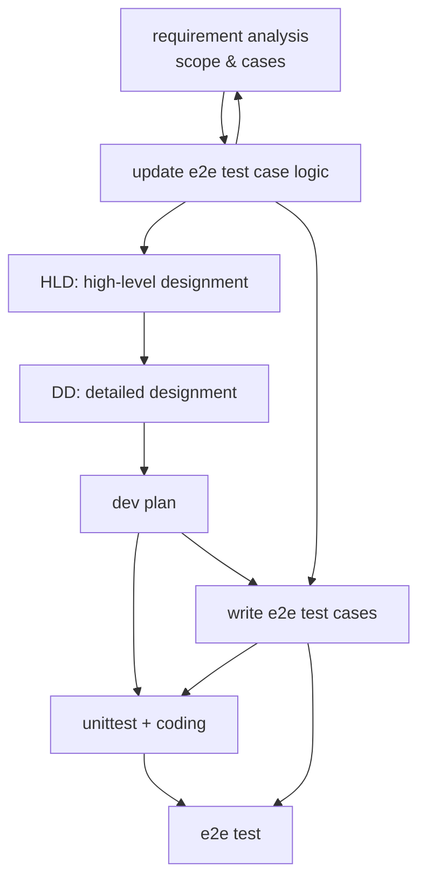

# development guide

Use Outside-In TDD in development flow on development activity. 
follow the following workflow.

- **User Requirements**: Defines problems and scenarios. Input to design. 
  - output: a file named `{date}-{name}-uc.md` with:
    - stakeholder list and their roles.
    - user story.
    - use cases (with examples to demonstrate it if necessary).
    - scope: what's included and not included.
  - Must:
    - not depend on any design decisions. 
- **High-Level Design (HLD)**: Architecture selection and design decisions based on requirements. 
  - output: a file named `{date}-{name}-hld.md` with:
    - any phylosiphy for the global designment.
    - main business flows, and important edge flows.
    - important modules and components.
    - archetecture selection and whys.
    - middleware selection and whys.
    - volumn assessment and whys & hows.
    - stability designment.
  - Must:
    - be self-contained 
    — do NOT reference detailed design.
- **Detailed Design (DD)**: Implementation details based on HLD decisions. May
  reference HLD conclusions and user requirements. 
  - output: a file named `{date}-{name}-dd.md` with:
    - declare API in swagger style.
    - declare DB with DDL sql file in migerations directory.
    - declare important Port interfaces

- **coding**: using TDD with unittests.
  - modular codes: with clear responsibility and boundary.
    - design a clear interface / method / function with a clear responsibility.
    - write unit test on the responsibility.
    - write implementation to pass the unittest.
  - middlewares: do not depend on middleware directly.
    - declare PORT interfaces for any middleware including DB / MQ etc.
    - any code depending on the middleware should depend on the PORT interface.
    - unittest for code depending on PORT interfaces can mock the interfaces.
    - there should be a contract testing for the real middleware to verify its behavior.
  - glue code: ignore its unittest if hard to write.

- **e2e test cases**: all end to end test cases should be written in [notification-test-cases.md](doc/notification-test-cases.md) following the rules in the file.