# API 通知系统 — 详细设计 (Detailed Design)

> 版本: v0.2  
> 日期: 2026-06-01  
> 状态: 草案  
> 基于 HLD: v0.2  
> 前置阅读: [需求文档 v0.3](202605-notification.md)、[HLD v0.2](202605-notification-design-hld.md)

---

## 目录

- [1. 引言](#1-引言)
  - [1.1 文档定位](#11-文档定位)
  - [1.2 名词对照](#12-名词对照)
  - [1.3 引用文档](#13-引用文档)
  - [1.4 MVP 范围界定](#14-mvp-范围界定)
- [2. 数据模型详细设计](#2-数据模型详细设计)
  - [2.1 实体状态机](#21-实体状态机)
  - [2.2 表结构 DDL](#22-表结构-ddl)
  - [2.3 索引策略](#23-索引策略)
  - [2.4 分区与分片策略](#24-分区与分片策略)
- [3. API 详细设计](#3-api-详细设计)
  - [3.1 通用规范](#31-通用规范)
  - [3.2 业务 API](#32-业务-api)
  - [3.3 管理 API](#33-管理-api)
  - [3.4 错误码一览](#34-错误码一览)
- [4. 配置详细设计](#4-配置详细设计)
  - [4.1 配置仓库目录结构](#41-配置仓库目录结构)
  - [4.2 事件类型 Schema 格式](#42-事件类型-schema-格式)
  - [4.3 供应商接入配置格式](#43-供应商接入配置格式)
  - [4.4 数据映射规则格式](#44-数据映射规则格式)
  - [4.5 路由规则格式](#45-路由规则格式)
  - [4.6 机密引用语法](#46-机密引用语法)
- [5. 组件内部设计](#5-组件内部设计)
  - [5.1 接收网关](#51-接收网关)
  - [5.2 路由分发器](#52-路由分发器)
  - [5.3 请求拼装引擎](#53-请求拼装引擎)
  - [5.4 投递工作器](#54-投递工作器)
  - [5.5 限流器](#55-限流器)
  - [5.6 熔断器](#56-熔断器)
- [6. MQ 拓扑设计](#6-mq-拓扑设计)
  - [6.1 完整拓扑图](#61-完整拓扑图)
  - [6.2 触发通道](#62-触发通道)
  - [6.3 投递队列](#63-投递队列)
  - [6.4 延迟重试通道](#64-延迟重试通道)
  - [6.5 消息格式规范](#65-消息格式规范)
- [7. 安全设计](#7-安全设计)
  - [7.1 调用方鉴权流程](#71-调用方鉴权流程)
  - [7.2 凭证全生命周期管理](#72-凭证全生命周期管理)
  - [7.3 审计日志](#73-审计日志)
- [8. 可观测性设计](#8-可观测性设计)
  - [8.1 结构化日志](#81-结构化日志)
  - [8.2 Prometheus 指标](#82-prometheus-指标)
  - [8.3 告警规则](#83-告警规则)
- [9. 实现指南](#9-实现指南)
  - [9.1 Go 包结构](#91-go-包结构)
  - [9.2 依赖清单](#92-依赖清单)
  - [9.3 关键接口定义](#93-关键接口定义)
  - [9.4 配置加载与启动流程](#94-配置加载与启动流程)
  - [9.5 优雅关闭](#95-优雅关闭)
- [10. 测试策略](#10-测试策略)
  - [10.1 测试方法论](#101-测试方法论)
  - [10.2 E2E 验收测试](#102-e2e-验收测试)
  - [10.3 编排测试](#103-编排测试)
  - [10.4 契约测试](#104-契约测试)
  - [10.5 算法测试](#105-算法测试)
  - [10.6 优雅关闭验证](#106-优雅关闭验证)
  - [10.7 层间协作关系](#107-层间协作关系)
  - [10.8 CI 运行策略](#108-ci-运行策略)

---

<a id="1-引言"></a>
## 1. 引言

<a id="11-文档定位"></a>
### 1.1 文档定位

本文档是通知系统的**详细设计（Detailed Design）**。它基于 HLD v0.2 的架构决策和方案组合，提供数据模型 DDL、API 定义、配置文件格式、组件内部接口、MQ 拓扑等实现级细节。目标是：开发者可据此直接编码实现，无需额外的设计决策。

根据项目文档规范（见 CLAUDE.md），详细设计可以引用 HLD 结论和用户需求，但 HLD 不得引用详细设计内容。

<a id="12-名词对照"></a>
### 1.2 名词对照

| HLD 术语 | 同义词/别称 | 说明 |
|----------|------------|------|
| 接收网关 | Ingestion API、接收层 | 接收业务系统提交通知的同步 HTTP 入口 |
| 路由分发器 | Router、路由层 | 消费触发消息，匹配路由规则，创建投递任务 |
| 请求拼装 | Mapper、映射层 | 将统一 payload 转换为供应商 API 格式 |
| 投递工作器 | Worker、投递层 | 执行 HTTP 调用，处理响应，管理重试 |
| Notification | 通知 | 业务系统提交的原始通知记录 |
| DeliveryTask | 投递任务 | 面向单个供应商的投递任务 |
| Caller | 调用方 | 业务系统调用方身份 |

<a id="13-引用文档"></a>
### 1.3 引用文档

| 文档 | 版本 | 说明 |
|------|------|------|
| [需求分析](202605-notification.md) | v0.3 | 用例定义、变化点分析、非功能性需求 |
| [概要设计](202605-notification-design-hld.md) | v0.2 | 架构决策、方案组合、核心组件定义 |

<a id="14-mvp-范围界定"></a>
### 1.4 MVP 范围界定

本文档按 HLD §6.3.1 的 MVP 范围界定编写。各功能模块的归属如下：

| 模块 | 保留在 MVP | 不放在 MVP（归属阶段） |
|------|-----------|-------------------|
| **接收层** | RESTful 接收入口、幂等键唯一约束、Schema 校验、MQ 触发 | 调用方鉴权（共享Secret过渡） |
| **数据模型** | 通知与投递任务分离、payload 存 DB/MQ 仅携 ID、预分片列 | DeliveryAttempt 审计日志、月度分区、Redis 缓存 |
| **路由层** | 简单事件→供应商映射 | 条件路由 |
| **映射层** | 结构化映射（L1 字段直映射） | 自定义映射插件、请求签名引擎、鉴权注入 |
| **投递层** | HTTP 投递、状态码判定、重试（MQ DLX+TTL）、死信表 | Body 条件判定、独立 Worker 池、限流器、熔断器 |
| **队列架构** | 共享队列（全供应商统一）、MQ 延迟重投（DLX+TTL） | 按供应商分区队列 |
| **配置管理** | 本地文件 | Git + Webhook + SecretStore |
| **可观测性** | 结构化日志 + 关键指标打点、通知状态查询（列表+详情） | Prometheus + Grafana、OTel 链路追踪 |
| **部署** | 单体架构 | 微服务拆分 |

> 表中标记为"不放在 MVP"的功能，本文档保留设计但标记为"**未来扩展**"，并在实现指南中标注对应阶段。开发者阅读时请以 MVP 内容为准。

---

<a id="2-数据模型详细设计"></a>
## 2. 数据模型详细设计

> HLD §2 定义了核心实体及其关系。本章给出完整的表结构 DDL、状态机、索引和分区策略。

<a id="21-实体状态机"></a>
### 2.1 实体状态机

#### 2.1.1 Notification 状态机

Notification 代表业务系统提交的一条原始通知。其状态是 N 个 DeliveryTask 状态的上卷聚合：

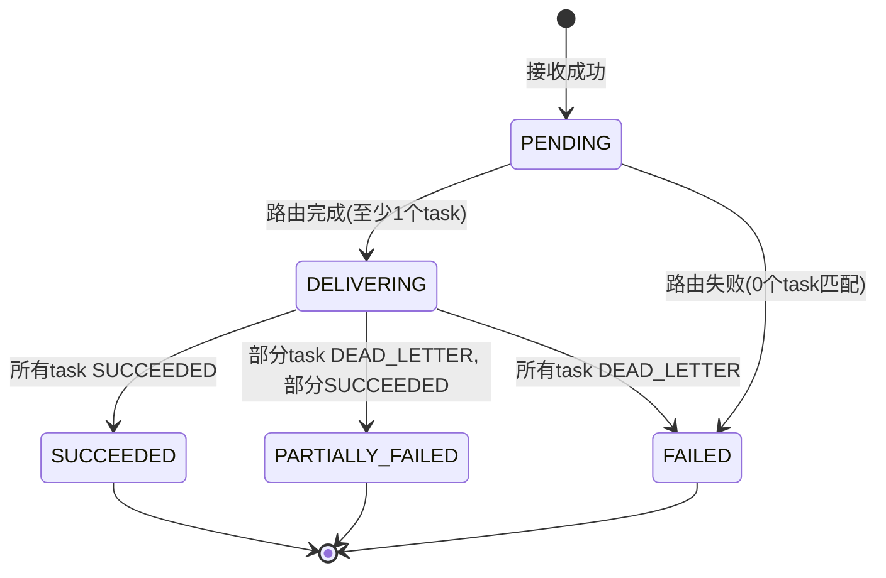
```mermaid
stateDiagram-v2
    [*] --> PENDING: 接收成功
    PENDING --> DELIVERING: 路由完成(至少1个task)
    PENDING --> FAILED: 路由失败(0个task匹配)
    DELIVERING --> SUCCEEDED: 所有task SUCCEEDED
    DELIVERING --> PARTIALLY_FAILED: 部分task DEAD_LETTER, 部分SUCCEEDED
    DELIVERING --> FAILED: 所有task DEAD_LETTER
    SUCCEEDED --> [*]
    PARTIALLY_FAILED --> [*]
    FAILED --> [*]
```

状态迁移条件：

| 当前状态 | 目标状态 | 触发条件 |
|----------|---------|----------|
| PENDING | DELIVERING | 路由分发器完成匹配并创建了至少 1 个 DeliveryTask |
| PENDING | FAILED | 路由分发器匹配结果为 0 个供应商 |
| DELIVERING | SUCCEEDED | 所有关联 DeliveryTask 状态为 SUCCEEDED |
| DELIVERING | PARTIALLY_FAILED | 部分 DeliveryTask SUCCEEDED，剩余全部 DEAD_LETTER |
| DELIVERING | FAILED | 所有 DeliveryTask 均为 DEAD_LETTER |

> Notification 的 FAILED 和 PARTIALLY_FAILED 是终端状态，不自动恢复。人工排查问题后可通过重试或重新提交通知来恢复。

#### 2.1.2 DeliveryTask 状态机

DeliveryTask 代表面向单个供应商的一次完整投递生命周期：

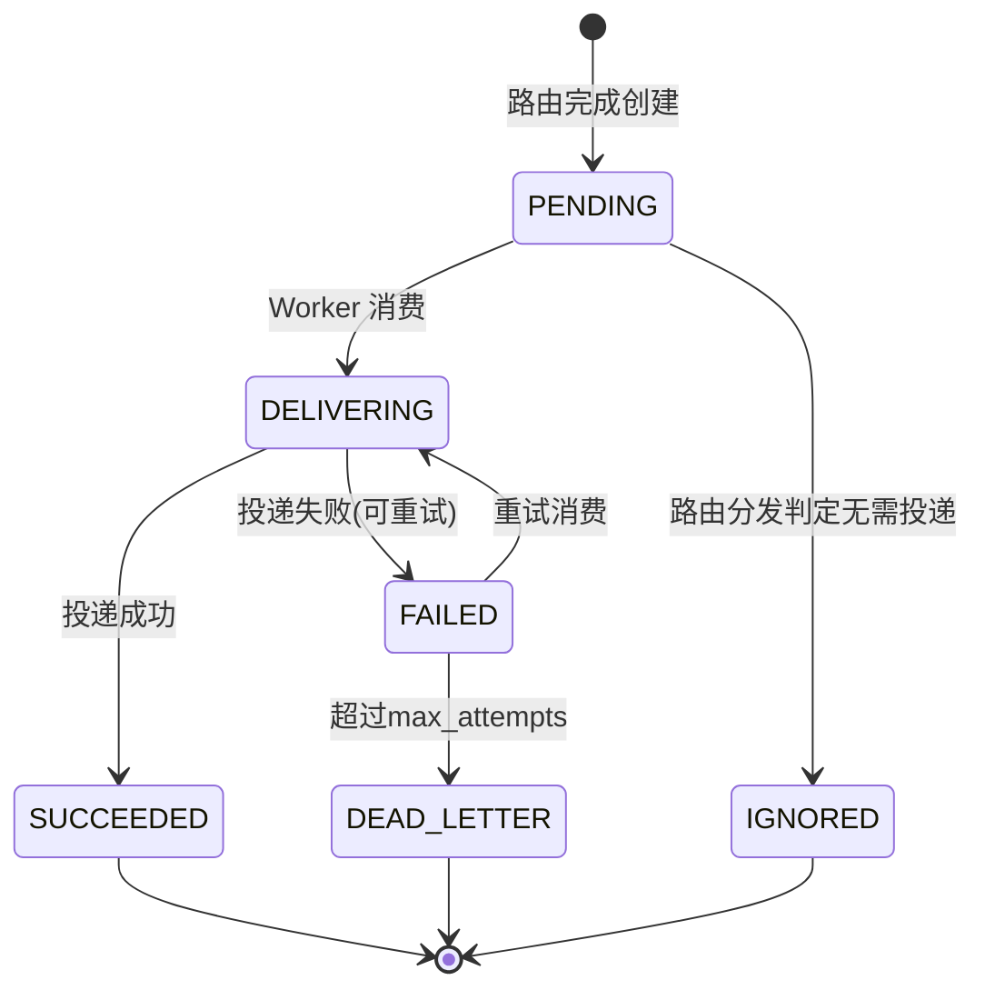
```mermaid
stateDiagram-v2
    [*] --> PENDING: 路由完成创建
    PENDING --> DELIVERING: Worker 消费
    PENDING --> IGNORED: 路由分发判定无需投递
    DELIVERING --> SUCCEEDED: 投递成功
    DELIVERING --> FAILED: 投递失败(可重试)
    FAILED --> DELIVERING: 重试消费
    FAILED --> DEAD_LETTER: 超过max_attempts
    SUCCEEDED --> [*]
    IGNORED --> [*]
    DEAD_LETTER --> [*]
```

状态迁移条件：

| 当前状态 | 目标状态 | 触发条件 |
|----------|---------|----------|
| PENDING | DELIVERING | Worker 从 MQ 消费到该 task 的消息，开始处理 |
| PENDING | IGNORED | 路由分发器判定：供应商已停用或无需投递（如重试窗口已过期） |
| DELIVERING | SUCCEEDED | 响应判定为成功 |
| DELIVERING | FAILED | 响应判定为失败，且 retry_count < max_attempts - 1 |
| FAILED | DELIVERING | 重试消息到达，Worker 再次消费 |
| FAILED | DEAD_LETTER | 响应判定为失败，且 retry_count >= max_attempts - 1 |

<a id="22-表结构-ddl"></a>
### 2.2 表结构 DDL

#### 2.2.1 callers — 调用方表（未来扩展）

> MVP 阶段不启用调用方鉴权。此表在第二阶段引入调用方鉴权时启用。

```sql
CREATE TABLE callers (
    id              BIGSERIAL       PRIMARY KEY,
    caller_id       VARCHAR(64)     NOT NULL,
    name            VARCHAR(128)    NOT NULL DEFAULT '',
    api_key_hash    VARCHAR(64)     NOT NULL,           -- SHA-256(api_key)，用于快速认证
    api_secret_hash VARCHAR(128)    NOT NULL,           -- bcrypt(api_secret)
    allowed_events  JSONB           NOT NULL DEFAULT '[]',  -- 允许的事件类型列表，[]表示全部
    rate_limit      JSONB,                              -- 调用方级限流配置，NULL表示不限
    status          VARCHAR(16)     NOT NULL DEFAULT 'ACTIVE',  -- ACTIVE / DISABLED
    contact         VARCHAR(256)    NOT NULL DEFAULT '',
    created_at      TIMESTAMPTZ     NOT NULL DEFAULT NOW(),
    updated_at      TIMESTAMPTZ     NOT NULL DEFAULT NOW(),

    CONSTRAINT uq_callers_caller_id UNIQUE (caller_id),
    CONSTRAINT uq_callers_api_key_hash UNIQUE (api_key_hash),
    CONSTRAINT chk_callers_status CHECK (status IN ('ACTIVE', 'DISABLED'))
);

COMMENT ON TABLE callers IS '调用方(业务系统)注册表';
COMMENT ON COLUMN callers.api_key_hash IS 'API Key 的 SHA-256 哈希，用于认证时快速查找';
COMMENT ON COLUMN callers.api_secret_hash IS 'API Secret 的 bcrypt 哈希';
COMMENT ON COLUMN callers.allowed_events IS '允许提交的事件类型列表，["*"]表示全部';
COMMENT ON COLUMN callers.rate_limit IS '调用方级限流配置: {"tokens_per_second": 100, "burst": 200}';
```

#### 2.2.2 notifications — 通知表（MVP）

```sql
CREATE TABLE notifications (
    id              UUID            PRIMARY KEY DEFAULT gen_random_uuid(),
    shard_id        INT             NOT NULL DEFAULT 0,
    caller_id       VARCHAR(64)     NOT NULL,
    idempotent_key  VARCHAR(128)    NOT NULL,
    event_type      VARCHAR(128)    NOT NULL,
    payload         JSONB           NOT NULL,
    status          VARCHAR(20)     NOT NULL DEFAULT 'PENDING',
    created_at      TIMESTAMPTZ     NOT NULL DEFAULT NOW(),
    updated_at      TIMESTAMPTZ     NOT NULL DEFAULT NOW(),

    CONSTRAINT uq_notifications_caller_idempotent UNIQUE (caller_id, idempotent_key),
    CONSTRAINT chk_notifications_status CHECK (status IN (
        'PENDING', 'DELIVERING', 'SUCCEEDED', 'PARTIALLY_FAILED', 'FAILED'
    ))
    -- MVP 阶段无 callers 表，caller_id 作为自由文本字段
    -- 第二阶段引入调用方管理后添加 FK: REFERENCES callers (caller_id)
);

COMMENT ON TABLE notifications IS '业务系统提交的原始通知';
COMMENT ON COLUMN notifications.shard_id IS '预分片键: id % 1024，初始阶段全为0';
COMMENT ON COLUMN notifications.idempotent_key IS '幂等键，与(caller_id)组成唯一约束';
COMMENT ON COLUMN notifications.payload IS '事件载荷，JSONB 格式';
```

#### 2.2.3 delivery_tasks — 投递任务表

```sql
CREATE TABLE delivery_tasks (
    id                UUID            PRIMARY KEY DEFAULT gen_random_uuid(),
    shard_id          INT             NOT NULL DEFAULT 0,
    notification_id   UUID            NOT NULL,
    vendor_id         VARCHAR(64)     NOT NULL,
    status            VARCHAR(20)     NOT NULL DEFAULT 'PENDING',
    retry_count       INT             NOT NULL DEFAULT 0,
    max_retries       INT             NOT NULL DEFAULT 5,
    next_retry_at     TIMESTAMPTZ,
    last_error        TEXT,
    created_at        TIMESTAMPTZ     NOT NULL DEFAULT NOW(),
    updated_at        TIMESTAMPTZ     NOT NULL DEFAULT NOW(),

    CONSTRAINT chk_delivery_tasks_status CHECK (status IN (
        'PENDING', 'DELIVERING', 'SUCCEEDED', 'FAILED', 'IGNORED', 'DEAD_LETTER'
    )),
    CONSTRAINT fk_delivery_tasks_notification FOREIGN KEY (notification_id)
        REFERENCES notifications (id)
);

COMMENT ON TABLE delivery_tasks IS '面向单个供应商的投递任务';
COMMENT ON COLUMN delivery_tasks.vendor_id IS '供应商标识，与本地配置 vendors/ 目录中的 vendor_id 对应';
COMMENT ON COLUMN delivery_tasks.retry_count IS '已重试次数(不含首次)';
COMMENT ON COLUMN delivery_tasks.max_retries IS '最大尝试次数(含首次)，从供应商配置继承';
COMMENT ON COLUMN delivery_tasks.next_retry_at IS '下次重试时间，Worker 消费时按此字段过滤';
COMMENT ON COLUMN delivery_tasks.last_error IS '最后一次失败的错误信息(摘要级，完整 attempt 日志走 stdout)';
```

#### 2.2.4 dead_letter_records — 死信记录表

```sql
CREATE TABLE dead_letter_records (
    id                UUID            PRIMARY KEY DEFAULT gen_random_uuid(),
    delivery_task_id  UUID            NOT NULL,
    notification_id   UUID            NOT NULL,
    vendor_id         VARCHAR(64)     NOT NULL,
    retry_count       INT             NOT NULL,
    last_error        TEXT            NOT NULL DEFAULT '',
    last_response     JSONB,                              -- 最后一次响应的关键信息
    last_attempt_at   TIMESTAMPTZ     NOT NULL,
    status            VARCHAR(20)     NOT NULL DEFAULT 'PENDING',  -- PENDING / RETRYING / ARCHIVED
    created_at        TIMESTAMPTZ     NOT NULL DEFAULT NOW(),
    updated_at        TIMESTAMPTZ     NOT NULL DEFAULT NOW(),

    CONSTRAINT uq_dead_letter_records_delivery_task UNIQUE (delivery_task_id),
    CONSTRAINT fk_dead_letter_records_delivery_task FOREIGN KEY (delivery_task_id)
        REFERENCES delivery_tasks (id),
    CONSTRAINT fk_dead_letter_records_notification FOREIGN KEY (notification_id)
        REFERENCES notifications (id)
);

COMMENT ON TABLE dead_letter_records IS '死信记录，保留完整的投递历史和关键响应信息';
COMMENT ON COLUMN dead_letter_records.last_response IS '最后一次响应的状态码和 body(截断)，用于快速排查';
```

#### 2.2.5 event_schemas — 事件类型 Schema 注册表

```sql
CREATE TABLE event_schemas (
    id              SERIAL          PRIMARY KEY,
    event_type      VARCHAR(128)    NOT NULL,
    version         INT             NOT NULL DEFAULT 1,
    schema_def      JSONB           NOT NULL,               -- JSON Schema 定义
    description     TEXT            NOT NULL DEFAULT '',
    status          VARCHAR(16)     NOT NULL DEFAULT 'ACTIVE',  -- ACTIVE / DEPRECATED
    created_at      TIMESTAMPTZ     NOT NULL DEFAULT NOW(),
    updated_at      TIMESTAMPTZ     NOT NULL DEFAULT NOW(),

    CONSTRAINT uq_event_schemas_type_version UNIQUE (event_type, version)
);

COMMENT ON TABLE event_schemas IS '事件类型及其 JSON Schema 定义';
COMMENT ON COLUMN event_schemas.schema_def IS 'JSON Schema (Draft-07) 定义，含 x-format 扩展';
```

> **说明**：`event_schemas` 表在 MVP 中即启用。接收网关在收到提交通知时，根据 `event_type` 加载对应 Schema 校验 payload。

<a id="23-索引策略"></a>
### 2.3 索引策略

#### 2.3.1 notifications 索引

```sql
-- 幂等校验查询：按 (caller_id, idempotent_key) 唯一约束已有索引，无需额外创建

-- 按调用方查询通知列表（支持分页）
CREATE INDEX idx_notifications_caller_id_created
    ON notifications (caller_id, created_at DESC);

-- 按事件类型查询（运营分析）
CREATE INDEX idx_notifications_event_type_created
    ON notifications (event_type, created_at DESC);

-- 按状态查询（后台扫描/数据修复）
CREATE INDEX idx_notifications_status_created
    ON notifications (status, created_at)
    WHERE status IN ('PENDING', 'DELIVERING');
```

#### 2.3.2 delivery_tasks 索引

```sql
-- 按 notification_id 查询投递任务列表
CREATE INDEX idx_delivery_tasks_notification_id
    ON delivery_tasks (notification_id);

-- 按供应商与状态查询待重试任务
CREATE INDEX idx_delivery_tasks_vendor_status_retry
    ON delivery_tasks (vendor_id, status, next_retry_at)
    WHERE status IN ('FAILED', 'DEAD_LETTER');

-- 按状态查询（后台重试扫描）
CREATE INDEX idx_delivery_tasks_status
    ON delivery_tasks (status, created_at)
    WHERE status = 'PENDING';

-- 死信列表查询
CREATE INDEX idx_delivery_tasks_dead_letter_vendor
    ON delivery_tasks (vendor_id, created_at DESC)
    WHERE status = 'DEAD_LETTER';
```

<a id="24-分区与分片策略"></a>
### 2.4 分区与分片策略

#### 2.4.1 时间分区

`delivery_tasks` 和 `dead_letter_records` 按时间分区策略：

```sql
-- delivery_tasks 月度分区（创建时即确定所属分区）
CREATE TABLE delivery_tasks (
    -- ...列定义如上...
) PARTITION BY RANGE (created_at);

CREATE TABLE delivery_tasks_2026_05 PARTITION OF delivery_tasks
    FOR VALUES FROM ('2026-05-01') TO ('2026-06-01');
CREATE TABLE delivery_tasks_2026_06 PARTITION OF delivery_tasks
    FOR VALUES FROM ('2026-06-01') TO ('2026-07-01');
-- ...每月预创建下月分区...

-- dead_letter_records 同理
CREATE TABLE dead_letter_records (
    -- ...列定义如上...
) PARTITION BY RANGE (created_at);
```

**分区维护规则**：

| 操作 | 周期 | 说明 |
|------|------|------|
| 预创建分区 | 每月 25 日 | 提前创建下月分区 |
| 清理历史分区 | 每季度 | 删除超过保留周期（默认 90 天）的分区 |

> **未来扩展**：`notifications` 表保留周期更长（默认 180 天），TBD 根据实际数据量决定是否分区。

#### 2.4.2 预分片设计

`shard_id` 是预留给未来分库的路由字段，遵循 HLD §4.1.3 的策略：

- **固定基数**：N = 1024，永不变化
- **计算方式**：`shard_id = id_uint64 % 1024`（id 为 UUID，取后 8 字节转为 uint64 后取模）
- **初始阶段**：所有 shard_id 落在同一张物理表，单库运行
- **扩容阶段**：路由表 `shard_id → db_instance` 决定各 shard 的物理归属

应用层在查询时携带  `WHERE shard_id = ?` 条件（当 `shard_id` 已知时），使未来分库后 SQL 可直接路由到目标实例，无需全库扫描。

> **说明**：MVP 阶段 `shard_id` 仅为预留字段，查询时不强制要求 `WHERE shard_id` 条件。当数据量增长到需要分库时，再在查询路径中补上该条件。

---

<a id="3-api-详细设计"></a>
## 3. API 详细设计

> HLD §5.1 定义接收网关为 RESTful JSON API。本章给出所有 API 端点的完整定义。
>
> **MVP 范围**：仅 §3.2 业务 API 在 MVP 中实现。§3.3 管理 API 属于第二阶段，MVP 阶段通过 DB 直连操作。
> **MVP 鉴权**：无（内网信任）。

<a id="31-通用规范"></a>
### 3.1 通用规范

**基础路径**：
- 业务 API: `/api/v1/`
- 管理 API: `/api/v1/admin/`

**认证方式**（MVP）：内网信任，不做鉴权。

**响应格式**：
```json
// 成功
{ "data": { ... } }

// 错误
{
  "error": {
    "code": "ERROR_CODE",
    "message": "人类可读的错误描述",
    "details": [ ... ]     // 可选，附加详情
  }
}
```

**日期格式**：所有时间字段使用 ISO 8601（`2026-05-24T10:30:00Z`）。

<a id="32-业务-api"></a>
### 3.2 业务 API

#### 3.2.1 提交通知

```
POST /api/v1/notifications
Content-Type: application/json

{
  "event": "order.paid",
  "idempotent_key": "ord_001_20260524",
  "payload": {
    "order_id": "ORD-001",
    "user_id": "u_12345",
    "amount": 29900,
    "currency": "CNY",
    "paid_at": 1716518400
  }
}
```

**字段说明**：

| 字段 | 类型 | 必填 | 说明 |
|------|------|------|------|
| `event` | string | 是 | 事件类型，如 `order.paid`，必须在 `event_schemas` 中注册 |
| `idempotent_key` | string | 否 | 调用方幂等键，建议使用业务唯一标识。不传时系统自动生成 UUID |
| `payload` | object | 是 | 事件载荷，需符合该 event_type 的 JSON Schema |

**成功响应 (202 Accepted)**：
```json
{
  "data": {
    "notification_id": "notif_abc123",
    "status": "PENDING",
    "created_at": "2026-05-24T10:30:00Z"
  }
}
```

**错误响应**：

| HTTP 状态码 | error.code | 说明 |
|------------|-----------|------|
| 400 | `INVALID_REQUEST` | 请求体格式错误（非 JSON、字段类型错误等） |
| 422 | `SCHEMA_VALIDATION_FAILED` | payload 不符合事件类型的 JSON Schema，详情见 `details` 数组 |
| 422 | `EVENT_NOT_FOUND` | 事件类型未注册 |
| 503 | `SERVICE_UNAVAILABLE` | 服务暂时不可用（DB 不可用等），调用方应重试 |

**Schema 校验失败详情格式**：
```json
{
  "error": {
    "code": "SCHEMA_VALIDATION_FAILED",
    "message": "payload 校验失败",
    "details": [
      { "field": "payload.amount", "error": "expected integer, got string" },
      { "field": "payload.order_id", "error": "required field missing" }
    ]
  }
}
```

#### 3.2.2 查询通知状态

```
GET /api/v1/notifications/:notification_id
```

**成功响应 (200)**：
```json
{
  "data": {
    "notification_id": "notif_abc123",
    "caller_id": "order-service",
    "event": "order.paid",
    "status": "DELIVERING",
    "payload": { ... },
    "created_at": "2026-05-24T10:30:00Z",
    "updated_at": "2026-05-24T10:30:05Z",
    "delivery_tasks": [
      {
        "delivery_task_id": "dt_001",
        "vendor_id": "crm_system",
        "status": "SUCCEEDED",
        "retry_count": 0,
        "created_at": "2026-05-24T10:30:01Z"
      },
      {
        "delivery_task_id": "dt_002",
        "vendor_id": "ad_platform",
        "status": "FAILED",
        "retry_count": 2,
        "last_error": "HTTP 503",
        "next_retry_at": "2026-05-24T10:31:00Z",
        "created_at": "2026-05-24T10:30:01Z"
      }
    ]
  }
}
```

#### 3.2.3 列表查询通知

```
GET /api/v1/notifications?caller_id=order-service&event=order.paid&status=FAILED&page=1&page_size=20
```

**查询参数**：

| 参数 | 类型 | 必填 | 说明 |
|------|------|------|------|
| `caller_id` | string | 否 | 按调用方过滤 |
| `event` | string | 否 | 按事件类型过滤 |
| `status` | string | 否 | 按状态过滤，可选值：PENDING/DELIVERING/SUCCEEDED/PARTIALLY_FAILED/FAILED |
| `idempotent_key` | string | 否 | 按幂等键精确查询 |
| `start` | string(ISO8601) | 否 | 起始时间 |
| `end` | string(ISO8601) | 否 | 结束时间 |
| `page` | int | 否 | 页码，默认 1 |
| `page_size` | int | 否 | 每页条数，默认 20，最大 100 |

**成功响应 (200)**：
```json
{
  "data": [
    { "notification_id": "...", "caller_id": "...", "event": "...", "status": "...", "created_at": "..." }
  ],
  "pagination": {
    "page": 1,
    "page_size": 20,
    "total": 156
  }
}
```

<a id="33-管理-api"></a>
### 3.3 管理 API（未来扩展）

> 管理 API 在第二/三阶段实现。MVP 阶段通过 DB 直连或 CLI 工具进行操作。

#### 3.3.1 死信管理

**查询死信列表**：
```
GET /api/v1/admin/dead-letters?vendor_id=crm_system&status=PENDING&page=1&page_size=20
```

**手动重试死信**：
```
POST /api/v1/admin/dead-letters/:id/retry

→ 202 Accepted
{ "data": { "delivery_task_id": "dt_001", "status": "RETRYING" } }
```

**批量重试**：
```
POST /api/v1/admin/dead-letters/batch-retry
Content-Type: application/json

{ "filter": { "vendor_id": "crm_system", "status": "PENDING" } }

→ 202 Accepted
{ "data": { "total": 15, "accepted": 15 } }
```

**归档死信**：
```
POST /api/v1/admin/dead-letters/:id/archive
```

#### 3.3.2 调用方管理

```
POST   /api/v1/admin/callers                        # 创建调用方
GET    /api/v1/admin/callers                         # 查询调用方列表
GET    /api/v1/admin/callers/:caller_id              # 查询单个调用方
PUT    /api/v1/admin/callers/:caller_id              # 更新调用方信息
DELETE /api/v1/admin/callers/:caller_id              # 删除调用方(软删除: 设置status=DISABLED)
POST   /api/v1/admin/callers/:caller_id/rotate-key   # 轮换 API Key
```

**创建调用方请求**：
```json
{
  "caller_id": "order-service",
  "name": "订单系统",
  "allowed_events": ["order.paid", "order.refund"],
  "rate_limit": { "tokens_per_second": 100, "burst": 200 },
  "contact": "张三 zhangsan@company.com"
}
```

**创建成功响应 (201)**（仅此一次返回明文密钥）：
```json
{
  "data": {
    "caller_id": "order-service",
    "api_key": "a1b2c3d4e5f6...",
    "api_secret": "f6e5d4c3b2a1...",
    "note": "请立即保存 API Key 和 Secret，创建后不再完整返回"
  }
}
```

#### 3.3.3 供应商配置管理

```
GET    /api/v1/admin/configs                        # 查看当前运行配置快照
GET    /api/v1/admin/configs/:vendor_id              # 查看单个供应商配置
POST   /api/v1/admin/config/reload                   # 手动触发配置重载
```

> 配置的新增/修改/删除通过 Git PR 流程完成，Admin API 仅提供只读查询和手动重载。

<a id="34-错误码一览"></a>
### 3.4 错误码一览

| code | HTTP 状态码 | 说明 | MVP | 恢复策略 |
|------|------------|------|-----|----------|
| `EVENT_NOT_FOUND` | 422 | 事件类型无对应路由规则 | ✅ | 检查 event_type 名称是否在路由表中 |
| `SCHEMA_VALIDATION_FAILED` | 422 | payload 不符合 Schema | ✅ | 按 details 修正 |
| `INVALID_REQUEST` | 400 | 请求体格式错误（非法 JSON 等） | ✅ | 检查请求体 |
| `SERVICE_UNAVAILABLE` | 503 | 服务暂时不可用（DB 不可用等） | ✅ | 等待后重试 |
| `INTERNAL_ERROR` | 500 | 内部错误 | ✅ | 联系运维排查 |
| `FORBIDDEN` | 403 | 事件类型不在允许列表中 | — 第二阶段 | 检查调用方权限 |
| `RATE_LIMITED` | 429 | 限流触发 | — 第二阶段 | 降低提交速率 |

---

<a id="4-配置详细设计"></a>
## 4. 配置详细设计

**MVP 方案**：本地文件。配置文件存放在 `config/` 目录下，系统启动时从本地磁盘加载。

**未来扩展**：第二阶段演进为 HLD §4.4 定义的 Git + Webhook + SecretStore 方案，目录结构保持不变。

<a id="41-配置仓库目录结构"></a>
### 4.1 配置目录结构（MVP）

```
config/                                   # 配置文件根目录
├── events/                               # 事件 Schema 定义（按业务方组织）
│   └── {biz}/
│       ├── route.yaml                    #   路由授权声明（事件→供应商）
│       └── events/
│           └── {biz_event}.yaml          #     Schema 定义
└── vendors/                              # 供应商接入配置（按供应商组织）
    └── {vendor}/
        ├── vendor.yaml                   #   供应商接入信息（URL、鉴权、签名等）
        └── {biz}/
            └── {biz_event}.yaml          #    投递契约（API 端点 + 映射规则 + 响应判定 + 重试策略）
```

> MVP 阶段事件 Schema 定义直接从上述目录加载，不必通过 `event_schemas` 表同步。`event_schemas` 表在第二阶段引入调用方鉴权时启用，为 Schema 校验提供运行时查询能力。

<a id="42-事件类型-schema-格式"></a>
### 4.2 事件类型 Schema 格式（MVP）

遵循 JSON Schema Draft-07，使用 `x-format` 扩展标注业务精度：

```yaml
# events/order/events/order.paid.yaml
event_type: "order.paid"
description: "订单支付成功通知"
version: 1
schema:
  type: object
  required: [order_id, user_id, amount, currency, paid_at]
  properties:
    order_id:
      type: string
      description: "订单号"
    user_id:
      type: string
      description: "用户标识"
    amount:
      type: integer
      description: "支付金额，单位分"
      minimum: 0
    currency:
      type: string
      description: "货币类型"
      enum: [CNY, USD, EUR]
    paid_at:
      type: integer
      description: "支付时间戳"
      x-format: unix_s        # 秒级时间戳。可能值: unix_s / unix_ms / iso8601
    discount:
      type: number
      description: "折扣金额"
      x-format: cent_precision   # 精度说明: cent_precision / dec_precision
```

**`x-format` 取值规范**：

| x-format 值 | 适用类型 | 说明 |
|-------------|----------|------|
| `unix_s` | integer | 秒级 Unix 时间戳 |
| `unix_ms` | integer | 毫秒级 Unix 时间戳 |
| `iso8601` | string | ISO 8601 日期时间字符串 |
| `date` | string | 日期字符串 `yyyy-MM-dd` |
| `cent_precision` | integer | 分精度整数（如金额 29900 = 299 元） |
| `dec_precision` | number | 小数精度（如金额 299.00） |

<a id="43-供应商接入配置格式"></a>
### 4.3 供应商接入配置格式（MVP）

```yaml
# vendors/crm_system/vendor.yaml
vendor_id: "crm_system"
name: "CRM 系统"
enabled: true

request:
  method: PATCH
  url: "https://crm.company.com/api/v3/contacts/@{payload.user_id}"
  headers:
    Content-Type: "application/json"
    Accept: "application/json"
    Authorization: "Bearer crm_api_token_xxx"    # 明文 Token，MVP 写死在配置中
  body:
    type: mapping       # mapping / raw / none / plugin

response_judgment:
  success:
    type: http_status                     # MVP 仅 HTTP 状态码判定

retry_policy:
  max_attempts: 5
  base_delay: 10s
  max_delay: 300s
  multiplier: 2.0
  jitter: 0.2
```

> **MVP 说明**：机密信息（API Token 等）直接写死在配置文件中。第二阶段引入 Git + SecretStore 管理。

<a id="44-数据映射规则格式"></a>
### 4.4 数据映射规则格式

> HLD §5.3 定义结构化映射 + 插件组合方式。本节给出映射规则的完整格式。

映射规则按 `(vendor_id, event_type)` 组合独立组织在 `vendors/{vendor_id}/{biz}/{event_type}.yaml` 文件中：

```yaml
# vendors/crm_system/order/order.paid.yaml
event_type: "order.paid"
request:
  method: PATCH
  url: "https://crm.company.com/api/v3/contacts/@{payload.user_id}"
  headers:
    Content-Type: "application/json"
    X-Source: "notification-system"
  body:
    type: mapping
    template:
      properties:
        lifecyclestage: "customer"
        last_paid_date:
          $source: "@{payload.paid_at}"
          $format: "yyyy-MM-dd"
        total_revenue: "@{payload.amount}"   # 金额，单位分（供应商按分理解）
        count:
          $source: "@{payload.count}"        # payload 中是 "42"（string）
          $type: integer                     # 强制转为 42（integer）
        items:                               # 数组字段：遍历 product_list 生成
          $source: "@{payload.product_list}"
          $each:
            product_id: "@{item.product_id}"
            quantity: "@{item.qty}"
            location: "@{item.warehouse}"
```

**映射语法完整参考**：

| 语法 | 示例 | 说明 |
|------|------|------|
| `@{payload.field}` | `@{payload.order_id}` | 从 payload 取值 |
| `@{payload.a.b.c}` | `@{payload.user.address.city}` | 嵌套路径访问 |
| `@{item.field}` | `@{item.product_id}` | 从 `$each` 遍历的当前元素取值 |
| `@{item.a.b}` | `@{item.user.address.city}` | 当前元素的嵌套路径访问 |
| `"static_value"` | `"customer"` | 静态字符串 |
| `123` | `29900` | 静态数字 |
| `$source` | `$source: "@{payload.paid_at}"` | 引擎关键字：取值来源 |
| `$format` | `$format: "yyyy-MM-dd"` | 引擎关键字：格式转换 |
| `$type` | `$type: "integer"` | 引擎关键字：强制类型转换。无 `$type` 则保持 payload 原始类型 |
| `$each` | `$each:` 后接元素映射块 | 引擎关键字：数组遍历。配合 `$source` 使用——`$source` 指定源数组，`$each` 内定义每个元素的映射规则。`item` 是保留关键字，在 `$each` 块内表示当前遍历到的数组元素，通过 `@{item.field}` 引用其字段 |

**DeliverySpec 组合**：MappingConfig 和 ResponseJudgment 按 `(vendor_id, event_type)` 组合为 DeliverySpec（投递规格），由 ConfigLoader 统一返回。Judgment 可选，非 nil 时覆盖供应商级别的默认判决规则。详见 §9.3.1。

**`$` 前缀处理规则**：

| 场景 | 处理 | 示例 |
|------|------|------|
| `$source` | 引擎关键字，表示取值来源 | `$source: "@{payload.paid_at}"` |
| `$format` | 引擎关键字，表示格式转换 | `$format: "yyyy-MM-dd"` |
| `$type` | 引擎关键字，表示强制类型转换 | `$type: "string"`，可选值: `string` / `integer` / `number` / `boolean` |
| `$$field_name` | 转义为字面量 `$field_name` | `$$dollar_value: "test"` → 输出 `{"$dollar_value": "test"}` |

<a id="45-路由规则格式"></a>
### 4.5 路由规则格式（MVP）

路由授权声明按业务方组织在 `events/{biz}/route.yaml` 中：

```yaml
# events/order/route.yaml
biz: "order"
rules:
  # order.paid → [crm_system, ad_platform]
  - event_type: "order.paid"
    vendor_id: "crm_system"

  - event_type: "order.paid"
    vendor_id: "ad_platform"

  # order.refund → [crm_system]
  - event_type: "order.refund"
    vendor_id: "crm_system"
```

> **未来扩展**：第二阶段引入条件路由和灰度控制，支持 `condition: "payload.amount > 10000"` 语法，使用 expr 库做轻量表达式评估。

<a id="46-机密引用语法"></a>
### 4.6 机密引用语法（未来扩展）

> MVP 直接在配置文件中写明文值。本节的 `${secret:path}` 语法是第二阶段 Git + SecretStore 方案的格式预留。

```yaml
# 第二阶段：Git + SecretStore 方案中的机密引用
auth:
  config:
    token: "${secret:crm/api_token}"
    api_key: "${secret:ad_platform/api_key}"
```

**引用路径规范**：`${secret:<path>}`，其中 `<path>` 为 SecretStore 中的键路径。

**解析流程**：ConfigLoader 在加载 YAML 后，扫描所有 `${secret:...}` 引用，调用 SecretStore.Resolve() 替换为实际值。

---

<a id="5-组件内部设计"></a>
## 5. 组件内部设计

> HLD §5 定义了各核心组件的职责和方案。本章给出组件的内部接口、处理流水线和关键算法。

<a id="51-接收网关"></a>
### 5.1 接收网关

> **MVP 范围**：接收网关内网信任，不做鉴权。接收时对 payload 做 JSON Schema 校验。

#### 5.1.1 处理流水线

接收网关是系统的唯一同步入口，每个请求按固定流水线顺序执行：

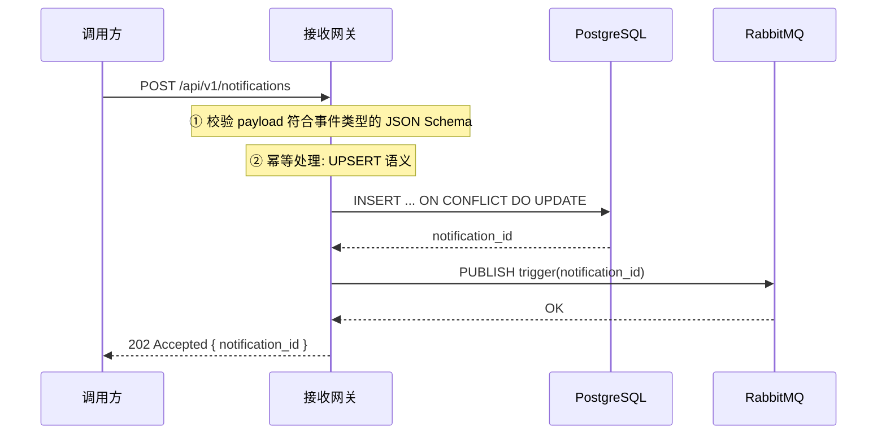
```mermaid
sequenceDiagram
    participant C as 调用方
    participant G as 接收网关
    participant DB as PostgreSQL
    participant MQ as RabbitMQ

    C->>G: POST /api/v1/notifications
    Note over G: ① 校验 payload 符合事件类型的 JSON Schema
    Note over G: ② 幂等处理: UPSERT 语义
    G->>DB: INSERT ... ON CONFLICT DO UPDATE
    DB-->>G: notification_id
    G->>MQ: PUBLISH trigger(notification_id)
    MQ-->>G: OK
    G-->>C: 202 Accepted { notification_id }
```

#### 5.1.2 校验与幂等处理逻辑

**处理流程**（伪码）：

```
Submit(request):
  // Step 1: 校验 payload 是否符合事件类型的 JSON Schema
  // 从 event_schemas 表加载该事件类型的 Schema 定义
  schemaDefinition ← 加载事件类型的 Schema 定义(request.event_type)
  
  ● 该事件类型未在系统中注册 → 拒收通知，返回 422 EVENT_NOT_FOUND

  validationErrors ← 用 Schema 校验 payload(schemaDefinition, request.payload)
  ● payload 中字段缺失或类型不匹配 → 拒收并告知具体出错字段，返回 422 SCHEMA_VALIDATION_FAILED

  // Step 2: 幂等写入 DB
  // 同一 (caller_id, idempotent_key) 不会重复创建
  idempotentKey ← 取 request.idempotent_key，若未提供则自动生成 UUID()

  (notificationId, isNew) ← 幂等插入通知记录(
    callerId: request.caller_id,
    eventType: request.event_type,
    idempotentKey,
    payload: request.payload
  )

  // Step 3: 仅新创建的才触发 MQ，已有通知不重复触发
  if isNew:
    publishResult ← 向 MQ 发布触发消息(notificationId)
    if publishResult 为失败:
      // MQ 发布失败不影响返回——通知已在 DB 持久化
      // 调用方可持 idempotent_key 重试，幂等语义保证不会重复创建
      记录警告日志("MQ publish failed", notificationId)

  响应 ← { notificationId: notificationId, status: "PENDING" }
  return 响应
```

#### 5.1.3 超时与错误处理

| 场景 | 处理方式 | 返回 |
|------|----------|------|
| Schema 校验失败 | 返回 422 + details，调用方修正后重试 | 422 SCHEMA_VALIDATION_FAILED |
| 事件类型未注册 | 返回 422 | 422 EVENT_NOT_FOUND |
| DB 写入超时 (3s) | 返回 503，调用方重试 | 503 SERVICE_UNAVAILABLE |
| MQ 发布失败 | 日志告警 + 返回 202 | 202 Accepted（幂等重试补偿） |

<a id="52-路由分发器"></a>
### 5.2 路由分发器

> **MVP 范围**：路由层仅做事件类型→供应商的简单映射，不支持条件表达式。条件路由在第二阶段引入。

#### 5.2.1 处理流水线

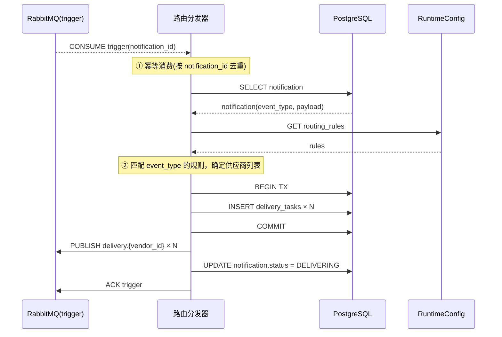
```mermaid
sequenceDiagram
    participant MQ as RabbitMQ(trigger)
    participant R as 路由分发器
    participant DB as PostgreSQL
    participant Config as RuntimeConfig

    MQ-->>R: CONSUME trigger(notification_id)
    Note over R: ① 幂等消费(按 notification_id 去重)
    R->>DB: SELECT notification
    DB-->>R: notification(event_type, payload)
    R->>Config: GET routing_rules
    Config-->>R: rules
    Note over R: ② 匹配 event_type 的规则，确定供应商列表
    R->>DB: BEGIN TX
    R->>DB: INSERT delivery_tasks × N
    R->>DB: COMMIT
    R->>MQ: PUBLISH delivery.{vendor_id} × N
    R->>DB: UPDATE notification.status = DELIVERING
    R->>MQ: ACK trigger
```

#### 5.2.2 delivery_tasks 创建逻辑

**处理流程**（活动图）：

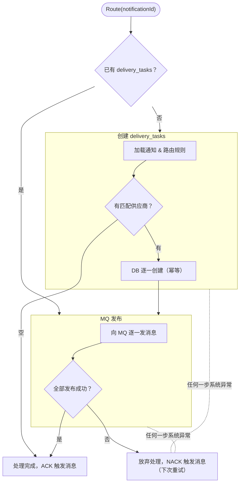
```mermaid
flowchart TD
    START(["Route(notificationId)"])
    IDEMP{"已有 delivery_tasks？"}

    subgraph CREATE_TASKS["创建 delivery_tasks"]
        LOAD["加载通知 & 路由规则"]
        VENDOR{"有匹配供应商？"}
        CREATE["DB 逐一创建（幂等）"]
    end

    subgraph PUB["MQ 发布"]
        PUBLISH["向 MQ 逐一发消息"]
        ALL_OK{"全部发布成功？"}
    end

    DONE["处理完成，ACK 触发消息"]
    RETRY["放弃处理，NACK 触发消息（下次重试）"]

    START --> IDEMP
    IDEMP -- "是" --> PUB
    IDEMP -- "否" --> CREATE_TASKS
    LOAD --> VENDOR
    VENDOR -- "空" --> DONE
    VENDOR -- "有" --> CREATE
    CREATE --> PUB
    PUBLISH --> ALL_OK
    ALL_OK -- "是" --> DONE
    ALL_OK -- "否" --> RETRY

    CREATE_TASKS -.-|"任何一步系统异常"| RETRY
    PUB -.-|"任何一步系统异常"| RETRY
```

<a id="53-请求拼装引擎"></a>
### 5.3 请求拼装引擎

> HLD §5.3 定义结构化映射 + 插件组合。本节给出引擎的引用解析流程和接口定义。

**算法依赖关系图**：

下方展示了映射引擎中各算法的协作关系：一个节点代表一个算法，边上的标签说明"在什么场景下调用"。

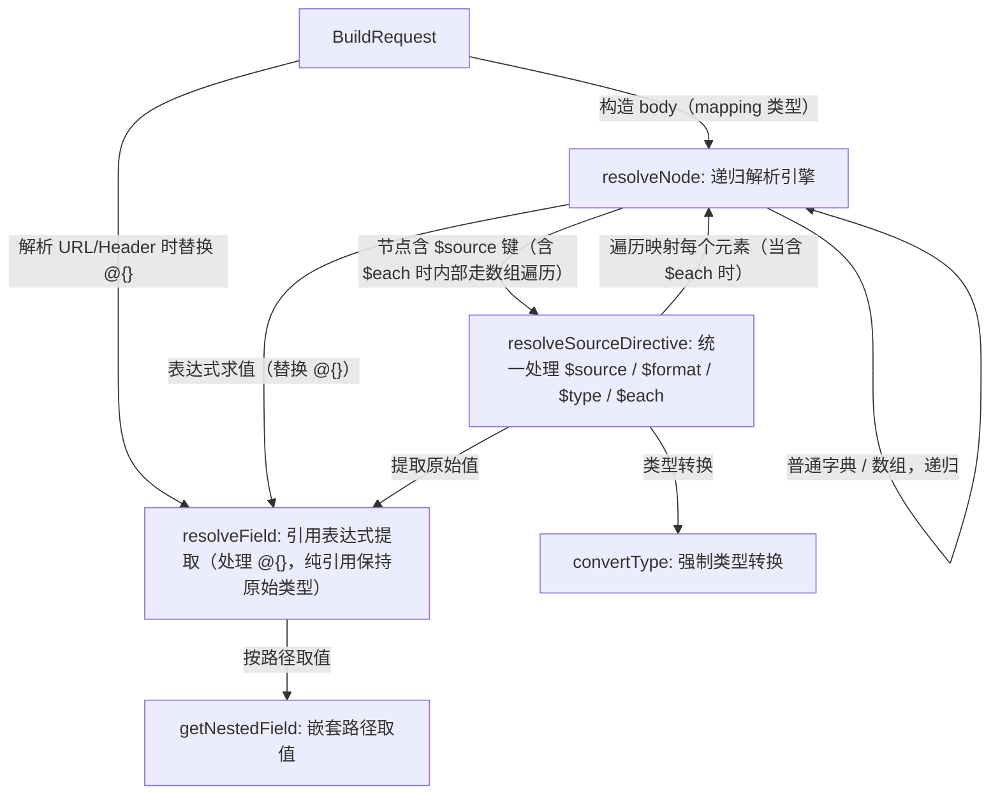
```mermaid
flowchart TD
    BUILD["BuildRequest"]

    NESTED["getNestedField: 嵌套路径取值"]
    FIELD["resolveField: 引用表达式提取（处理 @{}，纯引用保持原始类型）"]
    CONVERT["convertType: 强制类型转换"]

    NODE["resolveNode: 递归解析引擎"]

    SOURCE["resolveSourceDirective: 统一处理 $source / $format / $type / $each"]

    BUILD -->|"解析 URL/Header 时替换 @{}"| FIELD
    BUILD -->|"构造 body（mapping 类型）"| NODE

    NODE -->|"表达式求值（替换 @{}）"| FIELD
    NODE -->|"节点含 $source 键（含 $each 时内部走数组遍历）"| SOURCE
    NODE -->|"普通字典 / 数组，递归"| NODE

    SOURCE -->|"提取原始值"| FIELD
    SOURCE -->|"类型转换"| CONVERT
    SOURCE -->|"遍历映射每个元素（当含 $each 时）"| NODE

    FIELD -->|"按路径取值"| NESTED
```

**MappingEngine 结构**：

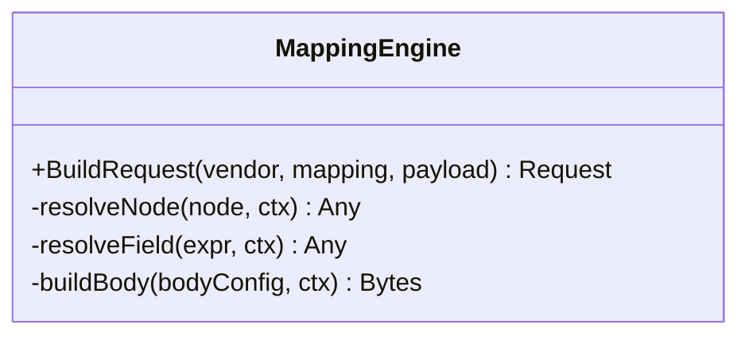
```mermaid
classDiagram
    class MappingEngine {
        +BuildRequest(vendor, mapping, payload) Request
        -resolveNode(node, ctx) Any
        -resolveField(expr, ctx) Any
        -buildBody(bodyConfig, ctx) Bytes
    }
```

**BuildRequest 流程**（伪码）：

```
BuildRequest(vendor, mapping, payload):
  // Step 0: 将原始 payload 包装为上下文容器
  // ctx = {payload: 原始通知数据}
  // resolveNode 及其内部算法都通过 ctx 这个统一接口取值
  // 未来可扩展 ctx 的键，如 ctx.global、ctx.env 等
  ctx ← {payload: payload}

  // Step 1: 解析 URL——用 resolveField 将 @{} 引用替换为实际值并拼接为字符串
  // 例如 "https://crm.com/@{payload.user_id}" → "https://crm.com/u_12345"
  // URL 中通常是混合模板（前缀+引用），resolveField 自动拼接为字符串
  resolvedUrl ← resolveField(mapping.request.url, ctx)

  // Step 2: 解析 Header——每条 Header 值都可能含 @{}，同样用 resolveField 处理
  headers ← 空字典
  for each (headerName, headerValue) ∈ mapping.request.headers:
    headers[headerName] ← resolveField(headerValue, ctx)

  // Step 3: 构造 Body——根据 body.type 路由到不同构造方式
  // body.type ∈ { none, raw, mapping, plugin }
  // 其中 mapping 类型走递归解析引擎 resolveNode（见 §5.3.2）
  body ← buildBody(mapping.request.body, ctx)

  // Step 4: 构造完整 HTTP 请求
  return HTTP请求(
    method: mapping.request.method,
    url: resolvedUrl,
    headers: headers,
    body: body
  )
```

#### 5.3.1 字段引用解析器

**resolveField — 引用表达式提取**（伪码）已在下方 §5.3.2 定义，此处先给出其内部依赖的底层工具。

**getNestedField — 嵌套路径取值**（伪码）：

```
getNestedField(data, path):
  // 仅被 resolveField 内部调用
  // 从嵌套字典 data 中按点分路径取出值
  //
  // 例：getNestedField({user: {address: {city: "北京"}}}, "user.address.city")
  // → 返回 "北京"

  parts ← path 按 "." 分割（如 "user.address.city" → ["user", "address", "city"]）
  current ← data

  依次遍历 parts 中的每个字段名 field:
    if field 不在 current 中 → 查找失败，返回 null
    if field 是 parts 最后一段 → return current[field]（找到最终值）
    // 进入下一层
    if current[field] 不是字典 → 路径中断，返回 null
    current ← current[field]
```

#### 5.3.2 $ 关键字处理

**处理模式总览**：

| Body 类型 | 说明 | 适用场景 |
|-----------|------|----------|
| `none` | 无 body | GET/DELETE 请求 |
| `raw` | 将模板字符串中的 `@{}` 替换后逐字输出 | 简单的字符串 body |
| `mapping` | 递归解析 `$source`、`$each`、`$format`、`$type` 指令，输出 JSON | 结构化映射 |
| `plugin` | 委托外部插件构造 body | 复杂/定制转换 |

**resolveNode — 递归解析引擎**（活动图）：

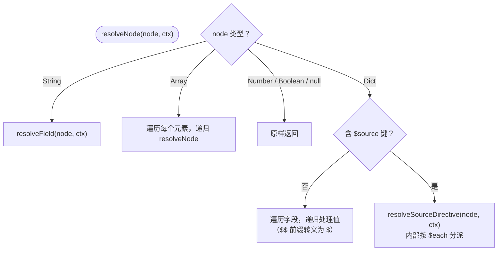
```mermaid
flowchart TD
    ENTER(["resolveNode(node, ctx)"])
    TYPE{"node 类型？"}

    TYPE -->|"String"| FIELD["resolveField(node, ctx)"]
    TYPE -->|"Array"| ARRAY["遍历每个元素，递归 resolveNode"]
    TYPE -->|"Number / Boolean / null"| PRIMITIVE["原样返回"]
    TYPE -->|"Dict"| MAP{"含 $source 键？"}

    MAP -->|"否"| NORMAL["遍历字段，递归处理值<br>（$$ 前缀转义为 $）"]
    MAP -->|"是"| SOURCE["resolveSourceDirective(node, ctx)<br>内部按 $each 分派"]
```

**resolveSourceDirective — $source 处理**（伪码）：

```
resolveSourceDirective(directive, ctx):
  // 被 resolveNode 在任何含有 $source 键的字典节点时调用
  // 统一处理 $source / $format / $type / $each 四条指令
  //
  // ctx = {payload: 原始通知} 或 {payload: 原始通知, item: 当前元素}
  // 分两个场景：
  //   场景 A：$source + $each → 数组遍历映射（委托 resolveEachDirective）
  //   场景 B：$source（可选 $type/$format）→ 单值提取 + 转换

  // Step 0: 判断是否需要走数组遍历
  if directive 含有键 "$each":
    return resolveEachDirective(directive, ctx)
    // resolveEachDirective 内部仍使用 resolveField 解析 $source
    // 但 $source 在此必须是数组类型

  // Step 1: 从 ctx 中提取 $source 路径指向的原始值
  // resolveField 通过 ctx[scope] 定位数据源：
  //   ctx["payload"] → 原始通知数据
  //   ctx["item"]    → $each 当前元素（$each 外不存在）
  // 纯引用 "@{payload.amount}" → 保持 int/bool 原始类型
  // 混合模板 "prefix_@{field}" → 全部转为字符串拼接
  rawValue ← resolveField(directive["$source"], ctx)

  // Step 2: 若存在 $type，按目标类型强制转换（在 $format 之前执行）
  if directive 含有键 "$type":
    rawValue ← convertType(rawValue, directive["$type"])

  // Step 3: 若存在 $format，按格式声明输出字符串
  if directive 含有键 "$format":
    return formatValue(toString(rawValue), directive["$format"])

  return rawValue
```

**resolveField — 引用表达式提取**（伪码）：

```
resolveField(expr, ctx):
  // 被 BuildRequest（URL/Header 解析）、resolveNode（字符串节点）、
  // resolveSourceDirective（$source 提取）调用
  //
  // ctx 是统一的数据上下文容器：
  //   ctx["payload"] → 原始通知数据
  //   ctx["item"]    → $each 当前元素（仅在 $each 块内存在）
  //   @{scope.path}  → ctx[scope] 中按 path 取值
  //
  // 返回行为取决于表达式写法：

  expr 不包含任何 @{} 引用:
    return expr 原值（纯静态字符串）

  expr 是纯引用形式 "@{payload.amount}"（一个 @{} 且无前后缀）:
    // 保持 int/bool/number 的原始类型，不自动转字符串
    // 目的是让后续的 convertType 能基于原始类型做转换
    scope ← 提取引用标识（"payload" 或 "item"）
    path  ← 提取字段路径
    return getNestedField(ctx[scope], path)

  expr 含前后缀文本 "prefix_@{field}_suffix" 或含多个 @{}:
    // 文字和值混在一起，只能整体拼接为字符串
    for 每处 @{} 引用:
      scope ← 提取引用标识
      path  ← 提取字段路径
      转为字符串(getNestedField(ctx[scope], path))
    return 整体拼接后的字符串
```

**resolveEachDirective — $source + $each 数组遍历**（伪码）：

```
resolveEachDirective(directive, ctx):
  // 被 resolveSourceDirective 内部调用（当指令中含有 $each 键时）
  // 处理 $source + $each 组合：遍历数组每个元素，逐一应用 $each 内的映射规则
  //
  // ctx 传入时为 {payload: 原始通知}，遍历每个元素时扩展为
  // {payload: 原始通知, item: 当前元素}，传递给嵌套的 resolveNode
  //
  // @{payload.xxx} 仍解析到 ctx.payload（原始通知字段）
  // @{item.xxx}    解析到 ctx.item（当前遍历元素字段）
  // 两者通过键名隔离，永不冲突
  //
  // 内部使用：
  //   resolveField($source) — 从 ctx 中取出源数组
  //   resolveNode($each) — 对每个元素递归执行映射

  srcArray ← resolveField(directive["$source"], ctx)
  // resolveField 自动从 ctx[scope] 取值，这里 scope 由 $source 写法决定
  if srcArray 不是数组类型:
    报配置错，终止处理

  result ← 空列表
  for each elem ∈ srcArray:
    // 扩展 ctx：保留原始所有键（payload 等），额外加入当前元素作为 item 数据源
    // 因每次遍历创建新对象，不修改上层 ctx
    mapped ← resolveNode(
      directive["$each"],
      {...ctx, item: elem}
    )
    result 追加 mapped

  return result
```

**convertType — 强制类型转换**：

| 目标类型 | 输入 int | 输入 float64 | 输入 string | 输入 bool |
|----------|---------|-------------|------------|----------|
| `string` | → toString | → toString | → 原值 | → toString |
| `integer` | → 原值 | → int64(int) | → ParseInt(s) | → error |
| `number` | → 原值 | → 原值 | → ParseFloat(s) | → error |
| `boolean` | → n != 0 | → error | → ParseBool(s) | → 原值 |

#### 5.3.3 插件接口

**MapperPlugin 接口定义**：

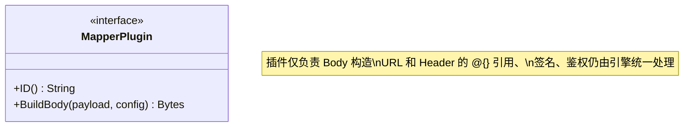
```mermaid
classDiagram
    class MapperPlugin {
        <<interface>>
        +ID() String
        +BuildBody(payload, config) Bytes
    }
    note "插件仅负责 Body 构造\nURL 和 Header 的 @{} 引用、\n签名、鉴权仍由引擎统一处理"
```

<a id="54-投递工作器"></a>
### 5.4 投递工作器

> **MVP 范围**：使用共享 Worker 池（所有供应商共用），不做限流和熔断。投递失败通过 MQ DLX+TTL 机制实现延迟重投。

#### 5.4.1 Worker 池管理

**WorkerPool 结构**：

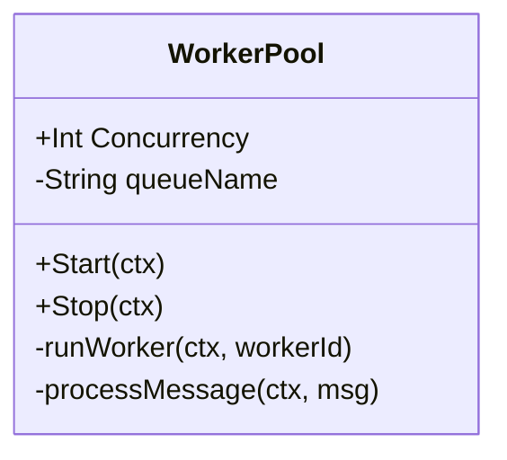
```mermaid
classDiagram
    class WorkerPool {
        +Int Concurrency
        -String queueName
        +Start(ctx)
        +Stop(ctx)
        -runWorker(ctx, workerId)
        -processMessage(ctx, msg)
    }
```

**Worker 消费循环**（伪码）：

```
// 启动 Worker 池
Start(ctx):
  按设定的并发数逐一启动 Worker 协程

// 单个 Worker 的消费循环
runWorker(ctx):
  建立独立的 MQ 通道（每个 Worker 独享，避免通道争用）
  限制每次只拉取 1 条消息（prefetch=1），防止消息堆积在本地缓冲区

  持续监听投递队列：
    从队列中取一条消息
    若队列已关闭或被上层通知停止 → 退出循环
    
    处理该消息（processMessage）
    // Worker 在此阻塞直到该消息处理完成，才拉取下一条

  关闭 MQ 通道，清理资源
```

#### 5.4.2 单条消息处理流程

**Worker 消息处理流程**：

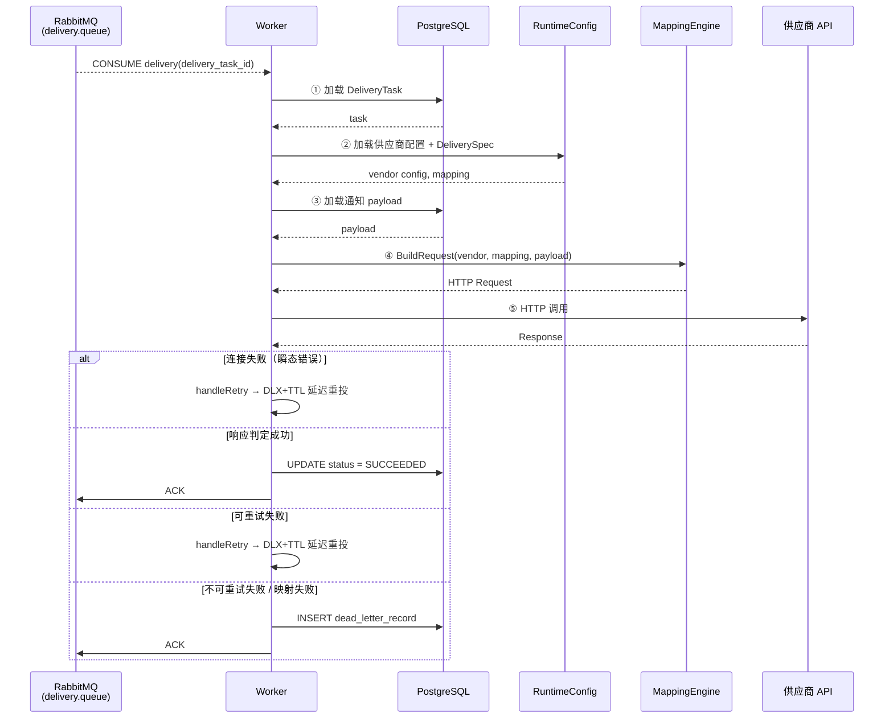
```mermaid
sequenceDiagram
    participant MQ as RabbitMQ<br/>(delivery.queue)
    participant W as Worker
    participant DB as PostgreSQL
    participant Config as RuntimeConfig
    participant Mapper as MappingEngine
    participant V as 供应商 API

    MQ-->>W: CONSUME delivery(delivery_task_id)
    W->>DB: ① 加载 DeliveryTask
    DB-->>W: task
    W->>Config: ② 加载供应商配置 + DeliverySpec
    Config-->>W: vendor config, mapping
    W->>DB: ③ 加载通知 payload
    DB-->>W: payload
    W->>Mapper: ④ BuildRequest(vendor, mapping, payload)
    Mapper-->>W: HTTP Request
    W->>V: ⑤ HTTP 调用
    V-->>W: Response

    alt 连接失败（瞬态错误）
        W->>W: handleRetry → DLX+TTL 延迟重投
    else 响应判定成功
        W->>DB: UPDATE status = SUCCEEDED
        W->>MQ: ACK
    else 可重试失败
        W->>W: handleRetry → DLX+TTL 延迟重投
    else 不可重试失败 / 映射失败
        W->>DB: INSERT dead_letter_record
        W->>MQ: ACK
    end
```

**processMessage 伪码**：

```
processMessage(msg):
  // 提取追踪 ID，贯穿整个处理链路的日志
  traceId ← msg.headers["x-trace-id"]

  // Step 1: 从 DB 加载投递任务记录
  deliveryTask ← 从 DB 查询投递任务(msg.body.delivery_task_id)

  if 查询失败（DB 连接异常、超时等）:
    // 瞬态错误，MQ 消息重新入队，等待下一次消费
    msg.nack(requeue: true)
    return

  if 查询成功但记录不存在:
    // 数据异常或消息异常，丢弃该消息（重试多少次都一样）
    msg.ack()
    记录错误日志("deliveryTask not found", msg.body.delivery_task_id)
    return

  // Step 2: 加载供应商配置和投递规格
  vendorConfig  ← 获取供应商配置(deliveryTask.vendorId)
  deliverySpec  ← 获取投递规格(deliveryTask.vendorId, deliveryTask.eventType)

  // Step 3: 加载原始通知的 payload（映射引擎的输入）
  payload ← 从 DB 查询通知 payload(deliveryTask.notificationId)

  if 加载失败:
    // 瞬态错误，重新入队
    msg.nack(requeue: true)
    return

  // Step 4: 用映射引擎将 payload 拼装为对供应商的 HTTP 请求
  // 内部使用 resolveNode / resolveField / resolveSourceDirective 等算法
  httpRequest ← BuildRequest(vendorConfig, deliverySpec.mapping, payload)

  if httpRequest 构造失败:
    // 永久错误——payload 不变则重试结果相同，直接进死信
    moveToDeadLetter(deliveryTask, "build_request_failed")
    msg.ack()
    return

  // Step 5: 向供应商 API 发起 HTTP 请求
  (httpResponse, duration) ← 发送 HTTP 请求(httpRequest)

  // Step 5a: 处理未收到完整响应的情况
  // 包括但不限于：DNS 解析失败、连接被拒、TLS 握手失败、TCP 中途断连、请求超时
  // 凡是未收到完整 HTTP 响应的，都视为瞬态错误，走重试机制
  if 网络连接失败:
    handleRetry(deliveryTask, msg, "network_error")
    return

  // Step 6: 用判决规则判定响应
  // 优先级：deliverySpec.judgment → vendorConfig.judgment
  rule ← deliverySpec.judgment ?? vendorConfig.judgment
  result ← judgeResponse(rule, httpResponse.statusCode, httpResponse.body)

  记录投递尝试日志(deliveryTask.id, httpRequest.url, httpResponse.statusCode, duration, result)

  // Step 7: 根据判决结果分三种情况
  if result == SUCCESS:
    deliveryTask.status ← "SUCCEEDED"
    更新 DB 投递任务状态(deliveryTask)
    msg.ack()

  else if result.retryable:
    handleRetry(deliveryTask, msg, result.errorMessage)

  else:
    moveToDeadLetter(deliveryTask, result.errorMessage)
    msg.ack()
```

#### 5.4.3 重试与死信处理

**handleRetry —— 重试逻辑**（伪码）：

```
handleRetry(task, msg, errorMsg):
  // 被 processMessage 在响应结果 retryable == true 时调用
  // 处理可重试的投递失败
  // MVP 方案：利用 MQ 的 DLX+TTL 机制实现延迟重投
  // 内部使用 calculateBackoff 计算等待时间
  //
  // 关键注意点——顺序不可颠倒：
  //   先发布延迟消息到 DLX → 确认成功 → 再 ACK 原始消息
  //   若反过来，服务在 ACK 后、publish 前崩溃，则重试丢失

  task.retryCount ← task.retryCount + 1
  nextDelay ← calculateBackoff(task.retryCount, task.retryPolicy)

  // 更新 DB：记录重试信息（辅助查询，实际延迟由 MQ TTL 控制）
  更新投递任务 retry 信息(
    id: task.id,
    retryCount: task.retryCount,
    nextRetryAt: now + nextDelay,
    lastError: errorMsg
  )

  if task.retryCount < task.maxRetries:
    // 有重试次数余量 → 向 DLX 投递一条带 TTL 的延迟消息
    // TTL 到期后消息自动死信回投递队列，重新被 Worker 消费
    publishDelayed(task.id, nextDelay)
    msg.ack()   // 原消息已确认，新消息在 MQ 中等待 TTL

  else:
    // 重试次数耗尽 → 写入死信表，不再投递
    moveToDeadLetter(task, errorMsg)
    msg.ack()
```

**publishDelayed —— 延迟消息发布**（伪码）：

```
publishDelayed(taskId, delay):
  // 被 handleRetry 在有重试余量时调用
  // 向 DLX 投递一条延迟消息，利用 MQ 原生 DLX+TTL 机制实现延迟重投：
  //
  //   DLX (fanout) → RETRY_EX → RETRY_Q
  //                                 ↓ TTL 到期
  //   DELIVERY_EX ← 死信回投      ← 
  //       ↓
  //   DELIVERY_Q → Worker 重新消费
  //
  // TTL 由消息的 expiration 属性（毫秒）控制，无需额外插件

  msg ← 构造 MQ 消息(
    body: { "delivery_task_id": taskId },
    persistent: true,
    expirationMs: delay 转为毫秒,
    headers: { "x-original-routing-key": "delivery" }
  )

  发布到 exchange("notification.dlx"), routingKey: ""
```

**calculateBackoff —— 指数退避**（伪码）：

```
calculateBackoff(attempt, policy):
  // 被 handleRetry 调用
  // 使用 Full Jitter 算法计算重试等待时间
  // 目的：避免所有 Worker 在同一时刻同时重试（踩踏效应）
  //
  // 参数 attempt: 当前是第几次重试（第 0 次 = 首次失败）
  // 参数 policy: { baseDelay, multiplier, maxDelay, jitter }
  //
  // 算法：
  //   delay ← base × multiplier^attempt
  //   delay ← min(delay, maxDelay)
  //   delay ← delay × (1 - jitter × random[0,1))
  //
  // 例：base=10s, multiplier=2, maxDelay=300s, jitter=0.2
  //   attempt=0 → 10s × (1 - 0~20%)      ≈ 8~10s
  //   attempt=2 → 40s × (1 - 0~20%)      ≈ 32~40s
  //   attempt=6 → min(640s, 300s) × 抖动  ≈ 240~300s

  delay ← policy.baseDelay × (policy.multiplier ^ attempt)
  delay ← min(delay, policy.maxDelay)

  if policy.jitter > 0:
    reduction ← policy.jitter × randomFloat(0, 1)
    delay ← delay × (1 - reduction)

  return delay
```

<a id="55-限流器"></a>
### 5.5 限流器（未来扩展）

> 限流器（令牌桶 + Redis）在第二阶段引入。MVP 阶段不做供应商级限流，仅通过供应商配置中的合理超时设置和 Worker 并发数控制投递速率。

<a id="56-熔断器"></a>
### 5.6 熔断器（未来扩展）

> 熔断器（三态滑动窗口）在第二阶段引入。MVP 阶段不做熔断保护，失败重试由重试机制处理，连续失败达到最大次数后进入死信。

---

<a id="6-mq-拓扑设计"></a>
## 6. MQ 拓扑设计

> **MVP 范围**：使用共享投递队列（全供应商统一），不按供应商分区。重试通过 MQ DLX+TTL 机制实现延迟重投。
>
> **未来扩展**：第二阶段引入按供应商分区队列，见 HLD §4.2。

<a id="61-完整拓扑图"></a>
### 6.1 完整拓扑图（MVP）

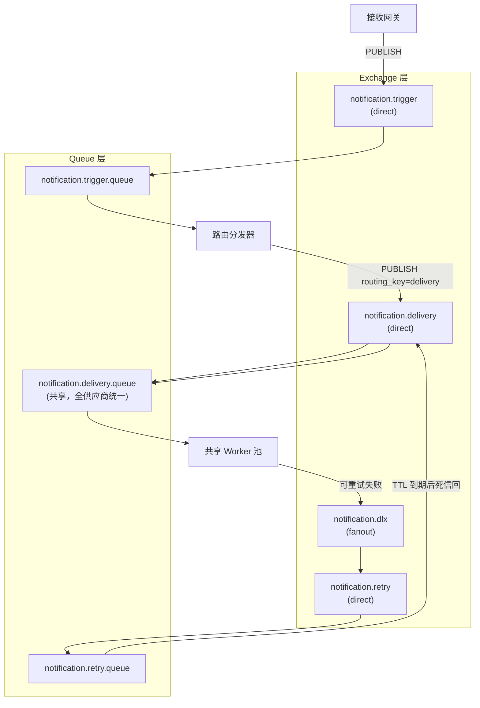
```mermaid
flowchart TB
    subgraph EX["Exchange 层"]
        TRIGGER_EX["notification.trigger<br/>(direct)"]
        DELIVERY_EX["notification.delivery<br/>(direct)"]
        DLX_EX["notification.dlx<br/>(fanout)"]
        RETRY_EX["notification.retry<br/>(direct)"]
    end

    subgraph Q["Queue 层"]
        TRIGGER_Q["notification.trigger.queue"]
        DELIVERY_Q["notification.delivery.queue<br/>(共享，全供应商统一)"]
        RETRY_Q["notification.retry.queue"]
    end

    GW[接收网关] -->|PUBLISH| TRIGGER_EX
    TRIGGER_EX --> TRIGGER_Q
    TRIGGER_Q --> ROUTER[路由分发器]

    ROUTER -->|PUBLISH routing_key=delivery| DELIVERY_EX
    DELIVERY_EX --> DELIVERY_Q
    DELIVERY_Q --> WP[共享 Worker 池]

    WP -->|可重试失败| DLX_EX
    DLX_EX --> RETRY_EX
    RETRY_EX --> RETRY_Q
    RETRY_Q -->|TTL 到期后死信回| DELIVERY_EX
    DELIVERY_EX --> DELIVERY_Q
```

<a id="62-触发通道"></a>
### 6.2 触发通道

| 项目 | 内容 |
|------|------|
| Exchange | `notification.trigger` (direct) |
| Queue | `notification.trigger.queue` |
| Binding | 队列绑定到 Exchange，routing_key = `trigger` |
| 消息内容 | `{"notification_id": "notif_abc123"}` |
| 持久化 | 消息 `delivery_mode=2`（持久化），队列 `durable=true` |
| 消费语义 | at-least-once，手动 ACK |

**声明拓扑**：

| 元素 | 类型 | 属性 |
|------|------|------|
| Exchange | `notification.trigger` | direct, durable |
| Queue | `notification.trigger.queue` | durable |
| Binding | `notification.trigger.queue` ↔ `notification.trigger` | routing_key = `trigger` |

<a id="63-投递队列"></a>
### 6.3 投递队列（MVP 共享队列）

| 项目 | 内容 |
|------|------|
| Exchange | `notification.delivery` (direct) |
| Queue | `notification.delivery.queue` |
| 消息内容 | `{"delivery_task_id": "dt_001"}` |
| 持久化 | 消息持久化，队列 durable=true |
| 消费 Qos | 每个 Worker `prefetch_count=1` |

**声明拓扑**：

| 元素 | 类型 | 属性 |
|------|------|------|
| Exchange | `notification.delivery` | direct, durable |
| Queue | `notification.delivery.queue` | durable |
| Binding | `notification.delivery.queue` ↔ `notification.delivery` | routing_key = `delivery` |

<a id="64-延迟重试通道"></a>
### 6.4 延迟重试通道（MVP：DLX+TTL）

采用 **DLX + TTL** 方案（无需额外插件），Worker 在投递失败时可重试时，将消息发布到 DLX，经过 RETRY_EX→RETRY_Q 等待 TTL 到期后，死信回 DELIVERY_EX 重新投递：

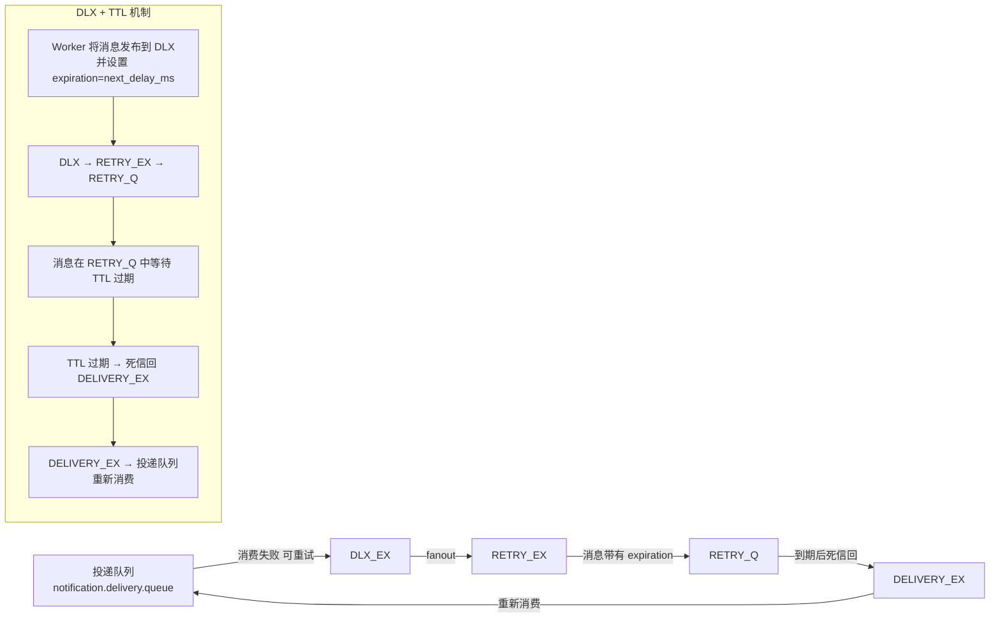
```mermaid
flowchart LR
    DELIVERY_Q[投递队列<br/>notification.delivery.queue] -->|消费失败 可重试| DLX_EX
    DLX_EX -->|fanout| RETRY_EX
    RETRY_EX -->|消息带有 expiration| RETRY_Q
    RETRY_Q -->|到期后死信回| DELIVERY_EX
    DELIVERY_EX -->|重新消费| DELIVERY_Q

    subgraph "DLX + TTL 机制"
        A[Worker 将消息发布到 DLX<br/>并设置 expiration=next_delay_ms]
        B[DLX → RETRY_EX → RETRY_Q]
        C[消息在 RETRY_Q 中等待 TTL 过期]
        D[TTL 过期 → 死信回 DELIVERY_EX]
        E[DELIVERY_EX → 投递队列<br/>重新消费]
        A --> B --> C --> D --> E
    end
```

**声明拓扑**：

| 元素 | 类型 | 属性 |
|------|------|------|
| Exchange | `notification.dlx` | fanout, durable |
| Exchange | `notification.retry` | direct, durable |
| Queue | `notification.retry.queue` | durable, `x-dead-letter-exchange = notification.delivery`，TTL 由每条消息的 `expiration` 决定 |
| Binding | `notification.retry.queue` ↔ `notification.retry` | routing_key = `retry` |
| Binding | `notification.dlx` → `notification.retry` | fanout 自动绑定 |

<a id="65-消息格式规范"></a>
### 6.5 消息格式规范

**触发消息**（pub → trigger queue → router）：
```json
{
  "notification_id": "notif_abc123"
}
```

**投递消息**（pub → delivery queue → worker）：
```json
{
  "delivery_task_id": "dt_001"
}
```

**消息 Headers**：

| Header | 类型 | 说明 | 必填 |
|--------|------|------|------|
| `x-trace-id` | string | 追踪 ID，接收层生成，沿链路传播 | 是 |
| `x-retry-count` | int | 已重试次数（延迟重试时设置） | 否 |
| `x-original-routing-key` | string | 原始路由键（延迟消息使用） | 延迟消息必填 |

---

<a id="7-安全设计"></a>
## 7. 安全设计

> **MVP 范围**：内网信任，不做鉴权。
> 
> **未来扩展**：第二阶段引入 HLD §5.1 定义的调用方鉴权（API Key + HMAC 签名），包括：
> - 调用方注册表（callers 表）和凭证哈希存储
> - 请求签名与验证流程（时间戳窗口、HMAC-SHA256）
> - 凭证全生命周期管理（颁发、轮换、吊销）
> - 审计日志

<a id="71-调用方鉴权流程"></a>
### 7.1 调用方鉴权流程（未来扩展）

> 预留章节，第二阶段实现时参考 HLD §5.1 展开。

<a id="72-凭证全生命周期管理"></a>
### 7.2 凭证全生命周期管理（未来扩展）

> 预留章节，第二阶段实现时参考 HLD §5.1 展开。

<a id="73-审计日志"></a>
### 7.3 审计日志（未来扩展）

> 预留章节，第二阶段实现时参考 HLD §5.1 展开。

---

<a id="8-可观测性设计"></a>
## 8. 可观测性设计

> **MVP 范围**：使用 stdout 结构化日志（zerolog），不依赖 Prometheus/Grafana/OTel。
>
> **未来扩展**：第二/三阶段引入 Prometheus 指标和告警规则。

<a id="81-结构化日志"></a>
### 8.1 结构化日志

使用 zerolog 输出 JSON 结构日志。

**全局字段**（每条日志行携带）：

| 字段 | 类型 | 说明 |
|------|------|------|
| `ts` | string | ISO8601 时间戳 |
| `level` | string | debug / info / warn / error |
| `module` | string | ingestion / routing / mapping / delivery |
| `trace_id` | string | 追踪 ID |

**按模块补充字段**：

| 模块 | 额外字段 |
|------|----------|
| 接收层 | caller_id, notification_id, event_type, ip |
| 路由层 | notification_id, event_type, matched_vendors[] |
| 投递层 | notification_id, delivery_task_id, vendor_id, attempt_number, duration_ms, http_status_code |
| 管理 API | operator_id, action, target |

**日志采样策略**：

| 级别 | 采样策略 |
|------|----------|
| error | 全量记录 |
| warn | 全量记录 |
| info | 正常投递每 100 条采样 1 条，关键事件（创建、入死信）全量记录 |
| debug | 仅在开发/调试环境开启 |

**Attempt 日志**（每次投递尝试记录为一行 JSON）：

```json
{
  "ts": "2026-05-24T10:30:05.123Z",
  "level": "info",
  "module": "delivery",
  "trace_id": "trc_abc123",
  "notification_id": "notif_abc123",
  "delivery_task_id": "dt_001",
  "vendor_id": "crm_system",
  "attempt_number": 1,
  "duration_ms": 350,
  "http_status_code": 200,
  "response_body": "{\"id\":\"contact_789\",\"status\":\"updated\"}",
  "result": "success"
}
```

<a id="82-prometheus-指标"></a>
### 8.2 Prometheus 指标（未来扩展）

> 预留章节，第三阶段引入。详见 HLD §5.6 可观测性的指标定义。

<a id="83-告警规则"></a>
### 8.3 告警规则（未来扩展）

> 预留章节，第三阶段引入。详见 HLD §5.6 可观测性的告警规则定义。

---

<a id="9-实现指南"></a>
## 9. 实现指南

> 本章提供编码实现所需的技术细节：包结构、依赖清单、关键接口、启动流程。

<a id="91-go-包结构"></a>
### 9.1 Go 包结构（MVP）

```
internal/
├── api/                    # HTTP 层
│   ├── handler/            # HTTP handler（接收、管理）
│   ├── middleware/         # 日志中间件
│   └── response/           # 响应格式化
├── config/                 # 配置管理
│   ├── loader/             # ConfigLoader（本地文件加载）
│   └── model/              # RuntimeConfig 结构体
├── db/                     # 数据访问层
│   ├── postgres/           # PostgreSQL 客户端 + 查询
│   └── migration/          # 数据库迁移
├── delivery/               # 投递层
│   └── worker/             # Worker 池管理
├── ingestion/              # 接收层
│   └── service/            # 提交流水线
├── mapping/                # 请求拼装引擎
│   └── engine/             # MappingEngine（引用解析、$source/$format）
├── mq/                     # 消息队列
│   └── rabbitmq/           # RabbitMQ 客户端封装
├── routing/                # 路由层
│   └── dispatcher/         # 路由分发器
├── model/                  # 领域模型
│   ├── notification.go
│   ├── delivery_task.go
│   └── dead_letter.go
└── logger/                 # 日志封装（zerolog）

cmd/
└── notification-server/    # main.go（启动入口）

migrations/                 # SQL 迁移文件
config/                     # 示例配置文件目录
```

<a id="92-依赖清单"></a>
### 9.2 依赖清单（MVP）

| 库 | 用途 | 版本说明 |
|----|------|----------|
| `github.com/rabbitmq/amqp091-go` | RabbitMQ 客户端 | v1.x |
| `github.com/jackc/pgx/v5` | PostgreSQL 驱动 | v5.x |
| `github.com/rs/zerolog` | 结构化日志 | v1.x |
| `github.com/google/uuid` | UUID 生成 | v1.x |
| `github.com/go-chi/chi/v5` | HTTP 路由 | v5.x（轻量路由） |
| `github.com/xeipuuv/gojsonschema` | JSON Schema 校验 | v1.x |

**未来扩展**：第二阶段增加 `go-redis/v9`（限流器）、`expr-lang/expr`（条件表达式）、`prometheus/client_golang`（指标）。

<a id="93-关键接口定义"></a>
### 9.3 关键接口定义

#### 9.3.1 ConfigLoader（MVP：本地文件加载）

**DeliverySpec —— 投递规格组合**：

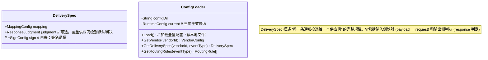
```mermaid
classDiagram
    class DeliverySpec {
        +MappingConfig mapping
        +ResponseJudgment judgment  // 可选，覆盖供应商级别默认判决
        // +SignConfig sign       // 未来：签名逻辑
    }
    note "DeliverySpec 描述 '将一条通知投递给一个供应商' 的完整规格。\n包括输入侧映射 (payload → request) 和输出侧判决 (response 判定)"

    class ConfigLoader {
        -String configDir
        -RuntimeConfig current  // 当前生效快照
        +Load()                     // 加载全量配置（读本地文件）
        +GetVendor(vendorId) VendorConfig
        +GetDeliverySpec(vendorId, eventType) DeliverySpec
        +GetRoutingRules(eventType) RoutingRule[]
    }
```

#### 9.3.2 WorkerPool（MVP：共享池）

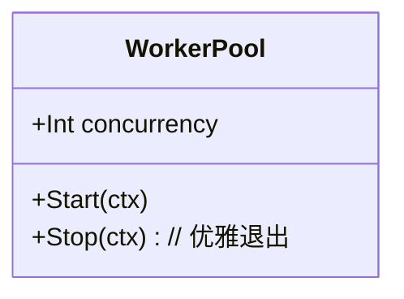
```mermaid
classDiagram
    class WorkerPool {
        +Int concurrency
        +Start(ctx)
        +Stop(ctx)                  // 优雅退出
    }
```

#### 9.3.3 DB 访问接口（MVP）

**DBClient 接口定义**：

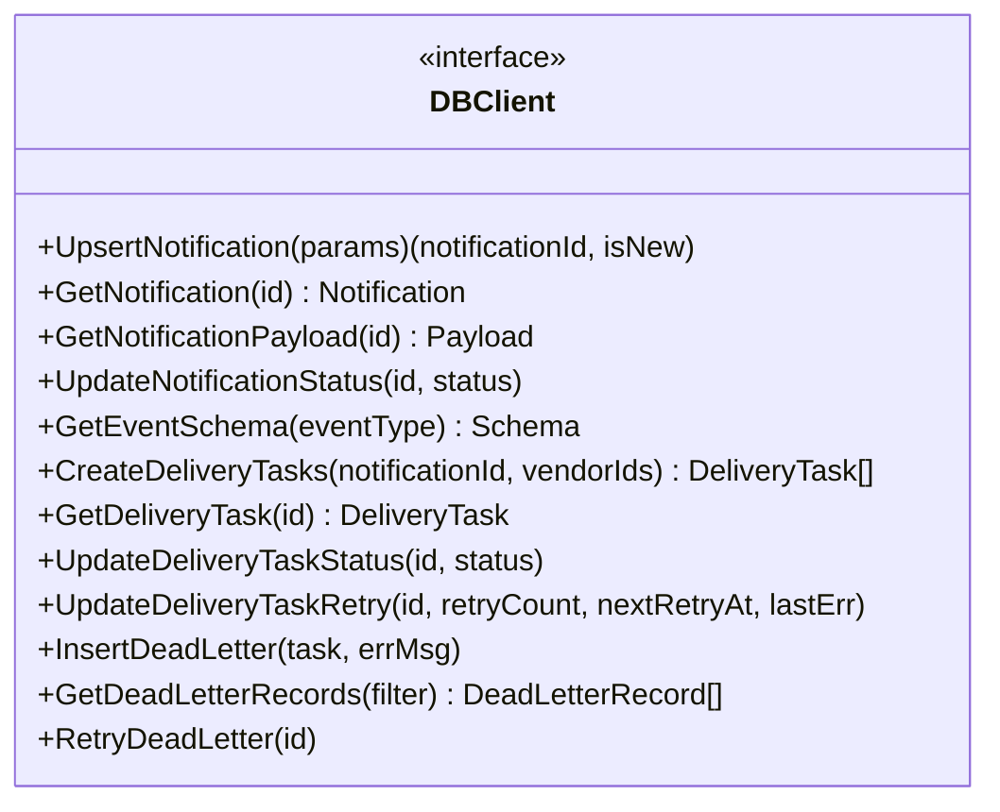
```mermaid
classDiagram
    class DBClient {
        <<interface>>
        +UpsertNotification(params) (notificationId, isNew)
        +GetNotification(id) Notification
        +GetNotificationPayload(id) Payload
        +UpdateNotificationStatus(id, status)
        +GetEventSchema(eventType) Schema
        +CreateDeliveryTasks(notificationId, vendorIds) DeliveryTask[]
        +GetDeliveryTask(id) DeliveryTask
        +UpdateDeliveryTaskStatus(id, status)
        +UpdateDeliveryTaskRetry(id, retryCount, nextRetryAt, lastErr)
        +InsertDeadLetter(task, errMsg)
        +GetDeadLetterRecords(filter) DeadLetterRecord[]
        +RetryDeadLetter(id)
    }
```

<a id="94-配置加载与启动流程"></a>
### 9.4 配置加载与启动流程（MVP）

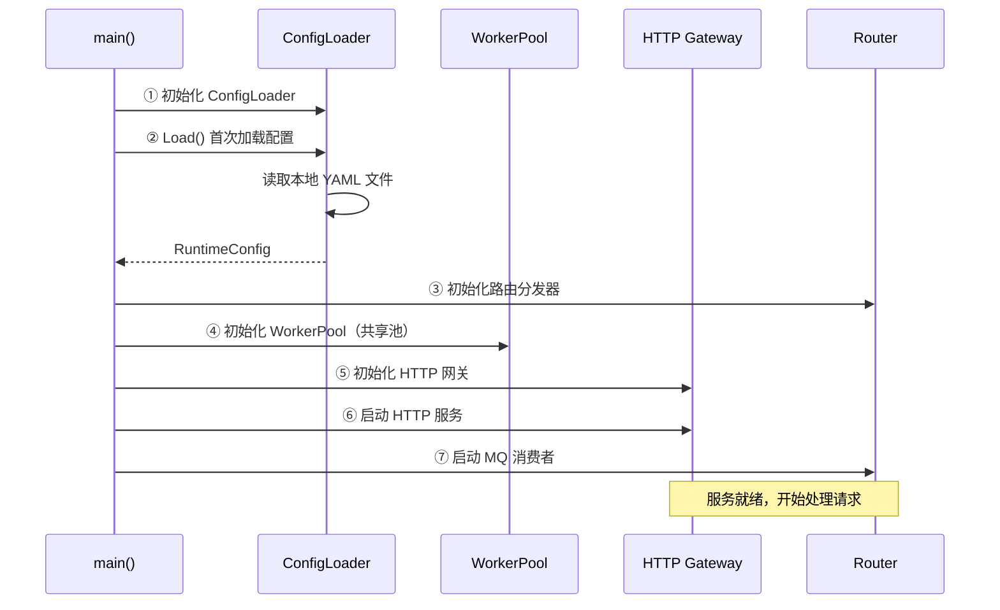
```mermaid
sequenceDiagram
    participant Main as main()
    participant CL as ConfigLoader
    participant WP as WorkerPool
    participant GW as HTTP Gateway
    participant R as Router

    Main->>CL: ① 初始化 ConfigLoader
    Main->>CL: ② Load() 首次加载配置
    CL->>CL: 读取本地 YAML 文件
    CL-->>Main: RuntimeConfig

    Main->>R: ③ 初始化路由分发器
    Main->>WP: ④ 初始化 WorkerPool（共享池）
    Main->>GW: ⑤ 初始化 HTTP 网关
    Main->>GW: ⑥ 启动 HTTP 服务
    Main->>R: ⑦ 启动 MQ 消费者

    Note over GW,R: 服务就绪，开始处理请求
```

**main 启动流程（MVP 伪码）**：

```
main():
  // 注册系统信号监听：收到 SIGTERM 或 SIGINT 时触发关闭流程
  注册信号监听(SIGTERM, SIGINT)

  // Step 1: 初始化基础设施——数据库连接、消息队列连接、日志系统
  db  ← 建立 PostgreSQL 连接
  mq  ← 建立 RabbitMQ 连接
  logger ← 初始化结构化日志系统

  // Step 2: 从本地 config/ 目录加载全量配置
  // 配置包括：供应商接入信息、事件 Schema、路由规则、映射规则
  configLoader ← 创建配置加载器(configDir: "config")
  success ← configLoader.Load()
  if not success:
    logger.Fatal("加载配置文件失败，终止启动")

  // Step 3: 构造接收层——通知提交通道的同步入口
  ingestionSvc     ← 创建 IngestionService(configLoader, db, mq, logger)
  ingestionHandler ← 创建 HTTP Handler(ingestionSvc)

  // Step 4: 在后台异步启动路由分发器
  router ← 创建 Dispatcher(configLoader, db, mq, logger)
  spawn router.Start(ctx)

  // Step 5: 在后台异步启动 Worker 池（共享池，并发数 = 10）
  workerPool ← 创建 WorkerPool(
    concurrency: 10, configLoader, db, mq, logger
  )
  spawn workerPool.Start(ctx)

  // Step 6: 在后台异步启动 HTTP 服务，监听 8080 端口
  httpServer ← 创建 HTTP 服务器(
    addr: ":8080",
    routes: {
      POST /api/v1/notifications           → ingestionHandler.Submit
      GET  /api/v1/notifications/{id}      → ingestionHandler.GetNotification
    }
  )
  spawn httpServer.ListenAndServe()

  // Step 7: 主协程在此阻塞等待退出信号
  waitSignal()
  logger.Info("收到退出信号，开始优雅关闭……")

  // Step 8: 逆序关闭各组件，超时 30s
  shutdownCtx ← 带超时的上下文(30s)
  workerPool.Stop(shutdownCtx)
  httpServer.Shutdown(shutdownCtx)
  // MQ、DB 连接在各组件的 Stop 方法中连带关闭
```

<a id="95-优雅关闭"></a>
### 9.5 优雅关闭

系统收到 SIGTERM/SIGINT 信号时执行以下关闭序列：

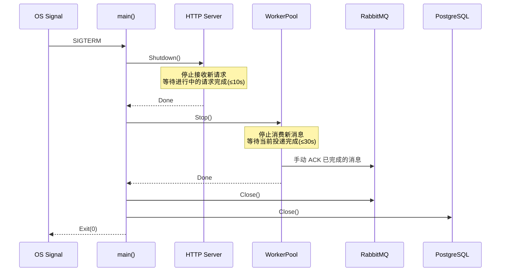
```mermaid
sequenceDiagram
    participant OS as OS Signal
    participant Main as main()
    participant HTTP as HTTP Server
    participant WP as WorkerPool
    participant MQ as RabbitMQ
    participant DB as PostgreSQL

    OS->>Main: SIGTERM
    Main->>HTTP: Shutdown()
    Note over HTTP: 停止接收新请求<br/>等待进行中的请求完成(≤10s)
    HTTP-->>Main: Done

    Main->>WP: Stop()
    Note over WP: 停止消费新消息<br/>等待当前投递完成(≤30s)
    WP->>MQ: 手动 ACK 已完成的消息
    WP-->>Main: Done

    Main->>MQ: Close()
    Main->>DB: Close()
    Main-->>OS: Exit(0)
```

**关闭前保证**：
1. HTTP 服务停止接收新请求，进行中的请求正常完成后关闭
2. Worker 停止消费新 MQ 消息，当前正在处理的 HTTP 投递正常完成后关闭
3. 未 ACK 的消息在连接断开后自动重新入队，重启后继续处理
4. 关闭超时（默认 30s）后强制退出，未完成的消息由 MQ 自动重投

---

<a id="10-测试策略"></a>
## 10. 测试策略

> 本章定义系统的测试架构和分层策略。测试方法论采用 **Outside-In TDD（Double-Loop TDD）**，以 E2E 验收测试为外循环（定义合格线），以组件级测试为内循环（驱动代码实现）。外层指导内层，内层支持外层，各层共同构成完整的 TDD 驱动闭环。

<a id="101-测试方法论"></a>
### 10.1 测试方法论

采用 Outside-In TDD（自外而内 TDD，即伦敦学派），其核心结构是双环模型：

**外循环（验收测试驱动）**：
- 以 E2E 验收测试定义功能的"合格线"
- 只有 E2E 测试变绿，才认为功能完成
- 外循环的结果决定开发进度，不绕过

**内循环（组件测试驱动）**：
- 在 E2E 的路径上，逐组件深入，用单元级测试驱动组件的实现
- 内循环服务于外循环——每条内层测试都是在为"让某条 E2E 变绿"服务
- 内循环覆盖 E2E 不方便覆盖的分支和边界

**双环关系**：外层指导内层（只有 E2E 路径上的组件才需要内层测试），内层支持外层（内层测试全绿时，E2E 大概率一次过，失败可归因到组件连接问题而非业务逻辑）。

<a id="102-e2e-验收测试"></a>
### 10.2 E2E 验收测试

**测试对象**：完整系统黑盒。以编译产物的二进制文件启动一个真实的通知系统实例（使用真实的 PostgreSQL 和 RabbitMQ）。测试脚本将通知系统视为黑盒，不直接访问其内部组件（DB、MQ），只通过与真实业务系统一致的 HTTP 接口交互。最终验证通知系统发往 Mock Vendor 的 HTTP 请求是否符合预期。

**启动方式**：
1. 编译二进制产物
2. 通过 testcontainers 或外部服务启动 PostgreSQL 和 RabbitMQ
3. 以二进制文件启动通知系统实例
4. 测试脚本通过 HTTP 提交通知
5. 系统异步投递完成后，测试脚本查询 Mock Vendor 的请求记录进行断言

**Mock Vendor**：一个轻量级 HTTP Server，作为测试环境中的"虚拟供应商 API"。提供响应预配置、请求记录、延迟注入、错误注入等能力（详见 HLD §7.8.2）。

**测试 ID 串联**：每轮测试生成唯一 test_case_id，作为 payload 字段提交通知，经映射规则拼入发往供应商的请求 Header（X-Test-Id）。Mock Vendor 据此识别用例、记录请求、模拟响应。测试脚本通过 test_case_id 查询请求记录并断言。

**目的**：定义功能的合格线。每条 E2E 测试通过，代表一个场景在完整链路上可用。它是开发流程的锁定信号——在外循环看到它变绿之前，功能不算完成。

**设计约束**：
- 数量极少，每个功能场景一条
- 只覆盖快乐路径和关键终态（如重试超限后走入死信）
- 不追求覆盖异常分支（那是内循环的责任）

<a id="103-编排测试"></a>
### 10.3 编排测试

**测试对象**：每个业务组件的决策逻辑（IngestionService、Router、Worker 等），即"给定外部依赖的不同响应，组件做出什么决策"。

**启动方式**：标准 `go test`，通过 Port 接口注入 mock（如 `testify/mock`）。不启动任何外部进程，不经过真实 DB 或 MQ。

**目的**：覆盖 E2E 无法稳定覆盖或代价过高的分支路径——DB 连接失败、MQ publish 异常、HTTP 超时、第 n 次重试触发死信等。这是内循环的主力测试层。

**与 E2E 的关系**：
- 测试范围由 E2E 决定——只在 E2E 路径上的组件，才为它们写编排测试
- 一个分支如果能被 E2E 低成本覆盖，就不需要单独写编排测试
- 编排测试变绿说明"组件在 mock 出的各种场景下做出了正确的决策"

<a id="104-契约测试"></a>
### 10.4 契约测试

**测试对象**：每个 Port 的 Adapter 实现（DB Adapter、MQ Adapter）与真实中间件的交互行为。

**启动方式**：testcontainers 独立启动 PostgreSQL 或 RabbitMQ，不启动完整系统，不加载业务组件。只验证 Adapter 实现与中间件的交互符合预期。

**目的**：验证我们对中间件行为的理解是否正确。编排测试中 mock 的行为（如"MQ publish 在 channel 正常时返回 nil"）的正确性依赖于 Port 实现与真实中间件的交互行为一致，契约测试验证这一层。

**与编排测试的关系**：
- 编排测试中 mock 的 Port 行为，其正确性假设由契约测试验证
- 契约测试为编排测试提供"Port 行为建模"的输入

**与 E2E 的关系**：
- E2E 验证"组件能连上"，契约测试验证"连上后交互行为和我们预期一致"
- 契约测试比 E2E 更快（只启动一个中间件），是 E2E 集成验证的诊断加速

<a id="105-算法测试"></a>
### 10.5 算法测试

**测试对象**：不依赖任何外部系统的纯函数（`calculateBackoff`、`judgeResponse`、`resolveField` 等）。

**启动方式**：标准 `go test`，无任何外部依赖。直接调用函数，断言返回值。

**目的**：覆盖核心算法的数学正确性和边界条件。投入只给"算错了会导致系统行为不符合预期"的函数。

**与编排测试的关系**：编排测试中如果某个组件依赖复杂的算法分支，将该算法拆到这一层精确覆盖其边界条件。例如编排测试验证"第 3 次重试后 Worker 调用了死信"，算法测试验证"`calculateBackoff(3, policy)` 的返回值等于 X"。

<a id="106-优雅关闭验证"></a>
### 10.6 优雅关闭验证

**测试对象**：SIGTERM 信号处理 + Worker 完成当前任务后才退出的机制。

**启动方式**：同 E2E 验收测试（编译二进制 → 启动完整真实系统），在 Worker 处理中途发送 SIGTERM，观察是否在完成当前请求后退出，且 MQ 消息不丢失。

**目的**：验证系统生命周期事件的正确处理。这是一个特殊的 E2E 场景——共享相同的基础设施，但测试的是"终结阶段"的行为而非"运行阶段"的行为。

**与 E2E 的关系**：它是 E2E 的一个回调场景，而非独立的测试层。在基本功能的 E2E 全部通过后执行。

<a id="107-层间协作关系"></a>
### 10.7 层间协作关系

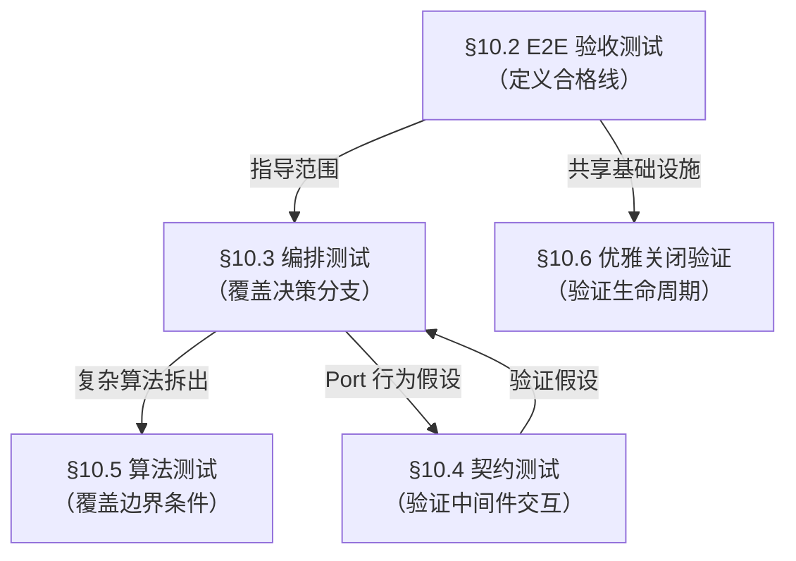
```mermaid
graph TD
    E2E["§10.2 E2E 验收测试<br/>（定义合格线）"]
    ORCH["§10.3 编排测试<br/>（覆盖决策分支）"]
    CONTRACT["§10.4 契约测试<br/>（验证中间件交互）"]
    ALGO["§10.5 算法测试<br/>（覆盖边界条件）"]
    SHUTDOWN["§10.6 优雅关闭验证<br/>（验证生命周期）"]

    E2E -->|指导范围| ORCH
    E2E -->|共享基础设施| SHUTDOWN
    ORCH -->|复杂算法拆出| ALGO
    ORCH -->|Port 行为假设| CONTRACT
    CONTRACT -->|验证假设| ORCH
```

**外层指导内层**：
- 只有 E2E 路径上的组件，才有必要为它写编排测试
- 只有编排测试中发现的需要精确验证的算法，才拆到算法测试

**内层支持外层**：
- 编排测试 + 契约测试 + 算法测试全绿 → E2E 大概率一次过
- 如果 E2E 仍然失败，可迅速归因到组件连接或配置问题，而非业务逻辑

<a id="108-ci-运行策略"></a>
### 10.8 CI 运行策略

| 测试层 | 触发时机 | 执行频率 | 通过时间预期 |
|-------|---------|---------|------------|
| 算法测试 | git push | 每次提交 | < 1s |
| 编排测试 | git push | 每次提交 | < 5s |
| 契约测试 | git push | 每次提交 | 10~30s |
| E2E 验收测试 | PR 合并前 / nightly | 按需 | 30~120s |
| 优雅关闭验证 | nightly | 每日 | 10~60s |

算法测试和编排测试作为 PR 门禁，契约测试并行执行，E2E 和优雅关闭验证作为 pre-merge 或 nightly 的独立 stage。

---

## 附录 A: 设计参考

### A.1 HLD 对应关系

| DD 章节 | 对应 HLD 章节 | 说明 |
|---------|---------------|------|
| §2 数据模型 | §2 核心实体模型, §4.1.2 存储模型 | 实现级表结构 |
| §3 API | §5.1 接收网关 | RESTful JSON API 完整定义（MVP 简化版） |
| §4 配置 | §3.5 配置架构, §4.4 配置存储 | 完整 YAML 文件格式（MVP 本地文件） |
| §5.1 接收网关 | §5.1 接收网关 | 幂等处理逻辑（MVP 无鉴权） |
| §5.2 路由分发器 | §5.2 路由分发器 | 事件→供应商映射（MVP 无条件路由） |
| §5.3 请求拼装 | §5.3 请求拼装 | 结构化映射引擎 |
| §5.4 投递工作器 | §5.5 投递工作器 | 共享 Worker 池 + MQ DLX+TTL 重试 |
| §5.5-5.6 限流熔断（未来扩展） | §5.5.2 限流器与熔断器 | MVP 不做限流熔断 |
| §6 MQ 拓扑 | §4.2 队列架构 | 共享投递队列（MVP） |
| §7 安全（未来扩展） | §5.1 接收网关(鉴权) | MVP 无鉴权，未来引入 API Key + HMAC |
| §8 可观测性 | 未展开(HLD 提及) | MVP 仅结构化日志 |
| §9 实现指南 | 未展开 | MVP 包结构/接口/启动流程 |
| §10 测试策略 | 未展开 | Outside-In TDD 测试分层架构 |

---

## 附录 B: 评审记录

### B.1 详细设计文档应该用 UML 图 / 伪码还是具体语言的代码示例？（2026-06-03）

**问题**：详细设计文档中，组件内部逻辑、算法流程用 Go 代码表示好，还是用语言无关的 UML 图或伪码表示好？

**关注点**：
- **Go 代码示例的读者门槛**：原文档在 §5 组件内部设计中大量使用了 Go 代码示例（Submit 函数、Route 函数、resolveString 等）。读者需要先理解 Go 语法才能理解设计意图——这为使用 Java、Python 等其他语言的开发者设置了不必要的障碍。对于"路由分发器的处理流程"这类通用逻辑场景，Go 的语法细节（`context.Context`、`time.Duration`、`type switch`）属于实现层面，而非设计层面，不应该出现在详细设计中。

- **UML 图能否清晰表达逻辑**：部分流程（如 Route 的幂等检查、守卫条件和多路分支）用活动图表达确实比线性伪码更直观——一眼能看出"哪些路径会终止、哪些能继续"。另一部分流程（如 resolveNode 的类型分派）用活动图的菱形分支也很自然，省去了在伪码里写 `switch typeOf(node)` 的负担。但有些逻辑不适合用图表示：`calculateBackoff` 这种数学公式适合公式本身；`getNestedField` 这种递归遍历适合伪码；`resolveString` 的字符串替换是"每处引用逐次替换"的循环，活动图画出来反而比一行伪码更费解。

- **语言无关的收益与成本**：用伪码取代 Go 代码时面临一个矛盾——伪码过于自然语言则缺乏精确性（实现者可能有歧义），过于精确则退化为"换了语法糖的代码"。折中方案是：对有明确算法步骤的逻辑用精确伪码（`delay ← base × mult^attempt；delay ← min(delay, maxDelay)`），对简单顺序管线和守卫条件用自然语言描述（"查询成功但记录不存在 → 日志警告，本消息不再重试"）。关键是从"描述代码怎么写"转变为"描述逻辑怎么走"。

- **如何保证关联性**：去掉 Go 后，各算法之间的调用关系容易丢失（"resolveSourceDirective 被谁调用了？它在哪用？"）。解决方式是在每段伪码开头标注被谁调用、内部依赖谁，同时在 §5.3 开头增加一张算法依赖关系图，读者先看全景再读细节。

**哲学**：详细设计文档同时面向"理解设计逻辑"的人和"实现当前模块"的人。即使是后者，文档要传达的也是"逻辑怎么走"而不是"代码怎么写"——否则不如直接写代码本身。语言无关的表示（UML 图 + 伪码）比具体语言的代码更准确地传达了设计意图。精确性与可读性的平衡点在于：逻辑复杂处给精确伪码，逻辑简单处给自然语言描述。

**结论**：将所有 Go 代码替换为 UML 图（活动图、序列图、类图）和语言无关的伪码。在 §5.3 开头增加算法依赖关系图，在每段伪码开头标注调用关系以避免上下文断裂。

### B.2 映射引擎中 resolveString 和 resolveField 的关系应该如何划分？（2026-06-03）

**问题**：映射引擎（§5.3）各算法之间的职责边界和调用关系应该如何设计？具体涉及：`resolveString` 和 `resolveField` 是否重复；`resolveSourceDirective` 和 `resolveEachDirective` 是独立入口还是包含关系；`resolveNode` 的数据上下文参数应该是什么形式。

**关注点**：
- **resolveString 和 resolveField 是否存在职责重叠**（去重）：两者解析 `@{}` 引用、提取值的逻辑完全一致，差别仅在最后一步——`resolveString` 强制把结果转为字符串，`resolveField` 在纯引用场景下保留原始类型。这意味着 `resolveString` 等价于 `resolveField` 后再做一次 `toString()`。既然如此，取值逻辑只需封装在 `resolveField` 中，`resolveString` 只剩下一个"取完值再转字符串"的壳。但问题在于设计上保留了这个壳，调用者就需要在两者间"根据场景凭经验选择"——URL/Header 解析用 `resolveString`，`$source` 提取用 `resolveField`。这种隐式约定不该出现在设计中，应去掉 `resolveString`，所有场景统一使用 `resolveField`。

- **resolveSourceDirective 和 resolveEachDirective 为什么不能是独立入口**（设计语义与代码结构的一致性）：设计上 `$source` 的语义是"对这个数据要做特殊处理了"，然后才根据其他键决定具体做什么处理（单值提取 + `$type`/`$format`，或 `$each` 数组遍历）。因此代码结构应该以 `$source` 为统一入口，内部按 `$each` 等键分派具体策略。原始设计在 `resolveNode` 中分别判断 `$each` 和 `$source` 键分派给两个独立算法，导致代码的控制流和设计语义打架——读者脑子里同时有两套逻辑在冲突：一套是实现的调度分支，一套是业务的 `$source` 入口语义。保证两者一致性，是在正确性之上更应保证的——不一致的代码，即使正确，也难以推导和验证。

- **数据上下文应该怎么设计以防止命名冲突**（命名空间隔离）：`$each` 遍历时需要同时暴露原始 payload 和当前数组元素给 `resolveField`。原始设计通过深拷贝后再 merge `item` 键实现，但 payload 本身也可能含有名为 `item` 的字段——merge 后 `@{payload.item}` 指向了数组元素而非原始值。虽然实践中 payload 中名为 `item` 的字段极少，但设计上这是个隐患。改进为 `ctx = {payload: 原始通知}` 的统一数据容器，`@{xxx.yyy}` 即 `ctx[xxx][yyy]`。`$each` 内扩展为 `{...ctx, item: 当前元素}`，payload 和 item 通过键名隔离。这种设计还能低成本支持未来扩展，如 `@{global.env}`。

**哲学**：
- 职责有重叠的两个算法，如果其中一个在特定参数下可完全退化为另一个的行为，则应该合并。让调用者根据场景"凭经验隐式选择"是设计不干净的表现。
- 代码的结构应该反映设计的语义，而非与之打架。如果设计上某个概念是入口，代码中就应以此概念为入口分派，否则读者需要在两套逻辑中反复切换才能验证代码的正确性。
- 数据源应通过独立键名隔离，而非 merge 共享同一命名空间。这样做不仅能避免键名冲突，也为未来扩展新数据源提供了零改动的接口。

**结论**：去掉 `resolveString`，`resolveField` 成为唯一的 `@{}` 引用替换入口。`resolveSourceDirective` 作为 `$source` 的统一入口，内部判断是否含 `$each` 后分派数组遍历或单值处理。`resolveNode` 的第二个参数改为 `ctx = {payload: 原始数据}`，`$each` 遍历时扩展为 `{...ctx, item: 当前元素}`。整体算法从 7 个精简为 5 个，调用关系从 12 条边简化为 8 条边。
