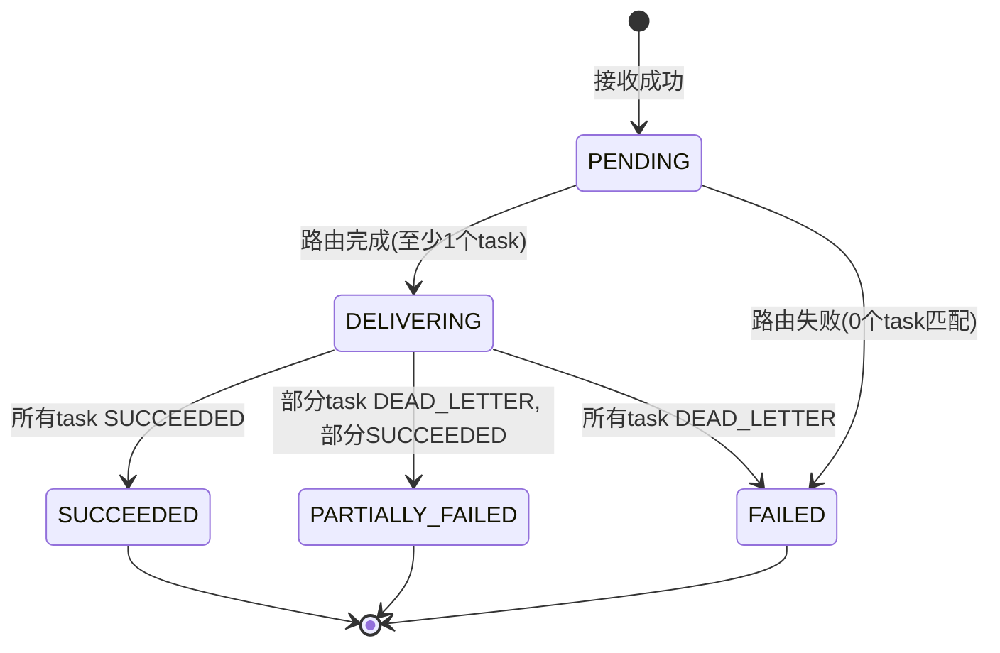
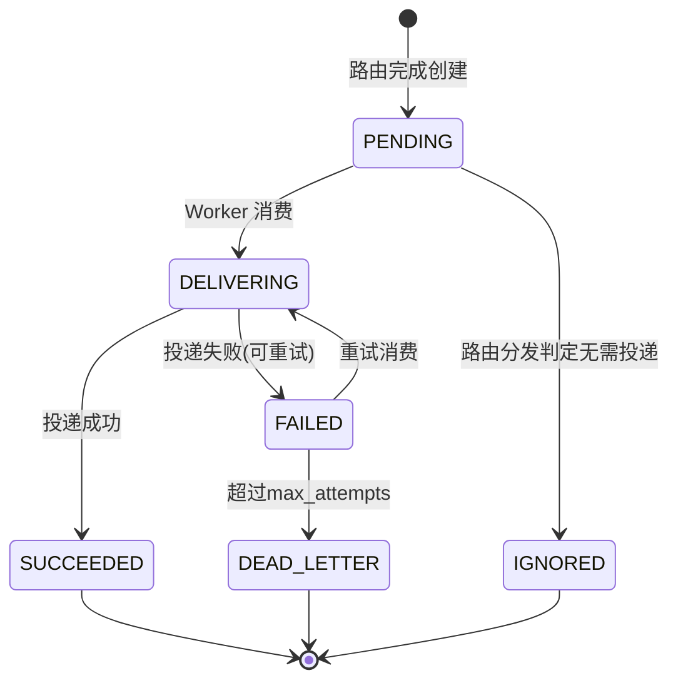
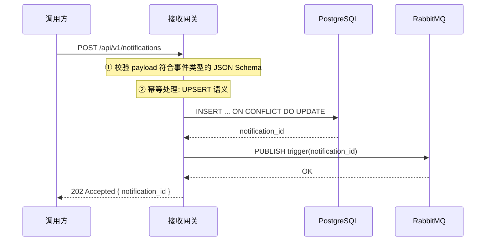
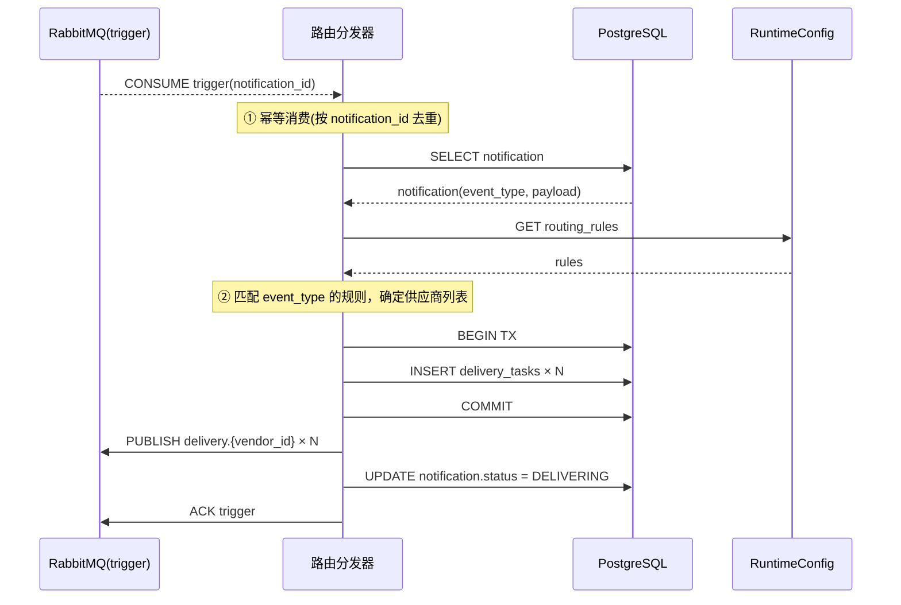
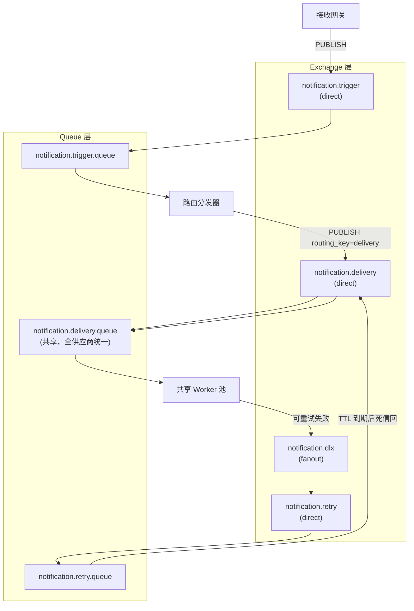
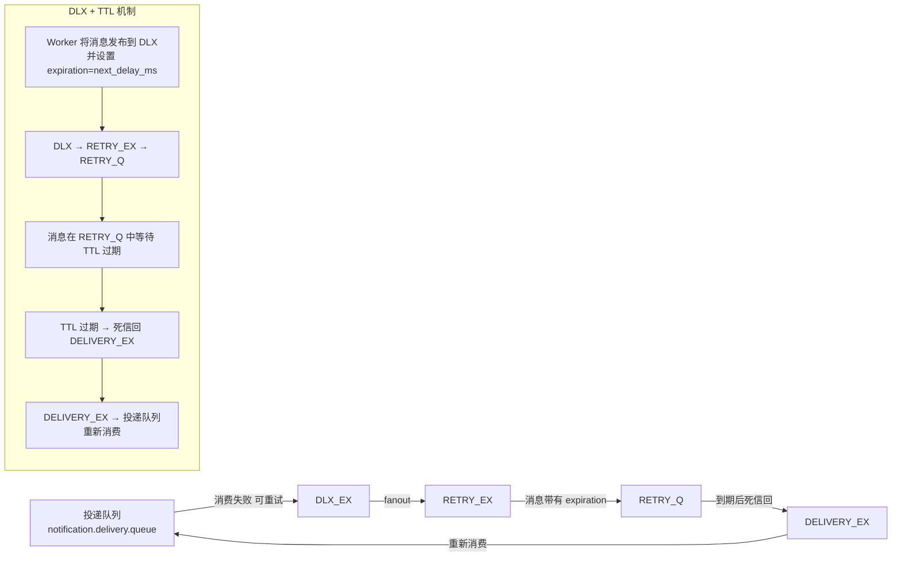
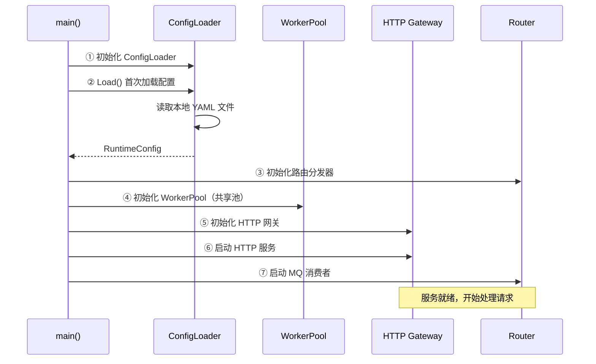
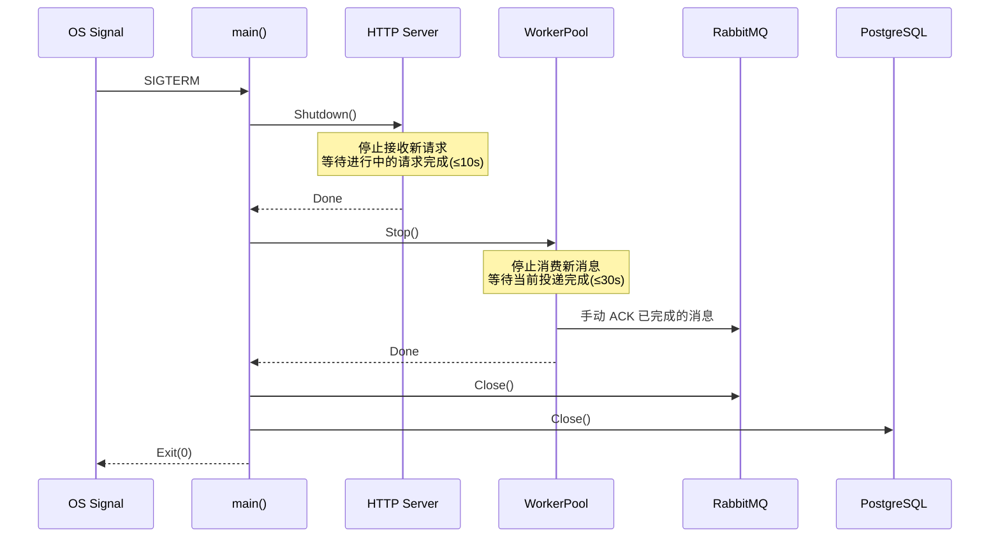
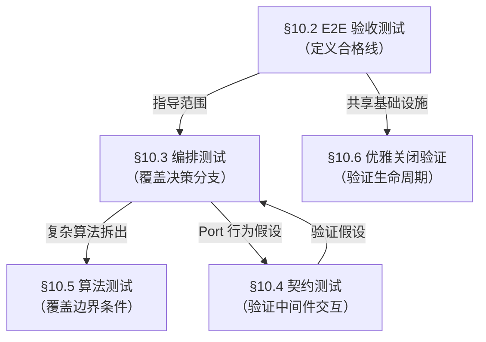

# API 通知系统 — 详细设计 (Detailed Design)

> 版本: v0.2  
> 日期: 2026-06-01  
> 状态: 草案  
> 基于 HLD: v0.2  
> 前置阅读: [需求文档 v0.3](202605-notification.md)、[HLD v0.2](202605-notification-design-hld.md)

---

## 目录

- [1. 引言](#1-引言)
  - [1.1 文档定位](#11-文档定位)
  - [1.2 名词对照](#12-名词对照)
  - [1.3 引用文档](#13-引用文档)
  - [1.4 MVP 范围界定](#14-mvp-范围界定)
- [2. 数据模型详细设计](#2-数据模型详细设计)
  - [2.1 实体状态机](#21-实体状态机)
  - [2.2 表结构 DDL](#22-表结构-ddl)
  - [2.3 索引策略](#23-索引策略)
  - [2.4 分区与分片策略](#24-分区与分片策略)
- [3. API 详细设计](#3-api-详细设计)
  - [3.1 通用规范](#31-通用规范)
  - [3.2 业务 API](#32-业务-api)
  - [3.3 管理 API](#33-管理-api)
  - [3.4 错误码一览](#34-错误码一览)
- [4. 配置详细设计](#4-配置详细设计)
  - [4.1 配置仓库目录结构](#41-配置仓库目录结构)
  - [4.2 事件类型 Schema 格式](#42-事件类型-schema-格式)
  - [4.3 供应商接入配置格式](#43-供应商接入配置格式)
  - [4.4 数据映射规则格式](#44-数据映射规则格式)
  - [4.5 路由规则格式](#45-路由规则格式)
  - [4.6 机密引用语法](#46-机密引用语法)
- [5. 组件内部设计](#5-组件内部设计)
  - [5.1 接收网关](#51-接收网关)
  - [5.2 路由分发器](#52-路由分发器)
  - [5.3 请求拼装引擎](#53-请求拼装引擎)
  - [5.4 投递工作器](#54-投递工作器)
  - [5.5 限流器](#55-限流器)
  - [5.6 熔断器](#56-熔断器)
- [6. MQ 拓扑设计](#6-mq-拓扑设计)
  - [6.1 完整拓扑图](#61-完整拓扑图)
  - [6.2 触发通道](#62-触发通道)
  - [6.3 投递队列](#63-投递队列)
  - [6.4 延迟重试通道](#64-延迟重试通道)
  - [6.5 消息格式规范](#65-消息格式规范)
- [7. 安全设计](#7-安全设计)
  - [7.1 调用方鉴权流程](#71-调用方鉴权流程)
  - [7.2 凭证全生命周期管理](#72-凭证全生命周期管理)
  - [7.3 审计日志](#73-审计日志)
- [8. 可观测性设计](#8-可观测性设计)
  - [8.1 结构化日志](#81-结构化日志)
  - [8.2 Prometheus 指标](#82-prometheus-指标)
  - [8.3 告警规则](#83-告警规则)
- [9. 实现指南](#9-实现指南)
  - [9.1 Go 包结构](#91-go-包结构)
  - [9.2 依赖清单](#92-依赖清单)
  - [9.3 关键接口定义](#93-关键接口定义)
  - [9.4 配置加载与启动流程](#94-配置加载与启动流程)
  - [9.5 优雅关闭](#95-优雅关闭)
- [10. 测试策略](#10-测试策略)
  - [10.1 测试方法论](#101-测试方法论)
  - [10.2 E2E 验收测试](#102-e2e-验收测试)
  - [10.3 编排测试](#103-编排测试)
  - [10.4 契约测试](#104-契约测试)
  - [10.5 算法测试](#105-算法测试)
  - [10.6 优雅关闭验证](#106-优雅关闭验证)
  - [10.7 层间协作关系](#107-层间协作关系)
  - [10.8 CI 运行策略](#108-ci-运行策略)

---

<a id="1-引言"></a>
## 1. 引言

<a id="11-文档定位"></a>
### 1.1 文档定位

本文档是通知系统的**详细设计（Detailed Design）**。它基于 HLD v0.2 的架构决策和方案组合，提供数据模型 DDL、API 定义、配置文件格式、组件内部接口、MQ 拓扑等实现级细节。目标是：开发者可据此直接编码实现，无需额外的设计决策。

根据项目文档规范（见 CLAUDE.md），详细设计可以引用 HLD 结论和用户需求，但 HLD 不得引用详细设计内容。

<a id="12-名词对照"></a>
### 1.2 名词对照

| HLD 术语 | 同义词/别称 | 说明 |
|----------|------------|------|
| 接收网关 | Ingestion API、接收层 | 接收业务系统提交通知的同步 HTTP 入口 |
| 路由分发器 | Router、路由层 | 消费触发消息，匹配路由规则，创建投递任务 |
| 请求拼装 | Mapper、映射层 | 将统一 payload 转换为供应商 API 格式 |
| 投递工作器 | Worker、投递层 | 执行 HTTP 调用，处理响应，管理重试 |
| Notification | 通知 | 业务系统提交的原始通知记录 |
| DeliveryTask | 投递任务 | 面向单个供应商的投递任务 |
| Caller | 调用方 | 业务系统调用方身份 |

<a id="13-引用文档"></a>
### 1.3 引用文档

| 文档 | 版本 | 说明 |
|------|------|------|
| [需求分析](202605-notification.md) | v0.3 | 用例定义、变化点分析、非功能性需求 |
| [概要设计](202605-notification-design-hld.md) | v0.2 | 架构决策、方案组合、核心组件定义 |

<a id="14-mvp-范围界定"></a>
### 1.4 MVP 范围界定

本文档按 HLD §6.3.1 的 MVP 范围界定编写。各功能模块的归属如下：

| 模块 | 保留在 MVP | 不放在 MVP（归属阶段） |
|------|-----------|-------------------|
| **接收层** | RESTful 接收入口、幂等键唯一约束、Schema 校验、MQ 触发 | 调用方鉴权（共享Secret过渡） |
| **数据模型** | 通知与投递任务分离、payload 存 DB/MQ 仅携 ID、预分片列 | DeliveryAttempt 审计日志、月度分区、Redis 缓存 |
| **路由层** | 简单事件→供应商映射 | 条件路由 |
| **映射层** | 结构化映射（L1 字段直映射） | 自定义映射插件、请求签名引擎、鉴权注入 |
| **投递层** | HTTP 投递、状态码判定、重试（MQ DLX+TTL）、死信表 | Body 条件判定、独立 Worker 池、限流器、熔断器 |
| **队列架构** | 共享队列（全供应商统一）、MQ 延迟重投（DLX+TTL） | 按供应商分区队列 |
| **配置管理** | 本地文件 | Git + Webhook + SecretStore |
| **可观测性** | 结构化日志 + 关键指标打点、通知状态查询（列表+详情） | Prometheus + Grafana、OTel 链路追踪 |
| **部署** | 单体架构 | 微服务拆分 |

> 表中标记为"不放在 MVP"的功能，本文档保留设计但标记为"**未来扩展**"，并在实现指南中标注对应阶段。开发者阅读时请以 MVP 内容为准。

---

<a id="2-数据模型详细设计"></a>
## 2. 数据模型详细设计

> HLD §2 定义了核心实体及其关系。本章给出完整的表结构 DDL、状态机、索引和分区策略。

<a id="21-实体状态机"></a>
### 2.1 实体状态机

#### 2.1.1 Notification 状态机

Notification 代表业务系统提交的一条原始通知。其状态是 N 个 DeliveryTask 状态的上卷聚合：



状态迁移条件：

| 当前状态 | 目标状态 | 触发条件 |
|----------|---------|----------|
| PENDING | DELIVERING | 路由分发器完成匹配并创建了至少 1 个 DeliveryTask |
| PENDING | FAILED | 路由分发器匹配结果为 0 个供应商 |
| DELIVERING | SUCCEEDED | 所有关联 DeliveryTask 状态为 SUCCEEDED |
| DELIVERING | PARTIALLY_FAILED | 部分 DeliveryTask SUCCEEDED，剩余全部 DEAD_LETTER |
| DELIVERING | FAILED | 所有 DeliveryTask 均为 DEAD_LETTER |

> Notification 的 FAILED 和 PARTIALLY_FAILED 是终端状态，不自动恢复。人工排查问题后可通过重试或重新提交通知来恢复。

#### 2.1.2 DeliveryTask 状态机

DeliveryTask 代表面向单个供应商的一次完整投递生命周期：



状态迁移条件：

| 当前状态 | 目标状态 | 触发条件 |
|----------|---------|----------|
| PENDING | DELIVERING | Worker 从 MQ 消费到该 task 的消息，开始处理 |
| PENDING | IGNORED | 路由分发器判定：供应商已停用或无需投递（如重试窗口已过期） |
| DELIVERING | SUCCEEDED | 响应判定为成功 |
| DELIVERING | FAILED | 响应判定为失败，且 retry_count < max_attempts - 1 |
| FAILED | DELIVERING | 重试消息到达，Worker 再次消费 |
| FAILED | DEAD_LETTER | 响应判定为失败，且 retry_count >= max_attempts - 1 |

<a id="22-表结构-ddl"></a>
### 2.2 表结构 DDL

#### 2.2.1 callers — 调用方表（未来扩展）

> MVP 阶段不启用调用方鉴权。此表在第二阶段引入调用方鉴权时启用。

```sql
CREATE TABLE callers (
    id              BIGSERIAL       PRIMARY KEY,
    caller_id       VARCHAR(64)     NOT NULL,
    name            VARCHAR(128)    NOT NULL DEFAULT '',
    api_key_hash    VARCHAR(64)     NOT NULL,           -- SHA-256(api_key)，用于快速认证
    api_secret_hash VARCHAR(128)    NOT NULL,           -- bcrypt(api_secret)
    allowed_events  JSONB           NOT NULL DEFAULT '[]',  -- 允许的事件类型列表，[]表示全部
    rate_limit      JSONB,                              -- 调用方级限流配置，NULL表示不限
    status          VARCHAR(16)     NOT NULL DEFAULT 'ACTIVE',  -- ACTIVE / DISABLED
    contact         VARCHAR(256)    NOT NULL DEFAULT '',
    created_at      TIMESTAMPTZ     NOT NULL DEFAULT NOW(),
    updated_at      TIMESTAMPTZ     NOT NULL DEFAULT NOW(),

    CONSTRAINT uq_callers_caller_id UNIQUE (caller_id),
    CONSTRAINT uq_callers_api_key_hash UNIQUE (api_key_hash),
    CONSTRAINT chk_callers_status CHECK (status IN ('ACTIVE', 'DISABLED'))
);

COMMENT ON TABLE callers IS '调用方(业务系统)注册表';
COMMENT ON COLUMN callers.api_key_hash IS 'API Key 的 SHA-256 哈希，用于认证时快速查找';
COMMENT ON COLUMN callers.api_secret_hash IS 'API Secret 的 bcrypt 哈希';
COMMENT ON COLUMN callers.allowed_events IS '允许提交的事件类型列表，["*"]表示全部';
COMMENT ON COLUMN callers.rate_limit IS '调用方级限流配置: {"tokens_per_second": 100, "burst": 200}';
```

#### 2.2.2 notifications — 通知表（MVP）

```sql
CREATE TABLE notifications (
    id              UUID            PRIMARY KEY DEFAULT gen_random_uuid(),
    shard_id        INT             NOT NULL DEFAULT 0,
    caller_id       VARCHAR(64)     NOT NULL,
    idempotent_key  VARCHAR(128)    NOT NULL,
    event_type      VARCHAR(128)    NOT NULL,
    payload         JSONB           NOT NULL,
    status          VARCHAR(20)     NOT NULL DEFAULT 'PENDING',
    created_at      TIMESTAMPTZ     NOT NULL DEFAULT NOW(),
    updated_at      TIMESTAMPTZ     NOT NULL DEFAULT NOW(),

    CONSTRAINT uq_notifications_caller_idempotent UNIQUE (caller_id, idempotent_key),
    CONSTRAINT chk_notifications_status CHECK (status IN (
        'PENDING', 'DELIVERING', 'SUCCEEDED', 'PARTIALLY_FAILED', 'FAILED'
    ))
    -- MVP 阶段无 callers 表，caller_id 作为自由文本字段
    -- 第二阶段引入调用方管理后添加 FK: REFERENCES callers (caller_id)
);

COMMENT ON TABLE notifications IS '业务系统提交的原始通知';
COMMENT ON COLUMN notifications.shard_id IS '预分片键: id % 1024，初始阶段全为0';
COMMENT ON COLUMN notifications.idempotent_key IS '幂等键，与(caller_id)组成唯一约束';
COMMENT ON COLUMN notifications.payload IS '事件载荷，JSONB 格式';
```

#### 2.2.3 delivery_tasks — 投递任务表

```sql
CREATE TABLE delivery_tasks (
    id                UUID            PRIMARY KEY DEFAULT gen_random_uuid(),
    shard_id          INT             NOT NULL DEFAULT 0,
    notification_id   UUID            NOT NULL,
    vendor_id         VARCHAR(64)     NOT NULL,
    status            VARCHAR(20)     NOT NULL DEFAULT 'PENDING',
    retry_count       INT             NOT NULL DEFAULT 0,
    max_retries       INT             NOT NULL DEFAULT 5,
    next_retry_at     TIMESTAMPTZ,
    last_error        TEXT,
    created_at        TIMESTAMPTZ     NOT NULL DEFAULT NOW(),
    updated_at        TIMESTAMPTZ     NOT NULL DEFAULT NOW(),

    CONSTRAINT chk_delivery_tasks_status CHECK (status IN (
        'PENDING', 'DELIVERING', 'SUCCEEDED', 'FAILED', 'IGNORED', 'DEAD_LETTER'
    )),
    CONSTRAINT fk_delivery_tasks_notification FOREIGN KEY (notification_id)
        REFERENCES notifications (id)
);

COMMENT ON TABLE delivery_tasks IS '面向单个供应商的投递任务';
COMMENT ON COLUMN delivery_tasks.vendor_id IS '供应商标识，与本地配置 vendors/ 目录中的 vendor_id 对应';
COMMENT ON COLUMN delivery_tasks.retry_count IS '已重试次数(不含首次)';
COMMENT ON COLUMN delivery_tasks.max_retries IS '最大尝试次数(含首次)，从供应商配置继承';
COMMENT ON COLUMN delivery_tasks.next_retry_at IS '下次重试时间，Worker 消费时按此字段过滤';
COMMENT ON COLUMN delivery_tasks.last_error IS '最后一次失败的错误信息(摘要级，完整 attempt 日志走 stdout)';
```

#### 2.2.4 dead_letter_records — 死信记录表

```sql
CREATE TABLE dead_letter_records (
    id                UUID            PRIMARY KEY DEFAULT gen_random_uuid(),
    delivery_task_id  UUID            NOT NULL,
    notification_id   UUID            NOT NULL,
    vendor_id         VARCHAR(64)     NOT NULL,
    retry_count       INT             NOT NULL,
    last_error        TEXT            NOT NULL DEFAULT '',
    last_response     JSONB,                              -- 最后一次响应的关键信息
    last_attempt_at   TIMESTAMPTZ     NOT NULL,
    status            VARCHAR(20)     NOT NULL DEFAULT 'PENDING',  -- PENDING / RETRYING / ARCHIVED
    created_at        TIMESTAMPTZ     NOT NULL DEFAULT NOW(),
    updated_at        TIMESTAMPTZ     NOT NULL DEFAULT NOW(),

    CONSTRAINT uq_dead_letter_records_delivery_task UNIQUE (delivery_task_id),
    CONSTRAINT fk_dead_letter_records_delivery_task FOREIGN KEY (delivery_task_id)
        REFERENCES delivery_tasks (id),
    CONSTRAINT fk_dead_letter_records_notification FOREIGN KEY (notification_id)
        REFERENCES notifications (id)
);

COMMENT ON TABLE dead_letter_records IS '死信记录，保留完整的投递历史和关键响应信息';
COMMENT ON COLUMN dead_letter_records.last_response IS '最后一次响应的状态码和 body(截断)，用于快速排查';
```

#### 2.2.5 event_schemas — 事件类型 Schema 注册表

```sql
CREATE TABLE event_schemas (
    id              SERIAL          PRIMARY KEY,
    event_type      VARCHAR(128)    NOT NULL,
    version         INT             NOT NULL DEFAULT 1,
    schema_def      JSONB           NOT NULL,               -- JSON Schema 定义
    description     TEXT            NOT NULL DEFAULT '',
    status          VARCHAR(16)     NOT NULL DEFAULT 'ACTIVE',  -- ACTIVE / DEPRECATED
    created_at      TIMESTAMPTZ     NOT NULL DEFAULT NOW(),
    updated_at      TIMESTAMPTZ     NOT NULL DEFAULT NOW(),

    CONSTRAINT uq_event_schemas_type_version UNIQUE (event_type, version)
);

COMMENT ON TABLE event_schemas IS '事件类型及其 JSON Schema 定义';
COMMENT ON COLUMN event_schemas.schema_def IS 'JSON Schema (Draft-07) 定义，含 x-format 扩展';
```

> **说明**：`event_schemas` 表在 MVP 中即启用。接收网关在收到提交通知时，根据 `event_type` 加载对应 Schema 校验 payload。

<a id="23-索引策略"></a>
### 2.3 索引策略

#### 2.3.1 notifications 索引

```sql
-- 幂等校验查询：按 (caller_id, idempotent_key) 唯一约束已有索引，无需额外创建

-- 按调用方查询通知列表（支持分页）
CREATE INDEX idx_notifications_caller_id_created
    ON notifications (caller_id, created_at DESC);

-- 按事件类型查询（运营分析）
CREATE INDEX idx_notifications_event_type_created
    ON notifications (event_type, created_at DESC);

-- 按状态查询（后台扫描/数据修复）
CREATE INDEX idx_notifications_status_created
    ON notifications (status, created_at)
    WHERE status IN ('PENDING', 'DELIVERING');
```

#### 2.3.2 delivery_tasks 索引

```sql
-- 按 notification_id 查询投递任务列表
CREATE INDEX idx_delivery_tasks_notification_id
    ON delivery_tasks (notification_id);

-- 按供应商与状态查询待重试任务
CREATE INDEX idx_delivery_tasks_vendor_status_retry
    ON delivery_tasks (vendor_id, status, next_retry_at)
    WHERE status IN ('FAILED', 'DEAD_LETTER');

-- 按状态查询（后台重试扫描）
CREATE INDEX idx_delivery_tasks_status
    ON delivery_tasks (status, created_at)
    WHERE status = 'PENDING';

-- 死信列表查询
CREATE INDEX idx_delivery_tasks_dead_letter_vendor
    ON delivery_tasks (vendor_id, created_at DESC)
    WHERE status = 'DEAD_LETTER';
```

<a id="24-分区与分片策略"></a>
### 2.4 分区与分片策略

#### 2.4.1 时间分区

`delivery_tasks` 和 `dead_letter_records` 按时间分区策略：

```sql
-- delivery_tasks 月度分区（创建时即确定所属分区）
CREATE TABLE delivery_tasks (
    -- ...列定义如上...
) PARTITION BY RANGE (created_at);

CREATE TABLE delivery_tasks_2026_05 PARTITION OF delivery_tasks
    FOR VALUES FROM ('2026-05-01') TO ('2026-06-01');
CREATE TABLE delivery_tasks_2026_06 PARTITION OF delivery_tasks
    FOR VALUES FROM ('2026-06-01') TO ('2026-07-01');
-- ...每月预创建下月分区...

-- dead_letter_records 同理
CREATE TABLE dead_letter_records (
    -- ...列定义如上...
) PARTITION BY RANGE (created_at);
```

**分区维护规则**：

| 操作 | 周期 | 说明 |
|------|------|------|
| 预创建分区 | 每月 25 日 | 提前创建下月分区 |
| 清理历史分区 | 每季度 | 删除超过保留周期（默认 90 天）的分区 |

> **未来扩展**：`notifications` 表保留周期更长（默认 180 天），TBD 根据实际数据量决定是否分区。

#### 2.4.2 预分片设计

`shard_id` 是预留给未来分库的路由字段，遵循 HLD §4.1.3 的策略：

- **固定基数**：N = 1024，永不变化
- **计算方式**：`shard_id = id_uint64 % 1024`（id 为 UUID，取后 8 字节转为 uint64 后取模）
- **初始阶段**：所有 shard_id 落在同一张物理表，单库运行
- **扩容阶段**：路由表 `shard_id → db_instance` 决定各 shard 的物理归属

应用层在查询时携带  `WHERE shard_id = ?` 条件（当 `shard_id` 已知时），使未来分库后 SQL 可直接路由到目标实例，无需全库扫描。

> **说明**：MVP 阶段 `shard_id` 仅为预留字段，查询时不强制要求 `WHERE shard_id` 条件。当数据量增长到需要分库时，再在查询路径中补上该条件。

---

<a id="3-api-详细设计"></a>
## 3. API 详细设计

> HLD §5.1 定义接收网关为 RESTful JSON API。本章给出所有 API 端点的完整定义。
>
> **MVP 范围**：仅 §3.2 业务 API 在 MVP 中实现。§3.3 管理 API 属于第二阶段，MVP 阶段通过 DB 直连操作。
> **MVP 鉴权**：无（内网信任）。

<a id="31-通用规范"></a>
### 3.1 通用规范

**基础路径**：
- 业务 API: `/api/v1/`
- 管理 API: `/api/v1/admin/`

**认证方式**（MVP）：内网信任，不做鉴权。

**响应格式**：
```json
// 成功
{ "data": { ... } }

// 错误
{
  "error": {
    "code": "ERROR_CODE",
    "message": "人类可读的错误描述",
    "details": [ ... ]     // 可选，附加详情
  }
}
```

**日期格式**：所有时间字段使用 ISO 8601（`2026-05-24T10:30:00Z`）。

<a id="32-业务-api"></a>
### 3.2 业务 API

#### 3.2.1 提交通知

```
POST /api/v1/notifications
Content-Type: application/json

{
  "event": "order.paid",
  "idempotent_key": "ord_001_20260524",
  "payload": {
    "order_id": "ORD-001",
    "user_id": "u_12345",
    "amount": 29900,
    "currency": "CNY",
    "paid_at": 1716518400
  }
}
```

**字段说明**：

| 字段 | 类型 | 必填 | 说明 |
|------|------|------|------|
| `event` | string | 是 | 事件类型，如 `order.paid`，必须在 `event_schemas` 中注册 |
| `idempotent_key` | string | 否 | 调用方幂等键，建议使用业务唯一标识。不传时系统自动生成 UUID |
| `payload` | object | 是 | 事件载荷，需符合该 event_type 的 JSON Schema |

**成功响应 (202 Accepted)**：
```json
{
  "data": {
    "notification_id": "notif_abc123",
    "status": "PENDING",
    "created_at": "2026-05-24T10:30:00Z"
  }
}
```

**错误响应**：

| HTTP 状态码 | error.code | 说明 |
|------------|-----------|------|
| 400 | `INVALID_REQUEST` | 请求体格式错误（非 JSON、字段类型错误等） |
| 422 | `SCHEMA_VALIDATION_FAILED` | payload 不符合事件类型的 JSON Schema，详情见 `details` 数组 |
| 422 | `EVENT_NOT_FOUND` | 事件类型未注册 |
| 503 | `SERVICE_UNAVAILABLE` | 服务暂时不可用（DB 不可用等），调用方应重试 |

**Schema 校验失败详情格式**：
```json
{
  "error": {
    "code": "SCHEMA_VALIDATION_FAILED",
    "message": "payload 校验失败",
    "details": [
      { "field": "payload.amount", "error": "expected integer, got string" },
      { "field": "payload.order_id", "error": "required field missing" }
    ]
  }
}
```

#### 3.2.2 查询通知状态

```
GET /api/v1/notifications/:notification_id
```

**成功响应 (200)**：
```json
{
  "data": {
    "notification_id": "notif_abc123",
    "caller_id": "order-service",
    "event": "order.paid",
    "status": "DELIVERING",
    "payload": { ... },
    "created_at": "2026-05-24T10:30:00Z",
    "updated_at": "2026-05-24T10:30:05Z",
    "delivery_tasks": [
      {
        "delivery_task_id": "dt_001",
        "vendor_id": "crm_system",
        "status": "SUCCEEDED",
        "retry_count": 0,
        "created_at": "2026-05-24T10:30:01Z"
      },
      {
        "delivery_task_id": "dt_002",
        "vendor_id": "ad_platform",
        "status": "FAILED",
        "retry_count": 2,
        "last_error": "HTTP 503",
        "next_retry_at": "2026-05-24T10:31:00Z",
        "created_at": "2026-05-24T10:30:01Z"
      }
    ]
  }
}
```

#### 3.2.3 列表查询通知

```
GET /api/v1/notifications?caller_id=order-service&event=order.paid&status=FAILED&page=1&page_size=20
```

**查询参数**：

| 参数 | 类型 | 必填 | 说明 |
|------|------|------|------|
| `caller_id` | string | 否 | 按调用方过滤 |
| `event` | string | 否 | 按事件类型过滤 |
| `status` | string | 否 | 按状态过滤，可选值：PENDING/DELIVERING/SUCCEEDED/PARTIALLY_FAILED/FAILED |
| `idempotent_key` | string | 否 | 按幂等键精确查询 |
| `start` | string(ISO8601) | 否 | 起始时间 |
| `end` | string(ISO8601) | 否 | 结束时间 |
| `page` | int | 否 | 页码，默认 1 |
| `page_size` | int | 否 | 每页条数，默认 20，最大 100 |

**成功响应 (200)**：
```json
{
  "data": [
    { "notification_id": "...", "caller_id": "...", "event": "...", "status": "...", "created_at": "..." }
  ],
  "pagination": {
    "page": 1,
    "page_size": 20,
    "total": 156
  }
}
```

<a id="33-管理-api"></a>
### 3.3 管理 API（未来扩展）

> 管理 API 在第二/三阶段实现。MVP 阶段通过 DB 直连或 CLI 工具进行操作。

#### 3.3.1 死信管理

**查询死信列表**：
```
GET /api/v1/admin/dead-letters?vendor_id=crm_system&status=PENDING&page=1&page_size=20
```

**手动重试死信**：
```
POST /api/v1/admin/dead-letters/:id/retry

→ 202 Accepted
{ "data": { "delivery_task_id": "dt_001", "status": "RETRYING" } }
```

**批量重试**：
```
POST /api/v1/admin/dead-letters/batch-retry
Content-Type: application/json

{ "filter": { "vendor_id": "crm_system", "status": "PENDING" } }

→ 202 Accepted
{ "data": { "total": 15, "accepted": 15 } }
```

**归档死信**：
```
POST /api/v1/admin/dead-letters/:id/archive
```

#### 3.3.2 调用方管理

```
POST   /api/v1/admin/callers                        # 创建调用方
GET    /api/v1/admin/callers                         # 查询调用方列表
GET    /api/v1/admin/callers/:caller_id              # 查询单个调用方
PUT    /api/v1/admin/callers/:caller_id              # 更新调用方信息
DELETE /api/v1/admin/callers/:caller_id              # 删除调用方(软删除: 设置status=DISABLED)
POST   /api/v1/admin/callers/:caller_id/rotate-key   # 轮换 API Key
```

**创建调用方请求**：
```json
{
  "caller_id": "order-service",
  "name": "订单系统",
  "allowed_events": ["order.paid", "order.refund"],
  "rate_limit": { "tokens_per_second": 100, "burst": 200 },
  "contact": "张三 zhangsan@company.com"
}
```

**创建成功响应 (201)**（仅此一次返回明文密钥）：
```json
{
  "data": {
    "caller_id": "order-service",
    "api_key": "a1b2c3d4e5f6...",
    "api_secret": "f6e5d4c3b2a1...",
    "note": "请立即保存 API Key 和 Secret，创建后不再完整返回"
  }
}
```

#### 3.3.3 供应商配置管理

```
GET    /api/v1/admin/configs                        # 查看当前运行配置快照
GET    /api/v1/admin/configs/:vendor_id              # 查看单个供应商配置
POST   /api/v1/admin/config/reload                   # 手动触发配置重载
```

> 配置的新增/修改/删除通过 Git PR 流程完成，Admin API 仅提供只读查询和手动重载。

<a id="34-错误码一览"></a>
### 3.4 错误码一览

| code | HTTP 状态码 | 说明 | MVP | 恢复策略 |
|------|------------|------|-----|----------|
| `EVENT_NOT_FOUND` | 422 | 事件类型无对应路由规则 | ✅ | 检查 event_type 名称是否在路由表中 |
| `SCHEMA_VALIDATION_FAILED` | 422 | payload 不符合 Schema | ✅ | 按 details 修正 |
| `INVALID_REQUEST` | 400 | 请求体格式错误（非法 JSON 等） | ✅ | 检查请求体 |
| `SERVICE_UNAVAILABLE` | 503 | 服务暂时不可用（DB 不可用等） | ✅ | 等待后重试 |
| `INTERNAL_ERROR` | 500 | 内部错误 | ✅ | 联系运维排查 |
| `FORBIDDEN` | 403 | 事件类型不在允许列表中 | — 第二阶段 | 检查调用方权限 |
| `RATE_LIMITED` | 429 | 限流触发 | — 第二阶段 | 降低提交速率 |

---

<a id="4-配置详细设计"></a>
## 4. 配置详细设计

**MVP 方案**：本地文件。配置文件存放在 `config/` 目录下，系统启动时从本地磁盘加载。

**未来扩展**：第二阶段演进为 HLD §4.4 定义的 Git + Webhook + SecretStore 方案，目录结构保持不变。

<a id="41-配置仓库目录结构"></a>
### 4.1 配置目录结构（MVP）

```
config/                                   # 配置文件根目录
├── events/                               # 事件 Schema 定义（按业务方组织）
│   └── {biz}/
│       ├── route.yaml                    #   路由授权声明（事件→供应商）
│       └── events/
│           └── {biz_event}.yaml          #     Schema 定义
└── vendors/                              # 供应商接入配置（按供应商组织）
    └── {vendor}/
        ├── vendor.yaml                   #   供应商接入信息（URL、鉴权、签名等）
        └── {biz}/
            └── {biz_event}.yaml          #    投递契约（API 端点 + 映射规则 + 响应判定 + 重试策略）
```

> MVP 阶段事件 Schema 定义直接从上述目录加载，不必通过 `event_schemas` 表同步。`event_schemas` 表在第二阶段引入调用方鉴权时启用，为 Schema 校验提供运行时查询能力。

<a id="42-事件类型-schema-格式"></a>
### 4.2 事件类型 Schema 格式（MVP）

遵循 JSON Schema Draft-07，使用 `x-format` 扩展标注业务精度：

```yaml
# events/order/events/order.paid.yaml
event_type: "order.paid"
description: "订单支付成功通知"
version: 1
schema:
  type: object
  required: [order_id, user_id, amount, currency, paid_at]
  properties:
    order_id:
      type: string
      description: "订单号"
    user_id:
      type: string
      description: "用户标识"
    amount:
      type: integer
      description: "支付金额，单位分"
      minimum: 0
    currency:
      type: string
      description: "货币类型"
      enum: [CNY, USD, EUR]
    paid_at:
      type: integer
      description: "支付时间戳"
      x-format: unix_s        # 秒级时间戳。可能值: unix_s / unix_ms / iso8601
    discount:
      type: number
      description: "折扣金额"
      x-format: cent_precision   # 精度说明: cent_precision / dec_precision
```

**`x-format` 取值规范**：

| x-format 值 | 适用类型 | 说明 |
|-------------|----------|------|
| `unix_s` | integer | 秒级 Unix 时间戳 |
| `unix_ms` | integer | 毫秒级 Unix 时间戳 |
| `iso8601` | string | ISO 8601 日期时间字符串 |
| `date` | string | 日期字符串 `yyyy-MM-dd` |
| `cent_precision` | integer | 分精度整数（如金额 29900 = 299 元） |
| `dec_precision` | number | 小数精度（如金额 299.00） |

<a id="43-供应商接入配置格式"></a>
### 4.3 供应商接入配置格式（MVP）

```yaml
# vendors/crm_system/vendor.yaml
vendor_id: "crm_system"
name: "CRM 系统"
enabled: true

request:
  method: PATCH
  url: "https://crm.company.com/api/v3/contacts/@{payload.user_id}"
  headers:
    Content-Type: "application/json"
    Accept: "application/json"
    Authorization: "Bearer crm_api_token_xxx"    # 明文 Token，MVP 写死在配置中
  body:
    type: mapping       # mapping / raw / none / plugin

response_judgment:
  success:
    type: http_status                     # MVP 仅 HTTP 状态码判定

retry_policy:
  max_attempts: 5
  base_delay: 10s
  max_delay: 300s
  multiplier: 2.0
  jitter: 0.2
```

> **MVP 说明**：机密信息（API Token 等）直接写死在配置文件中。第二阶段引入 Git + SecretStore 管理。

<a id="44-数据映射规则格式"></a>
### 4.4 数据映射规则格式

> HLD §5.3 定义结构化映射 + 插件组合方式。本节给出映射规则的完整格式。

映射规则按 `(vendor_id, event_type)` 组合独立组织在 `vendors/{vendor_id}/{biz}/{event_type}.yaml` 文件中：

```yaml
# vendors/crm_system/order/order.paid.yaml
event_type: "order.paid"
request:
  method: PATCH
  url: "https://crm.company.com/api/v3/contacts/@{payload.user_id}"
  headers:
    Content-Type: "application/json"
    X-Source: "notification-system"
  body:
    type: mapping
    template:
      properties:
        lifecyclestage: "customer"
        last_paid_date:
          $source: "@{payload.paid_at}"
          $format: "yyyy-MM-dd"
        total_revenue: "@{payload.amount}"   # 金额，单位分（供应商按分理解）
        count:
          $source: "@{payload.count}"        # payload 中是 "42"（string）
          $type: integer                     # 强制转为 42（integer）
```

**映射语法完整参考**：

| 语法 | 示例 | 说明 |
|------|------|------|
| `@{payload.field}` | `@{payload.order_id}` | 从 payload 取值 |
| `@{payload.a.b.c}` | `@{payload.user.address.city}` | 嵌套路径访问 |
| `"static_value"` | `"customer"` | 静态字符串 |
| `123` | `29900` | 静态数字 |
| `$source` | `$source: "@{payload.paid_at}"` | 引擎关键字：取值来源 |
| `$format` | `$format: "yyyy-MM-dd"` | 引擎关键字：格式转换 |
| `$type` | `$type: "string"` | 引擎关键字：强制类型转换。无 `$type` 则保持 payload 原始类型 |

**DeliverySpec 组合**：MappingConfig 和 ResponseJudgment 按 `(vendor_id, event_type)` 组合为 DeliverySpec（投递规格），由 ConfigLoader 统一返回。Judgment 可选，非 nil 时覆盖供应商级别的默认判决规则。详见 §9.3.1。

**`$` 前缀处理规则**：

| 场景 | 处理 | 示例 |
|------|------|------|
| `$source` | 引擎关键字，表示取值来源 | `$source: "@{payload.paid_at}"` |
| `$format` | 引擎关键字，表示格式转换 | `$format: "yyyy-MM-dd"` |
| `$type` | 引擎关键字，表示强制类型转换 | `$type: "string"`，可选值: `string` / `integer` / `number` / `boolean` |
| `$$field_name` | 转义为字面量 `$field_name` | `$$dollar_value: "test"` → 输出 `{"$dollar_value": "test"}` |

<a id="45-路由规则格式"></a>
### 4.5 路由规则格式（MVP）

路由授权声明按业务方组织在 `events/{biz}/route.yaml` 中：

```yaml
# events/order/route.yaml
biz: "order"
rules:
  # order.paid → [crm_system, ad_platform]
  - event_type: "order.paid"
    vendor_id: "crm_system"

  - event_type: "order.paid"
    vendor_id: "ad_platform"

  # order.refund → [crm_system]
  - event_type: "order.refund"
    vendor_id: "crm_system"
```

> **未来扩展**：第二阶段引入条件路由和灰度控制，支持 `condition: "payload.amount > 10000"` 语法，使用 expr 库做轻量表达式评估。

<a id="46-机密引用语法"></a>
### 4.6 机密引用语法（未来扩展）

> MVP 直接在配置文件中写明文值。本节的 `${secret:path}` 语法是第二阶段 Git + SecretStore 方案的格式预留。

```yaml
# 第二阶段：Git + SecretStore 方案中的机密引用
auth:
  config:
    token: "${secret:crm/api_token}"
    api_key: "${secret:ad_platform/api_key}"
```

**引用路径规范**：`${secret:<path>}`，其中 `<path>` 为 SecretStore 中的键路径。

**解析流程**：ConfigLoader 在加载 YAML 后，扫描所有 `${secret:...}` 引用，调用 SecretStore.Resolve() 替换为实际值。

---

<a id="5-组件内部设计"></a>
## 5. 组件内部设计

> HLD §5 定义了各核心组件的职责和方案。本章给出组件的内部接口、处理流水线和关键算法。

<a id="51-接收网关"></a>
### 5.1 接收网关

> **MVP 范围**：接收网关内网信任，不做鉴权。接收时对 payload 做 JSON Schema 校验。

#### 5.1.1 处理流水线

接收网关是系统的唯一同步入口，每个请求按固定流水线顺序执行：



#### 5.1.2 校验与幂等处理逻辑

```go
// Submit 处理提交通知的核心逻辑（MVP）
func (s *IngestionService) Submit(ctx context.Context, req *SubmitRequest) (*SubmitResponse, error) {
    // 1. 校验 payload 符合事件类型的 JSON Schema
    schema, err := s.db.GetEventSchema(ctx, req.EventType)
    if err != nil {
        return nil, ErrEventNotFound
    }
    if errs := s.validator.Validate(schema, req.Payload); len(errs) > 0 {
        return nil, NewSchemaValidationError(errs)
    }

    // 2. 幂等处理：INSERT ... ON CONFLICT DO UPDATE
    //    idempotent_key 为空时系统自动生成 UUID
    idempotentKey := req.IdempotentKey
    if idempotentKey == "" {
        idempotentKey = uuid.New().String()
    }

    notificationID, isNew, err := s.db.UpsertNotification(ctx, UpsertParams{
        CallerID:      req.CallerID,
        EventType:     req.EventType,
        IdempotentKey: idempotentKey,
        Payload:       req.Payload,
    })
    if err != nil {
        return nil, ErrServiceUnavailable
    }

    // 2. 只有新创建的通知才触发 MQ 消息
    if isNew {
        if err := s.mq.PublishTrigger(ctx, notificationID); err != nil {
            // MQ 发布失败 → 返回成功但日志记录异常
            // 调用方可通过 idempotent_key 重试，幂等语义保证不会重复创建
            s.logger.Error("publish trigger failed", "notification_id", notificationID, "error", err)
        }
    }

    return &SubmitResponse{
        NotificationID: notificationID,
        Status:         "PENDING",
    }, nil
}
```

#### 5.1.3 超时与错误处理

| 场景 | 处理方式 | 返回 |
|------|----------|------|
| Schema 校验失败 | 返回 422 + details，调用方修正后重试 | 422 SCHEMA_VALIDATION_FAILED |
| 事件类型未注册 | 返回 422 | 422 EVENT_NOT_FOUND |
| DB 写入超时 (3s) | 返回 503，调用方重试 | 503 SERVICE_UNAVAILABLE |
| MQ 发布失败 | 日志告警 + 返回 202 | 202 Accepted（幂等重试补偿） |

<a id="52-路由分发器"></a>
### 5.2 路由分发器

> **MVP 范围**：路由层仅做事件类型→供应商的简单映射，不支持条件表达式。条件路由在第二阶段引入。

#### 5.2.1 处理流水线



#### 5.2.2 delivery_tasks 创建逻辑

```go
// Route 处理单条通知的路由逻辑（MVP）
func (s *RoutingService) Route(ctx context.Context, notificationID string) error {
    // 1. 幂等检查：已处理过的通知直接跳过
    if s.alreadyProcessed(ctx, notificationID) {
        return nil
    }

    // 2. 加载通知
    notif, err := s.db.GetNotification(ctx, notificationID)
    if err != nil {
        return fmt.Errorf("load notification %s: %w", notificationID, err)
    }

    // 3. 加载路由规则，按 event_type 匹配供应商
    rules := s.config.GetRoutingRules(notif.EventType)

    // 4. 确定目标供应商列表（MVP 仅做事件→供应商映射，不支持条件路由）
    var matchedVendors []string
    for _, rule := range rules {
        matchedVendors = append(matchedVendors, rule.VendorID)
    }
    matchedVendors = unique(matchedVendors)

    if len(matchedVendors) == 0 {
        // 没有匹配的供应商，标记通知为 FAILED
        s.db.UpdateNotificationStatus(ctx, notificationID, "FAILED")
        return nil
    }

    // 5. 事务：创建 delivery_tasks + PUBLISH MQ
    tasks, err := s.db.CreateDeliveryTasks(ctx, notificationID, matchedVendors)
    if err != nil {
        return fmt.Errorf("create delivery tasks: %w", err)
    }

    for _, task := range tasks {
        if err := s.mq.PublishDelivery(ctx, task.VendorID, task.ID); err != nil {
            s.logger.Error("publish delivery task failed",
                "vendor_id", task.VendorID,
                "task_id", task.ID,
                "error", err)
        }
    }

    // 6. 更新通知状态（事务外，最终一致）
    _ = s.db.UpdateNotificationStatus(ctx, notificationID, "DELIVERING")

    return nil
}
```

<a id="53-请求拼装引擎"></a>
### 5.3 请求拼装引擎

> HLD §5.3 定义结构化映射 + 插件组合。本节给出引擎的引用解析流程和接口定义。

```go
// MappingEngine 请求拼装引擎
// HLD 明令禁止在配置中引入函数管道，L2-L5 复杂转换走 plugin
type MappingEngine struct{}

// BuildRequest 根据供应商配置和 payload 构建完整 HTTP 请求
func (e *MappingEngine) BuildRequest(
    vendor *VendorConfig,
    mapping *MappingConfig,
    payload map[string]any,
) (*http.Request, error) {
    // 1. 解析 URL（替换 @{} 引用）
    url, err := e.resolveString(mapping.Request.URL, payload)
    if err != nil {
        return nil, fmt.Errorf("resolve url: %w", err)
    }

    // 2. 解析 Headers
    headers := make(http.Header)
    for k, v := range mapping.Request.Headers {
        resolved, err := e.resolveString(v, payload)
        if err != nil {
            return nil, fmt.Errorf("resolve header %s: %w", k, err)
        }
        headers.Set(k, resolved)
    }

    // 3. 构建 Body
    body, err := e.buildBody(mapping.Request.Body, payload)
    if err != nil {
        return nil, fmt.Errorf("build body: %w", err)
    }

    // 4. 组装 http.Request
    req, err := http.NewRequest(mapping.Request.Method, url, bytes.NewReader(body))
    if err != nil {
        return nil, err
    }
    req.Header = headers
    return req, nil
}
```

#### 5.3.1 字段引用解析器

```go
// resolveString 解析字符串中的 @{payload.field} 引用
// 不支持函数管道——HLD 明确禁止。复杂转换走 plugin
func (e *MappingEngine) resolveString(tmpl string, payload map[string]any) (string, error) {
    // 只识别 @{payload.field} 和 @{payload.a.b.c} 两种引用
    re := regexp.MustCompile(`@\{payload\.([^}]+)\}`)
    return re.ReplaceAllStringFunc(tmpl, func(match string) string {
        // 去掉 @{payload. 和 }
        path := match[len("@{payload.") : len(match)-1]
        val := getNestedField(payload, path)
        return tostring(val)
    }), nil
}

// getNestedField 按递归路径从 map 中取值
// path 已由 resolveString 剥去 "payload." 前缀，如 "user.address.city"
func getNestedField(data map[string]any, path string) any {
    if path == "" {
        return nil
    }
    parts := strings.Split(path, ".")
    current := data
    for i, part := range parts {
        val, ok := current[part]
        if !ok {
            return nil
        }
        if i == len(parts)-1 {
            return val
        }
        nested, ok := val.(map[string]any)
        if !ok {
            return nil
        }
        current = nested
    }
    return nil
}
```

#### 5.3.2 $ 关键字处理

```go
// buildBody 处理 body 构造，支持 mapping / raw / none / plugin 四种模式
func (e *MappingEngine) buildBody(bodyCfg *BodyConfig, payload map[string]any) ([]byte, error) {
    switch bodyCfg.Type {
    case "none":
        return nil, nil
    case "raw":
        return e.resolveRawBody(bodyCfg.Template, payload)
    case "mapping":
        return e.resolveMappingBody(bodyCfg.Template, payload)
    case "plugin":
        plugin := GetMapperPlugin(bodyCfg.Plugin)
        if plugin == nil {
            return nil, fmt.Errorf("mapper plugin %q not found", bodyCfg.Plugin)
        }
        return plugin.BuildBody(payload, bodyCfg.PluginConfig)
    default:
        return nil, fmt.Errorf("unknown body type: %s", bodyCfg.Type)
    }
}

// resolveMappingBody 递归处理 mapping 模板
func (e *MappingEngine) resolveMappingBody(template any, payload map[string]any) ([]byte, error) {
    resolved, err := e.resolveNode(template, payload)
    if err != nil {
        return nil, err
    }
    return json.Marshal(resolved)
}

// resolveNode 递归解析节点
func (e *MappingEngine) resolveNode(node any, payload map[string]any) (any, error) {
    switch v := node.(type) {
    case string:
        // 处理 @{...} 引用
        return e.resolveString(v, payload)
    case map[string]interface{}:
        // 处理 $ 关键字
        if source, ok := v["$source"]; ok {
            return e.resolveSourceDirective(v, payload)
        }
        result := make(map[string]interface{})
        for key, val := range v {
            // $$ 前缀转义为 $
            actualKey := strings.TrimPrefix(key, "$$")
            resolved, err := e.resolveNode(val, payload)
            if err != nil {
                return nil, err
            }
            result[actualKey] = resolved
        }
        return result, nil
    case []interface{}:
        result := make([]interface{}, len(v))
        for i, val := range v {
            resolved, err := e.resolveNode(val, payload)
            if err != nil {
                return nil, err
            }
            result[i] = resolved
        }
        return result, nil
    default:
        return v, nil
    }
}

// resolveSourceDirective 处理 $source/$format/$type 指令
// 无 $type 时保持 payload 原始类型；有 $type 时强制转换
func (e *MappingEngine) resolveSourceDirective(v map[string]any, payload map[string]any) (any, error) {
    sourceExpr := v["$source"].(string)
    
    // 从 payload 提取原始值
    raw, err := e.resolveField(sourceExpr, payload)
    if err != nil {
        return nil, err
    }

    // 类型转换（在格式转换前执行，format 作用于转换后的值）
    if typeName, ok := v["$type"]; ok {
        converted, err := convertType(raw, typeName.(string))
        if err != nil {
            return nil, err
        }
        raw = converted
    }

    // 格式转换（仅处理时间戳格式等声明式转换）
    if format, ok := v["$format"]; ok {
        return formatValue(tostring(raw), format.(string))
    }

    return raw, nil
}

// convertType 强制类型转换
// 支持: string, integer, number, boolean
func convertType(val any, typeName string) (any, error) {
    switch typeName {
    case "string":
        return tostring(val), nil
    case "integer":
        switch v := val.(type) {
        case int, int64, int32:
            return v, nil
        case float64:
            return int64(v), nil
        case string:
            n, err := strconv.ParseInt(v, 10, 64)
            if err != nil {
                return nil, fmt.Errorf("cannot convert %q to integer", v)
            }
            return n, nil
        default:
            return nil, fmt.Errorf("cannot convert %T to integer", val)
        }
    case "number":
        switch v := val.(type) {
        case int, int64:
            return v, nil
        case float64:
            return v, nil
        case string:
            f, err := strconv.ParseFloat(v, 64)
            if err != nil {
                return nil, fmt.Errorf("cannot convert %q to number", v)
            }
            return f, nil
        default:
            return nil, fmt.Errorf("cannot convert %T to number", val)
        }
    case "boolean":
        switch v := val.(type) {
        case bool:
            return v, nil
        case string:
            return strconv.ParseBool(v)
        case int, int64:
            n := val.(int64)
            return n != 0, nil
        default:
            return nil, fmt.Errorf("cannot convert %T to boolean", val)
        }
    default:
        return nil, fmt.Errorf("unknown type: %s", typeName)
    }
}

// resolveField 从 $source 表达式中提取原始值
// 纯 "@{payload.field}" → 返回原始类型
// 含前后缀如 "prefix_@{payload.field}_suffix" → 全部转为字符串拼接
func (e *MappingEngine) resolveField(expr string, payload map[string]any) (any, error) {
    re := regexp.MustCompile(`@\{payload\.([^}]+)\}`)
    loc := re.FindStringIndex(expr)
    if loc == nil {
        return expr, nil // 无引用的纯字符串
    }
    
    // 只有单个纯引用（无前后缀），返回原始值
    if loc[0] == 0 && loc[1] == len(expr) {
        path := expr[len("@{payload.") : len(expr)-1]
        val := getNestedField(payload, path)
        return val, nil
    }
    
    // 有前后缀或有多处引用，按字符串拼接
    result := re.ReplaceAllStringFunc(expr, func(match string) string {
        path := match[len("@{payload.") : len(match)-1]
        return tostring(getNestedField(payload, path))
    })
    return result, nil
}
```

#### 5.3.3 插件接口

```go
// MapperPlugin 处理 body.type = plugin 的场景
// 插件仅负责 Body 构造，URL 和 Header 的 @{} 引用、签名、鉴权仍由引擎统一处理
type MapperPlugin interface {
    ID() string                                              // 插件唯一标识
    BuildBody(payload map[string]any, config any) ([]byte, error)  // 构造 Body
}
```

<a id="54-投递工作器"></a>
### 5.4 投递工作器

> **MVP 范围**：使用共享 Worker 池（所有供应商共用），不做限流和熔断。投递失败通过 MQ DLX+TTL 机制实现延迟重投。

#### 5.4.1 Worker 池管理

```go
// WorkerPool 共享 Worker 池（MVP 所有供应商共用）
type WorkerPool struct {
    Concurrency int
    queueName   string

    workerWg    sync.WaitGroup
    cancel      context.CancelFunc

    deliverySvc  *DeliveryService
    mapper       *MappingEngine
    config       *RuntimeConfig
    db           *DBClient
    mq           *MQClient
    logger       *Logger
}

// Start 启动 Worker 池中的 N 个 Worker 协程
func (p *WorkerPool) Start(ctx context.Context) {
    ctx, p.cancel = context.WithCancel(ctx)
    for i := 0; i < p.Concurrency; i++ {
        p.workerWg.Add(1)
        go p.runWorker(ctx, i)
    }
}

// runWorker 单个 Worker 的消费循环
func (p *WorkerPool) runWorker(ctx context.Context, id int) {
    defer p.workerWg.Done()

    // 每个 Worker 独立 MQ Channel
    ch, _ := p.mq.NewChannel()
    defer ch.Close()

    _ = ch.Qos(1, 0, false) // 每次消费 1 条

    msgs, _ := ch.Consume(p.queueName, fmt.Sprintf("worker-%d", id),
        false, // auto-ack: false, 手动 ACK
        false, false, false, nil,
    )

    for {
        select {
        case <-ctx.Done():
            return
        case msg, ok := <-msgs:
            if !ok {
                return
            }
            p.processMessage(ctx, msg)
        }
    }
}
```

#### 5.4.2 单条消息处理流程

```go
// processMessage 处理单条投递消息
func (p *WorkerPool) processMessage(ctx context.Context, msg amqp.Delivery) {
    traceID := msg.Headers["x-trace-id"]
    ctx = WithTraceID(ctx, traceID)

    var deliveryMsg DeliveryMessage
    json.Unmarshal(msg.Body, &deliveryMsg)

    // 1. 加载 DeliveryTask
    task, err := p.db.GetDeliveryTask(ctx, deliveryMsg.DeliveryTaskID)
    if err != nil {
        p.logger.Error("load delivery task failed", "task_id", deliveryMsg.DeliveryTaskID, "error", err)
        msg.Nack(false, true)
        return
    }

    // 2. 加载配置
    vendorCfg := p.config.GetVendorConfig(task.VendorID)
    deliverySpec := p.config.GetDeliverySpec(task.VendorID, task.EventType)

    // 3. 加载 payload
    payload, err := p.db.GetNotificationPayload(ctx, task.NotificationID)
    if err != nil {
        p.logger.Error("load payload failed", "notification_id", task.NotificationID, "error", err)
        msg.Nack(false, true)
        return
    }

    // 4. 请求拼装
    req, err := p.mapper.BuildRequest(vendorCfg, &deliverySpec.Mapping, payload)
    if err != nil {
        // 映射失败是永久性错误，payload 不变重试结果相同，直接死信
        p.logger.Error("build request failed", "error", err)
        p.handleDeadLetter(ctx, task, msg, "build_request_error: "+err.Error())
        return
    }

    // 5. HTTP 调用
    start := time.Now()
    resp, err := p.httpClient.Do(req)
    duration := time.Since(start)

    // 6. 响应判定
    if err != nil {
        // HTTP 连接失败是瞬态错误，走 DLX+TTL 重试
        p.handleRetry(ctx, task, msg, "http_error: "+err.Error())
        return
    }
    defer resp.Body.Close()

    body, _ := io.ReadAll(resp.Body)

    // 优先取 DeliverySpec 级别判决（按 event_type 可选覆盖），没有则回退供应商级别
    judgment := vendorCfg.Judgment
    if deliverySpec.Judgment != nil {
        judgment = *deliverySpec.Judgment
    }
    result := judgeResponse(judgment, resp.StatusCode, body)

    // 输出结构化日志 (attempt 详情)
    p.logAttempt(task, req, resp, body, duration, result)

    if result.Success {
        p.db.UpdateDeliveryTaskStatus(ctx, task.ID, "SUCCEEDED")
        msg.Ack(false)
    } else if result.Retryable {
        p.handleRetry(ctx, task, msg, result.ErrorMsg)
    } else {
        p.handleDeadLetter(ctx, task, msg, result.ErrorMsg)
    }
}
```

#### 5.4.3 重试与死信处理

```go
// handleRetry 处理可重试的失败（MVP：MQ DLX+TTL 延迟重投）
// 必须先 publish 后 Ack，否则两者间服务崩溃则原始消息已确认、延迟消息未投出，重试丢失
func (p *WorkerPool) handleRetry(ctx context.Context, task *DeliveryTask, msg amqp.Delivery, errMsg string) {
    task.RetryCount++
    nextDelay := calculateBackoff(task.RetryCount, &p.config.GetVendorConfig(task.VendorID).RetryPolicy)

    // DB 更新重试计数
    p.db.UpdateDeliveryTaskRetry(ctx, task.ID, task.RetryCount, time.Now().Add(nextDelay), errMsg)

    if task.RetryCount < task.MaxRetries {
        // 未超最大次数: 先发布延迟消息到 DLX，入队确认后再 ACK 原消息
        p.publishDelayed(ctx, task.VendorID, task.ID, nextDelay)
        msg.Ack(false)
    } else {
        // 超过最大次数: 先写入死信记录，再 ACK 原消息
        p.moveToDeadLetter(ctx, task, errMsg)
        msg.Ack(false)
    }
}

// publishDelayed 向 DLX 发布延迟消息
func (p *WorkerPool) publishDelayed(ctx context.Context, vendorID string, taskID string, delay time.Duration) {
    body, _ := json.Marshal(DeliveryMessage{DeliveryTaskID: taskID})
    msg := amqp.Publishing{
        ContentType:  "application/json",
        DeliveryMode: amqp.Persistent,
        Headers: amqp.Table{
            "x-original-routing-key": "delivery",
        },
        Expiration: strconv.FormatInt(int64(delay.Milliseconds()), 10), // TTL 毫秒
        Body:       body,
    }
    // 发布到 DLX → RETRY_EX → RETRY_Q（等待 TTL 到期后死信回 DELIVERY_EX）
    p.mq.Channel.Publish("notification.dlx", "", false, false, msg)
}

// calculateBackoff 指数退避 + 随机抖动
// Full Jitter 算法: delay = min(base * multiplier^attempt, max)
//                      actual = delay * (1 - jitter * random())
func calculateBackoff(attempt int, policy *RetryPolicy) time.Duration {
    delay := float64(policy.BaseDelay) * math.Pow(policy.Multiplier, float64(attempt))
    delay = math.Min(delay, float64(policy.MaxDelay))

    if policy.Jitter > 0 {
        jitter := policy.Jitter * rand.Float64()
        delay = delay * (1 - jitter)
    }

    return time.Duration(delay)
}
```

<a id="55-限流器"></a>
### 5.5 限流器（未来扩展）

> 限流器（令牌桶 + Redis）在第二阶段引入。MVP 阶段不做供应商级限流，仅通过供应商配置中的合理超时设置和 Worker 并发数控制投递速率。

<a id="56-熔断器"></a>
### 5.6 熔断器（未来扩展）

> 熔断器（三态滑动窗口）在第二阶段引入。MVP 阶段不做熔断保护，失败重试由重试机制处理，连续失败达到最大次数后进入死信。

---

<a id="6-mq-拓扑设计"></a>
## 6. MQ 拓扑设计

> **MVP 范围**：使用共享投递队列（全供应商统一），不按供应商分区。重试通过 MQ DLX+TTL 机制实现延迟重投。
>
> **未来扩展**：第二阶段引入按供应商分区队列，见 HLD §4.2。

<a id="61-完整拓扑图"></a>
### 6.1 完整拓扑图（MVP）



<a id="62-触发通道"></a>
### 6.2 触发通道

| 项目 | 内容 |
|------|------|
| Exchange | `notification.trigger` (direct) |
| Queue | `notification.trigger.queue` |
| Binding | 队列绑定到 Exchange，routing_key = `trigger` |
| 消息内容 | `{"notification_id": "notif_abc123"}` |
| 持久化 | 消息 `delivery_mode=2`（持久化），队列 `durable=true` |
| 消费语义 | at-least-once，手动 ACK |

**声明方式**（Go 中使用 amqp091-go 声明）：

```go
// 触发通道
ch.ExchangeDeclare("notification.trigger", "direct", true, false, false, false, nil)
ch.QueueDeclare("notification.trigger.queue", true, false, false, false, nil)
ch.QueueBind("notification.trigger.queue", "trigger", "notification.trigger", false, nil)
```

<a id="63-投递队列"></a>
### 6.3 投递队列（MVP 共享队列）

| 项目 | 内容 |
|------|------|
| Exchange | `notification.delivery` (direct) |
| Queue | `notification.delivery.queue` |
| 消息内容 | `{"delivery_task_id": "dt_001"}` |
| 持久化 | 消息持久化，队列 durable=true |
| 消费 Qos | 每个 Worker `prefetch_count=1` |

**声明方式**：

```go
// 投递通道（共享队列）
ch.ExchangeDeclare("notification.delivery", "direct", true, false, false, false, nil)
ch.QueueDeclare("notification.delivery.queue", true, false, false, false, nil)
ch.QueueBind("notification.delivery.queue", "delivery", "notification.delivery", false, nil)
```

<a id="64-延迟重试通道"></a>
### 6.4 延迟重试通道（MVP：DLX+TTL）

采用 **DLX + TTL** 方案（无需额外插件），Worker 在投递失败时可重试时，将消息发布到 DLX，经过 RETRY_EX→RETRY_Q 等待 TTL 到期后，死信回 DELIVERY_EX 重新投递：



**声明配置**：

```go
// 延迟重试队列声明
ch.ExchangeDeclare("notification.dlx", "fanout", true, false, false, false, nil)
ch.ExchangeDeclare("notification.retry", "direct", true, false, false, false, nil)

// RETRY_Q: 消息在此等待 TTL 到期
// x-dead-letter-exchange = notification.delivery（到期后重回投递交换机）
args := amqp.Table{
    "x-dead-letter-exchange":    "notification.delivery",
    "x-message-ttl":             0,      // TTL 由每条消息的 expiration 决定
}
ch.QueueDeclare("notification.retry.queue", true, false, false, false, args)
ch.QueueBind("notification.retry.queue", "retry", "notification.retry", false, nil)
```

<a id="65-消息格式规范"></a>
### 6.5 消息格式规范

**触发消息**（pub → trigger queue → router）：
```json
{
  "notification_id": "notif_abc123"
}
```

**投递消息**（pub → delivery queue → worker）：
```json
{
  "delivery_task_id": "dt_001"
}
```

**消息 Headers**：

| Header | 类型 | 说明 | 必填 |
|--------|------|------|------|
| `x-trace-id` | string | 追踪 ID，接收层生成，沿链路传播 | 是 |
| `x-retry-count` | int | 已重试次数（延迟重试时设置） | 否 |
| `x-original-routing-key` | string | 原始路由键（延迟消息使用） | 延迟消息必填 |

---

<a id="7-安全设计"></a>
## 7. 安全设计

> **MVP 范围**：内网信任，不做鉴权。
> 
> **未来扩展**：第二阶段引入 HLD §5.1 定义的调用方鉴权（API Key + HMAC 签名），包括：
> - 调用方注册表（callers 表）和凭证哈希存储
> - 请求签名与验证流程（时间戳窗口、HMAC-SHA256）
> - 凭证全生命周期管理（颁发、轮换、吊销）
> - 审计日志

<a id="71-调用方鉴权流程"></a>
### 7.1 调用方鉴权流程（未来扩展）

> 预留章节，第二阶段实现时参考 HLD §5.1 展开。

<a id="72-凭证全生命周期管理"></a>
### 7.2 凭证全生命周期管理（未来扩展）

> 预留章节，第二阶段实现时参考 HLD §5.1 展开。

<a id="73-审计日志"></a>
### 7.3 审计日志（未来扩展）

> 预留章节，第二阶段实现时参考 HLD §5.1 展开。

---

<a id="8-可观测性设计"></a>
## 8. 可观测性设计

> **MVP 范围**：使用 stdout 结构化日志（zerolog），不依赖 Prometheus/Grafana/OTel。
>
> **未来扩展**：第二/三阶段引入 Prometheus 指标和告警规则。

<a id="81-结构化日志"></a>
### 8.1 结构化日志

使用 zerolog 输出 JSON 结构日志。

**全局字段**（每条日志行携带）：

| 字段 | 类型 | 说明 |
|------|------|------|
| `ts` | string | ISO8601 时间戳 |
| `level` | string | debug / info / warn / error |
| `module` | string | ingestion / routing / mapping / delivery |
| `trace_id` | string | 追踪 ID |

**按模块补充字段**：

| 模块 | 额外字段 |
|------|----------|
| 接收层 | caller_id, notification_id, event_type, ip |
| 路由层 | notification_id, event_type, matched_vendors[] |
| 投递层 | notification_id, delivery_task_id, vendor_id, attempt_number, duration_ms, http_status_code |
| 管理 API | operator_id, action, target |

**日志采样策略**：

| 级别 | 采样策略 |
|------|----------|
| error | 全量记录 |
| warn | 全量记录 |
| info | 正常投递每 100 条采样 1 条，关键事件（创建、入死信）全量记录 |
| debug | 仅在开发/调试环境开启 |

**Attempt 日志**（每次投递尝试记录为一行 JSON）：

```json
{
  "ts": "2026-05-24T10:30:05.123Z",
  "level": "info",
  "module": "delivery",
  "trace_id": "trc_abc123",
  "notification_id": "notif_abc123",
  "delivery_task_id": "dt_001",
  "vendor_id": "crm_system",
  "attempt_number": 1,
  "duration_ms": 350,
  "http_status_code": 200,
  "response_body": "{\"id\":\"contact_789\",\"status\":\"updated\"}",
  "result": "success"
}
```

<a id="82-prometheus-指标"></a>
### 8.2 Prometheus 指标（未来扩展）

> 预留章节，第三阶段引入。详见 HLD §5.6 可观测性的指标定义。

<a id="83-告警规则"></a>
### 8.3 告警规则（未来扩展）

> 预留章节，第三阶段引入。详见 HLD §5.6 可观测性的告警规则定义。

---

<a id="9-实现指南"></a>
## 9. 实现指南

> 本章提供编码实现所需的技术细节：包结构、依赖清单、关键接口、启动流程。

<a id="91-go-包结构"></a>
### 9.1 Go 包结构（MVP）

```
internal/
├── api/                    # HTTP 层
│   ├── handler/            # HTTP handler（接收、管理）
│   ├── middleware/         # 日志中间件
│   └── response/           # 响应格式化
├── config/                 # 配置管理
│   ├── loader/             # ConfigLoader（本地文件加载）
│   └── model/              # RuntimeConfig 结构体
├── db/                     # 数据访问层
│   ├── postgres/           # PostgreSQL 客户端 + 查询
│   └── migration/          # 数据库迁移
├── delivery/               # 投递层
│   └── worker/             # Worker 池管理
├── ingestion/              # 接收层
│   └── service/            # 提交流水线
├── mapping/                # 请求拼装引擎
│   └── engine/             # MappingEngine（引用解析、$source/$format）
├── mq/                     # 消息队列
│   └── rabbitmq/           # RabbitMQ 客户端封装
├── routing/                # 路由层
│   └── dispatcher/         # 路由分发器
├── model/                  # 领域模型
│   ├── notification.go
│   ├── delivery_task.go
│   └── dead_letter.go
└── logger/                 # 日志封装（zerolog）

cmd/
└── notification-server/    # main.go（启动入口）

migrations/                 # SQL 迁移文件
config/                     # 示例配置文件目录
```

<a id="92-依赖清单"></a>
### 9.2 依赖清单（MVP）

| 库 | 用途 | 版本说明 |
|----|------|----------|
| `github.com/rabbitmq/amqp091-go` | RabbitMQ 客户端 | v1.x |
| `github.com/jackc/pgx/v5` | PostgreSQL 驱动 | v5.x |
| `github.com/rs/zerolog` | 结构化日志 | v1.x |
| `github.com/google/uuid` | UUID 生成 | v1.x |
| `github.com/go-chi/chi/v5` | HTTP 路由 | v5.x（轻量路由） |
| `github.com/xeipuuv/gojsonschema` | JSON Schema 校验 | v1.x |

**未来扩展**：第二阶段增加 `go-redis/v9`（限流器）、`expr-lang/expr`（条件表达式）、`prometheus/client_golang`（指标）。

<a id="93-关键接口定义"></a>
### 9.3 关键接口定义

#### 9.3.1 ConfigLoader（MVP：本地文件加载）

```go
// DeliverySpec 描述 "将一条通知投递给一个供应商" 的完整规格。
// 包括输入侧映射（payload → request）和输出侧判决（response 判定）。
// Judgment 非 nil 时覆盖 VendorConfig.ResponseJudgment。
type DeliverySpec struct {
    Mapping  MappingConfig     // payload → request 映射
    Judgment *ResponseJudgment // 可选，覆盖供应商级别默认判决
    // Sign  *SignConfig       // 未来：签名逻辑
}

type ConfigLoader struct {
    configDir string                // 配置文件目录（config/）
    mu        sync.RWMutex
    current   *RuntimeConfig        // 当前生效快照
}

func (l *ConfigLoader) Load(ctx context.Context) error              // 加载全量配置（读本地文件）
func (l *ConfigLoader) GetVendor(vendorID string) *VendorConfig
func (l *ConfigLoader) GetDeliverySpec(vendorID, eventType string) *DeliverySpec
func (l *ConfigLoader) GetRoutingRules(eventType string) []RoutingRule
```

#### 9.3.2 WorkerPool（MVP：共享池）

```go
type WorkerPool struct {
    Concurrency int           // Worker 并发数

    cancel context.CancelFunc
    wg     sync.WaitGroup
}

func NewWorkerPool(concurrency int, deps *WorkerDeps) *WorkerPool
func (p *WorkerPool) Start(ctx context.Context)
func (p *WorkerPool) Stop(ctx context.Context) error     // 优雅退出
```

#### 9.3.3 DB 访问接口（MVP）

```go
type DBClient interface {
    // 通知操作
    UpsertNotification(ctx context.Context, p UpsertParams) (notificationID string, isNew bool, err error)
    GetNotification(ctx context.Context, id string) (*Notification, error)
    GetNotificationPayload(ctx context.Context, id string) (map[string]any, error)
    UpdateNotificationStatus(ctx context.Context, id, status string) error
    GetEventSchema(ctx context.Context, eventType string) ([]byte, error)

    // 投递任务操作
    CreateDeliveryTasks(ctx context.Context, notificationID string, vendorIDs []string) ([]*DeliveryTask, error)
    GetDeliveryTask(ctx context.Context, id string) (*DeliveryTask, error)
    UpdateDeliveryTaskStatus(ctx context.Context, id, status string) error
    UpdateDeliveryTaskRetry(ctx context.Context, id string, retryCount int, nextRetryAt time.Time, lastErr string) error

    // 死信操作
    InsertDeadLetter(ctx context.Context, task *DeliveryTask, errMsg string) error
    GetDeadLetterRecords(ctx context.Context, filter DeadLetterFilter) ([]*DeadLetterRecord, error)
    RetryDeadLetter(ctx context.Context, id string) error
}
```

<a id="94-配置加载与启动流程"></a>
### 9.4 配置加载与启动流程（MVP）



**main.go 启动流程（MVP）**：

```go
func main() {
    ctx, cancel := signal.NotifyContext(context.Background(), os.Interrupt, syscall.SIGTERM)
    defer cancel()

    // 1. 初始化依赖
    db := initDB(ctx)
    mq := initMQ(ctx)
    logger := initLogger()

    // 2. 配置加载（本地文件）
    configLoader := config.NewLoader("config", logger)
    if err := configLoader.Load(ctx); err != nil {
        logger.Fatal().Err(err).Msg("failed to load config")
    }

    // 3. 接收层
    ingestionSvc := ingestion.NewService(configLoader, db, mq, logger)
    ingestionHandler := handler.NewIngestionHandler(ingestionSvc, logger)

    // 4. 路由分发器
    router := routing.NewDispatcher(configLoader, db, mq, logger)
    go router.Start(ctx)

    // 5. 投递 Worker 池（共享池，所有供应商共用）
    workerPool := delivery.NewWorkerPool(10, configLoader, db, mq, logger)
    go workerPool.Start(ctx)

    // 6. HTTP 服务
    mux := chi.NewRouter()
    mux.Use(middleware.Logger(logger))
    mux.Post("/api/v1/notifications", ingestionHandler.Submit)
    mux.Get("/api/v1/notifications/{id}", ingestionHandler.GetNotification)

    httpServer := &http.Server{Addr: ":8080", Handler: mux}
    go httpServer.ListenAndServe()

    // 7. 等待退出信号
    <-ctx.Done()
    logger.Info().Msg("shutting down...")

    // 8. 优雅退出
    shutdownCtx, shutdownCancel := context.WithTimeout(context.Background(), 30*time.Second)
    defer shutdownCancel()

    workerPool.Stop(shutdownCtx)
    httpServer.Shutdown(shutdownCtx)
}
```

<a id="95-优雅关闭"></a>
### 9.5 优雅关闭

系统收到 SIGTERM/SIGINT 信号时执行以下关闭序列：



**关闭前保证**：
1. HTTP 服务停止接收新请求，进行中的请求正常完成后关闭
2. Worker 停止消费新 MQ 消息，当前正在处理的 HTTP 投递正常完成后关闭
3. 未 ACK 的消息在连接断开后自动重新入队，重启后继续处理
4. 关闭超时（默认 30s）后强制退出，未完成的消息由 MQ 自动重投

---

<a id="10-测试策略"></a>
## 10. 测试策略

> 本章定义系统的测试架构和分层策略。测试方法论采用 **Outside-In TDD（Double-Loop TDD）**，以 E2E 验收测试为外循环（定义合格线），以组件级测试为内循环（驱动代码实现）。外层指导内层，内层支持外层，各层共同构成完整的 TDD 驱动闭环。

<a id="101-测试方法论"></a>
### 10.1 测试方法论

采用 Outside-In TDD（自外而内 TDD，即伦敦学派），其核心结构是双环模型：

**外循环（验收测试驱动）**：
- 以 E2E 验收测试定义功能的"合格线"
- 只有 E2E 测试变绿，才认为功能完成
- 外循环的结果决定开发进度，不绕过

**内循环（组件测试驱动）**：
- 在 E2E 的路径上，逐组件深入，用单元级测试驱动组件的实现
- 内循环服务于外循环——每条内层测试都是在为"让某条 E2E 变绿"服务
- 内循环覆盖 E2E 不方便覆盖的分支和边界

**双环关系**：外层指导内层（只有 E2E 路径上的组件才需要内层测试），内层支持外层（内层测试全绿时，E2E 大概率一次过，失败可归因到组件连接问题而非业务逻辑）。

<a id="102-e2e-验收测试"></a>
### 10.2 E2E 验收测试

**测试对象**：完整系统黑盒。以编译产物的二进制文件启动一个真实的通知系统实例（使用真实的 PostgreSQL 和 RabbitMQ）。测试脚本将通知系统视为黑盒，不直接访问其内部组件（DB、MQ），只通过与真实业务系统一致的 HTTP 接口交互。最终验证通知系统发往 Mock Vendor 的 HTTP 请求是否符合预期。

**启动方式**：
1. 编译二进制产物
2. 通过 testcontainers 或外部服务启动 PostgreSQL 和 RabbitMQ
3. 以二进制文件启动通知系统实例
4. 测试脚本通过 HTTP 提交通知
5. 系统异步投递完成后，测试脚本查询 Mock Vendor 的请求记录进行断言

**Mock Vendor**：一个轻量级 HTTP Server，作为测试环境中的"虚拟供应商 API"。提供响应预配置、请求记录、延迟注入、错误注入等能力（详见 HLD §7.8.2）。

**测试 ID 串联**：每轮测试生成唯一 test_case_id，作为 payload 字段提交通知，经映射规则拼入发往供应商的请求 Header（X-Test-Id）。Mock Vendor 据此识别用例、记录请求、模拟响应。测试脚本通过 test_case_id 查询请求记录并断言。

**目的**：定义功能的合格线。每条 E2E 测试通过，代表一个场景在完整链路上可用。它是开发流程的锁定信号——在外循环看到它变绿之前，功能不算完成。

**设计约束**：
- 数量极少，每个功能场景一条
- 只覆盖快乐路径和关键终态（如重试超限后走入死信）
- 不追求覆盖异常分支（那是内循环的责任）

<a id="103-编排测试"></a>
### 10.3 编排测试

**测试对象**：每个业务组件的决策逻辑（IngestionService、Router、Worker 等），即"给定外部依赖的不同响应，组件做出什么决策"。

**启动方式**：标准 `go test`，通过 Port 接口注入 mock（如 `testify/mock`）。不启动任何外部进程，不经过真实 DB 或 MQ。

**目的**：覆盖 E2E 无法稳定覆盖或代价过高的分支路径——DB 连接失败、MQ publish 异常、HTTP 超时、第 n 次重试触发死信等。这是内循环的主力测试层。

**与 E2E 的关系**：
- 测试范围由 E2E 决定——只在 E2E 路径上的组件，才为它们写编排测试
- 一个分支如果能被 E2E 低成本覆盖，就不需要单独写编排测试
- 编排测试变绿说明"组件在 mock 出的各种场景下做出了正确的决策"

<a id="104-契约测试"></a>
### 10.4 契约测试

**测试对象**：每个 Port 的 Adapter 实现（DB Adapter、MQ Adapter）与真实中间件的交互行为。

**启动方式**：testcontainers 独立启动 PostgreSQL 或 RabbitMQ，不启动完整系统，不加载业务组件。只验证 Adapter 实现与中间件的交互符合预期。

**目的**：验证我们对中间件行为的理解是否正确。编排测试中 mock 的行为（如"MQ publish 在 channel 正常时返回 nil"）的正确性依赖于 Port 实现与真实中间件的交互行为一致，契约测试验证这一层。

**与编排测试的关系**：
- 编排测试中 mock 的 Port 行为，其正确性假设由契约测试验证
- 契约测试为编排测试提供"Port 行为建模"的输入

**与 E2E 的关系**：
- E2E 验证"组件能连上"，契约测试验证"连上后交互行为和我们预期一致"
- 契约测试比 E2E 更快（只启动一个中间件），是 E2E 集成验证的诊断加速

<a id="105-算法测试"></a>
### 10.5 算法测试

**测试对象**：不依赖任何外部系统的纯函数（`calculateBackoff`、`judgeResponse`、`resolveString` 等）。

**启动方式**：标准 `go test`，无任何外部依赖。直接调用函数，断言返回值。

**目的**：覆盖核心算法的数学正确性和边界条件。投入只给"算错了会导致系统行为不符合预期"的函数。

**与编排测试的关系**：编排测试中如果某个组件依赖复杂的算法分支，将该算法拆到这一层精确覆盖其边界条件。例如编排测试验证"第 3 次重试后 Worker 调用了死信"，算法测试验证"`calculateBackoff(3, policy)` 的返回值等于 X"。

<a id="106-优雅关闭验证"></a>
### 10.6 优雅关闭验证

**测试对象**：SIGTERM 信号处理 + Worker 完成当前任务后才退出的机制。

**启动方式**：同 E2E 验收测试（编译二进制 → 启动完整真实系统），在 Worker 处理中途发送 SIGTERM，观察是否在完成当前请求后退出，且 MQ 消息不丢失。

**目的**：验证系统生命周期事件的正确处理。这是一个特殊的 E2E 场景——共享相同的基础设施，但测试的是"终结阶段"的行为而非"运行阶段"的行为。

**与 E2E 的关系**：它是 E2E 的一个回调场景，而非独立的测试层。在基本功能的 E2E 全部通过后执行。

<a id="107-层间协作关系"></a>
### 10.7 层间协作关系



**外层指导内层**：
- 只有 E2E 路径上的组件，才有必要为它写编排测试
- 只有编排测试中发现的需要精确验证的算法，才拆到算法测试

**内层支持外层**：
- 编排测试 + 契约测试 + 算法测试全绿 → E2E 大概率一次过
- 如果 E2E 仍然失败，可迅速归因到组件连接或配置问题，而非业务逻辑

<a id="108-ci-运行策略"></a>
### 10.8 CI 运行策略

| 测试层 | 触发时机 | 执行频率 | 通过时间预期 |
|-------|---------|---------|------------|
| 算法测试 | git push | 每次提交 | < 1s |
| 编排测试 | git push | 每次提交 | < 5s |
| 契约测试 | git push | 每次提交 | 10~30s |
| E2E 验收测试 | PR 合并前 / nightly | 按需 | 30~120s |
| 优雅关闭验证 | nightly | 每日 | 10~60s |

算法测试和编排测试作为 PR 门禁，契约测试并行执行，E2E 和优雅关闭验证作为 pre-merge 或 nightly 的独立 stage。

---

## 附录 A: 设计参考

### A.1 HLD 对应关系

| DD 章节 | 对应 HLD 章节 | 说明 |
|---------|---------------|------|
| §2 数据模型 | §2 核心实体模型, §4.1.2 存储模型 | 实现级表结构 |
| §3 API | §5.1 接收网关 | RESTful JSON API 完整定义（MVP 简化版） |
| §4 配置 | §3.5 配置架构, §4.4 配置存储 | 完整 YAML 文件格式（MVP 本地文件） |
| §5.1 接收网关 | §5.1 接收网关 | 幂等处理逻辑（MVP 无鉴权） |
| §5.2 路由分发器 | §5.2 路由分发器 | 事件→供应商映射（MVP 无条件路由） |
| §5.3 请求拼装 | §5.3 请求拼装 | 结构化映射引擎 |
| §5.4 投递工作器 | §5.5 投递工作器 | 共享 Worker 池 + MQ DLX+TTL 重试 |
| §5.5-5.6 限流熔断（未来扩展） | §5.5.2 限流器与熔断器 | MVP 不做限流熔断 |
| §6 MQ 拓扑 | §4.2 队列架构 | 共享投递队列（MVP） |
| §7 安全（未来扩展） | §5.1 接收网关(鉴权) | MVP 无鉴权，未来引入 API Key + HMAC |
| §8 可观测性 | 未展开(HLD 提及) | MVP 仅结构化日志 |
| §9 实现指南 | 未展开 | MVP 包结构/接口/启动流程 |
| §10 测试策略 | 未展开 | Outside-In TDD 测试分层架构 |
