# API 通知系统 — 概要设计 (High-Level Design)

> 版本: v0.2
> 日期: 2026-05-23
> 状态: 草案

## 目录

- [1. 设计指导思想](#1-设计指导思想)
  - [1.1 核心原则](#11-核心原则)
  - [1.2 易变点应对策略](#12-易变点应对策略)
  - [1.3 幂等语义](#13-幂等语义)
- [2. 核心实体模型](#2-核心实体模型)
  - [2.1 实体关系图](#21-实体关系图)
  - [2.2 实体说明](#22-实体说明)
- [3. 整体逻辑架构](#3-整体逻辑架构)
  - [3.1 模块分层图](#31-模块分层图)
  - [3.2 模块职责总览](#32-模块职责总览)
  - [3.3 主数据流](#33-主数据流)
  - [3.4 事件类型与数据契约](#34-事件类型与数据契约)
  - [3.5 配置架构总览](#35-配置架构总览)
- [4. 关键架构决策](#4-关键架构决策)
  - [4.1 数据路径架构](#41-数据路径架构)
  - [4.2 队列架构：按供应商分区](#42-队列架构按供应商分区)
  - [4.3 部署架构：单体 vs 微服务](#43-部署架构单体-vs-微服务)
  - [4.4 配置存储选型与管理机制](#44-配置存储选型与管理机制)
  - [4.5 中间件选型总览](#45-中间件选型总览)
  - [4.6 可用性保障（未来扩展）](#46-可用性保障未来扩展)
- [5. 核心组件详解](#5-核心组件详解)
  - [5.1 接收网关](#51-接收网关)
  - [5.2 路由分发器](#52-路由分发器)
  - [5.3 请求拼装](#53-请求拼装)
  - [5.4 请求签名](#54-请求签名)
  - [5.5 投递工作器](#55-投递工作器)
  - [5.6 易变点与扩展机制总览](#56-易变点与扩展机制总览)
- [6. 推荐方案组合总结](#6-推荐方案组合总结)
  - [6.1 推荐组合（生产环境）](#61-推荐组合生产环境)
  - [6.2 方案组合的逻辑一致性](#62-方案组合的逻辑一致性)
  - [6.3 实施阶段建议](#63-实施阶段建议)
- [附录 A: 设计评审记录](#附录-a-设计评审记录)
  - [A.1 配置管理方案评审](#a1-配置管理方案评审2026-05-22)
  - [A.2 同步→异步触发机制评审](#a2-同步异步触发机制评审2026-05-22)
  - [A.3 请求拼装方案评审](#a3-请求拼装方案评审2026-05-22)
  - [A.4 配置格式与数据契约评审](#a4-配置格式与数据契约评审2026-05-22)
  - [A.5 请求签名机制评审](#a5-请求签名机制评审2026-05-22)
  - [A.6 响应判定方案评审](#a6-响应判定方案评审2026-05-22)
  - [A.7 数据库扩展策略评审](#a7-数据库扩展策略评审2026-05-22)
  - [A.8 幂等语义评审](#a8-幂等语义评审2026-05-23)
  - [A.9 MQ 与 DB 定位关系评审](#a9-mq-与-db-定位关系评审2026-05-23)
  - [A.10 存储层选型评审](#a10-存储层选型评审2026-05-23)

---

<a id="1-设计指导思想"></a>
## 1. 设计指导思想

<a id="11-核心原则"></a>
### 1.1 核心原则

| 原则 | 说明 |
|------|------|
| **稳定层抽象，变化层扩展** | 核心工作流（接收 → 持久化 → 路由 → 投递 → 重试）是稳定的骨架，不因供应商差异而变动。供应商相关的差异（格式、鉴权、限流）通过扩展点隔离 |
| **关注点分离** | 每个模块职责单一：路由只关心"发给谁"，映射只关心"格式怎么转换"，投递只关心"怎么发出去" |
| **故障隔离** | 一个供应商的故障绝不扩散到其他供应商。此原则影响投递、限流、熔断等多个模块的设计 |
| **运行时可配置** | 供应商接入、路由规则、映射规则等配置变更不应要求重启服务 |

<a id="12-易变点应对策略"></a>
### 1.2 易变点应对策略

基于需求分析识别出的易变点，整体应对策略如下。各扩展点的详细实现位于 §5 对应组件中。

| 易变点 | 应对策略 | 展开位置 |
|--------|----------|----------|
| 供应商 API 格式 | 数据映射层抽象为可配置规则 + 插件扩展 | §5.3 请求拼装 |
| 鉴权方式 | 鉴权处理器接口化，每种方式独立实现 | §5.4 请求签名 |
| 重试策略 | 策略可配置，策略参数存储在供应商配置中 | §5.5.3 重试与死信管理 |
| 限流配置 | 限流器通过配置驱动，不同供应商独立配置 | §5.5.2 限流器与熔断器 |
| 事件类型体系 | 事件类型 Schema 注册 + 校验 | §5.1 接收网关 |
| 路由规则 | 路由表 CRUD API，运行时生效 | §5.2 路由分发器 |
| 优先级需求 | 投递队列支持优先级标签，Worker 按优先级调度 | §5.2 路由分发器 |

<a id="13-幂等语义"></a>
### 1.3 幂等语义

本系统的幂等设计围绕以下两点展开：

**1. 追求"调用 vendor 幂等"**：一个通知发往某个 vendor，只要该次调用成功过，后续的重试就不应再调用该 vendor。系统通过幂等键（`idempotent_key`）追踪每个 vendor 的投递状态——已成功的自动跳过，只重试失败的。

**2. 不追求"严格一次"**：系统到 vendor 之间的网络不可靠——TCP 超时、连接断开等情况下，vendor 可能已经成功处理了请求，而系统没有收到响应，判定为失败并重试。这意味着同一通知可能被重复投递到 vendor。因此 vendor 自身的 API 需要具备幂等处理能力（通过事件 ID 或幂等键去重），系统不保证也不会试图保证"严格只调一次"。

> 幂等键的作用域是"每次重试驱动只补齐未完成的投递"，而非"整个流程只跑一次"。

---

<a id="2-核心实体模型"></a>
## 2. 核心实体模型

> 本章定义系统中核心概念及其关系，是后续所有章节的领域语言基础。

<a id="21-实体关系图"></a>
### 2.1 实体关系图

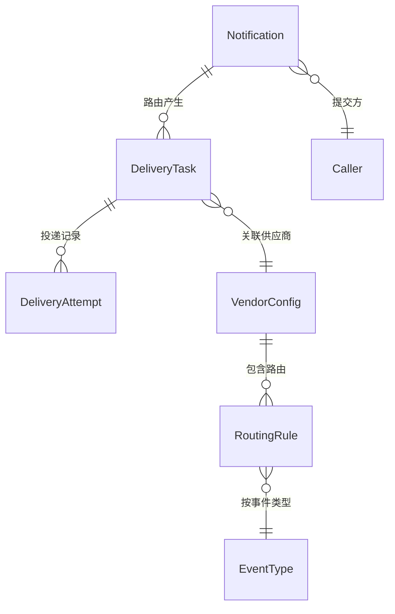

<a id="22-实体说明"></a>
### 2.2 实体说明

| 实体 | 定义 | 核心关系 |
|------|------|----------|
| **Event** | 外部系统中发生了什么事。包含事件类型（如 `order.paid`）和原始载荷（payload） | 驱动一个 Notification 的创建 |
| **Notification（通知）** | 业务系统提交的原始通知，代表"发生了什么事"。包含事件类型、幂等键和载荷 | 一个 Notification 通过路由产生 N 个 DeliveryTask |
| **DeliveryTask（投递任务）** | 面向单个供应商的投递任务，代表"需要发给这个供应商"。包含状态、重试计数、下次重试时间 | 每个 Notification 对应 N 条 |
| **DeliveryAttempt（投递尝试）** | 每次 HTTP 调用的完整记录，包含请求/响应信息 | 用于审计和死信排查 |
| **Vendor（供应商）** | 供应商的抽象。包含 API 端点、鉴权配置、重试/限流策略 | 通过 RoutingRule 与 EventType 关联 |
| **EventType（事件类型）** | 事件分类（如 `order.paid`、`order.refund`）。关联 Schema 定义和路由规则 | 驱动路由匹配 |
| **Caller（调用方）** | 业务系统调用方。包含身份凭证和调用配额 | Notification 的提交者 |

**生命周期概要**：

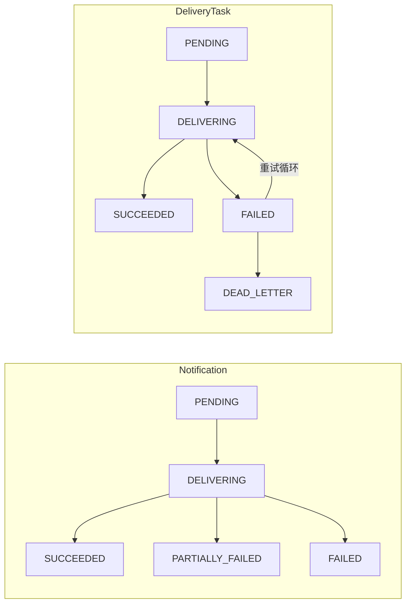


---

<a id="3-整体逻辑架构"></a>
## 3. 整体逻辑架构

<a id="31-模块分层图"></a>
### 3.1 模块分层图

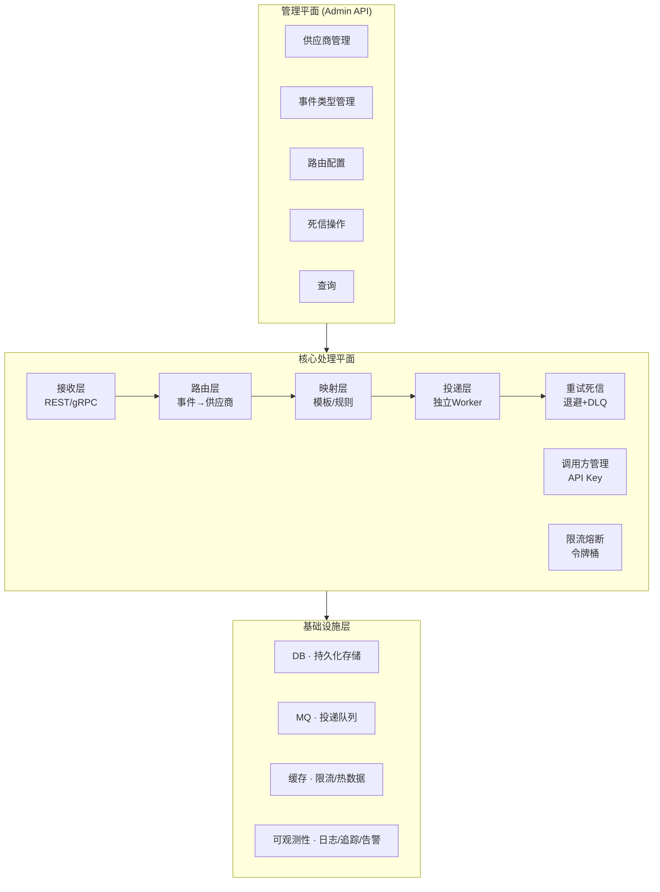

<a id="32-模块职责总览"></a>
### 3.2 模块职责总览

| 模块 | 职责 | 对应章节 |
|------|------|----------|
| **接收层** | 接收业务系统通知请求，校验调用方身份和事件数据，持久化并返回 ID | §5.1 |
| **路由层** | 根据事件类型匹配供应商列表，生成独立投递任务 | §5.2 |
| **映射层** | 将统一事件模型转换为目标供应商的请求格式（URL、Header、Body） | §5.3 |
| **投递层** | 执行 HTTP 调用，处理响应，区分成功/失败 | §5.5 |
| **重试死信** | 管理投递失败后的重试时机和次数，最终失败进入死信 | §5.5.3 |
| **限流熔断** | 控制调用方提交速率和供应商调用速率，自动熔断故障供应商 | §5.5.2 |
| **调用方管理** | 调用方身份注册、凭证管理、调用配额控制 | §5.1 |
| **供应商配置** | 供应商接入信息、鉴权凭据、重试/限流策略的 CRUD | §3.5 |
| **可观测性** | 投递指标、日志追踪、告警、交叉分析 | §3.5 |

<a id="33-主数据流"></a>
### 3.3 主数据流

> 以下是通知从进入系统到最终投递的宏观协作流程。各组件内部的处理细节在 §5 中展开。消息队列是同步路径到异步路径的唯一纽带，也是生产者到消费者的核心通道。

**关键设计点**：
- 同步路径 **止于 DB 写入 + MQ 触发**。接收网关写入 Notification 后立即返回，不等待任何下游处理
- 路由分发器通过 **消费 MQ 触发消息** 来驱动，与接收网关完全解耦
- 投递工作器消费 MQ 投递消息后执行 HTTP 调用，与路由分发器完全解耦

**宏观数据流**（模块级）：

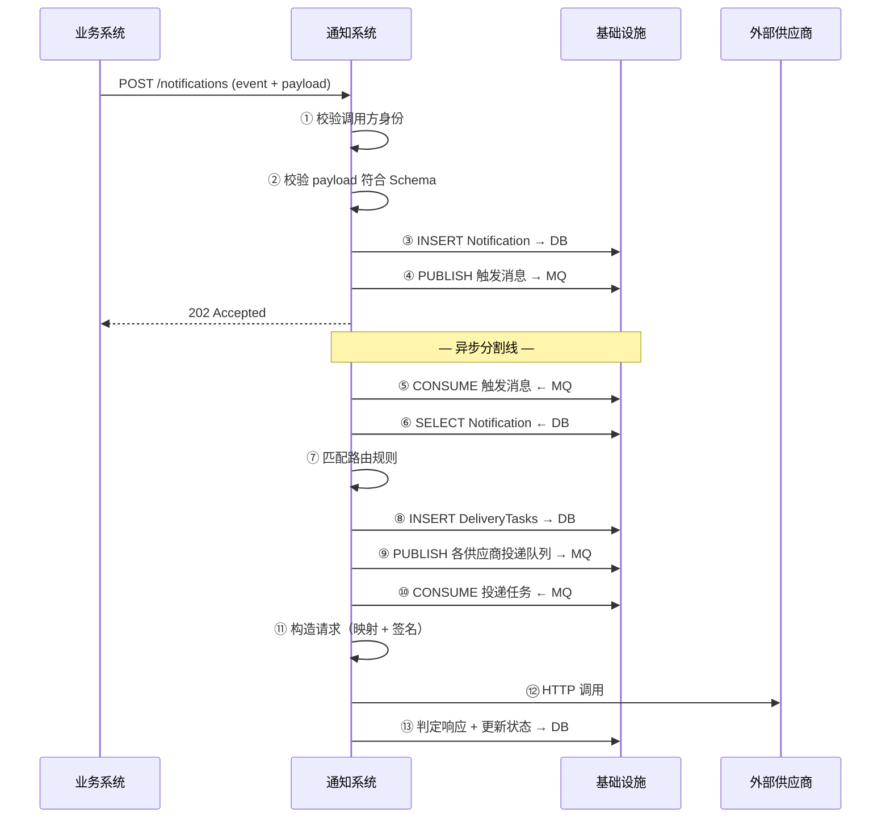

**数据平面交互图**（组件级）：

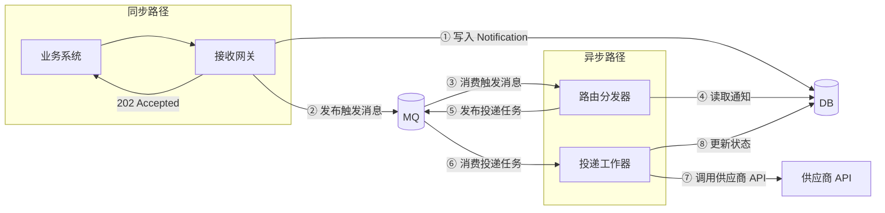

**成功链路时序**（完整流程）：

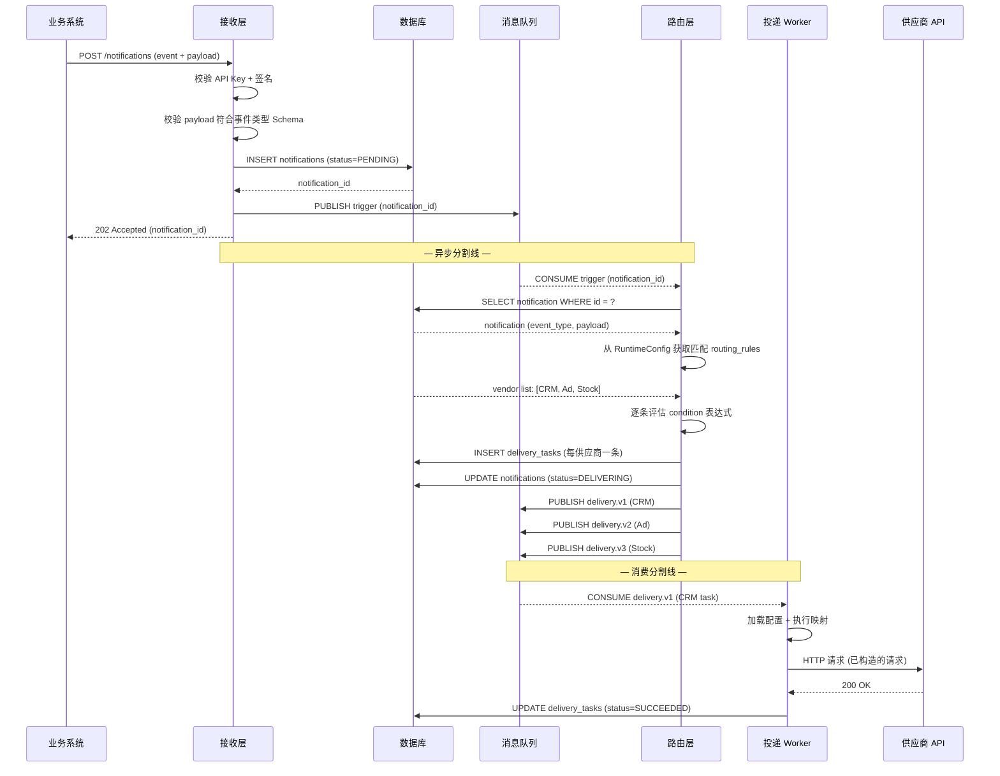

<a id="34-事件类型与数据契约"></a>
### 3.4 事件类型与数据契约

**是什么**：每个事件类型（如 `order.paid`）需定义其 payload 字段的结构和类型精度——哪些字段必填、`paid_at` 是秒级还是毫秒级时间戳、金额单位是分还是元。这一定义即为数据契约，是业务系统与通知系统之间的接口约定。

**三个消费方**：
- **业务系统（消息的投递者）**：按契约构造 payload，确保字段齐全、格式正确
- **接收层**：校验入站 payload 是否符合约定，拒绝格式错误的数据
- **映射层**：从契约中读取字段定义（名称、类型、精度），在转换为供应商格式时做正确转换

**谁定义**：业务系统方定义事件类型 Schema，通知系统维护方按 Schema 校验入站数据。

**格式选型**：以 JSON Schema 为基础，增加 `x-format` 扩展字段描述业务精度（如 `unix_s`、`yyyy-MM-dd`）。

<a id="35-配置架构总览"></a>
### 3.5 配置架构总览

通知系统的运行时行为由配置驱动——事件类型定义、供应商接入信息、路由规则、重试/限流策略等均可通过配置管理，不硬编码在代码中。

**配置管理的核心职责**：

```
配置管理层（管理平面） → 运行时配置（内存快照） → 各组件在投递时读取
```

- **管理平面**负责配置的存储、变更、审批、发布。管理平面与执行平面分离，变更不影响运行的投递
- **运行时配置**是各组件在投递时读取的只读快照，启动时加载、运行时按需刷新
- 不同实例间允许短暂配置不一致（最终一致性已足够），这天然形成实例级灰度发布
- 配置变更应支持审计追溯和回滚

> 配置存储的具体选型（方案对比、选定方案详情）见 §4.4。

---

<a id="4-关键架构决策"></a>
## 4. 关键架构决策

<a id="41-数据路径架构"></a>
### 4.1 数据路径架构

数据路径涉及 MQ 和 DB 的角色定位、数据如何在两者间分布、以及存储层选型。以下三条决策构成一条推导链。

#### 4.1.1 MQ 与 DB 角色定位

| 组件 | 核心定位 | 职责范围 |
|------|---------|----------|
| **MQ（RabbitMQ）** | 流程引擎 | 驱动投递流程：路由触发、排队、延迟重试、死信 |
| **DB（PostgreSQL）** | 持久化存储与查询 | 存储 payload、提供投递状态查询和追溯 |

**核心原则**：
1. **MQ 是系统的核心引擎**：路由分发器通过消费 MQ 触发消息驱动工作；投递工作器通过消费 MQ 投递队列执行投递；重试通过 MQ 延迟机制实现
2. **DB 不是 MQ 的备份**：MQ 不可用直接体现为系统不可用（投递流程停滞），不试图用 DB 兜底 MQ 的失败。DB 写入成功 + MQ 发布失败 = 整体失败，调用方通过 idempotent_key 重试。MQ 的可用性是系统可用性的前提，通过监控和快速恢复保证可用性
3. **MQ 仅携带 ID**：每条 MQ 消息仅包含 `notification_id`（约 50 字节），payload 由消费者按 ID 从 DB 查询。避免 payload 膨胀耗尽 MQ 带宽和存储

**决策理由**：MQ 和 DB 各有擅长的领域——MQ 擅长异步解耦、延迟调度、队列隔离；DB 擅长持久化、复杂查询、事务。让 MQ 做流程引擎、DB 做持久化查询，职责不重叠、各自独立演进。详细的讨论见附录 A.9。

#### 4.1.2 存储模型：通知与投递任务分离

`notifications` 表存储业务系统提交的通知本体。`delivery_tasks` 表存储每个供应商的投递任务，一条通知对应 N 条投递任务：

| notifications | ← 1:N → | delivery_tasks |
|-------------|---------|---------------|
| id, caller_id, event_type, payload, status | | id, notification_id, vendor_id, status, retry_count, next_retry_at |

两表通过 `notification_id` 关联。`delivery_tasks` 可独立查询、加锁、建索引。MQ 驱动投递流程，DB 负责 payload 持久化和状态查询——`delivery_tasks` 需要按 `(vendor_id, status, next_retry_at)` 高效检索待重试记录，嵌入 JSONB 的方案不支持独立索引和行级锁。

> **说明：为何没有 `delivery_attempts` 表？**  
> 每次 HTTP 调用的完整记录（请求 URL/Body、响应状态码/Body、耗时等）不在 DB 中持久化。原因有三：
> 1. 重试决策不依赖 attempt 历史——`delivery_tasks.last_error` + `retry_count` 已足够判断下一次重试
> 2. 每条 attempt 携带 request/response body（1-50KB），3k TPS × 平均重试 1.5 次 × 7 天 ≈ 2.7TB，高频大写入与 DB 的持久化定位不匹配
> 3. attempt 是纯粹的审计日志，它的消费场景是"出问题才查"——用日志系统承载比用 DB 更经济
>
> **审计替代方案**：Worker 在每次 HTTP 调用后将 attempt 详情（含 request/response）输出为结构化 JSON 日志（stdout），接入日志平台（如 Loki、ELK）供死信排查和审计追溯。死信进入 `dead_letter_records` 表时，会将关键 attempt 信息一并归档。

#### 4.1.3 存储层选型：持久化 + 缓存分层

**背景**：存储层需满足两个层次的数据可用需求：

1. **投递流程依赖**：MQ 消息仅携带 `notification_id`，Worker 消费后需从 DB 点查完整 payload 才能执行 HTTP 投递。重试窗口（7 天，对齐幂等键 TTL）内 payload 必须持续可读
2. **审计追溯**：投递完成后，业务方可能需要查询原始通知内容（周期从数周到数年不等，具体依赖业务合规要求）

投递流程依赖是正确性约束，驱动存储层的核心设计。审计追溯可以通过独立方案满足（如归档到冷存、日志平台），不要求与在线存储共用同一份数据。

> 以下对比中 PG 为 PostgreSQL 的缩写。

**可选方案**：

| 维度 | A: 纯 PG（选定方案） | 纯 Redis（排除） | B: PG + Redis 热缓存（演进方向） | C: Pika（排除） | D: ScyllaDB（排除） |
|------|-------------------|-----------------|---------------------|---------|-------------|
| **核心思路** | PG 写入即持久化，消费者直接读 PG | 全内存存储，原生 TTL 自动过期 | PG 持久化，Redis 做 1h TTL 热缓存 | Redis 协议兼容 + RocksDB 磁盘存储 | 分布式 KV，原生 TTL |
| **写入延迟** | 2-5ms（含事务） | <1ms | ~4.5ms（PG + Redis） | 1-3ms（磁盘 I/O） | 2-5ms |
| **读延迟** | 2-5ms（点查） | <1ms | 0.3ms（缓存命中）/ 2-5ms（回源 PG） | 1-3ms | 2-3ms |
| **单机写入吞吐** | ~1-2 万 TPS（读写混部） | 10 万+ TPS | ~1-2 万 TPS（写为主，读极少） | ~3-5 万 TPS | 10-50 万 TPS/节点 |
| **TB 级积压** | 需分区 + 定期清理 | 内存限制，1.8TB需 5+ 实例 | 需分区 + 定期清理，消化期读走 Redis | 磁盘容量够 | 线性扩展 |
| **组件新增** | 无 | Redis 集群（5+ 实例，月成本 ~¥2000 万） | Redis（可选部署，6-12GB） | 新集群（3 节点） | 新集群（3 节点） |
| **运维负担** | ★★★★★ 低 | ★★★☆☆ 中 | ★★★★☆ 低-中 | ★★☆☆☆ 中 | ★★☆☆☆ 中 |
| **适用场景** | **MVP + 生产前期** | **已排除——TB 级全内存成本不可接受** | 生产后期 TPS 持续 >1 万，积压 drain 读压力大 | **已排除——社区活跃度低、运维工具链不成熟** | **已排除——设计用于 10 万+ TPS，当前需求远未到瓶颈** |

> **关键约束**：MVP 阶段纯 PG 完全够用。Redis 热缓存仅为性能优化，不作正确性依赖——Redis 不可用时系统降级为直接读 PG。纯 Redis、Pika、ScyllaDB 已在评审中排除，详细推理见附录 A.10。

**选型结论**：选定 **纯 PG（选项 A）** 作为起点，同时设计到 **PG + Redis 热缓存（选项 B）** 的无缝演进路径。

| 阶段 | 存储架构 | 触发条件 |
|------|---------|---------|
| **MVP ~ 生产初期** | 纯 PG | TPS < 1 万，积压可接受 |
| **生产扩容** | PG + Redis 热缓存（1h TTL） | TPS 持续 >1 万，或积压 drain 频繁触发 PG 读瓶颈 |

**演进路径**（不涉及核心流程改动）：

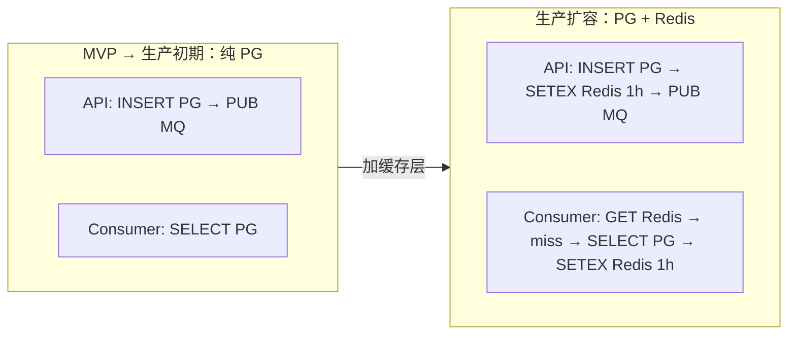

两阶段仅在 API 写入和 Consumer 读取时各多一行 Redis 操作，核心的 PG 表结构、MQ 消息格式、幂等语义均无变化。

**幂等记录分层**：幂等校验所需的数据同样使用这一分层策略——近期（24h）依赖 Redis 加速，全量（7 天）始终以 PG 为准：

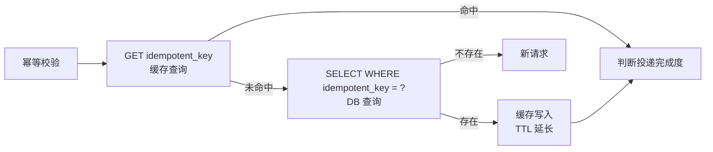

> 存储层选型仅影响读写延迟和系统吞吐上限，不影响系统的正确性。Redis 热缓存的引入或移除均不应触发核心代码的修改。

**数据库扩展策略**：按 `delivery_task_id % 1024` 的路由结果（`shard_id`）将流量分散到多个 DB 实例，`N=1024` 为固定基数永不变化。分表通过 PostgreSQL 原生时间分区（按月）解决，与分库正交。两个问题相互独立，初始阶段无需处理。

<a id="42-队列架构按供应商分区"></a>
### 4.2 队列架构：按供应商分区

**方案 A — 统一队列**

所有供应商的投递任务写入**同一个 MQ 队列**。所有 Worker 从该队列消费，不区分供应商。Worker 数量全局共享：

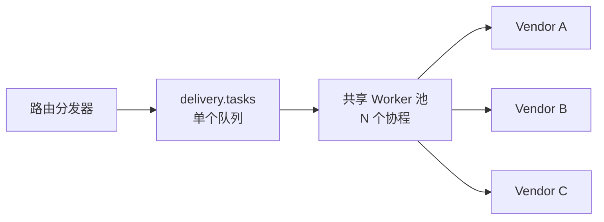

**方案 B — 按供应商分区队列（选定方案）**

每个供应商拥有**独立的 MQ 队列**。路由分发器按 vendor_id 将消息写入对应队列。每个供应商的 Worker 池独立：

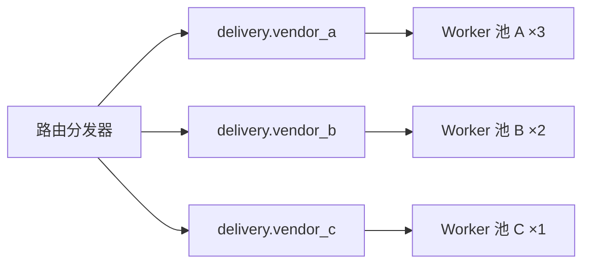

| 维度 | A: 统一队列 | B: 按供应商分区队列（选定方案） |
|------|-----------|-------------------------|
| 方案说明 | 所有供应商共享一个队列和 Worker 池 | 每个供应商独立队列 + 独立 Worker 池 |
| 故障隔离 | ★☆☆☆☆ 无：一个供应商响应慢 → HTTP 调用阻塞 Worker → 队列中其他供应商的消息堆积 | ★★★★★ 完全隔离：Vendor A 慢只阻塞 A 的队列和 Worker，B 和 C 不受影响 |
| 队列管理 | ★★★★★ 1 个队列，运维简单 | ★★★★☆ N 个队列，但按模板创建，自动化可控 |
| 并发差异化 | ★☆☆☆☆ 全局同一个并发数 | ★★★★★ 每个供应商独立配置 Worker 数（如 VIP 供应商分配更多） |
| 堆积范围 | ★☆☆☆☆ 堆积影响全体供应商投递 | ★★★★★ 堆积只影响该供应商自身 |

**决策理由**：故障隔离是需求分析中明确的最重要需求之一（§8.2 故障隔离与稳定）。统一队列在理论上有资源利用率高的优势，但在实践中——某供应商 API 响应时间从 200ms 恶化到 30s 时，Worker 被阻塞，队列中其他供应商的消息也延迟投递。分区队列使各供应商消费进度完全独立，且可差异化配置（VIP 供应商分配更多 Worker）。

<a id="43-部署架构单体-vs-微服务"></a>
### 4.3 部署架构：单体 vs 微服务

**方案 A — 单体先行，按需按模块拆分微服务（选定方案）**

将数据平面所有模块（接收网关、路由分发器、投递工作器）和控制平面的管理后台编译为**同一个 Go 二进制文件**，运行在**同一个操作系统中**。模块之间的调用通过进程内的函数调用完成，不经过网络。部署拓扑为：

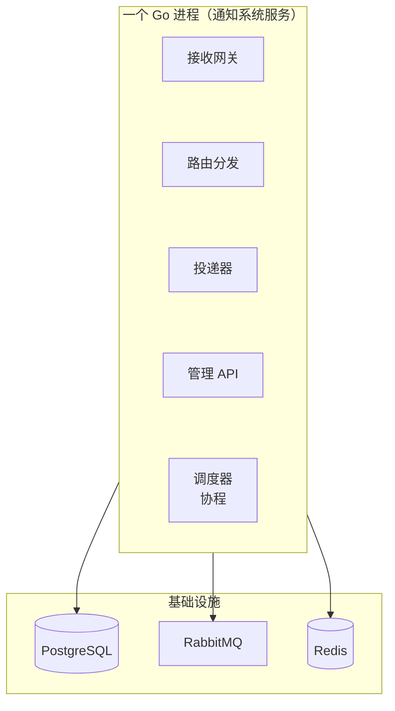

**方案 B — 微服务（演进方向）**

将各模块拆分为独立的 Go 服务进程，每个服务可独立部署和扩缩容：
- **接入服务**（接收网关）：处理 HTTP 请求，写入 DB 后入 MQ
- **投递服务**（路由分发器 + 投递工作器）：从 MQ 消费并执行投递
- **管理服务**（Admin API）：提供供应商配置、查询、死信操作等管理接口

服务间通过 gRPC / HTTP 或消息队列通信。

| 维度 | A: 单体先行，按需拆分（选定方案） | B: 微服务（演进方向） |
|------|---------------|-----------|
| 方案说明 | 所有模块在一个进程中，函数调用互通 | 各模块独立进程，网络通信 |
| 部署运维 | ★★★★★ 一个进程，一台机器可运行 | ★★★☆☆ 多服务部署，需服务发现/治理 |
| 故障域 | ★★★☆☆ 进程崩溃影响全部 | ★★★★★ 单个服务崩溃不影响其他 |
| 内部通信 | ★★★★★ 函数调用，零延迟 | ★★★☆☆ RPC/消息有延迟和序列化开销 |
| 扩展粒度 | ★★★☆☆ 只能整体水平扩展 | ★★★★★ 可按组件独立扩缩 |
| 团队要求 | ★★★★★ 低 | ★★★☆☆ 高（服务治理、链路追踪等） |

**决策理由**：当前阶段选择**单体先行**，后续**按需按模块拆分微服务**。本系统本质上是一个管道处理系统，核心瓶颈在于投递层的并发度和供应商的响应速度，而不是 CPU 计算。单体内通过独立 Worker goroutine 池已可实现充分的并发和故障隔离。微服务引入的部署复杂度（多进程部署、服务发现、链路追踪）和团队要求，在当前阶段不值得。若未来投递层确实成为独立瓶颈，可将投递工作器单独剥离为一个服务，单体→微服务的迁移成本可控（已按接口分离设计，拆分时仅需将对应模块编译为独立进程 + 替换内部函数调用为 MQ/gRPC 通信）。

<a id="44-配置存储选型与管理机制"></a>
### 4.4 配置存储选型与管理机制

**背景**：通知系统的运行时行为（事件类型定义、供应商接入信息、路由规则、重试/限流策略）需要在不重启服务的前提下动态变更。配置存储方案的选择直接影响变更审批、审计追溯、机密管理、多实例同步等能力。

**可选方案**（配置存储选型）：

| 维度 | DB + 本地缓存 | etcd/Consul | 配置文件热加载 | Git + Webhook + SecretStore（选定） |
|------|-------------|-------------|--------------|-----------------------------------|
| **配置存放** | DB 表 | etcd/Consul KV | 本地 YAML/JSON 文件 | Git 仓库（公共配置）+ SecretStore（机密） |
| **变更入口** | Admin API 直接写入 | Admin API 直接写入 | 本地编辑文件 | Git PR/MR → 审批 → 合入 |
| **生效机制** | DB 写入 → 事件通知 → 各实例刷新缓存 | Watch 回调 → 实时推送 | fsnotify 文件监听 → 热加载 | Webhook → git pull → 加载 → 调用 SecretStore 解析机密 |
| **审计追溯** | ★★★★☆ DB 审计日志（字段级） | ★★★★☆ 版本历史 | ☆☆☆☆☆ 无 | ★★★★★ Git commit 全历史 + blame + diff |
| **变更审批** | ☆☆☆☆☆ 无（API 直写即生效） | ☆☆☆☆☆ 无 | ☆☆☆☆☆ 无 | ★★★★★ PR/MR + Code Review + CI 校验 |
| **回滚能力** | ★★★☆☆ 反向修改 | ★★★★☆ 版本回退 | ★☆☆☆☆ 手动复原 | ★★★★★ git revert，原子回滚 |
| **机密管理** | ★★★★★ DB 天然存储 | ★★★★★ 天然存储 | ★★☆☆☆ 文件明文不安全 | ★★★★☆ 引用 `${secret:key}`，SecretStore 可替换实现 |
| **多实例支持** | ★★★★★ 好 | ★★★★★ 好 | ★☆☆☆☆ 差 | ★★★★☆ 好（需兜底轮询补偿 Webhook 丢事件） |
| **运维负担** | ★★★★★ 低 | ★★★☆☆ 中 | ★★★★★ 极低 | ★★★★☆ 低-中（需管理 Git 凭据 + SecretStore） |
| **适用场景** | 通用场景（初始阶段可选用） | 已有配置中心 | 开发/单机 | **标准推荐（选定方案）** |

> **选型结论**：选定 **Git + Webhook + SecretStore** 方案。核心理由：配置变更可通过 PR/MR 审批流程管控，所有变更有完整 Git 历史可追溯和回滚；机密信息不经过 Git，由可替换的 SecretStore 接口管理（当前阶段提供 SimpleKV 实现，生产环境可对接公司 KMS）。Webhook 丢事件的缺陷通过定期轮询兜底补偿。A.1 评审记录了详细的决策过程。

**配置架构图**：

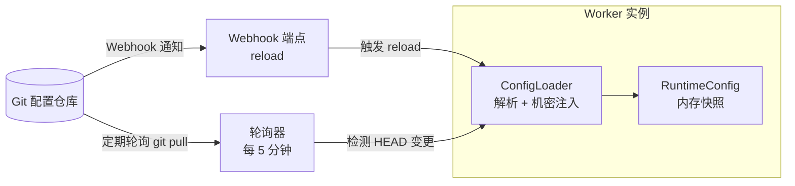

**关键设计点**：

#### 配置内容

配置仓库中管理的内容分为以下几类：

| 类别 | 内容 | 维护者 |
|------|------|--------|
| **事件 Schema（数据契约）** | 各业务域下事件类型的 payload 结构定义 | 业务方 |
| **路由授权** | 每个业务域声明哪些事件类型应投递给哪些供应商 | 业务方 |
| **投递契约** | 每个供应商按业务域组织的映射规则、端点、重试策略等 | 供应商维护者 |
| **控制条件** | 每条消息实际是否投递的运行时策略（如灰度比例） | 供应商维护者 |
| **供应商接入信息** | 供应商的基础 URL、鉴权方式、签名方式等公共配置 | 供应商维护者 |
| **机密信息** | API Key、Secret Token 等凭证，不直接进入 Git 文件 | — |

对应到目录结构：

```
events/{biz}/                        # 事件 Schema 和路由授权，由业务方维护
  route.yaml                         #   路由授权声明
  events/                            #   具体事件类型定义
    {biz_event}.yaml                 #     Schema 定义
vendors/{vendor}/                    # 供应商配置，由供应商维护者维护
  vendor.yaml                        #   供应商接入信息（URL、鉴权、签名等）
  {biz}/{biz_event}.yaml             #   投递契约 + 控制条件
```

- **机密分离**：API Key / Secret Token 不进入 Git，由 `${secret:key}` 引用，启动时通过 SecretStore 注入

#### 变更管控

配置变更的管理围绕"谁有权改什么、怎么确认授权"展开：

- **路由授权与控制分离**：路由决策分为两个逻辑层次，分别由不同角色负责：

  | 层次 | 职责 | 归属角色 | 内容 |
  |------|------|---------|------|
  | **路由授权** | 决定一个事件类型"应不应该"投递给某个供应商。这是一次性的业务决策 | 业务方 | 声明哪些事件需要通知哪些供应商 |
  | **控制条件** | 决定一条具体消息"实际上"要不要投递。用于渐进式放量、灰度切换等运行时策略 | 供应商维护者 | 按事件字段（如用户维度）的分流比例等 |

  路由授权是相对稳定的业务约定，变更需要业务方审批；控制条件是供应商维护者的业务域内决策，自行管理，不需要业务方审批。控制条件可以独立调整灰度比例，不影响路由授权。

- **角色治理**：通过 Git CODEOWNERS 将目录与需求分析 §3.2 中定义的三类角色对应，实现契约治理的隔离原则：

  ```
  # CODEOWNERS 示例
  /events/order/route.yaml          @order-team        # 业务方：路由授权审批
  /events/order/events/             @order-team        # 业务方：Schema 定义审批

  /vendors/crm_v2/                  @crm-vendor-mnt    # 供应商维护者：投递契约+控制条件
  /vendors/ad_platform/             @ad-vendor-mnt     # 供应商维护者

  /vendors/                         @sys-mnt           # 兜底：系统维护者全局可审
  *                                 @sys-mnt           # 兜底
  ```

  这一安排将需求文档的治理模型直接落地为 Git 的权限机制：

  | 治理原则 | CODEOWNERS 实现 |
  |----------|----------------|
  | **横向隔离** | 各业务线配置分属不同目录，互不拥有审批权 |
  | **纵向隔离** | 供应商维护者对 `events/` 无审批权，只能引用已有 Schema 字段；业务方对 `vendors/` 无审批权，不介入供应商接入细节 |
  | **变更审批** | 路由授权变更需业务方 approve；投递契约和控制条件由供应商维护者自审批 |
  | **可追溯** | 每次合入产生 commit，结合 approve 记录完整追溯"谁批准了什么变更" |

  系统维护者作为兜底审批方，可以在任一角色缺失响应时介入，避免变更阻塞。

- **审批与测试的职责分工**：正确性由测试保障，审批由 CODEOWNERS 授权。两者职责互不重叠：

  | 职责 | 负责什么 | 怎么完成 |
  |------|---------|---------|
  | **测试** | 保证配置**正确工作** | 在沙箱/测试环境向供应商沙箱端点发真实请求验证 |
  | **审批** | 保证变更**被授权**上线 | 通过 PR CODEOWNERS 确认变更在授权范围内 |

  审批人不需要为正确性负责——配置是否工作已在测试环境验证过。审批人只需要确认"这个变更在我的授权范围内，我知情并同意"。

- **协作流程**：新增供应商或投递契约时，供应商维护者在同一个 PR 中同时修改路由授权文件和投递契约。业务方 reviewer 只需关注路由授权部分（确认"我同意这个事件发给这个供应商"），供应商维护者 reviewer 关注投递契约部分（确认映射和技术配置正确）。双方各自审批自己关心的 diff，互不阻塞。

#### 配置发布

配置变更从合入到各实例生效的机制：

- **生效机制**：Webhook 推送 + 5 分钟轮询兜底，各实例独立拉取，天然形成实例级灰度发布
- **运行时生效**：配置变更不影响进行中的投递——每次投递读取 RuntimeConfig 内存快照，新配置通过原子替换生效，不会影响正在执行的投递
- **不同实例间允许短暂配置不一致**（最终一致性已足够）

> **MVP 边界**：控制条件（渐进式放量、灰度切换）不在 MVP 范围内。MVP 阶段仅需要路由授权 + 投递契约的简单映射——所有已授权的通知直接投递，不需要分流控制。

**演进路径**：

| 阶段 | 变更入口 | 审批流程 | 安全校验 | 触发条件 |
|------|---------|---------|---------|---------|
| **MVP** | 开发者直接编辑 Git YAML → PR | 人工 Code Review | 手动检查配置格式 | 快速上线，配置少、变更频率低 |
| **生产** | Admin UI 辅助生成配置变更 → 自动创建 PR | CI 自动校验（Schema 合规、格式检查、权限审计） | PR 触发配置模拟验证 + Schema 校验 | 配置项多、变更频繁、涉及多角色（运维/运营/开发） |

两阶段的后端基础设施一致（Git + Webhook + SecretStore），演进主要体现在变更入口从纯手工 evolve 到 UI 辅助、审批从纯人工 evolve 到 CI 自动化。

**为什么朝这个方向演进？** MVP 阶段配置量少、变更频率低、开发者直接编辑 YAML 不会成为瓶颈。但当供应商数量增长到 20+，每个供应商的配置项（请求拼装、签名、响应判定、重试/限流策略）组合增多后，手动编辑 YAML 的出错概率和心智负担都会上升——漏写一个字段、写错一个缩进、引用了不存在的 Schema 字段，都可能导致配置生效后投递失败。Admin UI 通过结构化表单+字段级校验消除语法错误，CI 自动校验确保合入前配置已经过 Schema 合规检查和模拟验证，这就是演进方向需要同时提升"便利性"（减少人工操作负担）和"安全性"（减少配置错误导致的事故）的原因。

---

<a id="45-中间件选型总览"></a>
### 4.5 中间件选型总览

基于 §4.1 的数据路径架构决策和 §4.4 的配置存储选型，选定以下中间件和服务。各选型仅做结果确认，详细论证见对应设计评审记录。

| 中间件/服务 | 必选/可选 | 核心用途 | 备选方案 |
|--------|----------|----------|----------|
| **PostgreSQL** | **必选** | 通知记录持久化、调用方管理、死信记录。存储层选型见 §4.1.3 | MySQL, TiDB |
| **RabbitMQ** | **必选** | 投递队列、延迟重试、死信队列 | Kafka, Redis Streams, AWS SQS |
| **Redis** | **必选 / 可选** | **必选**：限流计数器<br/>**可选**：payload 热缓存（1h TTL）、幂等记录加速（24h TTL） | — |
| **Git** | **必选** | 配置仓库：事件 Schema、供应商配置、路由规则的版本控制与变更审批 | — |
| **Webhook** | **必选** | Git 推送通知接收端，触发配置热加载。定期轮询（5 分钟）兜底补偿丢事件 | — |
| **SecretStore** | **必选** | 机密管理：API Key、Secret Token 的存储与注入，不经过 Git。接口可替换（SimpleKV / KMS） | — |
| **Prometheus + Grafana** | **必选** | 指标采集、可视化面板 | — |

**各中间件选型理由**：

**PostgreSQL**：

| 特性 | 与系统需求的匹配 |
|------|-----------------|
| JSON/JSONB 支持 | 通知 payload、映射规则等半结构化数据的理想存储 |
| 丰富的索引类型 | 按状态+时间的联合查询、JSONB 字段索引 |
| 唯一约束 + 幂等 | `UNIQUE(caller_id, idempotent_key)` 保障幂等语义，MQ 解耦后不依赖跨表事务 |
| 成熟的生态 | pgAdmin、迁移工具、ORM 支持 |
| 窗口函数 | 按调用方/供应商维度的聚合查询 |

**RabbitMQ**：

| 特性 | 与系统需求的匹配 |
|------|-----------------|
| **死信交换器 (DLX)** | 实现投递延迟重试的天然机制 — 消息消费失败 → DLX → 重试队列 |
| **队列分区** | 按 vendor_id 创建独立队列，实现强故障隔离 |
| **Consumer 确认机制** | 确保消息至少处理一次，消费端宕机不丢消息 |
| **灵活的路由** | Direct/Topic/Fanout 交换机，适配不同投递模式 |
| **延迟消息插件** | 支持精确的延迟投递（替代 DLX 模拟延迟） |

**RabbitMQ vs 备选方案对比**：

| 维度 | RabbitMQ（推荐） | Kafka | Redis Streams |
|------|----------------|-------|---------------|
| 延迟投递能力 | ★★★★★ DLX 原生支持 | ★★☆☆☆ 需额外实现 | ★★★☆☆ 有限支持 |
| 死信机制 | ★★★★★ 原生 DLX | ★★☆☆☆ 需自行实现 | ★☆☆☆☆ 需自行实现 |
| 故障隔离 | ★★★★★ 独立队列 | ★★★★☆ 分区机制 | ★★★☆☆ 独立 Stream |
| 运维成熟度 | ★★★★★ 广泛使用 | ★★★★★ 广泛使用 | ★★★☆☆ 较新 |
| 适用场景 | **标准推荐** | 已有 Kafka + 高吞吐 | 轻量级场景 |

**Redis 用途**：

| 用途 | 数据结构 | 说明 |
|------|----------|------|
| 限流计数器 | `Sorted Set` / `String` | 令牌桶计数器，滑动窗口数据 |
| 幂等校验 | `String` + TTL | `idempotent_key → notification_id`，TTL 设为 7 天 |
| 分布式锁 | `String` (SET NX) | 死信重试等操作的互斥 |

<a id="46-可用性保障"></a>
### 4.6 可用性保障（未来扩展）

#### 4.6.1 DB 写失败时的投递结果保障

**问题**：投递工作器调用 vendor API 成功（200 OK）后，`UpdateDeliveryTaskStatus` 写入 DB 失败（如磁盘满、连接池耗尽等持续性写故障）。此时 NACK 消息会导致消息重回队列，重试时再次调用 vendor，产生重复投递。

**前置条件**：此场景只发生在"读路径正常、写路径故障"的模式下——Worker 能在投递前正常从 DB 读取 delivery_task 和 payload（因为读和写可能走不同的连接池或不同的表），但投递后的 UPDATE 无法完成。

**方案：Reconciliation 队列**

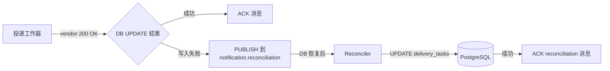

**流程**：

1. Worker 调用 vendor 成功（200 OK）
2. `UpdateDeliveryTaskStatus` 写入 DB 失败
3. Worker **ACK 原消息**（不回队列，避免重复调 vendor）
4. Worker PUBLISH reconciliation 消息到专用队列，记录投递结果：

```json
{
  "delivery_task_id": "dt_001",
  "notification_id": "n_001",
  "vendor_id": "crm_system",
  "status": "SUCCEEDED",
  "attempted_at": "2026-05-25T10:30:05Z"
}
```

5. Reconciler 消费 reconciliation 队列时先检查 DB 是否可用
6. 若可用，执行 `UPDATE delivery_tasks SET status = 'SUCCEEDED' WHERE id = 'dt_001'`
7. 更新成功后 ACK reconciliation 消息
8. 若 DB 持续不可用，NACK 消息，通过 DLX+TTL 退避重试

**设计要点**：

- Reconciler 为独立消费者，可内嵌在 WorkerPool 中或独立进程运行
- Reconciliation 队列使用 DLX+TTL 做退避，DB 持续不可用时消息不丢失
- 消息使用持久化模式（`delivery_mode=2`），服务重启不丢失
- Reconciler 消费前应做 DB 健康检查，避免空转重试

**MVP 阶段行为**：

MVP 阶段不实现 reconciliation 队列。DB 写入失败时，Worker **ACK 原消息**（不回队列），输出结构化日志记录投递结果，由人工在 DB 恢复后通过日志捞取并修复 delivery_tasks 状态。此策略避免了 vendor 重复调用和 MQ 空转循环两个问题，代价是短暂的状态不一致和人工介入。MVP 的核心目标是快速验证系统主链路，DB 写故障属低概率事件，此处理方式在 MVP 阶段可接受。Reconciliation 机制在第二阶段随可用性增强一并引入。

<a id="5-核心组件详解"></a>
## 5. 核心组件详解

> 沿请求生命周期组织组件：接收 → 路由 → 拼装 → 签名 → 投递。每个组件包含职责说明、方案对比、选型结论和扩展点。

<a id="51-接收网关"></a>
### 5.1 接收网关

| 项目 | 内容 |
|------|------|
| **职责** | 接收业务系统通知 → 鉴权 → 校验 Schema → 持久化 → 同步返回 ID |
| **为什么需要** | 系统唯一的同步入口。集中处理鉴权和校验，确保"接收即持久化"的可靠性承诺 |
| **输入** | 业务系统的 HTTP 请求（caller_id, event_type, payload, idempotent_key） |
| **输出** | notification_id（同步返回 202 Accepted） |
| **下游** | Notification 表写入，触发后续的异步路由和投递 |
| **设计要点** | 必须无状态才可水平扩展；同步路径尽可能短，不做映射或投递；幂等性在接收层通过 `idempotent_key` 唯一约束解决 |

**可选方案**：

| 维度 | RESTful JSON API（推荐） | gRPC | MQ 直写 |
|------|------------------------|------|---------|
| 调用方接入成本 | ★★★★★ 极低 | ★★★☆☆ 需客户端 | ★★☆☆☆ 需 MQ 客户端 |
| 同步反馈 | 同步返回 ID + 错误 | 同步返回 | 无同步返回，需另寻方式 |
| 调试友好度 | ★★★★★ curl 即可 | ★★★☆☆ 需工具 | ★☆☆☆☆ 需 MQ 工具 |
| 适用场景 | **标准推荐** | 内部已有 gRPC 生态 | 事件驱动架构 |

<a id="52-路由分发器"></a>
### 5.2 路由分发器

| 项目 | 内容 |
|------|------|
| **职责** | 匹配事件类型 → 供应商列表 → 创建 DeliveryTask → 发布到各供应商投递队列 |
| **为什么需要** | 将"发生了什么"转化为"需要通知谁"，是解耦业务事件和供应商投递的关键枢纽 |
| **输入** | MQ 触发消息（notification_id） |
| **输出** | N 个 DeliveryTask（DB）+ N 条投递消息（MQ，每供应商一条）<br/>每个 DeliveryTask 携带 event_type，投递工作器据此查找对应的映射配置 |
| **依赖** | RoutingRule 配置表 |
| **设计要点** | 一个通知匹配零到多个供应商；路由可能带条件（如 `payload.amount > 10000`）；路由失败不应阻塞接收（可通过最终一致性保障） |

**路由规则**：定义"事件类型 → 供应商列表"的映射关系。

| 类型 | 规则示例 | 说明 |
|------|----------|------|
| **简单映射** | `order.paid → [crm, ad]` | 一个事件通知固定的供应商列表 |
| **条件路由** | `order.paid` + `payload.amount > 10000` → `ad` | 根据 payload 字段值决定是否路由到某些供应商 |

一个通知可能匹配多条规则，多条规则命中的供应商列表合并去重后即为最终投递目标。

路由规则的复杂度决定了路由分发器的实现方式——是简单的配置表查找，还是需要规则引擎。以下基于上述规则类型对比各方案的适用性。

**各方案实际形态**：

| 方案 | 实际样子 |
|------|----------|
| **配置驱动路由表**（推荐） | YAML 声明事件→供应商映射表，按事件类型查找 |
| **规则引擎** | 引入表达式引擎（如 CEL），在配置中写条件逻辑 |
| **代码硬编码** | 在 Go 代码中用 if-else / switch 写路由 |

```yaml
# 配置驱动路由表示例
- event_type: order.paid          # 简单映射：order.paid → [crm, ad]
  vendors: [crm, ad]
- event_type: order.paid          # 条件路由：amount > 10000 时额外通知 ad_vip
  condition: "payload.amount > 10000"
  vendors: [ad_vip]
- event_type: order.refund        # 简单映射
  vendors: [crm]
```

**路由实现可选方案**：

| 维度 | 配置驱动路由表（推荐） | 规则引擎 | 代码硬编码 |
|------|---------------------|---------|-----------|
| 运行时变更 | ★★★★★ 支持 | ★★★★★ 支持 | ☆☆☆☆☆ 不支持 |
| 表达能力 | ★★★☆☆ 简单条件 | ★★★★★ 复杂条件 | ★★★★★ 任意逻辑 |
| 学习成本 | ★★★★★ 零成本 | ★★★☆☆ 中等 | ★★★★★ 熟悉即可 |
| 适用场景 | **标准推荐** | 按金额/地域等复杂条件路由 | 不推荐 |

**MQ 队列拓扑**：

路由分发器按 vendor_id 发布消息到对应的投递队列。每个供应商有独立队列：

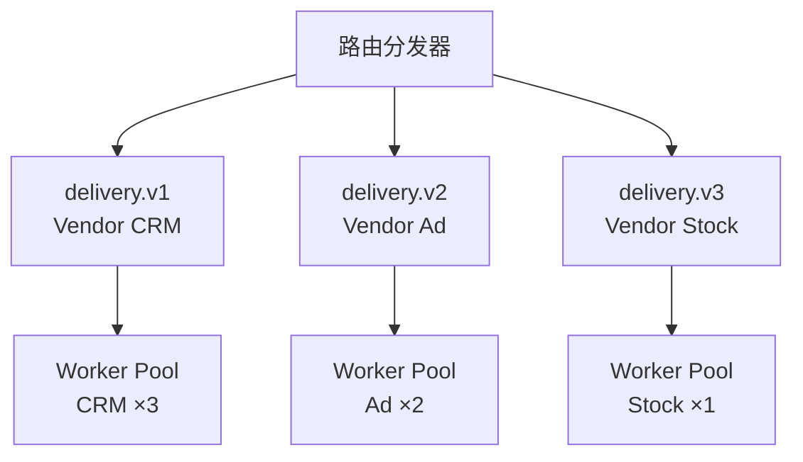

**新增供应商的队列操作**：

| 操作项 | RabbitMQ | Kafka | Redis Streams |
|--------|----------------|-------|---------------|
| 是否需要新建资源 | **需要**，每个供应商一个独立队列 | **取决于方案**：可为每个供应商独立 topic，或在共享 topic 中用 partition key 分区 | **不需要**，Stream 按 key 自动创建 |
| 资源创建方式 | ① 应用代码调用 `Channel.QueueDeclare()` 自动声明（幂等）<br/>② 或运维通过 Management UI / HTTP API 手动创建 | ① `kafka-topics.sh --create` 命令行创建<br/>② 或 Admin API 自动创建 | 无需创建，`XADD delivery:vendor_d` 即可写入，消费者 `XREAD` 即可消费 |
| 创建时机 | 建议应用启动时统一声明所有已知供应商的队列；新增供应商时重启或通过 Admin API 触发声明 | 建议通过运维脚本在注册供应商时同步创建 topic | 无需提前创建，第一次写入时自动生成 |
| 资源删除 | 供应商下线时需手动删除队列（`Queue.Delete()`） | 供应商下线时需手动删除 topic | 供应商下线时需手动删除 Stream key（`DEL`） |
| 运维自动化 | 可在 Admin API 新增供应商的流程中，自动调用 MQ 管理 API（`PUT /api/queues/{vhost}/{queue}`）完成队列创建和绑定 | 可在新增供应商流程中调用 `kafka-topics.sh` 或 Admin API | 无需自动化，仅需在代码配置中增加 vendor_id 路由 |

**说明**：RabbitMQ 的队列在 `QueueDeclare` 时若已存在，会直接复用（幂等），因此应用可在启动时统一声明，新增供应商后滚动重启即可。若要避免重启，可在 Admin API 注册供应商时通过 RabbitMQ HTTP API 创建队列、绑定交换器。

<a id="53-请求拼装"></a>
### 5.3 请求拼装

| 项目 | 内容 |
|------|------|
| **职责** | 将统一通知 payload 转换为目标供应商 API 所需的 HTTP 请求（URL、Header、Body、鉴权） |
| **为什么需要** | 每个供应商的 API 格式千差万别。这是系统中**差异化最大**的模块，直接决定接入一个新供应商需要多少工作量 |
| **输入** | 统一 payload（JSON） + 供应商配置 |
| **输出** | 完整的 `http.Request`（method、url、headers、body） |
| **核心挑战** | 简单场景要"配得明白"，复杂场景要"能兜得住"。90% 的供应商是字段直映射 + 静态值，配置应该一行一个字段、一眼看懂；剩下 10% 涉及异构格式、签名、条件逻辑，交给插件 |

**问题**：拼装 API 请求需要两方面的信息——"输入数据长什么样"和"怎么转换成供应商格式"。前者由 §3.4 数据契约定义，后者由供应商映射配置定义。

**映射方式**：结构化映射 + 插件，分层组合。

**结构化映射**是标准方式，以 YAML 配置直接描述目标请求。配置结构镜像目标 JSON 的层级，字段值通过 `@{payload.field}` 从事件数据取值：

```yaml
body:
  type: mapping
  template:
    user_id: "@{payload.user_id}"
    event: "register"
    properties:
      lifecyclestage: "customer"
      last_paid_date: "@{payload.paid_at}"
```

当供应商期望的格式与数据契约中的原始精度不同时（如 Schema 声明 `paid_at` 是秒级时间戳，但供应商要求 `yyyy-MM-dd`），引擎关键字使用 `$` 前缀，区分指令和输出字段名：

```yaml
last_paid_date:
  $source: "@{payload.paid_at}"    # 引擎关键字，从此字段取值
  $format: "yyyy-MM-dd"            # 引擎关键字，转换为此格式
```

对于 payload 中字段类型与 API 期望类型不一致的场景，使用 `$type` 做显式类型转换：

```yaml
count:
  $source: "@{payload.count}"      # payload 中是 "42"（string）
  $type: integer                   # 强制转为 42（integer）
```

无 `$type` 时保持 payload 原始类型。非法转换（如 `"abc"` → integer）返回错误，拒绝构造请求。

> 引擎关键字以 `$` 前缀标识。不加 `$` 前缀的 key 即为输出字段名，即使叫 `source`、`format`、`type` 也不产生冲突。`$input` 通常从 Schema 的 `x-format` 自动推导，仅当需要覆盖 Schema 声明时手写。若输出字段名恰好以 `$` 开头（如 `$source`），用 `$$` 前缀表示字面量：`$$source` → 输出字段 `$source`。引擎关键字包括：`$source`（取值来源）、`$format`（格式转换）、`$type`（类型转换）。

**配置结构**：一个供应商可能接收多种事件类型，不同事件的接口和字段映射不同。配置按共享和事件专属分层：

```
vendors/crm_system.yaml                    # 共享配置：auth、sign、retry 策略，同 vendor 所有事件共用
mappings/crm_system/
├── order.paid.yaml                        # 事件专属：endpoint、body mapping，按事件类型独立定义
└── order.refund.yaml
```

投递工作器根据路由传入的 (vendor_id, event_type) 组合定位映射配置，发送到正确的接口。新增事件类型只需在 `mappings/{vendor}/` 下添加文件，不影响已有配置。

**插件**用于结构化映射无法覆盖的场景（条件构造、异构格式等）。配置 `body.type: plugin` 即可切换，插件仅负责 Body 构造，URL 和 Header 的 `@{...}` 引用、签名、鉴权仍由引擎统一处理。

**场景覆盖**：

| 层级 | 场景 | 处理方式 |
|------|------|----------|
| L1 | 字段直映射、静态值（~90%+ 场景） | 结构化映射 |
| L2-L5 | 条件构造、格式变换、异构格式、签名计算 | 插件（仅在需要时编写） |

> 不在配置中引入模板语法或函数管道——结构化映射的简洁性依赖于"配置只做字段直映射"。L2-L5 全走插件，保证 L1 场景正确性的同时为复杂场景保留扩展能力。

<a id="54-请求签名"></a>
### 5.4 请求签名

**定位**：签名是独立于请求构造的系统能力，与 `request` 平级配置。引擎在请求构造完成后（包括 Body 组装、Header 解析），按供应商配置的 `sign` 段执行签名，将结果注入请求的指定位置。

```yaml
# vendors/crm_system.yaml（签名段，与 request 平级）
sign:
  type: hmac-sha256
  secret: "${secret:crm/signing_key}"
  include:
    - body
    - timestamp
    - header: "Content-Type"
    - header: "X-*"
  header: "X-Signature"
```

**签名元素组装**：引擎按 `include` 声明的顺序逐个处理元素。

| 元素 | 取值来源 | 组装方式 |
|------|----------|----------|
| `body` | 已组装完成的请求体 | 原始字节序（JSON 序列化后的字符串） |
| `timestamp` | 引擎自动生成 | Unix 秒级时间戳，格式为十进制数字字符串 |
| `method` | 请求配置的 HTTP 方法 | 大写字符串（如 `POST`、`PATCH`） |
| `path` | 请求 URL 的路径部分 | 不包含 Query String 的原始路径 |
| `header: "Name"` | 当前请求的指定 Header | Header 的值，不做额外处理 |
| `header: "X-*"` | 当前请求中所有匹配的 Header | 通配符匹配，处理规则见下方 |
| `query: "name"` | 当前请求的指定 Query 参数 | URL 解码后的原始值 |

元素值按 `include` 顺序以 `\n` 连接为待签字符串。

**通配符 Header 处理**（`header: "X-*"`）：

| 步骤 | 操作 |
|------|------|
| 1 | 遍历当前请求的所有 Header，筛选出名称匹配 `X-*` 的项 |
| 2 | 匹配到的 Header 名转小写（`X-Sign-Time` → `x-sign-time`） |
| 3 | Header 值去除首尾空格 |
| 4 | 按 Header 名字典序升序排列 |
| 5 | 格式化为 `name:value` 每行一条，以 `\n` 连接 |
| 6 | 结果作为单个元素拼入待签字符串 |

**Query 参数处理**：如果 `include` 中声明了 `query: "name"`，引擎从请求 URL 中提取对应参数。引擎不做全局 Query 排序，仅提取指定名称的参数值。

**常见模式示例**：

```yaml
# 模式一：MD5(body) → Sign header（库存系统）
sign:
  type: md5
  secret: "${secret:inventory/signing_key}"
  include:
    - body
  header: "Sign"

# 模式二：HMAC-SHA256(body + timestamp) → X-Signature header
sign:
  type: hmac-sha256
  secret: "${secret:ad/signing_key}"
  include:
    - body
    - timestamp
  header: "X-Signature"

# 模式三：HMAC-SHA256(body + 特定 Header + 通配 Header) → X-Signature
# 通配符 header: "X-*" 表示所有以 X- 开头的 Header 参与签名
sign:
  type: hmac-sha256
  secret: "${secret:crm/signing_key}"
  include:
    - body
    - timestamp
    - header: "Content-Type"
    - header: "X-*"
  header: "X-Signature"

# 模式四：HMAC-SHA256(body + timestamp) → Authorization: HMAC key:signature
sign:
  type: hmac-sha256
  secret: "${secret:crm/signing_key}"
  include:
    - body
    - timestamp
  authorization:
    scheme: "HMAC"
  encoding: hex
```

**超出内置范围（走自定义插件）**：

```yaml
sign:
  type: plugin
  plugin: "custom_signer"
```

> `type` 支持 `hmac-sha256`、`hmac-sha1`、`md5`。`header` 写入自定义 Header，`authorization` 写入 Authorization Header。`encoding` 默认 `base64`，可选 `hex`。元素组装规则和规范化逻辑见上方。

**完整示例——格式转换 + 签名组合**：

```yaml
last_paid_date:
  source: "@{payload.paid_at}"
  format: "yyyy-MM-dd"
created_at:
  source: "@{payload.created_at}"
  format: "iso8601"
count:
  source: "@{payload.total_count}"
  format: "string"
# sign 在供应商配置顶层，与 request 平级，引擎在请求构造完成后执行
```

**签名计算流程**：

```
待签字符串 = element_1 + "\n" + element_2 + "\n" + ...
HMAC 计算  = Base64( HMAC-SHA256(secret, 待签字符串) )
MD5 计算   = MD5(待签字符串 + secret_value)
```

**结果注入**：

| 配置 | 行为 |
|------|------|
| `header: "X-Sign"` | 将签名结果作为普通 Header 注入：`X-Sign: <signature>` |
| `authorization: { scheme: "HMAC" }` | 注入 `Authorization: HMAC <signature>` |
| `authorization: { scheme: "HMAC" }` + `encoding: hex` | 注入 `Authorization: HMAC <hex_signature>` |

**插件集成**：当 Body 由插件构造时（`body.type: plugin`），引擎的签名执行时机不变——Body 由插件返回后，引擎仍然按 `sign` 配置对完整请求执行签名。插件无需关心签名逻辑。超出内置能力的情况（如 RSA 签名、多 Header 结果注入），配置 `sign.type: plugin`，由自定义插件完成完整签名流程。

**扩展点：AuthProvider 鉴权注入**

鉴权处理器接口化，每种鉴权方式独立实现：

| 鉴权类型 | 说明 |
|----------|------|
| `bearer` | 静态 Token，从 `auth.config.token` 取值注入 `Authorization: Bearer <token>` |
| `basic` | HTTP Basic Auth，从 `auth.config` 取值 |
| `hmac` | 独立于 `sign` 的鉴权。`sign` 处理消息完整性，`auth` 处理调用方身份 |
| `custom` | 实现 AuthProvider 接口注册，处理动态 Token（OAuth2 等） |

`auth` 与 `sign` 的职责分离：`sign` 保证请求未被篡改（消息完整性），`auth` 声明调用方身份（身份认证）。引擎默认执行顺序为先 `sign`（构造请求 → 计算签名 → 注入签名结果），再施加 `auth`。

**需要注意的两种例外**：

- **`sign` 已产出 Authorization（模式四）**：sign 通过 `authorization` 配置直接写入 `Authorization` header，此时无需也不应再走独立的 `auth` 步骤。
- **auth header 在签名范围内**：若 `sign.include` 包含 `Authorization` 但鉴权在 sign 之后执行，签名时拿不到该 header。这种情况需自定义插件在 sign 前完成鉴权注入，或采用 `sign.type: plugin` 自定义签名逻辑。

<a id="55-投递工作器"></a>
### 5.5 投递工作器

投递工作器是系统的执行引擎。以下按"主流程 → 保护机制 → 场景验证"组织。

#### 5.5.1 投递主流程

| 项目 | 内容 |
|------|------|
| **职责** | 消费 MQ → 加载供应商配置 → 数据映射 → HTTP 调用 → 处理响应 → 更新状态 |
| **为什么需要** | 实际执行外部 API 调用的执行单元，是系统的"引擎" |
| **输入** | MQ 中的 DeliveryTask 消息 |
| **获取** | VendorConfig（端点、鉴权、限流）、DataMapping（结构化规则） |
| **产出** | HTTP 请求 → 外部 API → 成功/失败 → 更新 DeliveryTask 状态 |
| **设计要点** | 供应商间故障隔离是最重要的设计目标；数据映射是最大技术难点（应对 L1-L4 复杂度谱系）；响应判定需支持供应商自定义规则；重试决策在此层执行 |

**投递步骤**：
1. 消费 MQ 投递消息 → 获取 `notification_id` + `vendor_id`
2. 从本地 RuntimeConfig 缓存读取供应商配置（端点、鉴权、映射规则、重试策略、限流配置）
3. 从 DB 查询 payload（如有 Redis 缓存则优先从缓存获取）
4. 检查限流器 → 获取令牌
5. 检查熔断器 → 确认供应商未熔断
6. 执行数据映射 → 构造 HTTP 请求
7. 执行 HTTP 调用
8. 判定响应（HTTP 状态码 AND body 条件）
9. 更新 DeliveryTask 状态
10. ACK/NACK MQ 消息

**响应判定规则**：

两层语义 AND——HTTP 2xx 是基础设施层成功，body 条件是业务层成功：

| 场景 | 判定逻辑 |
|------|----------|
| HTTP 4xx/5xx | 直接失败，进入重试或死信 |
| HTTP 2xx + body 字段匹配 | 业务成功 |
| HTTP 2xx + body 不匹配 | 业务失败——通常是配置/数据问题，重试大概率同样失败，需人工排查 |

内置四种 body 判定模式：`body_field`（字段比较）、`body_match`（精确匹配）、`field_absent`（字段缺失）、`http_status`（仅状态码）。非 JSON 响应走 `type: plugin`。可重试判定通过 `retryable.add/remove` 覆盖默认规则。

**供应商 Worker 池选择**：

| 维度 | 独立 Worker 组 Per 供应商（推荐） | 共享 Worker 池 | Actor 模型 |
|------|--------------------------------|---------------|-----------|
| 故障隔离 | ★★★★★ 完全隔离 | ★★☆☆☆ 弱 | ★★★★★ 强 |
| 资源效率 | ★★★☆☆ 中等 | ★★★★★ 最高 | ★★★☆☆ 中等 |
| 实现复杂度 | ★★★★☆ 中等 | ★★★★★ 简单 | ★★☆☆☆ 复杂 |
| 适用场景 | **标准推荐** | 初期过渡 | 数百+供应商 |

#### 5.5.2 限流器与熔断器

| 项目 | 内容 |
|------|------|
| **职责** | 控制对外投递速率、自动熔断持续故障的供应商 |
| **为什么需要** | ① **保护供应商 API**：避免超过其配额触发封禁 ② **保护自身 Worker**：供应商故障时快速失败，避免资源浪费和连锁效应 |
| **数据依赖** | Redis（跨实例共享限流计数和熔断状态） |
| **输入** | 每次投递前查询（是否允许发送？），每次投递后反馈（成功/失败） |
| **输出** | PERMIT / DENY（限流），CLOSED / OPEN / HALF_OPEN（熔断） |

**可选方案**：

| 维度 | 令牌桶 + 断路器（推荐） | 滑动窗口 + 自适应 | 无中心限流 |
|------|----------------------|-----------------|-----------|
| 保护效果 | ★★★★★ 好 | ★★★★★ 更好 | ★★☆☆☆ 弱 |
| 实现复杂度 | ★★★★☆ 中等 | ★★☆☆☆ 复杂 | ★★★★★ 简单 |
| 运维调优 | ★★★★☆ 低 | ★★★☆☆ 高 | ★★★★★ 无 |
| 适用场景 | **标准推荐** | 供应商 SLA 极高 | 用量远低于限制 |

**限流器**：令牌桶算法，基于 Redis（跨实例共享）。每次投递前尝试获取令牌，获取成功后放行，失败后等待或快速拒绝。

**熔断器**：状态机模式（CLOSED → OPEN → HALF_OPEN → CLOSED），基于 Redis 共享状态。连续错误率超过阈值（默认 60s 窗口内错误率 > 50%）时切换为 OPEN，快速拒绝请求；30s 后自动 HALF_OPEN 探活，探活成功恢复 CLOSED。

**数据流**：

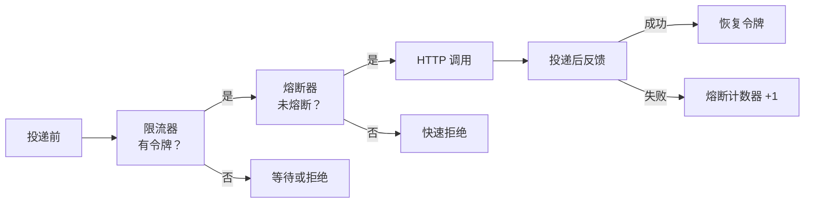

#### 5.5.3 重试与死信管理

**重试策略**：退避参数（base_delay、max_delay、multiplier）在供应商配置中声明，引擎按指数退避 + 随机抖动计算下次重试时间。

**重试驱动方式**（待决策）：

两种 MQ 自身方案均能满足延迟重投，可根据所选队列基础设施的实际支持情况选型。

| 维度 | DLX + TTL | 延迟消息插件 |
|------|----------|------------|
| 方案说明 | 一个交换机后挂一个投递队列（有消费者）和若干延迟队列（无消费者）。各延迟队列设不同 TTL，且死信交换机指向主交换机、死信路由键指向投递队列。消息 TTL 到期后自动清除 TTL 并死信回主交换机，按新路由键重新路由到投递队列。worker 按重试次数将消息 PUBLISH 到对应延迟队列，确认入队后再 ACK 原消息。 | 声明一个延迟交换机，后挂投递队列。worker 将消息 PUBLISH 到延迟交换机并设延迟时长，到期后交换机自动投递到投递队列。 |
| 额外依赖 | 无（标准 RabbitMQ） | 需安装 `rabbitmq_delayed_message_exchange` 插件 |
| 精度 | TTL 秒级（队列级别） | 毫秒级（消息级别） |
| 实现复杂度 | 需额外配置 DLX 和延迟队列绑定 | 一个 exchange 解决 |
| 风险 | 若延迟队列未正确设置死信路由键，死信后将命中自身，形成死循环 | 依赖非标准插件，版本兼容性和运维复杂度更高 |

**死信管理**：重试次数耗尽后 DeliveryTask 状态标记为 `DEAD_LETTER`，对应记录进入死信表。支持通过 Admin API 手动重试或丢弃。

#### 5.5.4 详细场景流程

**重试链路**：

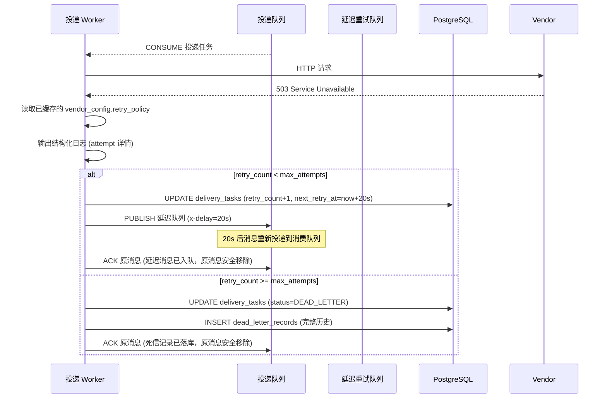

**熔断链路**：

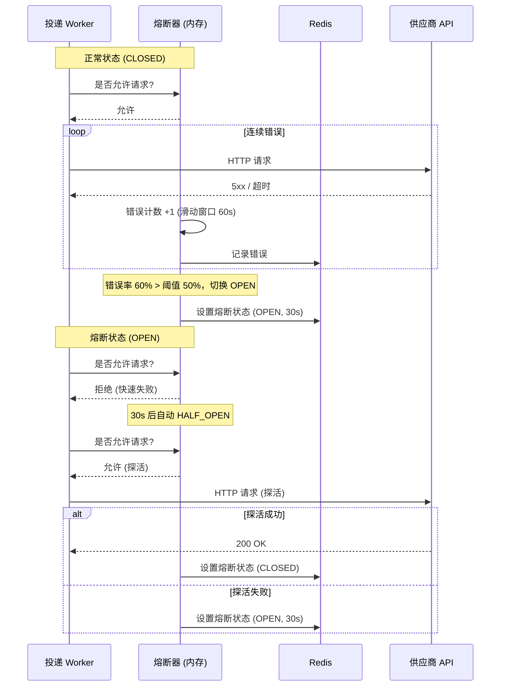

<a id="56-易变点与扩展机制总览"></a>
### 5.6 易变点与扩展机制总览

以下汇总所有扩展点的设计方式及其在 §5 中的位置。

| 易变项 | 扩展机制 | 设计方式 | 展开位置 |
|--------|----------|----------|----------|
| **供应商 API 格式** | 映射规则配置 | 结构化映射规则，配置可 CRUD，运行时生效 | §5.3 请求拼装 |
| **鉴权方式** | 鉴权处理器接口 | AuthProvider 接口，每种方式独立实现，注册中心加载 | §5.4 请求签名 |
| **请求构造复杂度 L3/L4** | 自定义插件 | MapperPlugin 接口，`body.type: plugin` 引用 | §5.3 请求拼装 |
| **重试策略** | 策略配置 | RetryPolicy 对象，存储在供应商配置中 | §5.5.3 重试与死信管理 |
| **限流配置** | 限流算法配置 | RateLimitConfig，每个供应商独立 | §5.5.2 限流器与熔断器 |
| **事件类型体系** | Schema 注册中心 | 事件类型 + JSON Schema 注册表 | §5.1 接收网关 |
| **路由规则** | 路由表 CRUD | 路由表存储在 DB，Admin API 管理 | §5.2 路由分发器 |
| **优先级需求** | 队列标签 + 调度权重 | 队列 priority 标签，Worker 按权重分配 | §5.2 路由分发器 |

---

<a id="6-推荐方案组合总结"></a>
## 6. 推荐方案组合总结

<a id="61-推荐组合生产环境"></a>
### 6.1 推荐组合（生产环境）

基于通用场景（非极端规模和简单场景），各模块的推荐方案如下：

| 模块 | 推荐方案 | 核心理由 |
|------|---------|----------|
| **接收层** | RESTful JSON API | 业务系统接入最友好，通用 HTTP 生态 |
| **路由层** | 配置驱动路由表 | 简单可靠，CRUD 即可管理 |
| **数据映射** | 结构化映射 + 插件扩展 | L1 字段直映射用配置，L2-L5 复杂场景走插件（见 §5.3） |
| **投递层** | 独立 Worker 组 (Per 供应商) | 供应商间故障隔离，可独立配置并发度 |
| **重试死信** | 指数退避 + 抖动 + MQ 延迟 | 简单、可靠、可配置 |
| **限流熔断** | 令牌桶 + 状态机断路器 | 成熟、可预测、独立配置 |
| **供应商配置** | Git + Webhook + SecretStore | 变更可审批、历史可追溯、机密不落 Git（见 §3.4） |
| **调用方管理** | API Key + HMAC 签名 | 内部系统间足够安全，实现简单 |
| **可观测性** | 结构化日志 + Prometheus + trace_id | 低成本、高价值、生态成熟 |

<a id="62-方案组合的逻辑一致性"></a>
### 6.2 方案组合的逻辑一致性

推荐组合遵循以下一以贯之的设计哲学：

1. **简单优先**：在满足需求的前提下，选择实现和运维成本最低的方案
2. **配置驱动**：所有易变点通过配置管理，避免核心代码随供应商增加而膨胀
3. **故障隔离**：投递层的独立 Worker 组 + 限流熔断器 + 分区队列，确保一个供应商的故障不影响其他
4. **渐进可扩展**：数据映射层从结构化规则起步，不排除复杂场景通过插件扩展；存储从纯 PG 起步，按需演进到 PG+Redis 缓存分层

<a id="63-实施阶段建议"></a>
### 6.3 实施阶段建议

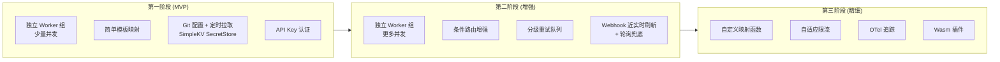

- **第一阶段（MVP）**：快速打通端到端流程，支持 1-3 个供应商
- **第二阶段（增强）**：强化故障隔离和可观测性，支持 10-30 个供应商
- **第三阶段（精细）**：支持高度定制化的集成场景和极大规模

#### 6.3.1 MVP 功能范围界定

以下按"做减法"原则梳理各功能模块的 MVP 归属。判断标准：

**不放在 MVP**：
1. 可以逐渐丰富的功能
2. 移除后流程依然可以顺利运行的
3. 仅部分供应商要求的功能

**保留在 MVP**（满足任一即可）：
1. 移除后流程不再完整的
2. 现在不做未来将极度难以扩展/支持的
3. 影响系统效果（成功率、延迟等）的

| 功能 / 流程 | 保留在MVP | 不放在MVP（归属阶段） | 判断理由 |
|------------|-----------|-------------------|----------|
| **接收层** | | | |
| RESTful 接收入口 | ✅ | — | 系统入口，移除则流程不完整 |
| 调用方鉴权（API Key） | — | 第二阶段 | 移除后流程仍完整，可用共享 Secret 过渡 |
| Schema 格式校验 | ✅ | — | 不加则畸形 payload 导致映射引擎出错或 silent 失败，排障成本远高于校验实现成本 |
| 幂等键唯一约束 | ✅ | — | 不加则重复提交无法安全重试，后续改造成本高 |
| MQ 触发机制 | ✅ | — | 异步流程基石，移除则路由无法驱动 |
| **数据模型** | | | |
| 通知与投递任务分离 | ✅ | — | 核心数据模型，后续合并为一张表后拆分极困难 |
| payload 存 DB，MQ 仅携 ID | ✅ | — | 否则 MQ 带宽膨胀，后续整改成本高 |
| DeliveryAttempt 审计日志 | — | 第二阶段 | 可后续加，MVP 简单日志即可 |
| 预分片列（shard_id） | ✅ | — | 现在加几乎零成本，后续加需迁移全量数据 |
| 月度时间分区 | — | 第二阶段 | MVP 数据量小无需分区 |
| Redis 缓存加速 | — | 第三阶段 | 纯 PG 已够 MVP，演进路径清晰 |
| **路由层** | | | |
| 简单事件→供应商映射 | ✅ | — | 核心流程，移除则无法路由 |
| 条件路由 | — | 第二阶段 | 可逐渐丰富，简单映射已满足基本需求 |
| **映射层** | | | |
| 结构化映射（L1 字段直映射） | ✅ | — | 无此则请求无法构造 |
| 自定义映射插件（L2-L5） | — | 第二阶段 | 仅复杂场景需要，MVP 走结构化映射 |
| **请求签名与鉴权** | | | |
| 内置签名（HMAC/MD5） | — | 第二阶段 | 仅部分供应商要求 |
| 鉴权注入（OAuth2 等） | — | 第三阶段 | 仅部分供应商要求 |
| **投递层** | | | |
| HTTP 投递执行 | ✅ | — | 投递核心流程 |
| HTTP 状态码判定 | ✅ | — | 无此则不知投递成败 |
| body 条件判定 | — | 第二阶段 | 可逐渐丰富，HTTP 状态码已覆盖多数场景 |
| 独立 Worker 池（按供应商） | — | 第二阶段 | 共享 Worker 池流程已完整，可逐渐演进 |
| 限流器（令牌桶） | — | 第二阶段 | 移除后流程完整，低 TPS 时无迫切需求 |
| 熔断器 | — | 第二阶段 | 移除后流程完整，可用手工处理替代 |
| **重试与死信** | | | |
| 指数退避+抖动重试 | ✅ | — | 无重试则投递失败后永久停滞 |
| MQ 延迟重投（DLX+TTL 或插件） | ✅ | — | 影响重试可靠性，进程内定时器在进程崩溃时丢失重试机会 |
| 死信标记 + 死信表 | ✅ | — | 流程终结，否则重试永不停止 |
| Admin 手动重试/丢弃 | — | 第二阶段 | 可后续加，MVP 可通过 DB 直接操作 |
| **队列架构** | | | |
| 共享队列（全供应商统一） | ✅ | — | MVP 1-3 个供应商够用，流程完整 |
| 按供应商分区队列 | — | 第二阶段 | 可逐渐演进，共享队列已满足基本隔离需求 |
| **配置管理** | | | |
| 本地文件 | ✅ | — | 配置少，MVP 够用 |
| Git + Webhook + SecretStore | — | 第二阶段 | 可逐渐丰富 |
| Admin UI 辅助生成配置 | — | 第三阶段 | 可后续加 |
| **可观测性** | | | |
| 结构化日志 + 关键指标打点 | ✅ | — | 排查问题必需；投递成功率/重试/队列深度等关键指标可统计查看 |
| 通知状态查询（列表+详情） | ✅ | — | 按时间/供应商/事件类型/状态筛选，入口不限（查 DB 或 API 均可） |
| Prometheus + Grafana | — | 第二阶段 | 有基础设施时可选，MVP 不依赖 |
| OTel 全链路追踪 | — | 第三阶段 | 已有规划 |
| **部署** | | | |
| 单体架构 | ✅ | — | §4.3 已决策 |
| 微服务拆分 | — | 第三阶段 | §4.3 已规划 |

---

## 附录 A: 设计评审记录

> 本附录记录概要设计阶段的评审讨论和决策过程，便于追溯设计决策的上下文和未采纳方案的考虑。

### A.1 配置管理方案评审（2026-05-22）

**问题**：是否引入 Git + Webhook + SecretStore 作为供应商配置管理的方案。

**关注点**：
- **原始方案将配置一致性问题看得很重——各实例必须运行同一版本配置。这个约束是否必要？**：配置变更需要灰度发布。如果所有实例在同一时刻切换配置，一个错误配置会同时污染全量流量，回滚也是全量回滚。Git 方案中实例逐个拉取配置，天然形成"实例级别的灰度发布"——错误配置只影响先拉到的那部分实例，其余实例仍运行在旧配置上，形成了一个自动的慢速回滚窗口。强一致性要求（所有实例同时切换）实际上是把配置变更的风险从"分批暴露"变成了"全量暴露"，对稳定性有害。因此"短时间内配置不一致"不是缺陷，而是灰度发布需要的特性。
- **机密信息（API Key/Secret Token 等）是否应该存放在 Git 仓库中？**：Git 的审计轨迹服务于代码变更审查（review diff、approve PR），这种审计和机密信息的访问控制是不同维度的安全需求。如果 API Key 放在 Git 仓库里，有 Git 读权限的人就能看到所有密钥——但运维同学需要读 PR 来审查配置变更，他们不该因此就能看到密钥。将机密分离到 SecretStore，使得 Git 的读权限和 SecretStore 的读权限可以独立管控。此外，Git 历史不可篡改但也不可删除——密钥一旦误提交到 Git，它在历史中永久存在。SecretStore 支持密钥轮换和版本管理，误暴露后可以立即轮换。
- **Admin API 是否应该直接写入 Git 仓库？**：如果 Admin API 直接推送 Git，它需要一个"机器身份"（如 Git SSH Key 或 Personal Access Token）。这个凭证本身需要在 Admin API 实例之间安全分发——又回到了机密管理的问题。更本质的是：Admin API 的使用者（运维/运营人员）通过 UI 操作，如果这个操作直接提交 Git，这等于让 UI 操作绕过 PR 审查流程直接修改配置。失去了 Git 方案最核心的价值——变更审批和审计。所以 Admin API 的角色应该是"查看当前运行配置"和"触发重新加载"，而不是"修改配置源"。
- **Webhook 可能丢事件，如何保证配置更新不丢失？**：Webhook 是 at-most-once 语义——网络闪断或 Webhook 端点处理出错时，Git 不会重发。这时如果刚好有新配置提交，就会错过。需要一个 pull 模式的兜底（如每 5 分钟 git fetch）。这个组合（push + periodic pull）在业界 GitOps 实践中是标准做法（ArgoCD 就是定时轮询 + Webhook 加速）。兜底间隔的选取：5 分钟意味着配置生效延迟最多 5 分钟。对于通知系统（配置变更不频繁，紧急变更可手动触发 reload），这个延迟完全可以接受。

**哲学**：配置变更的风险远大于配置不一致的风险。强一致配置（所有实例同时切换）将变更的单点故障放大为全量故障，灰度过程需要的恰恰是"短时间内不一致"——让错误配置只影响一小部分流量。一致性越强，变更事故的爆炸半径越大。

**结论**：采用 Git + Webhook + SecretStore 方案。最终一致性对通知系统足够，且灰度发布的天然收益使其优于强一致方案。

---

### A.2 同步→异步触发机制评审（2026-05-22）

**问题**：接收网关写入 DB 后，如何触发路由分发器开始异步工作。

**关注点**：
- **Go Channel 能否保证 crash 后触发消息不丢失？**：Go Channel 是进程内内存队列。当进程崩溃时，channel 中所有未被消费的消息丢失。兜底方案是"重启时扫描 PENDING 状态通知"。但这里的问题是：扫描 PENDING 通知后重新触发路由，会重新创建 delivery_task——这与 crash 前已创建但未提交的 delivery_task 可能重复。需要下游幂等消费（按 notification_id 去重）。既然无论如何都需要 MQ 层面做幂等消费，那为何不让 MQ 同时承担触发通道的职责？Go Channel 的正确性保障最终还是要落在 MQ 上。
- **PG LISTEN/NOTIFY 在高吞吐下是否可靠？**：PG 的 NOTIFY 服务端队列是固定大小（默认 8GB 的 shared memory 中的一部分），当队列满时，最老的 NOTIFY 消息会被丢弃。这不像 MQ 的持久化队列——MQ 队列满了会阻塞生产者或 spill 到磁盘，NOTIFY 满了直接丢弃。在高 TPS 写入下，通知系统如果依赖 NOTIFY 来触发路由，任何一个写入尖峰都可能导致触发消息丢失——然后依赖 PENDING 扫描兜底。但扫描兜底又有延迟窗口（秒到十秒级），且扫描的是全量通知表（随数据量增长越来越慢）。
- **出站表（Outbox）+ 轮询方案能解决触发可靠性问题吗？**：Outbox 表写入是在同一 DB 事务中完成的，一致性没有问题。但问题在于读端——outbox 发布器需要轮询 `WHERE status=PENDING ORDER BY created_at`。持续写入 + 持续轮询 = 读写混部。在 TPS 高时，`PENDING` 状态的 outbox 行数可能很多（如果 MQ 短暂不可用会积压），轮询 SQL 的索引扫描范围会越来越大。即使有 `(status, created_at)` 索引，持续 INSERT 和 DELETE 也会产生大量索引写放大和 autovacuum 压力。
- **RabbitMQ 已经是基础设施——再多一个触发队列是否值得？**：RabbitMQ 已经是系统基础设施——投递队列、延迟重试都依赖它。增加一个触发队列的边际成本接近于零（只是多一个 exchange + queue）。相比 outbox 表，MQ 没有轮询压力（消费者 idle 时零负载）；相比 NOTIFY，MQ 消息可持久化且不限制队列深度；相比 Go Channel，MQ 跨进程通信未来拆微服务零改动。触发路径延迟约 1ms，相比于投递 HTTP 调用的 100ms+，占比可忽略。

**哲学**：已有基础设施优先复用。增加一个触发队列的边际成本远低于引入新组件或新机制的成本。触发通道的选择不应引入新的数据存储（如 outbox 表）或依赖 crash 恢复后的扫描兜底——已选定的 MQ 已具备所需全部能力。不要为"回字的四种写法"分散设计精力。

**结论**：采用 RabbitMQ 触发。已有基础设施、跨进程通信、持久化保障、未来拆分零改动。

---

### A.3 请求拼装方案评审（2026-05-22）

**问题**：如何将事件 payload 转换为供应商要求的 API 请求格式——选择请求拼装的实现方式。

**关注点**：
- **Go Template 作为映射方案的可行性和成本如何？**：结构化映射是声明式的——配置描述"结果应该长什么样"，引擎负责填充字段。Go Template 是命令式的——模板描述了"怎么构造结果"，`{{ if }}`、`{{ range }}` 可以嵌入任意逻辑。这种区别意味着：结构化映射的输出是可预测的（给定输入，输出结构完全由配置决定，无隐藏分支）；Go Template 的输出需要执行模板才能知道。对于 YAML 配置这种"提交即生效"的格式，可预测性至关重要——reviewer 看配置 diff 就能理解会产出什么请求体，不需要在脑中模拟模板执行。
- **Go Template 拼接字符串时，特殊字符（引号、换行符）会不会导致生成的 JSON 语法错误？**：这是 Go Template 在 JSON 场景下的关键隐患。假如配置为 `"order_name": "{{ .payload.order_name }}"`，当 payload 中 `order_name` 值为 `Book "Advanced"` 时，Go Template 直接拼接的结果是 `"order_name": "Book "Advanced""`——引号破坏 JSON 结构，反序列化失败。要避免这个问题，模板作者必须在每个可能包含特殊字符的字段上手动调用转义函数（如 `{{ .payload.order_name | jsonEscape }}`），且不能遗漏任何一个。结构化映射不存在这个问题——引擎知道每个字段的类型（字符串/数字/布尔/对象），在序列化时自动处理转义。配置作者只需要说"把 order_name 的值放到这里"，不需要关心值本身是否包含特殊字符。从这个角度看，结构化映射不仅更简单，而且更安全——它消除了一个容易被遗漏的隐患。
- **需求文档揭示的 L1-L5 复杂度谱系下，单一方案是否够用？**：需求文档揭示 L1 字段直映射覆盖约 90% 的供应商场景。这意味着如果选用 Go Template，90% 的场景本可以用更简单的结构化映射来表达，但最终却需要编写模板代码（以及应对模板语法错误、引号问题等）。另一方面，如果只选结构化映射，L4（XML/SOAP）和 L5（签名）的场景无法覆盖。所以不是"选哪个方案"，而是"如何用最合适的方案覆盖对应层级的场景"。
- **能否在结构化映射中逐步增强（加入条件判断、循环等）来避免引入插件？**：有诱惑力的是"在结构化映射中逐步增强，加入条件判断、循环、函数管道"。但这样配置会从"数据"逐渐变成"编程语言"——今天加一个条件语法，明天加一个循环，后天加一个错误处理。最终配置会变成一种自研的、未经过大规模验证的、文档不全的 DSL。最差的情况是：系统同时包含了配置 DSL 和插件两种扩展机制，且 DSL 能做的事越来越多，它似乎"几乎能解决一切问题"——但每次遇到边界情况时，都需要花大量时间去定位"是配置语法不够用，还是我配置写错了"。与其如此，不如在起点就划清界限：配置只做字段直映射，复杂逻辑走插件。这不是逃避问题，而是避免一个"看起来全能、实际把简单问题搞复杂"的中间地带。

**哲学**：配置是数据，不是代码。声明式配置和命令式代码有本质区别——前者描述"是什么"，后者描述"怎么做"。不要试图在配置层解决所有问题，让简单场景保持简单，让复杂场景走代码。90% 的场景不应因为 10% 的复杂场景而复杂度上升。

**结论**：结构化映射覆盖 L1（90%），插件覆盖 L2-L5（10%）。通过 `body.type` 切换。

---

### A.4 配置格式与数据契约评审（2026-05-22）

**问题**：结构化映射的配置语法如何定义，事件类型的数据契约如何约定。

**关注点**：
- **字段引用应该用 Go Template 语法还是自定义 `@{payload.field}` 语法？**：`{{ .payload.field }}` 是表达式求值语法——它不仅意味着"获取这个值"，还意味着"可以写任意表达式"。配置作者会在映射中用 `{{ if }}`、`{{ with }}`、管道函数链。一旦开启这个口子，配置就会从数据变成代码（见 A.3 的同一问题）。而 `@{payload.field}` 是一个纯引用标记——它唯一能做的事情就是告诉引擎"从 payload 的指定路径取值放到这里"。引擎看到 `@{...}` 能做的事情是限定的、确定的、可验证的。这种"语法级别的约束"比"规则文档中的约定"要可靠得多——约定可以被打破，语法约束不能。
- **时间戳格式多样（unix_s/unix_ms/ISO 8601），Schema 如何准确表达这些差异？**：`paid_at: 1736870400` 这个字段，上游业务方可能传 unix seconds，也可能传 unix milliseconds（1736870400000），还可能传 ISO 8601 字符串。从 JSON Schema 的 `type: integer` 上完全无法区分。如果映射引擎直接把这个整数塞到供应商 API 的 body 里，供应商可能解析出错误的时间（差 1000 倍）。`x-format` 扩展就是在 Schema 层面标注"这个 integer 实际上是 unix_s 还是 unix_ms"，让引擎在映射时可以自动转换。这不仅仅是"格式提示"，而是防止静默数据错误的关键机制。
- **配置语法（怎么取值）和数据契约（输入结构定义）是同一问题还是不同问题？**：最初配置语法和 Schema 定义是分开讨论的。但在讨论中意识到：配置中 `@{payload.field}` 引用的字段名，和 Schema 中定义的字段名，本质上是同一套命名体系。如果分开描述，配置作者需要同时查阅两处文档才能理解一条映射的含义。合并为完整的"数据契约 + 映射规则"描述后，Schema 定义了"有什么字段"，配置定义了"字段怎么映射到供应商请求"，两者互相补充，共同构成一个完整的配置画面。

**哲学**：语法级别的约束比文档约定更可靠。`@{payload.field}` 的语法限制不是缺陷，而是保护——它保证配置不会退化未代码。格式信息从 Schema 自动推导，减少人为错误。

**结论**：`@{payload.field}` 引用语法 + JSON Schema + `x-format` 扩展。

---

### A.5 请求签名机制评审（2026-05-22）

**问题**：供应商要求对请求进行签名（MD5、HMAC 等），如何通过配置表达签名参数，签名机制如何设计。

**关注点**：
- **签名应该是请求构造的一部分，还是独立的后处理步骤？**：如果把签名嵌入映射层（如在映射规则中调用 `hmac_sha256` 函数），那么每次添加新的签名算法都需要在映射引擎中注册新函数。更糟的是：签名计算依赖的待签字符串可能在映射完成后才能确定（如需要规范化后的 Header 值）。如果映射层不感知签名，它只需要完成"拼装请求"这一件事；如果映射层还要负责签名，它的单一职责被破坏。方案是做后处理步骤——引擎先构造完整请求，然后把"已构造的请求"交给签名处理器。签名处理器按 `sign` 配置从请求中提取元素、计算签名、注入结果。这样映射和签名各自独立演进。
- **签名元素的组合方式多样，如何表达才能避免每次新增组合都改代码？**：需求文档显示，不同签名的字符串组合方式差异很大：有的只签 body，有的签 body+timestamp，有的签 method+path+body+timestamp，有的需要按字典序排列 Header 后签 Header 子集。如果内置固定模式（如"body+timestamp"、"path+body"每种模式一个代码分支），每新增一种组合就要改代码、发版本。用 `include` 声明式描述可以让配置作者自由组合——`include: [method, path, body, timestamp]` 和 `include: [body]` 的区别就是一个配置项，不需要改动代码。
- **是否需要内置 RSA 签名支持？**：RSA 签名需要管理公私钥对——私钥的存储、轮换、权限控制与 HMAC 的共享密钥有本质区别。HMAC 只需要一个 secret（可以放在 SecretStore 中统一管理），RSA 的私钥需要严格的 PKI 体系。从需求文档中看到的供应商场景，HMAC 占绝大多数。RSA 走插件是合理的——需要使用 RSA 的供应商通常也会提供签名 SDK 或详细的签名规范，这个规范更适合由插件开发者实现，而不是内置在引擎中。
- **插件是否应该复用引擎的内置签名能力？**：插件是否需要感知签名配置？不需要。引擎的执行顺序是：先按 `request` 构造请求，再按 `sign` 配置执行签名。插件只负责构造 body，不关心签名。如果某个供应商的签名方式实在过于特殊（如需要自定义规范化规则、多 Header 组合结果），可以配置 `sign.type: plugin`，由自定义签名插件接管完整的签名逻辑。这个边界清晰：普通的签名字符串组装用配置，特殊的签名逻辑用自定义代码。

**哲学**：签名是安全机制，独立于业务映射。签名字符串的组装规则因供应商而异——声明式 `include` 描述"签什么"，引擎决定"怎么签"。常用算法内置（覆盖 80%+），稀有算法插件。引擎的执行顺序是约定，不是配置——请求构造在前、签名在后，插件不需关心签名逻辑。

**结论**：`include` 声明签名元素，内置 hmac-sha256/hmac-sha1/md5，结果注入 `header` 或 `authorization`，复杂签名走 `sign.type: plugin`。

---

### A.6 响应判定方案评审（2026-05-22）

**问题**：如何设计供应商 API 响应成功/失败的判定逻辑。

**关注点**：
- **仅靠 HTTP 状态码判断成功是否足够？**：需求揭示了"200 但实际失败"的多种场景——Facebook/Meta 返回 `{"events_received": 0}` 表示没有事件被接受，Trade Me 返回 `{"success": false}`，LeadSquared 返回 `{"Status": "Error"}`。如果只检查 HTTP 状态码，这些场景都会被判定为"投递成功"，但实际供应商并没有接受内容。反过来，如果只检查 body，5xx 错误的响应体可能无法解析。结论是：需要一套可配置的判定规则，既要检查 HTTP 层面是否通达（基础设施层），也要检查 body 层面是否被接受（业务层），且两者不能互相替代。
- **HTTP 状态码检查与 body 条件检查是 AND 关系还是 OR 关系？**：`body_field` 规则是"替代"状态码检查，还是两者共存？例如 `{"success": true}` 是否隐含了 HTTP 200 的前提？结论是**两层语义 AND**——HTTP 2xx 是隐式前提（基础设施层成功），body 条件是额外约束（业务层成功）。非 2xx 直接进入失败/重试流程，不进入 body 解析。两类失败性质不同：非 2xx 是网络/服务端问题，需要重试或告警；2xx + body 失败是业务层拒绝，通常是配置/数据问题，重试大概率同样失败，需要人工排查。
- **3xx 重定向响应是否应视为投递成功？**：3xx（301/302/307/308）不算成功。Go HTTP 客户端默认跟随重定向（直到非 3xx 响应），Worker 看不到 3xx 中间状态码。Worker 最终看到的是跟随重定向后的最终响应（通常是 2xx 或 4xx/5xx）。不存在需要判定"3xx 是否成功"的场景。
- **需要哪些 body 判定模式来覆盖需求文档中的供应商场景？**：内置四种模式——`body_field`（字段比较）、`body_match`（精确匹配）、`field_absent`（字段缺失）、`http_status`（仅状态码）。这四种模式来自对需求中所有供应商响应格式的归纳，覆盖了 JSON 响应的全部场景。非 JSON 响应（XML/SOAP）走 `type: plugin`。
- **判定规则应该放在供应商配置的什么位置？**：默认放在供应商配置顶层 `response_judgment` 段，与 `request`、`sign` 平级。原因是响应判定和请求构造是两个独立的关注点——一个决定"怎么发"，一个决定"怎么判断结果"。放在平级位置让配置结构清晰，新增供应商时不会遗漏。同时支持在 DeliverySpec（按 `(vendor, event_type)` 组织的投递规格）中可选覆盖，覆盖时以 DeliverySpec 为准。同一供应商的大多数事件类型共享同一套判决规则，需要差异化时可通过 DeliverySpec 单独配置。
- **默认的可重试规则是否够用？如果不够如何覆盖？**：默认规则（5xx/超时/429 → 可重试；4xx 非 429 → 不可重试）覆盖大部分场景。但存在特殊情况：部分供应商可能返回 200 + `{"error": "RETRY_LATER"}`，这种业务错误也应该重试；或 502 在某些场景下视为不可重试。通过 `response_judgment.retryable.add/remove` 声明覆盖规则，保持默认设置保守（不轻易重试 body 失败），避免配置错误的投递反复重试浪费队列资源。
- **XML/SOAP 等非 JSON 响应怎么处理？**：`body_field` 依赖 JSON 反序列化后用点号路径取值。XML 没有"点号路径"概念——同一份数据可以有 XPath、DOM、StAX 等多种解析方式，且 XML 响应可能包含命名空间、CDATA、Schema 校验等多重复杂性。引擎不应对 XML 做"简单化"处理——提供 `type: plugin` 让开发者写完整的解析逻辑，比引擎内置一个"半吊子"的 XML 解析器要可靠得多。

**哲学**：响应判定需要区分基础设施失败和业务失败两类性质——前者需要重试，后者需要排查。不内置"乐观重试"策略，宁可少重试也不做无效重试。配置让新增供应商无需代码变更，但 XML/SOAP 等异构格式需要插件来处理。

**结论**：两层语义（HTTP 2xx AND body 条件），内置四种模式覆盖 JSON 响应，XML/SOAP 走 `type: plugin`，可重试判定通过 `retryable.add/remove` 覆盖默认规则。

---

### A.7 数据库扩展策略评审（2026-05-22）

**问题**：系统是否需要分库分表，如果需要选择何种方案。

**关注点**：
- **MVP 阶段是否需要实现分库？如果不实现，是否需要预留扩展性？**：如果不预留 shard_id，未来需要分库时面临两种选择：（a）全量数据迁移加 shard_id 列——带数据量的 migration 成本极高，且需要停服或双写；（b）采用不同的分片键（如 caller_id）——与已有查询模式可能不匹配。预留一个 shard_id 列（`delivery_task_id % 1024`）是几乎零成本的——只是一列 INT，占 4 字节。但未来分库时不需要改表结构、不需要数据迁移、不需要改查询 SQL（一直带着 `WHERE shard_id = ?`）。这个预留是"几行配置 + 一个 INT 列"在 MVP 阶段做的极少投入，换来未来分库时零改动的能力。
- **分片基数 N 应该是可变还是固定的？**：如果分片基数 N 可变（如从 4 扩展到 8），已存储的数据中 `id % 4` 的结果不会自动变成 `id % 8`——所有已存在的行需要重新分配 shard_id。这意味着全量数据重迁移。而固定 N=1024，shard_id 与行永久绑定（永远不会变），扩容只是修改外围映射表 `shard_id → db_instance`。数据不动，路由变。这就是预分片的核心思想。
- **1024 个分片是否需要创建 1024 张物理表？**：1024 个分片不代表需要创建 1024 张物理表。在单库阶段，所有 shard_id 落在同一张物理表上。`shard_id` 只是表中的一列，查询时使用 `WHERE shard_id = ?` 即可实现分区裁剪——索引扫描单个 shard 的数据，不影响其他 shard。当扩容到多库时，按 `shard_id → db_instance` 路由到不同实例，每个实例上仍是单张物理表。逻辑分片是"路由到实例"的依据，不是"拆分表"的依据。
- **不同表是否需要统一分片键？**：`notifications`、`delivery_tasks`、`delivery_attempts` 三张表是关联的，理论上可以用 `notification_id` 作为统一分片键让关联数据落在同一实例上。但代价是所有表的分片逻辑必须一致，不能独立扩展。考虑到系统没有跨表 JOIN 的查询场景——`notifications` 按 `caller_id + idempotent_key` 查、`delivery_tasks` 按 `notification_id` 查、`delivery_attempts` 按 `delivery_task_id` 查，都是单表点查——不需要让关联数据强制同库。各表独立按各自 `id % 1024` 路由即可，更简单灵活。
- **安全的扩容流程应该是什么样的？**：分库扩容涉及双写、数据搬迁、切读、清理四个步骤，每个步骤都可能出错。安全的要求是每一步可回滚、每步之间有校验确认——双写后校验数据一致性再切读，切读后观察一段时间再清理旧库。这个流程在逻辑上必须是严格有序的，不能跳跃或并行。
- **这个流程一般是不是由 DB 平台自动支持的？**：业界成熟的 DB 平台（如 TiDB、Vitess）通过工单 + SDK 的方式自动化整个流程——运维在平台上提交扩容工单，平台逐步推进（双写→校验→切换→清理），SDK 在业务代码中透明地处理读写路由切换，全程不需要人工干预。但自建这套平台需要专门的基础设施团队，通知系统生命周期内扩容次数极少（可能 1-2 次），为此建设全自动平台成本远超收益。手动流程在"执行次数极少"的场景下是合理选择。

**哲学**：预留扩展性不提前实现。shard_id 是"未来的路由信息，今天的一部分数据"——在 MVP 阶段就嵌入数据模型，但不实现分库逻辑。预分片的核心是固定基数、永久绑定，扩缩容只需改映射不改数据。

**结论**：预分片（N=1024）用于分库路由，初始单库单表。分表由 PG 原生时间分区解决。

---

### A.8 幂等语义评审（2026-05-23）

**问题**：`idempotent_key` 的语义是什么——"效果幂等"还是"流程幂等"，以及幂等键的保留策略。

**关注点**：
- **幂等应该关注"流程只跑一次"还是"最终对 vendor 只投递一次"？**：幂等的本质是"发生一次与发生多次等价"。这里有两个不同层面的含义——"流程幂等"是请求去重，业务系统提交一个通知后，后续重复提交都被挡住，整个投递流程只启动一遍；"效果幂等"是投递去重，无论业务系统重复提交多少次，最终向 vendor 只投递一次。两者的关键区别在于遇到部分失败时的行为：如果第一次提交后投递未全部完成（如 MQ 短暂不可用导致部分 vendor 没收到），流程幂等会因为"流程已经跑过"而挡住重试，调用方看到一个成功的 ID 但实际数据没有送达；效果幂等则允许调用方重试，由系统检查哪些投递已完成、哪些还需补发，最终使所有 vendor 都收到且不重复。我们的场景需要的是效果幂等——允许重试驱动，保证最终效果的幂等。
- **幂等键需要保留多久？永久保留还是设置 TTL？如果设置 TTL，多长合适？**：
  - 太短（如 1 小时）：调用方系统可能因为自身故障在 2 小时后才重试——此时幂等键已过期，系统创建一个新的通知。调用方看到两个通知都成功了，实际产生了重复投递。
  - 太长（永久）：存储成本无限增长。幂等键索引也是 B-Tree——行数越多，索引插入越慢。
  - 7 天的选取逻辑：通知的"时效性"是核心约束——7 天前的通知业务上已经不需要了（超时的订单通知、过期的告警等）。如果调用方在 7 天后还要重试，大概率是一起独立的事件，而不是同一次重试。7 天的窗口覆盖了绝大多数重试场景（小时到天级别的故障恢复周期），同时存储是可管理的（3k TPS × 7 天 × ~100B/条 ≈ 180GB）。
- **vendor 侧是否需要具备幂等处理能力？我们的重试行为是否合理？**：这是一个分布式系统的客观事实问题，不是责任划分问题。HTTP 请求可能在以下情况"发出但无响应"：TCP 连接超时（客户端发送了请求但没收到 resp）、服务端处理成功但响应在回传途中丢失、客户端超时设置小于服务端处理时间。这些场景下我们的 Worker 会重试——这不是"我们的设计选择"，这是 TCP/IP 协议栈的内在行为。任何构建在 HTTP 之上的系统都会有重试，所以任何对外暴露 API 的系统都应该处理重复请求。vendor 如果不在 API 层面做幂等，他们的系统本身就存在缺陷——不只是对我们，对所有调用方。

**哲学**：幂等键是"请求的上下文标识"，不是"做过了就跳过"的锁。重试是分布式系统保证最终一致性的正常手段，不是异常行为。幂等的目的是"做第二次的结果不会比做第一次差"，而不是"不做第二次"。7 天 TTL 在"重试窗口"和"存储成本"之间取得平衡。

**结论**：效果幂等语义，唯一约束 (caller_id, idempotent_key)，INSERT ... ON CONFLICT DO UPDATE，7 天 TTL。vendor 侧幂等是分布式的固有要求。

---

### A.9 MQ 与 DB 定位关系评审（2026-05-23）

**问题**：在本系统的架构中，MQ 和 DB 各自的核心定位是什么？谁主导、谁辅助？

**关注点**：
- **DB 写入成功但 MQ 发布失败，这个问题怎么处理？**：最初的想法是让 DB 承担补偿角色——如果 MQ 发布失败，通过出站表（outbox）或 PENDING 扫描兜底，等 MQ 恢复后再补发。这样做的隐含假设是"DB 写入成功 = 这件事已经成功了，需要保证它最终被送达"。但这个假设值得商榷：如果 MQ 不可用，通知实际上没有被投递，DB 写入成功只意味着"数据存下来了"，不意味着"通知发出去了"。让 DB 兜底 MQ 的失败，本质上是让 DB 替 MQ 的工作负责——DB 去维护待发送队列、DB 去轮询 MQ 是否恢复、DB 去补发消息。这模糊了 MQ 和 DB 的职责边界。换个角度思考：如果 MQ 不可用到需要 DB 来兜底，说明 MQ 的稳定性本身有问题，应该优先解决 MQ 稳定性（监控、告警、快速恢复），而不是用 DB 掩盖这个问题。结论是：DB 成功 + MQ 失败 = 整体失败，调用方通过 idempotent_key 重试。MQ 的可用性是系统可用性的前提。
- **没有 DB 是否可以？纯 MQ 能否工作？**：顺着"MQ 是核心"的思路往下推——能否干脆去掉 DB，全用 MQ？这取决于 MQ 能否承担完整 payload 的存储和传输。MQ 每条消息体积如果到 1-50KB，3k TPS 下每日新增约 260GB-13TB 的消息体数据，存储和带宽会被迅速填满，运维难度大幅上升。payload 不能塞进 MQ，意味着 DB 是必须的——DB 存 payload，MQ 只携带 ID（~50 字节）。所以不是"纯 MQ 能否工作"的问题，而是在"MQ 必须轻量化"的约束下，DB 自然成了 payload 的唯一归宿。消费者先查 DB 拿 payload，再执行投递，多一次 DB 查询（2-5ms）相对于 HTTP 投递的 100ms+，这个代价值得付出。DB 的定位是"持久化存储层"，不是 MQ 的备份。
- **DB 是否应该作为"最终成功的依据"？还是 MQ 承担这个角色？**：DB 写入成功但 MQ 发布失败时，通知实际上没有被投递。如果以 DB 写入成功作为"最终成功"的依据，系统需要添加补偿机制（扫描 PENDING 状态的通知补发），这等于用一个复杂的兜底机制来掩盖 MQ 失败的问题。如果以 MQ 成功作为依据，逻辑就清晰了：DB 写入 + MQ 发布都成功 = 通知已提交；任何一步失败 = 调用方重试。DB 的定位是"查询和追溯"——投递成功后调用方来查结果、7 天后审计追溯，DB 提供查询能力；MQ 的定位是"流程引擎"——驱动投递任务的路由、排队、重试、死信等核心流程。这个分工让两个组件的职责不重叠，各自独立演进。

**哲学**：MQ 是系统的核心引擎（驱动流程），DB 是外部可见的窗口（查询追溯）。两者职责不重叠，不互为备份。MQ 的可用性是系统可用性的前提，不试图用 DB 来掩盖 MQ 的不可用。MQ 只携带元数据避免带宽膨胀，payload 统一由 DB 管理。

**结论**：MQ 为核心引擎驱动投递流程，DB 为查询和追溯服务。MQ 仅携带 ID，payload 存 PG。MQ 不可用直接体现为系统不可用，通过监控和快速恢复保证可用性。

---

### A.10 存储层选型评审（2026-05-23）

**问题**：通知 payload 的存储选型——纯 Redis、PG、PG+Redis、Pika、ScyllaDB。

**关注点**：
- **纯 Redis 作为通知 payload 的存储是否可行？**：纯 Redis 全内存，3k TPS × 1KB avg × 7天 ≈ 1.8TB 数据。加上 delivery_attempts 的响应体记录（可能需要更长时间保留）轻松超过 2TB。生产级 Redis 实例（如 AWS ElastiCache r7g.16xlarge，约 400GB）需要 5+ 实例，月成本约 ¥2000 万。TB 级别全内存存储的经济模型不成立，纯 Redis 被排除。但它的性能确实是最佳的（<1ms），这引出了另一个问题：能否用少量 Redis 缓存热数据 + PG 持久化冷数据，在接近纯 Redis 性能的同时不承担全量成本？
- **Pika 和 ScyllaDB 作为替代方案是否值得引入？**：Pika 的技术原理是 Redis 协议兼容 + RocksDB 磁盘存储。优点是可以重用 Redis 客户端和运维经验。但问题是：Pika 的社区活跃度不如 PG（360 开源，维护资源有限），其备份恢复、监控面板、慢查询分析等运维工具链成熟度远不如 PG。ScyllaDB 各方面优秀（C++ 实现、shard-per-core、原生 TTL），但它设计用来解决的是 10 万+ TPS 的场景——对于当前 3000 TPS 的需求，ScyllaDB 的运维成本和硬件需求（至少 3 节点）远超收益。两者的共同问题是：为了一个"可能出现的性能瓶颈"引入一个全新的存储系统，而这个瓶颈可能永远不会出现。
- **排除了纯 Redis 和 Pika/ScyllaDB 后，剩下的 PG/PG+Redis 是否是唯一合理的选择？**：是的。PG 作为存储层的老牌数据库，运维工具链成熟（备份恢复、慢查询、监控面板），单机 TPS 上限 1-2 万（当前 3000 TPS 远未到瓶颈），点查延迟 2-5ms，满足需求。问题只剩下：是否一开始就引入 Redis 做缓存加速？还是先用纯 PG，等瓶颈出现再演进？
- **从纯 PG 到 PG+Redis 的演进是否顺畅——需要时能否安全加入？**：从纯 PG 到 PG+Redis 只需要改动两处代码（API 写入 + Consumer 读取），各多一行 Redis 操作。PG 表结构不变、MQ 格式不变、幂等语义不变、Redis 不可用时降级读 PG。渐进式的演进路径，风险隔离，可随时决策是否推进。

**哲学**：从简开始，按需演进。不提前为不确定的未来引入新组件。缓存的本质是性能优化——引入缓存只应为了突破可量化的性能瓶颈（TPS > 1万或 PG 读延迟 > 50ms），在此之前的 PG 已经足够。新增组件的运维成本（部署、监控、备份、故障切换）应作为决策的核心考量因素。

**结论**：纯 PG 起点 → PG+Redis 演进路径（由瓶颈触发）。Pika/ScyllaDB 备选记录，当前阶段不引入。

---

### A.11 数据契约与投递契约的管控方案评审（2026-06-01）

**问题**：如何通过配置仓库的目录结构和审批机制，实现对数据契约（事件 Schema）和投递契约（映射规则）的管控，使得三类角色（业务方、供应商维护者、系统维护者）的职责边界可落地。

**关注点**：
- **路由决策应该放在事件类型定义中、供应商映射配置中，还是独立文件中？**：如果路由嵌入事件类型定义（`events/{biz}/{biz_event}.yaml` 中加 `routes` 字段），业务方虽然清楚"应该发给谁"，但不知道供应商的映射是否已配好——容易产生"有路由无映射"的中间态。如果路由隐含在供应商映射配置的文件存在性中（`vendors/{vendor}/{biz}/{biz_event}.yaml` 存在即路由），流程上最顺畅——映射配好了路由自然存在——但供应商维护者无法判断业务方是否同意这个路由决策。两者各有信息盲区。最终选择路由授权独立为 `events/{biz}/route.yaml`，与事件 Schema 文件并列。原因是：路由授权和 Schema 定义虽同为业务方职责（一个定义"数据长什么样"，一个定义"该发给谁"），但两者变化频率不同——Schema 随业务需求演进，路由授权随供应商合作关系变化。独立文件使 CODEOWNERS 路径更清晰，且与投递契约在同一 PR 中合入时自然解决了"有 route 无 mapping"的问题。
- **路由授权和控制条件是同一回事还是应该分离？**：如果路由决策同时包含"应不应该发"和"实际发不发"两层逻辑，那么审批的粒度会变得模糊。灰度切换场景下——新供应商需渐进式放量，灰度比例需要运行时灵活调整，但这不意味着业务方对路由授权的认可需要重新审批。分离后：路由授权是相对稳定的一次性业务决策（由业务方审批），控制条件是供应商维护者域内的运行时策略（自行管理，按需调整比例）。灰度结束时控制条件自然退出（比例达到 100%），路由授权照常生效。
- **审批和测试各自的职责是什么？**：审批者一般会认为自己应该检查变更是否正确。但传递过来的配置是否"正确"需要向真实供应商端点发请求才能验证——这不是 reviewer 通过阅读 diff 能做到的。如果审批被赋予"验证正确性"的期望，那每次 PR 的审批负担都很重，但实际仍然难以发现错误。正确性应该由沙箱测试环境验证——集成实施方在测试环境配好路由和映射，向供应商沙箱发真实通知验证通过后，再提交 PR 到生产配置仓库。审批人只需要确认"这个变更在我的授权范围内，我知情并同意"。审批和测试的职责分开，使双方负担都减轻，且各有所长。
- **`vendors/{vendor}/{biz}/{biz_event}.yaml` 应该由谁来审批？**：投递契约是唯一的耦合点——它引用 Schema 中定义的字段（业务方的资产）和供应商 API 的接入信息（供应商维护者的资产）。如果只由供应商维护者自审批，业务方可能不知道数据已被授权流向某个供应商；如果只由业务方审批，供应商维护者的技术判断（映射是否正确、API 参数是否合规）无法被替代。唯一合理的设置是双方都是 CODEOWNER——供应商维护者在同一个 PR 中添加路由授权和投递契约，业务方 reviewer 只关注 `route.yaml` 的 diff（确认"我同意这个事件发给这个供应商"），供应商维护者关注投递契约部分。双方各自审批自己关心的 diff，互不阻塞。

**哲学**：审批的目的是授权，不是验证正确性。正确性由沙箱测试保证，审批只回答"这个变更在我的授权范围内吗"。配置的目录结构应该反映角色的职责边界，而不是技术的模块划分。

**结论**：`events/{biz}/route.yaml` 作为路由授权（业务方审批），`vendors/{vendor}/{biz}/{biz_event}.yaml` 作为投递契约（双方在同一个 PR 中各审所需部分），控制条件内嵌在投递契约中（供应商维护者自管理）。沙箱测试在前 + PR 批准在后，审批不负责正确性。
