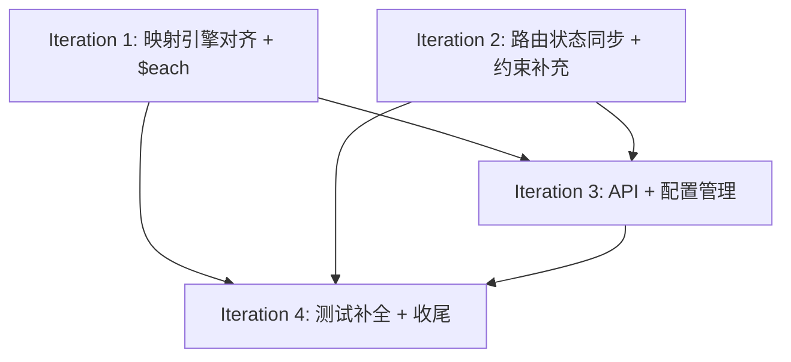

# API 通知系统 — 迭代计划 v2

> 版本: v0.2
> 日期: 2026-06-03
> 基于: HLD v0.2, DD v0.2, 测试用例 v0.2 (2026-06-03)
> 前置条件: 代码已实现 MVP 骨架（Ingestion + Router + MappingEngine + Worker + DB/MQ/Config），
>           现有 E2E 测试 48 ✅ / 10 ➖（见测试用例文档）

## 背景：为什么需要 v2

HLD 和 DD 在代码实现后经历了多轮迭代更新，新增/修改了以下内容：

| 变更 | 对应版本 | 代码状态 |
|------|---------|---------|
| 引用语法统一为 `@{scope:path}`（HLD §5.3、DD §4.4） | v0.2 | 代码使用 `@{payload.field}` |
| `resolveString` 合并入 `resolveField`（DD B.2 评审） | v0.2 | 代码同时保留两者 |
| `$each` 数组遍历映射 + `@{item:field}`（HLD §5.3、DD §4.4） | v0.2 | 未实现 |
| 数据上下文改为 `ctx = {payload, item}` 命名空间隔离（DD B.2 评审） | v0.2 | 代码使用 `payload map[string]any` 参数 |
| 组件图与 Port 边界设计（DD §5.0） | v0.2 | Port 接口已定义，组件依赖需对齐 |
| MQ 发布改为无条件发送（DD §5.1.2） | v0.2 | 代码已按此实现 ✅ |
| `delivery_tasks` 通知详情索引改为唯一约束（DD §2.3.2） | v0.2 | 未对齐 |
| ResponseJudgment 可配置规则判定（DD §5.4.2） | v0.2 | **不放在 MVP**，Worker 使用硬编码 HTTP 状态检查 |
| 重试机制：DLX + per-message TTL → 队列级 TTL + 预定义时间槽（DD §6.4） | v0.2 | 代码使用 DLX + expiration，DD 已改为 retry exchange + 多延迟队列 |

## 当前代码状态

### 已实现（MVP 主体骨架已完成）

- ✅ 领域模型：Notification、DeliveryTask、Port 接口
- ✅ 接收网关：Schema 校验 + 幂等 UPSERT + MQ 触发
- ✅ 路由分发器：事件类型→供应商匹配 + 创建 DeliveryTask
- ✅ 映射引擎：`@{payload.field}` 解析、`$source`/`$type`/`$format` 处理
- ✅ 投递工作器：HTTP 调用 + DLX+TTL 重试 + 死信
- ✅ 配置加载器：本地 YAML 文件加载（vendor + routing + mapping）
- ✅ DB 适配器：PostgreSQL CRUD（notifications + delivery_tasks + event_schemas）
- ✅ MQ 适配器：RabbitMQ 触发/投递/延迟重试
- ✅ 优雅关闭：SIGTERM 并发关闭 HTTP + Worker
- ✅ 42/58 个 E2E 测试通过（覆盖率 83%）

### 画红线：代码与设计的差异

| 序号 | 差异点 | 严重程度 | 影响范围 |
|------|--------|---------|---------|
| **D1** | 引用语法 `@{payload.field}` → `@{payload:field}` | **严重** | engine.go + 所有映射配置 + 测试 |
| **D2** | `$each` 数组遍历 + `@{item:field}` 未实现 | **严重** | 8 个 TC3.7.5 用例未覆盖 |
| **D3** | `resolveString` 与 `resolveField` 并存（DD B.2 要求去掉 resolveString） | **中** | engine.go |
| **D4** | 路由分发器未设置 notification.status = DELIVERING | **中** | dispatcher.go |
| **D5** | `delivery_tasks` 缺少 `(notification_id, vendor_id)` 唯一约束 | **中** | migrations |
| **D6** | `delivery_tasks` 缺少 `IGNORED` 状态 | **低** | migrations |
| **D7** | 通知列表查询 API（DD §3.2.3）未实现 | **中** | handler + 路由 |
| **D8** | 配置目录结构与 DD §4.1 不对齐（扁平 vs 分层） | **中** | config loader + 测试配置 |
| **D9** | Schema 从 DB 加载而非本地文件（DD §2.2 说纯 Git 管理） | **中** | ingestion service + db |
| **D10** | 重试机制：DLX + per-message TTL → 队列级 TTL + 可配置时间槽（DD §6.4） | **高** | mq.go + topology.go + worker.go + config |
| **D11** | 组件级测试缺失：ingestion/service_test、handler/ingestion_test | **中** | 测试 |

---

## 迭代计划

### Iteration 1: 映射引擎对齐 + $each 实现

**目标**：将映射引擎与 HLD/DD 的语法和算法结构对齐，实现 `$each` 数组遍历，覆盖 TC3.7.5 全部测试。

| 改动项 | 关联差异 | 文件 |
|--------|---------|------|
| 1.1 引用语法 `@{payload:field}` | D1 | `internal/mapping/engine.go` |
| 1.2 去掉 `resolveString`，统一为 `resolveField` | D3 | `internal/mapping/engine.go` |
| 1.3 数据上下文改为 `ctx = {payload, item}` 命名空间隔离 | D1, D2 | `internal/mapping/engine.go` |
| 1.4 实现 `$each` 数组遍历 + `@{item:field}` | D2 | `internal/mapping/engine.go` |
| 1.5 更新所有映射 YAML 配置文件（逗号→冒号语法） | D1 | `test/e2e/testdata/mappings/*`、`mapping_content_test.go` |
| 1.6 更新 engine_test.go 适配语法变更 + $each 算法测试 | D1, D2 | `internal/mapping/engine_test.go` |
| 1.7 编写 TC3.7.5 全部 8 个 E2E 测试 | D2 | `test/e2e/mapping_content_test.go` |

**验证**：
```bash
go test ./internal/mapping/... -v       # 算法测试全绿
go vet ./...                             # 静态检查通过
```

**依赖**：无外部依赖，纯算法改动。

---

### Iteration 2: 路由状态同步 + 约束补充

**目标**：路由分发器创建投递任务时同步更新 notification 状态为 DELIVERING，补充 `delivery_tasks` 表约束。

| 改动项 | 关联差异 | 文件 |
|--------|---------|------|
| 2.1 路由分发器设置 notification.status = DELIVERING | D4 | `internal/routing/dispatcher.go` |
| 2.2 对齐 `delivery_tasks` 约束：唯一约束 + IGNORED 状态 | D5, D6 | `migrations/004_delivery_tasks_constraints.up.sql` |

**验证**：
```bash
go test ./internal/routing/... -v      # 路由编排测试全绿
go vet ./...
```

**依赖**：无。

---

### Iteration 3: API + 配置管理对齐

**目标**：补充通知列表查询 API，对齐配置目录结构和 Schema 管理方式。

| 改动项 | 关联差异 | 文件 |
|--------|---------|------|
| 3.1 实现 `GET /api/v1/notifications?caller_id=...&event=...&page=...` | D9 | `internal/api/handler/ingestion.go` |
| 3.2 添加 `ListNotifications` DB 查询方法 | D9 | `internal/db/postgres/db.go` + `internal/port/db.go` |
| 3.3 添加列表查询 E2E 测试 | D9 | `test/e2e/ingestion_test.go` |
| 3.4 Schema 加载从 DB 改为本地文件（config/events/ 目录） | D11 | `internal/config/loader.go` |
| 3.5 配置目录结构对齐 DD §4.1（events/{biz}/ 分层） | D10 | `internal/config/loader.go` + 所有 testdata 配置 |
| 3.6 `IngestionService` 从 ConfigLoader 获取 Schema 而非 DB | D11 | `internal/ingestion/service.go` + `internal/port/config.go` |
| 3.7 更新 suite.go seedEventSchemas 适配本地文件 | D11 | `test/e2e/suite.go` |
| 3.8 更新 config/loader_test.go | D10 | `internal/config/loader_test.go` |

**验证**：
```bash
go test ./internal/api/... -v          # API 编排测试
go test ./internal/config/... -v       # 配置加载测试
go test ./internal/ingestion/... -v    # 接收层编排测试
go vet ./...
```

**依赖**：Iteration 2 完成后。如果 Iteration 2 的 DELIVERING 状态未完成，路由缺少状态同步会影响列表 API 的全链路验证。

---

### Iteration 4: 补全测试 + 收尾

**目标**：补全组件级测试缺口，MW 拓扑对齐，全链路 E2E 测试全绿。

| 改动项 | 关联差异 | 文件 |
|--------|---------|------|
| 4.1 编写 `internal/ingestion/service_test.go`（mock DB/MQ） | D13 | `internal/ingestion/service_test.go` **新增** |
| 4.2 编写 `internal/api/handler/ingestion_test.go` | D13 | `internal/api/handler/ingestion_test.go` **新增** |
| 4.3 对齐 MQ 拓扑类型（DD §6.1: trigger=direct, delivery=direct, dlx=fanout, retry=direct） | D12 | `internal/mq/rabbitmq/mq.go` + `topology.go` |
| 4.4 实现 `DeclareAll(ch)` 集中声明拓扑（topology.go TODO） | D12 | `internal/mq/rabbitmq/topology.go` |
| 4.5 更新 MQ/DLX 契约测试 | D12 | `internal/mq/rabbitmq/dlx_test.go` |
| 4.6 全量运行验证 | — | 所有 E2E 测试 |
| 4.7 测试用例文档标记更新 | — | `doc/notification-test-cases.md` |

**验证**（CI 等价）：
```bash
go build .
go vet ./...
go test -race ./...
GOOS=windows go build ./...
GOOS=darwin go build ./...
GOOS=linux go build ./...
# E2E 测试需在 Docker 环境：docker compose up -d + go test ./test/e2e/ -v
```

**依赖**：Iteration 1–3 全部完成后。

---

## 依赖关系总览



Iteration 1 和 2 可完全并行（两个开发者在独立分支上同时进行）；Iteration 3 和 4 需要 IT1 和 IT2 均完成后。

**建议开发顺序**：
1. Iteration 1（映射引擎——最核心的差异，影响面最大，优先处理）
2. Iteration 2（路由状态同步——与 IT1 无依赖，可并行）
3. Iteration 3（API/配置——依赖 IT1 + IT2 完成）
4. Iteration 4（收尾——依赖前三步完成）

---

## 工作总量估算

| 迭代 | 新增/修改文件数 | 预计 E2E 测试增量 | 风险 |
|------|---------------|------------------|------|
| IT1 | ~8 文件 | +8 ✅（TC3.7.5 全部） | **高**：语法变更需更新所有映射配置，可能遗漏 |
| IT2 | ~2 文件 | 无新增 | **低** |
| IT3 | ~6 文件 | +2（列表查询） | **中**：配置目录结构调整影响测试配置路径 |
| IT4 | ~6 文件 | — | **低**：主要是新增组件测试 |

---

## 评审记录（2026-06-03）

### 为什么不把语法统一放在最后做？

引用语法 `@{scope:path}` 是 HLD/DD 的最新规范，影响 engine.go 核心 regex、所有配置 YAML 文件和测试用例。越早完成语法统一，越早发现后续变更的兼容问题，避免"基于旧语法写新代码再返工"。

### 为什么 `$each` 单独一个迭代？

`$each` 涉及算法（数组遍历、嵌套映射、item 命名空间隔离）、测试（8 个 E2E + 单元测试）和引擎数据结构变更，是映射引擎的最大一块新功能。和语法合并一起做，属于"改一个文件完成两个关联变更"。

### 为什么配置目录结构不单独作为一个迭代？

配置目录结构调整（`vendors/{vendor}.yaml` → `vendors/{vendor}/vendor.yaml`）与 Schema 本地文件加载具有强关联——两者都涉及 ConfigLoader 的目录遍历逻辑和 TestData 目录结构的重排。合并到 Iteration 3 做可以减少一次测试配置重构。
