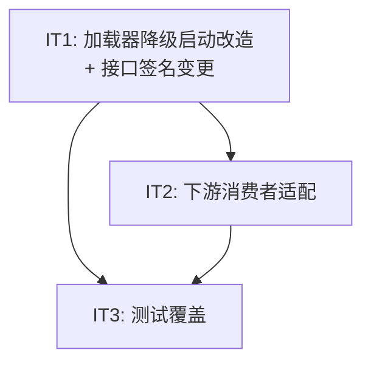

# API 通知系统 — 迭代计划 v3

> 版本: v0.2
> 日期: 2026-06-04
> 基于: HLD v0.2 (§4.4 加载容错), DD v0.2 (§9.4 配置加载与启动流程, B.3 评审记录)
> 前置条件: v2 计划中的 IT3 (配置目录分层) 已完成

## 背景：为什么需要 v3

HLD §4.4 和 DD §9.4 明确规定了**配置加载的降级启动策略**：

- 单个路由文件加载失败 → 仅该事件类型的路由规则不可用
- 单个 Schema 文件加载失败 → 仅该事件类型的 Schema 不可用
- 单个供应商配置加载失败 → 仅该 vendor 不可用
- 单个投递契约加载失败 → 仅该 vendor+event 契约不可用
- **仅**全局性错误（`vendors/` 或 `events/` 目录均缺失）应阻止启动

### 当前代码状态

| 项目 | 状态 |
|------|------|
| `loader.go` 的 `Load()` | ❌ 任何文件加载失败立即 `return err`，完全中止 |
| 错误收集 | ❌ 无错误收集机制，加载失败后无法运行时可查 |
| 接口签名 | ❌ `(*T, bool)` 无法区分"从未配置"和"加载失败" |
| 结构日志 / 指标 | ❌ loader 中无日志或指标打点 |
| 跨配置校验 | ❌ 缺少（模板字段是否在 schema 中有声明等） |
| main.go 启动 | ❌ `Load()` 报错直接 `log.Fatalf` |
| Worker 处理缺失配置 | ⚠️ 仅 `Nack(false,false)` 丢弃消息，不更新 DB 状态 |

### 影响

当前行为违反 HLD §1.1 的**故障隔离原则**——一个业务方或供应商的配置文件错误，将导致整个系统拒绝启动，所有消息链路全部中断。

### 与 v2 计划的关系

v2 IT3 已完成了配置目录分层加载和 Schema 从本地文件加载。v3 在此基础上进一步对齐 HLD/DD 的降级启动策略。

---

## 接口变更：`(*T, bool)` → `(*T, error)`

### 为什么改

在降级启动场景下，`GetVendorConfig("crm_system")` 返回 `false` 可能有两个原因：

| 原因 | 发生场景 | 运维响应 |
|------|---------|---------|
| **从未配置** | `vendors/crm_system/` 目录不存在 | 可能是预期行为（路由规则指向了不存在的 vendor），WARN 即可 |
| **加载失败** | `vendor.yaml` 存在但 YAML 解析出错 | 需要立即修复，每次投递都应持续 ERROR 报出根因 |

`bool` 将两者混为一谈，Worker 无法区分，导致"加载失败"的错误信息只在启动时打印一次，随后被海量日志淹没。运维人员排查一个持续 DEAD_LETTER 的 vendor 时，看到的是"vendor config not found"——无法追溯 6 小时前加载阶段的 YAML 解析错误。

### 新的接口签名

```go
package port

var ErrNotConfigured = errors.New("config not configured")

type ConfigProvider interface {
    GetVendorConfig(vendorID string) (*VendorConfig, error)
    GetDeliverySpec(vendorID, eventType string) (*DeliverySpec, error)
    GetRoutingRules(eventType string) ([]RoutingRule, error)
    GetEventSchema(eventType string) (map[string]any, error)
}
```

- 查找成功 → `(config, nil)`
- 从未配置 → `(nil, ErrNotConfigured)`
- 加载失败 → `(nil, fmt.Errorf("config load failed: %w", rootCause))`，rootCause 是加载阶段记录到 `LoadedValue.Error` 中的原始错误

### Loader 内部的错误保存机制：`LoadedValue[T]`

将 error 和 value 绑定在一起，而不是分开维护两个 map：

```go
package config

// LoadedValue 包装一个配置项的值和加载时的错误。
// 通过一个 struct 回答"这个配置项有没有加载成功"——不需要查第二个 map。
type LoadedValue[T any] struct {
    Value T
    Error error
}
```

```go
type Loader struct {
    mu    sync.RWMutex
    paths []string

    // 所有 map 的值都改为 LoadedValue，value 和 error 绑定在一起
    routingRules      map[string]*LoadedValue[[]*port.RoutingRule] // key: eventType
    vendorConfigs     map[string]*LoadedValue[*port.VendorConfig]
    deliveryContracts map[string]*LoadedValue[*deliveryContractFile] // key: "vendorID/eventType"
    eventSchemas      map[string]*LoadedValue[map[string]any]        // key: eventType
}
```

`recordError` 在加载时直接输出结构化日志，不保存错误信息集合：

```go
func (l *Loader) recordError(typ, scope, file string, err error) {
    l.mu.Lock()
    // 写入 LoadedValue.Error，供运行时 Get* 调用携带根因
    switch typ {
    case "vendor":
        l.vendorConfigs[scope] = &LoadedValue[*port.VendorConfig]{Error: err}
    case "schema":
        l.eventSchemas[scope] = &LoadedValue[map[string]any]{Error: err}
    // ...
    }
    l.mu.Unlock()
    // 直接输出结构化日志，不需要事后收集
    log.Error().Str("module", "config.loader").Str("event", "load_"+typ+"_error").
        Str("file", file).Str("scope", scope).Err(err).
        Msg("config load failure")
}
```

`GetVendorConfig` 的实现逻辑——统一的三段式查询：

```go
func (l *Loader) GetVendorConfig(vendorID string) (*port.VendorConfig, error) {
    l.mu.RLock()
    defer l.mu.RUnlock()

    lv, ok := l.vendorConfigs[vendorID]
    if !ok {
        return nil, port.ErrNotConfigured        // 从未配置（目录/文件不存在）
    }
    return lv.Value, lv.Error                     // 加载成功或加载失败——Error 贯穿始终
}
```

无论成功还是失败，`vendorConfigs[vendorID]` 都存在一个条目。查询的三种结果：
- `key 不存在` → `ErrNotConfigured`
- `key 存在且 Error == nil` → 返回 value
- `key 存在且 Error != nil` → 返回加载时的原始错误，每次调用都带出来`

---

## 迭代计划

### Iteration 1: 加载器降级启动改造 + 接口签名变更

**目标**：将 Loader 改为可降级运行，ConfigProvider 接口签名从 `(*T, bool)` 改为 `(*T, error)`。

| 改动项 | 文件 | 说明 |
|--------|------|------|
| 1.1 定义 `ErrNotConfigured` sentinel error | `internal/port/config.go` | 新增 `var ErrNotConfigured = errors.New("config not configured")` |
| 1.2 `ConfigProvider` 接口 4 个方法签名改为 `(*T, error)` | `internal/port/config.go` | `GetVendorConfig`, `GetDeliverySpec`, `GetRoutingRules`, `GetEventSchema` |
| 1.3 定义泛型类型 `LoadedValue[T]` | `internal/config/loader.go` | `Value T; Error error`，将值和错误绑定在一起 |
| 1.4 Loader 各 map 的 value 类型改为 `*LoadedValue[T]` | `internal/config/loader.go` | `vendorConfigs`, `deliveryContracts`, `eventSchemas` 三个 map；`routingRules` 从 `[]RoutingRule` 改为 `map[string]*LoadedValue[[]*RoutingRule]`（key: eventType） |
| 1.5 `recordError` 辅助方法 + 所有内部加载方法使用 | `internal/config/loader.go` | 加载失败时调 `recordError`（写 `LoadedValue.Error` + 结构化日志），不 `return err`，continue 加载下一项 |
| 1.6 路由文件加载改为扫描 `routes/*.yaml` | `internal/config/loader.go` | 加载路径从 `events/{biz}/route.yaml` 改为 `events/{biz}/routes/*.yaml`，每文件对应一个 event type |
| 1.7 重写 `Get*` 方法 | `internal/config/loader.go` | 返回 `(*T, error)`：`map[key]` 不存在 → `ErrNotConfigured`；存在则返回 `Value, Error` |
| 1.8 添加跨配置校验步骤 | `internal/config/loader.go` | 独立阶段：模板字段引用在 schema 中有声明、路由中的 vendor 存在。仅记录，不阻塞 |
| 1.9 添加结构化日志 | `internal/config/loader.go` | 按 DD §9.4 规范：`module=config.loader`, `event=load_route_error` 等字段 |
| 1.10 添加指标打点 | `internal/config/loader.go` | `config.load.failure` counter |
| 1.11 Schema 加载改为直接存 `map[string]any` | `internal/config/loader.go` | 去掉 `json.Marshal` 步骤，`eventSchemas` 直接存 YAML 解析后的结构，`GetEventSchema` 返回 `map[string]any` |
| 1.12 更新所有 mock/stub 实现 | `internal/*/` | 任何实现了 ConfigProvider 的 mock 需同步更新方法签名 |

**验证**：

```bash
go test ./internal/config/... -v       # 加载器测试全绿
go vet ./...
```

---

### Iteration 2: 下游消费者适配降级行为

**目标**：Worker、Ingestion 适配新的 `(*T, error)` 签名，补齐 Worker 缺失配置时更新 DB DEAD_LETTER 的缺陷，main.go 支持降级启动。

| 改动项 | 文件 | 说明 |
|--------|------|------|
| 2.1 Worker: VendorConfig 缺失 → DEAD_LETTER | `internal/delivery/worker.go` | `GetVendorConfig` 返回 `err != nil` → ERROR 日志（带错误根因）+ 更新 DB DEAD_LETTER + ACK，不区分错误类型 |
| 2.2 Worker: DeliverySpec 缺失 → DEAD_LETTER | `internal/delivery/worker.go` | 同 2.1，统一处理 `err != nil` |
| 2.3 Ingestion: 适配新签名 | `internal/ingestion/service.go` | `GetEventSchema` 的 `!ok` → `err != nil`，统一返回 `ErrEventNotFound`（含根因），不区分错误类型 |
| 2.4 Router: 适配新签名 | `internal/routing/dispatcher.go` | `GetRoutingRules` 改为 `(*T, error)` 适配 |
| 2.5 main.go: 降级启动 | `cmd/notification-server/main.go` | `Load()` 返回 nil 后直接启动（具体错误已在加载时逐条记录），不 `Fatalf` |
| 2.6 E2E suite: 适配新签名 | `test/e2e/suite.go` | 任何使用 ConfigProvider 的 suite 代码需适配 `(*T, error)` |
| 2.7 Schema 校验缓存 | `internal/ingestion/validator.go` | `schemaValidator` 增加 `map[string]*schemaNode` cache，`GetEventSchema` 返回的 `map[string]any` 在首次使用时解析为 `schemaNode` 并缓存，后续复用；去掉每次校验的 `json.Unmarshal` |

**Worker 改动示意**：

```go
// 目标代码：不区分错误类型，统一处理
vendorCfg, err := p.deps.Config.GetVendorConfig(task.VendorID)
if err != nil {
    log.Error().Err(err).Str("vendor", task.VendorID).
        Msg("vendor config unavailable, task to DEAD_LETTER")
    p.deps.DB.UpdateDeliveryTaskStatus(ctx, taskID, "DEAD_LETTER")
    msg.Ack(false)
    return nil
}
```

**验证**：

```bash
go test ./internal/config/... -v       # 保证 Iteration 1 仍绿
go test ./internal/delivery/... -v     # Worker 测试通过
go test ./internal/routing/... -v      # Router 测试通过
go test ./internal/ingestion/... -v    # Ingestion 测试通过
go build .
go vet ./...
```

---

### Iteration 3: 测试覆盖

**目标**：补充降级启动的测试覆盖，更新现有测试适配新接口。

| 改动项 | 文件 | 说明 |
|--------|------|------|
| 3.1 更新所有现有 loader_test.go 测试 | `internal/config/loader_test.go` | `!ok` → `err != nil`/`errors.Is`；`Setup` 在配置正确时不验证 `err == nil` |
| 3.2 添加部分失败场景测试 | `internal/config/loader_test.go` | 含无效 YAML vendor 的 testdata，验证 Load 返回 nil，该 vendor 的 `GetVendorConfig` 返回加载错误（`errors.Is(ErrNotConfigured) == false`） |
| 3.3 添加路由文件加载失败场景测试 | `internal/config/loader_test.go` | 无效 routes/*.yaml → 该事件类型路由不可用，其他正常 |
| 3.4 添加跨配置校验测试 | `internal/config/loader_test.go` | 路由引用不存在 vendor → validation error 记录，不影响启动 |
| 3.5 更新 E2E TC4.1 | `test/e2e/config_test.go` | 改为验证**降级启动**：Load() 返回 nil，指定 vendor 的 `GetVendorConfig` 返回加载错误 |
| 3.6 添加 E2E 降级启动集成测试 | `test/e2e/config_test.go` | 启动 server 时有 vendor 配置错误 → server 正常启动，该 vendor 投递 DEAD_LETTER，其他 vendor 正常送达 |
| 3.7 更新 mapping_content_test.go | `test/e2e/mapping_content_test.go` | 若它使用了 ConfigProvider 的旧签名 |

**验证**：

```bash
go test ./internal/config/... -v
go test ./test/e2e/... -v -run TestConfig
go vet ./...
```

---

## 依赖关系



- **IT1** 是基础——接口签名变更影响所有消费者
- **IT2** 下游适配依赖 IT1 的新签名和类型定义
- **IT3** E2E 降级测试需 IT2 的 main.go 和 Worker 改动

## 文件变更清单

| 文件 | 变更类型 | 预计新增/修改 |
|------|---------|-------------|
| `internal/port/config.go` | 修改 | 4 个方法签名改为 `(*T, error)` + `ErrNotConfigured` sentinel，约 +10 行 |
| `internal/config/loader.go` | 大改 | +160 行 / -40 行（LoadedValue + 降级加载 + 校验） |
| `cmd/notification-server/main.go` | 修改 | +15 行（降级启动处理 + `(*T, error)` 适配） |
| `internal/delivery/worker.go` | 修改 | +25 行（DEAD_LETTER + 精确区分错误类型） |
| `internal/ingestion/service.go` | 修改 | +5 行（适配 `map[string]any` 签名） |
| `internal/ingestion/validator.go` | 修改 | +20 行（schema cache，消除每次校验的 `json.Unmarshal`） |
| `internal/routing/dispatcher.go` | 修改 | +5 行（适配新签名） |
| `internal/config/loader_test.go` | 修改 | +100 行（3 个新测试 + 现有测试适配） |
| `test/e2e/config_test.go` | 修改 | +70 行（E2E 降级测试） |
| `test/e2e/suite.go` | 修改 | +5 行（ConfigProvider 使用处适配） |
| `CLAUDE.md` | 修改 | 更新 config 目录结构说明 |
| 各类 testdata `route.yaml` | 修改 | `events/{biz}/route.yaml` → `events/{biz}/routes/{event}.yaml` 结构调整 |

## 路由文件格式变更

路由文件从每个 biz 共享一个 `route.yaml` 改为每个 event 独立文件：

```yaml
# 旧格式：events/order/route.yaml
biz: "order"
rules:
  - event_type: "order.paid"
    vendor_id: "crm_system"
  - event_type: "order.paid"
    vendor_id: "ad_platform"
```

```yaml
# 新格式：events/order/routes/order.paid.yaml
event_type: "order.paid"   # 自声明，与文件名双重确认
routes:
  - vendor_id: "crm_system"
  - vendor_id: "ad_platform"
```

## 降级行为矩阵（运行时）

| 加载失败类型 | Ingestion | Router | Worker |
|-------------|-----------|--------|--------|
| 路由文件加载失败 | 不影响 | 该事件类型路由为空 → notification 终态 FAILED | 不影响 |
| Schema 加载失败 | 返回 400（schema 不可用，含根因） | 该事件类型无路由 | 不影响 |
| Vendor 配置加载失败 | 不影响 | 路由仍可能匹配到该 vendor | `GetVendorConfig` 返回 `error`（含根因）→ task DEAD_LETTER |
| 投递契约加载失败 | 不影响 | 不影响 | `GetDeliverySpec` 返回 `error`（含根因）→ task DEAD_LETTER |
| 跨配置校验失败 | 不影响 | 不影响 | 不影响 |

## 评审记录

### 为什么 Worker 的 Nack 行为需要改？

当前代码中 `GetVendorConfig` 返回 false 时 Worker 只 `Nack(false,false)` 丢弃消息但不更新 DB。在"启动即全有全无"的模式下永远不会遇到缺失的 vendor——系统要么启动成功要么失败。但降级启动后 Worker 会实际遇到缺失配置，如果只 Nack 不更新 DB，delivery_task 永远停留在 DELIVERING，成为"僵尸"记录。

### 为什么不把 `(*T, bool)` → `(*T, error)` 放在单独的迭代？

接口签名变更影响所有消费者（4 个组件 + mock 实现），分散到多个迭代会导致中间状态编译不过。IT1 一次性完成接口定义和 Loader 实现，IT2 一次性完成所有消费者适配，每个 iteration 都编译通过、测试可运行。

### 加载错误信息为什么需要跨场景复用而不在每个场景单独生成？

一个 YAML 解析错误的 error value 在 Load 时已经产生了——它是 `yaml.Unmarshal` 返回的 error。`recordError` 把这个 error 保存到 `LoadedValue.Error`，之后每次 `Get*` 调用把这个 error 包装后返回。这样：
- 错误信息**只产生一次**（解析引擎的原始错误，信息最精确）
- 每次运行时使用都**携带同一根因**
- 避免了 Worker 自己重新解析 `LoadedValue.Error` 再生成错误消息——消息来源一致，排查时不会出现"同一个 vendor 的两个错误消息对不上"的问题

### 为什么不需要 `IsDegraded()` 标记？

`recordError` 在加载失败时已逐条输出结构化日志，`main.go` 无需额外检查降级状态。系统是否降级应由监控系统通过告警规则来感知，而非在代码中保留一个无消费者的状态位。
