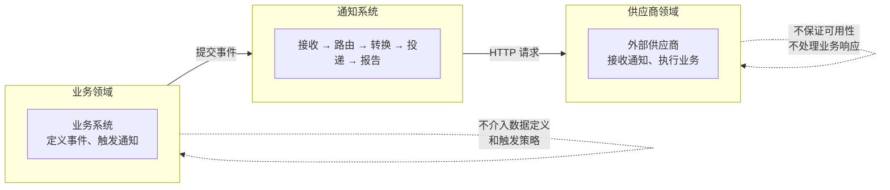
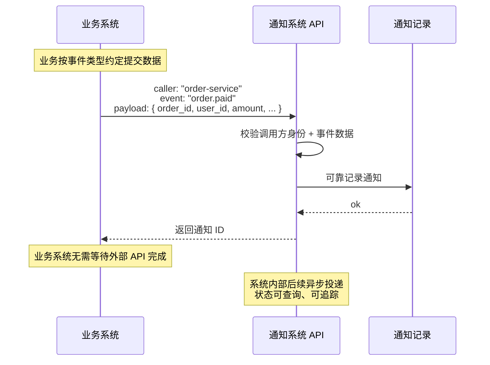
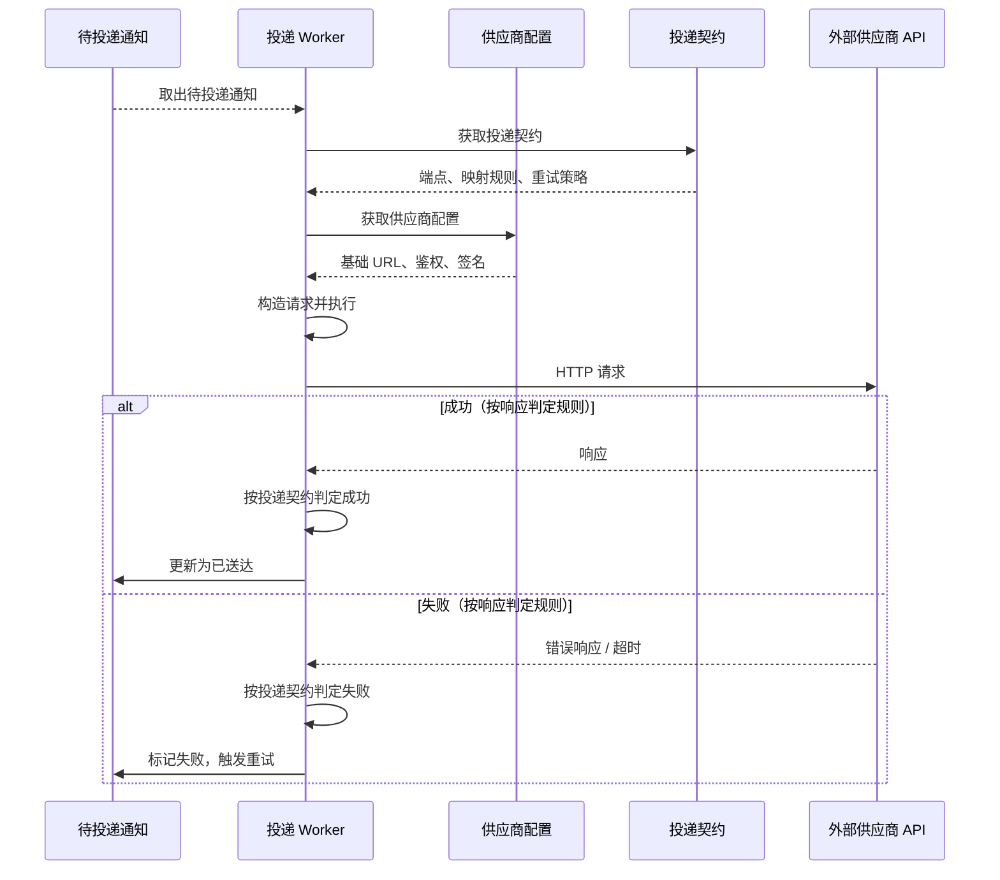
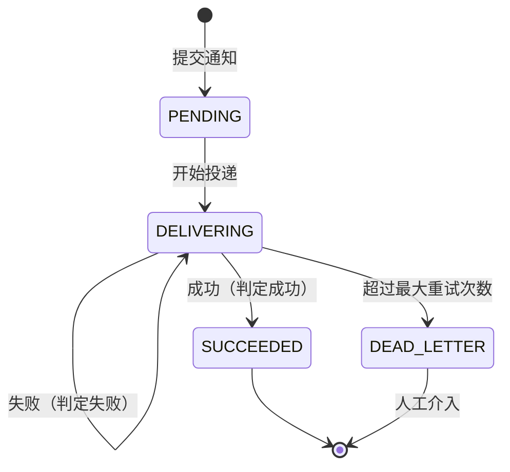
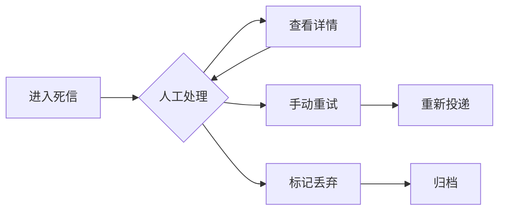
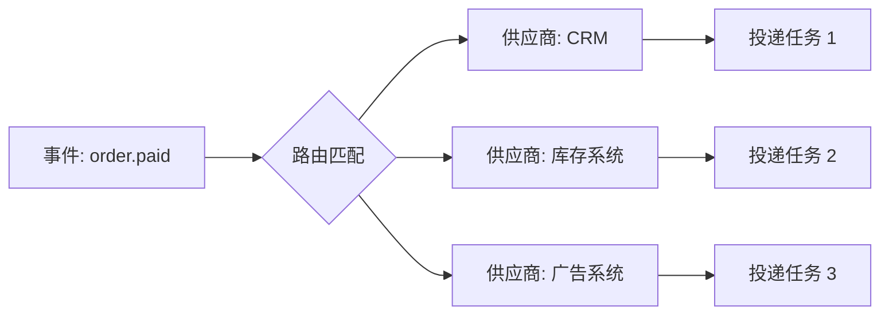
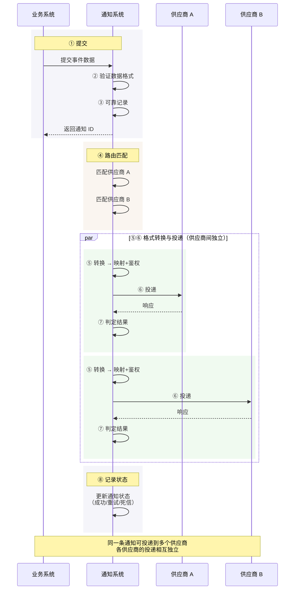
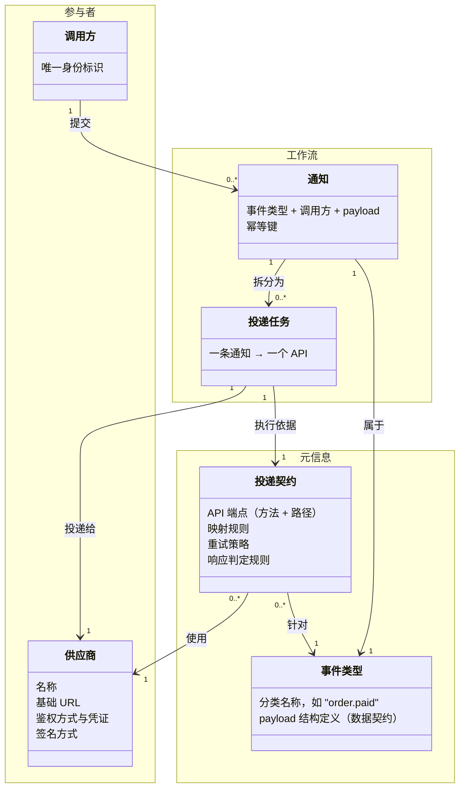

# API 通知系统 — 需求分析

> 版本: v0.3  
> 日期: 2026-05-25  
> 状态: 草稿

### Review记录

| 轮次 | Review要点 | 修改概要 |
|------|-----------|----------|
| R2 | 业务方 MVP 核心关注点——看效果 | UC-07 补充 MVP 范围和聚合统计需求 |
| R2 | 可观测性 MVP 定界——结构化日志+统计打点保底，有基础设施上 Prometheus | §8.5 补充 MVP 列，区分保底/后续需求 |
| R2 | 数据归档需求——通知数据后续入数仓 | 新增 §8.9 数据归档 |
| R2 | 三类参与者角色定义——业务方/Schema、供应商维护者/映射、系统维护者/审批 | 新增附录 B 角色定义（未来方向） |
| R1 | "即抛即忘"的含义澄清——不是不追踪送达状态 | 概述中明确"忘的是等待，不是状态"，UC-01 补充说明 |
| R1 | Body template 是方案不是需求 | 去掉方案表述，改为供应商 API 示例 + 渲染复杂度 L1-L4 分析 |
| R1 | 去除技术方案论述（线程池、连接池等） | 替换为业务概念表达（供应商间隔离、故障保护等） |
| R1 | 消息量超过供应商 Quota 怎么办 | 新增 §8.4 节：配额感知、超额保护、超限处理策略 |
| R1 | 核心指标应有各供应商 Quota/使用量 | 新增配额指标（总量、已用、剩余、趋势） |
| R1 | 调研供应商鉴权方式，特别是用户绑定鉴权 | 新增第 6 节：6 种鉴权方式 + 动态凭证场景分析 |
| R1 | 通知消息到 API 请求的数据映射关系不清晰 | 新增第 3 节：事件类型作为数据契约锚点、映射语义、角色分工 |
| R1 | 同一事件类型可能来自多个调用方，需要治理 | UC-01 增加 caller 身份；§8.4 增加调用方管理；§8.5 增加调用方指标和交叉分析 |

---

## 目录

- [1. 概述](#1-概述)
  - [1.0 为什么需要这个系统](#10-为什么需要这个系统五问分析)
  - [1.1 利益相关者与参与者](#11-利益相关者与参与者)
  - [1.2 约束与假设](#12-约束与假设)
  - [1.3 系统边界](#13-系统边界)
  - [1.4 术语解释](#14-术语解释)
- [2. 用例](#2-用例)
  - [2.0 用户故事](#20-用户故事)
  - [UC-01 提交通知](#uc-01-提交通知)
  - [UC-02 投递通知](#uc-02-投递通知)
  - [UC-03 失败自动重试](#uc-03-失败自动重试)
  - [UC-04 死信管理](#uc-04-死信管理)
  - [UC-05 供应商管理](#uc-05-供应商管理)
  - [UC-06 通知查询与监控](#uc-06-通知查询与监控)
  - [UC-07 事件类型路由](#uc-07-事件类型路由)
  - [2.1 端到端业务流程](#21-端到端业务流程)
- [3. 领域能力分析](#3-领域能力分析)
  - [3.1 领域概念模型](#31-领域概念模型)
  - [3.2 数据契约的维护](#32-数据契约的维护)
  - [3.3 投递契约的组织方式](#33-投递契约的组织方式)
  - [3.4 映射规则需要表达的语义](#34-映射规则需要表达的语义)
  - [3.5 响应成功判定需求](#35-响应成功判定需求)
  - [3.6 请求构造的复杂度层级](#36-请求构造的复杂度层级)
  - [3.7 鉴权方式](#37-鉴权方式)
  - [3.8 签名需求](#38-签名需求)
- [4. 变化点分析](#4-变化点分析)
  - [4.1 不易变的部分 (Stable)](#41-不易变的部分-stable)
  - [4.2 容易变的部分 (Volatile)](#42-容易变的部分-volatile)
- [5. 非功能性需求](#5-非功能性需求)
  - [5.1 可靠性与送达保证](#51-可靠性与送达保证)
  - [5.2 故障隔离与稳定](#52-故障隔离与稳定)
  - [5.3 性能](#53-性能)
  - [5.4 调用方管理与供应商 Quota 管理](#54-调用方管理与供应商-quota-管理)
  - [5.5 可观测性](#55-可观测性)
  - [5.6 安全性](#56-安全性)
  - [5.7 可维护性](#57-可维护性)
  - [5.8 可测试性](#58-可测试性)
  - [5.9 数据归档](#59-数据归档)
- [6. MVP 范围](#6-mvp-范围)
- [附录 A — R1 Review详情](#附录-a--r1-review详情)
  - [A.1 "即抛即忘"的澄清](#a1-即抛即忘的澄清)
  - [A.2 Body template 不是需求](#a2-body-template-不是需求)
  - [A.3 去除技术方案细节](#a3-去除技术方案细节)
  - [A.4 供应商 Quota 超限问题](#a4-供应商-quota-超限问题)
  - [A.5 核心指标补充](#a5-核心指标补充)
  - [A.6 供应商鉴权方式调研](#a6-供应商鉴权方式调研)
  - [A.7 通知消息与 API 请求的数据映射](#a7-通知消息与-api-请求的数据映射)
  - [A.8 多调用方场景](#a8-多调用方场景)
- [附录 B — 参与者角色（未来方向）](#附录-b--参与者角色未来方向)
  - [B.1 角色定义](#b1-角色定义)
  - [B.2 映射规则的归属](#b2-映射规则的归属)
  - [B.3 隔离原则](#b3-隔离原则)
- [附录 C — 供应商调研详情](#附录-c--供应商调研详情)
  - [C.1 请求格式与响应判定](#c1-请求格式与响应判定)
    - [C.1.1 请求格式的差异维度](#c11-请求格式的差异维度)
    - [C.1.2 供应商 API 示例](#c12-供应商-api-示例)
    - [C.1.3 响应状态码](#c13-响应状态码)
    - [C.1.4 "200 但实际失败"——各供应商案例](#c14-200-但实际失败各供应商案例)
  - [C.2 签名机制](#c2-签名机制)
    - [C.2.1 签名算法类型](#c21-签名算法类型)
    - [C.2.2 签名的通用构造模式](#c22-签名的通用构造模式)
    - [C.2.3 规范化 Header](#c23-规范化-header)
    - [C.2.4 Query 参数的规范化处理](#c24-query-参数的规范化处理)
    - [C.2.5 签名结果的携带方式](#c25-签名结果的携带方式)
    - [C.2.6 代理网关环境下的签名处理](#c26-代理网关环境下的签名处理)
  - [C.3 鉴权方式](#c3-鉴权方式)
    - [C.3.1 常见鉴权方式](#c31-常见鉴权方式)

---

## 1. 概述

企业内部多个业务系统在关键事件发生时，需要调用外部系统供应商提供的 HTTP(S) API 进行通知。本系统旨在提供一个**通用的、可靠的异步通知管道**，将业务系统与外部供应商 API 解耦。

### 1.0 为什么需要这个系统——五问分析

**一问：业务系统在做什么？**

企业内部多个业务系统（订单、CRM、库存、广告等）在关键事件发生时，需要向外部系统供应商发起通知。这是业务运作的刚需——订单状态变更要通知仓库系统，用户注册要回传广告平台，客户升级要在 CRM 中同步。

**二问：为什么不能由业务系统直接调用供应商 API？**

外部供应商的 API 在请求格式（JSON / XML / SOAP）、鉴权方式（API Key / Bearer Token / HMAC 签名 / OAuth 2.0）、签名算法、成功判定规则上千差万别（详见第 3 节）。如果每个业务系统都直接对接供应商，那么每当新增一个供应商，所有需要通知它的业务系统都要重复实现这套接入逻辑；每当供应商升级 API，各业务系统又得同步修改。

**三问：直接集成的后果是什么？**

直接集成导致三个结构性问题：

1. **高耦合**：业务系统的核心逻辑与外部 API 细节纠缠在一起。业务代码中充斥着对特定供应商的鉴权逻辑、签名计算、格式转换，代码难以维护和测试。
2. **高成本**：N 个业务系统 × M 个供应商，可能的集成工作面是 N×M。每新增一个供应商，所有业务系统都需要重复对接，成本线性甚至超线性增长。
3. **高风险**：没有统一的失败处理机制——每条通知的成功依赖业务系统的局部实现。没有自动重试、没有熔断保护、没有死信管理，供应商临时故障直接导致业务主流程阻塞或数据丢失。

**四问：这些后果对业务意味着什么？**

- 业务系统团队无法专注于业务逻辑，反而要花大量精力维护外部 API 的集成细节
- 新增或切换一个供应商需要数周甚至数月的开发测试，极大限制了业务合作扩展的速度
- 供应商的 API 变更（升级、下架）会触发多处修改，变更风险扩散到多个系统
- 通知失败时排查困难——没有统一的日志和监控，难以定位是业务系统的问题、网络问题还是供应商的问题
- 当供应商数量增长到 3-5 个以上时，这些成本叠加形成显著的运营瓶颈

**五问：所以这个系统的核心价值是什么？**

通知系统的本质是**在业务系统与外部供应商之间建立一个解耦层**。它将"发生了什么事件"与"如何通知供应商"分离开来：

- **业务系统**只需表达"发生了什么事"（携带事件类型和结构化数据），无需关心"怎么通知谁"
- **通知系统**负责"谁来接、怎么接、接不上怎么办"——供应商的接入细节（端点、格式、鉴权、签名、重试策略）集中配置和管理
- 通知系统承诺**可靠送达**，包括格式转换、鉴权计算、失败重试、故障隔离、死信管理在内的一整套保障

这个解耦带来的商业价值是：

| 价值维度 | 没有通知系统 | 有通知系统 |
|----------|-------------|-----------|
| **集成成本** | 每个新供应商 × 每个业务系统 = N×M | 通知系统配置一次，所有业务系统受益 |
| **系统健壮性** | 依赖各业务系统的局部实现 | 统一的重试、熔断、死信机制保障 |
| **可观测性** | 日志分散在各系统，问题难定位 | 集中日志追踪和监控，定位效率大幅提升 |
| **业务响应速度** | 新增/切换供应商需要业务系统改代码（周~月级） | 仅需通知系统配置变更（天级） |
| **变更风险** | 供应商 API 变更波及多个业务系统 | 变更局限在通知系统内部 |

**结论**：没有这个系统，当供应商数量超过 3-5 个时，直接集成的维护成本和故障风险会呈指数级上升，最终成为制约业务系统扩展的瓶颈。本系统的核心使命就是**用一层架构的解耦，换取业务增长的可持续性**——让业务系统做业务系统的事，让通知成为一项可配置、可观测、可靠的基础设施能力。

### 1.1 系统定位

本系统的核心定位是：**一个将业务系统与外部供应商 API 解耦的、可靠的异步通知管道**。

这一核心定位包含三个不可分割的面向：

- **解耦**：业务系统只表达"发生了什么事"，不关心"通知谁、怎么通知"。新增或变更供应商不影响业务代码
- **异步**：业务系统提交通知后立即返回，无需等待外部 API 响应。系统在后台完成投递，不阻塞业务主流程
- **可靠**：通过持久化、重试、死信等机制保障通知最终送达。系统承诺"至少一次"投递语义，并为每个通知提供可追踪的生命周期状态

### 1.2 利益相关者与参与者

利益相关者是所有对系统有利益关切的角色，包括直接与系统交互的参与者（见下表中的参与者说明）和其他间接相关方。

| 利益相关者 | 角色说明 | 核心关切与痛点 |
|-----------|---------|---------------|
| **业务系统（调用方）** | 参与者。在关键事件发生时提交通知的内部系统，如订单系统、CRM 系统。也是事件类型和事件数据的定义者——它们决定"发生了什么事件"以及"事件携带什么数据" | <ul><li>关切：提交通知后不被阻塞，能确认最终送达；新增或切换供应商时不修改自身代码</li><li>痛点：每个供应商都要重复做一遍集成，供应商的 API 变更直接牵连自己的代码，业务逻辑被外部接口细节淹没</li></ul> |
| **运维/运营人员** | 参与者。负责通知系统日常运行的开发和运营人员，关注系统的配置管理、运行状态和异常处理 | <ul><li>关切：新增供应商的配置复杂度可控；死信能高效恢复</li><li>痛点：供应商接入分散在多个业务系统，没有统一管理入口；通知失败时排查链路长，日志碎片化</li></ul> |
| **外部供应商** | 参与者。通知的接收方，是提供 HTTP(S) API 的外部系统或服务，如广告平台、CRM SaaS、库存系统等 | <ul><li>关切：收到符合其 API 规范的请求</li><li>痛点：来自不同业务系统的请求格式不统一、鉴权不一致，接入方质量参差不齐</li></ul> |
| **业务方管理者** | 负责业务效果达成的管理人员 | <ul><li>关切：灵活调整供应商关系（新增/更换/停止）能快速落地，不因集成工作而延迟业务节奏；通知成功率达标；供应商合作正常</li><li>痛点：通知发出后无法确认是否送达，供应商出问题时最后一刻才知道，缺乏量化的效果评估手段</li></ul> |
| **公司管理层** | 决定资源投入的决策者 | <ul><li>关切：系统带来的集成效率提升和成本节约</li><li>痛点：集成成本不透明，供应商切换周期长，难以量化当前分散集成模式的真实损耗</li></ul> |
| **通知系统开发团队** | 设计、开发、维护通知系统的团队 | <ul><li>关切：系统架构的可维护性；新增供应商的扩展成本；服务质量的可观测性</li><li>痛点：点对点集成模式下代码重复、测试困难，每次供应商变更都可能是 emergency 修复</li></ul> |
| **审计/合规团队** | 负责数据合规和安全审计的团队 | <ul><li>关切：通知数据的审计追溯能力；操作变更的可追溯性</li><li>痛点：当前没有统一的操作审计记录，出问题时难以追溯"谁在什么时候改了什么"</li></ul> |


### 1.3 约束与假设

以下前提贯穿整个文档，是后续所有分析的基础。其中**约束**是固定的、不可协商的边界条件；**假设**是认为正确但可能变化的前提，构成设计决策的风险点。

#### 约束

- **通知是单向推送**：系统只负责将数据推送给供应商，不接收供应商的回调查询或反向通知。供应商的响应仅用于判断投递成败，不包含需要回传给业务系统的业务数据
- **通知系统与供应商 API 之间网络可达**：系统可以正常建立到供应商 API 的 HTTP 连接。网络不可达属于故障场景，由重试和死信机制处理
- **业务系统提交的数据已过业务校验**：通知系统只验证数据的格式（是否符合事件类型的数据契约），不验证数据的业务含义（如金额是否合理、库存是否足够）
- **通知系统不需要长期保存数据**：如有长期归档或审计需求，可以由数据仓库或审计等外部系统支持
- **HTTP 投递中重试无法避免**：投递可能因网络超时、供应商临时故障等临时性问题失败，系统需要重试。每次重试都可能产生重复请求到达供应商。这是 HTTP 协议投递的固有属性，系统无法保证"恰好一次"
- **部分投递失败无法通过自动重试恢复**：某些失败（如参数错误、鉴权过期、供应商 API 变更）即使多次重试也无法成功，需要人工介入判断和处理

#### 假设

| 假设 | 若不成立 |
|------|---------|
| **供应商 API 基于 HTTP(S) 协议**：本系统处理的是外部系统通过 HTTP(S) 暴露的 API，不涉及进程内通信、消息队列或非 HTTP 协议的系统对接 | 需为特定供应商开发非 HTTP 协议的接入适配器，重构投递引擎使其支持多协议 |
| **供应商的接入配置及 API 响应格式相对稳定**：供应商变更 API 的频率远低于业务系统提交通知的频率。API 的升级或变更通过配置管理处理，不需要通知系统实时自动发现 | 频繁的 API 变更将使配置维护工作急剧增加，迫使系统引入 API 版本管理和自动适配机制 |
| **供应商的 API 配额是已知的**：供应商对 API 的调用限制（每分钟 N 次、每天 M 次）是可以配置的，不要求系统自动探测配额上限 | 配额不可知时，限流保护和超额处理功能无法正常工作，系统可能因超额调用被封禁，需改用试错反馈的容错策略 |
| **供应商应自行处理幂等**：由于重复请求可能发生，供应商需要自行处理去重（如通过请求中的幂等键）。通知系统只保证至少送达一次 | 重复请求可能导致业务数据重复（如重复扣款、重复创建订单）。通知系统可在提交时通过幂等键拦截已知成功的重复提交，但无法根除因超时后重试导致的重复投递。业务系统需为此保留补偿手段（如对账、撤销） |

### 1.4 系统边界

从概述的分析出发，系统处在"业务系统"与"外部供应商"之间的解耦层位置，其职责边界可以明确界定。

#### ✅ 系统负责

| 职责 | 说明 |
|------|------|
| **接收通知** | 提供接入入口，接收业务系统提交的事件数据 |
| **路由分发** | 根据事件类型确定投递目标（一个或多个供应商） |
| **转换与投递** | 将内部事件数据转换为供应商要求的请求格式（含鉴权/签名），并调用供应商 API 发出请求 |
| **交付保障** | 通过持久化、自动重试、死信管理、供应商间故障隔离等机制，确保通知可靠送达 |
| **可观测性** | 每条通知的生命周期状态可查、可追踪 |
| **配置管理** | 供应商接入信息、映射规则、重试策略等集中管理，运行时生效 |

#### ❌ 系统不负责

| 非职责 | 说明 |
|--------|------|
| **定义事件数据格式** | 事件类型的 payload schema 由业务系统方定义，通知系统不替业务方设计数据结构 |
| **决定触发策略** | 系统不决定"哪些事件需要通知"——这是业务系统自己的策略。系统只处理已提交的事件 |
| **执行业务逻辑** | 系统不关心事件对业务的含义。收到 `order.paid`，系统不检查金额合理性、库存充足性，只负责投递 |
| **保证供应商可用性** | 供应商的 API 故障、变更不在系统控制范围内。系统负责探测、重试、告警，但不承诺"对方一定收到" |
| **处理供应商的业务响应** | 供应商返回的业务语义（如"用户不存在"），系统只记录为失败原因，不解析更不代处理 |
| **长期存储业务数据** | 通知送达后原始 payload 不长期保留（审计归档除外，见 §5.9）。系统不是业务数仓 |
| **主动发起通知** | 系统是被动的管道——等待业务系统提交，不自行扫描或触发通知 |

#### 一句话概括

**系统负责"收到事件后，可靠地把它变成供应商需要的格式并送达，然后报告结果"；不负责"事件该不该发、发了意味着什么、供应商收到后怎么办"。**



### 1.5 术语解释

| 术语 | 英文 | 解释 |
|------|------|------|
| **通知** | Notification | 业务系统提交的一条消息，表达了"某事件发生了"。包含事件类型、调用方身份和结构化数据 (payload) |
| **投递任务** | Delivery Task | 一条通知投递到某个特定供应商的过程实例。一条通知可对应多个投递任务（同一条通知投给多个供应商） |
| **事件类型** | Event Type | 业务事件的分类名称，如 `order.paid`、`user.registered`。它是数据契约、路由和映射规则的锚点 |
| **供应商** | Vendor | 接收通知的外部系统。每个供应商有独立的接入配置（端点、鉴权方式、重试策略等） |
| **调用方** | Caller | 提交通知的业务系统，如 `order-service`、`crm-sync`。每个调用方有唯一身份标识 |
| **数据契约** | Data Contract / Schema | 事件类型对应的 payload 结构定义，规定了业务系统提交通知时应传入哪些字段 |
| **映射规则** | Mapping Rule | 投递契约的属性之一，定义如何从事件 payload 的字段转换到供应商请求的指定位置——如 `payload.user_id → body.uid` |
| **路由** | Routing | 根据事件类型确定通知应投递到哪些供应商的决策逻辑 |
| **死信** | Dead Letter | 经过最大重试次数仍投递失败的通知，进入死信状态等待人工处理 |
| **重试策略** | Retry Policy | 投递失败后的重试规则，包含最大重试次数和重试间隔（如固定间隔、指数退避） |
| **供应商配额** | Vendor Quota | 供应商对 API 调用量的限制，如每分钟 N 次、每天 M 次 |
| **成功判定规则** | Success Determination Rule | 根据供应商的 HTTP 响应（状态码 + body 内容）判断一次投递是否成功的规则 |

---

---

## 2. 用例

### 2.0 用户故事

以下从各参与者的视角出发，用用户故事的形式描述系统需要提供的价值。每个故事都来自前面概述和利益相关者分析中识别出的真实诉求。

**业务系统（调用方）**

> **US-01** 作为一名业务系统开发者，我希望在关键事件发生时只提交事件数据和事件类型，而不必关心供应商 API 的地址、格式、鉴权和签名细节，这样我的代码不会与外部供应商耦合，可以专注于业务逻辑。

> **US-02** 作为一名业务系统开发者，我希望提交后立即返回而不等待外部 API 响应，这样我的主流程不被投递延迟所阻塞。

> **US-03** 作为一名业务系统开发者，我希望新增或更换一个供应商时不需要修改我的代码，这样集成变更的成本和风险都由通知系统处理。

> **US-04** 作为一名业务系统开发者，我希望提交通知后能确认系统已可靠接收，并在需要时能查询该通知的最终送达状态，这样我知道"它最终送到了没有"。

> **US-05** 作为一名业务系统开发者，我希望一个事件类型能自动投递到多个外部供应商，这样我只需提交一次，系统负责分发。

**运维/运营人员**

> **US-06** 作为一名运维人员，我希望通过配置就能接入一个新的供应商 API（包括端点、鉴权、签名、重试），而不用修改代码或重启服务，这样供应商的接入和变更是轻量的运维操作。

> **US-07** 作为一名运维人员，我希望为每个供应商独立配置重试策略和限流策略，这样我可以根据供应商的 SLA 来区别对待。

> **US-08** 作为一名运维人员，我希望为每个 (事件类型, 供应商) 组合配置独立的映射规则和响应判定规则，这样不同事件的数据可以按不同方式投递给同一供应商。

> **US-09** 作为一名运维人员，我希望某个供应商持续投递失败时系统能自动暂停投递，不拖累其他供应商，这样我可以在避免故障扩散的同时从容排查。

> **US-10** 作为一名运维人员，我希望能在系统中查看投递失败的死信，并支持手动重试或丢弃，这样出问题时我有恢复手段。

> **US-11** 作为一名运维人员，我希望能在投递失败时看到完整的请求和响应记录，这样我可以快速定位是参数错误、供应商故障还是网络问题。

> **US-12** 作为一名运维人员，我希望系统感知每个供应商的 API 配额上限，在接近上限时控制流量并发出告警，这样避免因超额调用导致被封禁。

**业务方管理者**

> **US-13** 作为一名业务方管理者，我希望新增、更换或停止一个供应商时能快速落地，这样供应商调整只需业务决策，不会被集成工作拖慢节奏。

> **US-14** 作为一名业务方管理者，我希望看到按供应商、按事件类型的投递成功率和趋势，这样我能评估系统运行效果，及时发现供应商合作的质量问题。

**通知系统开发团队**

> **US-15** 作为一名通知系统开发者，我希望能通过扩展点支持现有配置无法覆盖的请求构造场景（如异构格式转换、自定义签名算法），这样新的供应商接入需求不会因为系统能力的限制而被阻塞。

### UC-01 提交通知

| 项目 | 内容 |
|------|------|
| **场景** | 业务系统在关键事件发生时，向通知系统提交一条通知 |
| **解决的问题** | 业务系统不需要关注外部 API 的细节（地址、格式、鉴权），只需表达"发生了什么事"。同步返回，避免阻塞业务主流程 |
| **行为** | 业务系统调用通知系统的内部 API，**携带调用方身份标识**，按**事件类型对应的数据契约**传入结构化数据。系统验证后可靠记录通知内容，立即返回通知 ID |

> **说明**：同一个事件类型可能来自多个不同的业务系统（例如 "order.paid" 可能来自主站订单系统和第三方订单同步服务），因此调用方身份是提交的必要信息，用于追溯来源和责任划分。



---

### UC-02 投递通知

| 项目 | 内容 |
|------|------|
| **场景** | 系统取出待发送的通知，按供应商配置进行格式转换并调用外部 API |
| **解决的问题** | 将一条内部事件转换为特定供应商能理解的请求格式，并完成 HTTP 调用 |
| **行为** | 后台取出待投递通知，根据路由配置确定目标供应商，按供应商配置构造请求并发出。根据**供应商对应的响应判定规则**（状态码 + body 业务状态码）判断是否成功 |

#### 供应商 API 示例

为理解投递格式差异，以下是在实际调研中遇到的五种典型场景（详见[附录 C](#附录-c--供应商调研详情)）：

- **L1 — 固定模板**：请求结构固定，仅替换 payload 中的字段值。例如广告平台回传事件，所有 event 类型都用同一个请求骨架，只有 `user_id`、`timestamp` 这样的值不同，没有条件判断和结构变化
- **L2 — 条件构造**：多个事件类型路由到同一个供应商，但该供应商的请求中包含哪些字段取决于具体的事件类型或数据值。**这是映射层面的条件逻辑，不是路由层面的差异**。例如 "order.paid" 和 "user.registered" 都投递给同一个 CRM 系统，但 order.paid 携带 `{lifecyclestage: "customer", last_paid_date: ...}`，user.registered 携带 `{lifecyclestage: "lead", source: "website"}`——同一供应商的请求结构随事件类型变化。或者同一事件中金额超阈值时多带一个 `approval_required: true` 字段
- **L3 — 数据变换**：payload 的字段不能直接映射到供应商请求，需要重命名、嵌套、拆分或聚合。例如 payload 中有 `product_id`、`quantity`、`warehouse` 三个独立字段，但供应商要求 `{"items": [{"product_id": "...", "qty": 1, "location": "SH"}]}`——字段重命名（quantity→qty、warehouse→location）并包装到数组中
- **L4 — 异构格式**：供应商要求非 JSON 格式，如 XML 或 SOAP 请求，整个请求体需要用不同的序列化方式构造
- **L5 — 计算/签名**：发送时需要在请求中动态计算值（如 HMAC 签名、OAuth Token），这些值不能在配置时预计算，只能在实际发送时刻生成

**用例行为：**



---

### UC-03 失败自动重试

| 项目 | 内容 |
|------|------|
| **场景** | 投递失败时，系统按策略自动重试 |
| **解决的问题** | 外部 API 可能因网络抖动、限流、临时故障而失败，自动重试可大幅提高最终成功率 |
| **行为** | 根据投递契约配置的重试策略（如最大重试次数、重试间隔），在延迟后重新投递。达到最大重试次数后进入死信 |



---

### UC-04 死信管理

| 项目 | 内容 |
|------|------|
| **场景** | 多次重试依然失败的通知进入死信状态，等待人工处理 |
| **解决的问题** | 避免无效重试浪费资源，同时保留失败记录以便排查和恢复 |
| **行为** | 死信记录保存完整请求/响应/错误信息。运维人员可查看详情、手动重试或丢弃 |



---

### UC-05 供应商管理

| 项目 | 内容 |
|------|------|
| **场景** | 运营/开发人员配置或修改供应商信息及其关联的投递契约 |
| **解决的问题** | 新增或变更供应商、或新增事件类型与供应商之间的投递关系时，无需修改代码或重启服务 |
| **行为** | 管理供应商信息（基础 URL、鉴权、签名等），以及该供应商的投递契约（API 端点、映射规则、重试、响应判定等）。配置项见下方 |

**所需的配置分为两个维度：**

**供应商配置（公共信息，不随 API 变化）：**
- 基本信息：名称、描述、是否启用
- 基础 URL：供应商 API 的基础地址
- 鉴权方式：鉴权协议及凭证
- 签名方式：签名算法及密钥
- 限流策略：速率阈值、超额处理方式

**投递契约（每个 (事件类型 × 端点) 独立配置，详见第 3 节）：**
- 关联事件类型：该投递契约针对哪个事件类型
- 关联供应商：该投递契约使用哪个供应商
- API 端点：HTTP 方法 + 子路径
- 映射规则：如何从 payload 构造请求体
- 重试策略：最大重试次数、退避规则
- 响应判定规则：如何判断投递成功或失败

---

### UC-06 通知查询与监控

| 项目 | 内容 |
|------|------|
| **场景** | 运维/开发/业务方查看通知状态、追踪问题 |
| **解决的问题** | 在通知投递失败或延迟时，提供可见性以快速定位原因。业务方主要关注"通知是否送达""整体成功率如何"，是评估系统效果的核心途径 |
| **行为** | 查询通知列表及详情（当前状态、投递历史、错误原因），按时间、供应商、事件类型、状态等维度过滤和聚合统计 |
| **MVP 范围** | 支持按时间/供应商/事件类型/状态筛选和聚合统计，了解系统整体运行状况。查询入口不限（直接查 DB 即可）。详情的单条追踪在 MVP 中作为辅助能力 |
| **演进方向** | 通知数据后续落入数仓（Hive 等），支持长期审计和 BI 仪表盘，当前确保数据结构化存储即可 |

---

### UC-07 事件类型路由

| 项目 | 内容 |
|------|------|
| **场景** | 系统根据事件类型自动确定投递到哪个供应商 |
| **解决的问题** | 业务系统只需说明"发生了什么事"，由系统决定"通知谁"。同一事件可通知多个供应商 |
| **行为** | 通过事件类型→供应商的路由配置，将一条通知匹配到零个或多个供应商，每个匹配产生一条独立的投递任务 |



---

## 2.1 端到端业务流程

各用例并非孤立存在，它们共同组成一条完整的通知处理链路。以下是通知从提交到送达的完整业务流程：


各步骤间的职责归属：

| 步骤 | 归属 | 对应用例 |
|------|------|----------|
| ① 提交事件数据 | 业务系统主动发起 | UC-01 |
| ② 验证数据格式 | 通知系统处理 | UC-01 |
| ③ 可靠记录与返回 ID | 通知系统处理 | UC-01 |
| ④ 根据事件类型路由 | 通知系统内部决策 | UC-07 |
| ⑤ 格式转换（映射 + 鉴权/签名） | 通知系统处理 | UC-02 |
| ⑥ 投递 | 通知系统调用供应商 | UC-02 |
| ⑦ 判定结果与重试 | 通知系统处理 | UC-02 / UC-03 / UC-04 |
| ⑧ 提供可见性 | 通知系统提供 | UC-06 |

### 流程要点说明

- **异步解耦**：步骤 ①–③ 与 ④–⑧ 在时间上解耦。业务系统在步骤 ③ 即可返回，不等待后续投递完成。即使投递过程中通知系统宕机，重启后未完成的任务自动恢复投递。
- **投递独立**：每条投递任务独立执行。供应商 A 投递失败触发重试，不影响供应商 B 的投递。
- **状态可追踪**：整个过程中的每个状态变更都被记录，支持按通知 ID 追溯完整生命周期。
- **终点明确**：每条通知的终点只有三个——成功送达、进入死信等待人工处理、或被人工丢弃。

---
## 3. 领域能力分析

### 3.1 领域概念模型

在深入数据映射之前，先明确系统中涉及的几个核心业务实体及其关系：



其中的几个关键关系需要特别说明：

- **通知 → 投递任务**：一条通知可拆分为多个投递任务，每个任务独立执行
- **投递契约**：完整描述怎样将一个事件类型的数据投递给一个供应商的 API——包括 API 端点（方法+路径）、映射规则（如何从 payload 构造请求）、重试策略、响应判定规则等。它是事件类型和供应商之间的一份完整约定，连接了**事件类型**（提供 payload 结构定义，即数据契约）和**供应商**（提供基础 URL、鉴权方式、签名方式等接入信息）。一个事件类型可关联多份投递契约（投递到不同供应商或同一供应商的不同端点）

下面用一个具体实例来说明这个模型如何运作：

```
事件 "order.paid"
  ├── 事件类型 & 数据契约
  │     { order_id, user_id, amount, currency, product_list }
  │
  ├── 投递契约 A（→ CRM 的 /v3/contacts PATCH）
  │     ├── 端点：PATCH /v3/contacts
  │     ├── 映射规则：
  │     │     payload.user_id  → header Authorization
  │     │     payload.amount   → body.amount
  │     │     payload.currency → body.currency
  │     ├── 重试策略：最多 5 次，指数退避
  │     └── 响应判定：检查 body.success == true
  │
  ├── 投递契约 B（→ 库存系统的 /api/stock/change POST）
  │     ├── 端点：POST /api/stock/change
  │     ├── 映射规则：
  │     │     payload.product_list → body.items
  │     │     payload.order_id     → body.order_sn
  │     ├── 重试策略：最多 10 次，进死信
  │     └── 响应判定：2xx 即成功
  │
  └── 投递契约 C（→ 广告平台的 /tracking POST）
        ├── 端点：POST /tracking
        ├── 映射规则：
        │     payload.user_id  → query string uid
        │     payload.amount   → query string revenue
        ├── 重试策略：最多 3 次，直接丢弃
        └── 响应判定：检查 body.events_received > 0

三个投递契约共用同一份供应商配置：
  → CRM SaaS:       base URL = https://crm.company.com (投递契约 A)
  → 库存系统:        base URL = https://inventory.fulu.com (投递契约 B)
  → 广告平台:        base URL = https://adplatform.com    (投递契约 C)
```

这个例子展示了几个关键点：

- **事件类型作为枢纽**：`order.paid` 定义了数据契约，所有投递契约都基于同一份 payload 结构来定义映射规则
- **投递契约是 (事件类型 × 供应商) 的约定**：每个投递契约独立描述"发给谁、怎么发、发什么"，互不干扰
- **供应商配置是共用的**：同一供应商的基础 URL、鉴权凭证不随事件类型变化，多个投递契约共享同一份供应商配置
- **业务系统只需提交通知**：业务系统提交 `order.paid` 事件时携带 payload，通知系统根据事件类型找到所有投递契约，自动执行转换和投递

### 3.2 数据契约的维护

| 角色 | 职责 |
|------|------|
| **业务系统方** | 定义事件类型、该事件的 payload 数据契约（有什么字段、类型、含义） |
| **通知系统维护方** | 提供数据契约的注册和管理能力，确保提交校验可行 |
| **集成实施方** | 为每个 (事件类型, 供应商) 组合定义投递契约，使用事件契约中声明的字段进行映射配置 |

**关于多调用方的说明**：同一个事件类型可能被多个业务系统调用（例如 "order.paid" 被主站订单系统和第三方平台订单同步服务共同使用）。此时：
- 所有调用方必须遵循**同一个事件类型的数据契约**——事件类型是全局定义的，每个调用方按同一 schema 提交通知
- 但调用方身份是独立的，系统要为每个调用方维护独立的身份标识和权限

每当新增事件类型，或变更事件的数据契约时：
- 业务系统方的开发人员**注册/更新事件类型定义**（名称、描述、payload schema）
- 所有引用该事件类型的投递契约被**标记为可能需要更新**（映射规则需重新审核）
- 新增供应商时，集成方为相关事件类型**补增投递契约**，不修改业务系统

### 3.3 投递契约的组织方式

从维护角度，投递契约可能有三种组织方式，各有侧重：

| 方式 | 说明 | 适用场景 |
|------|------|----------|
| **按供应商聚合** | 每个供应商一套投递契约，包含该供应商接收的所有事件类型的配置 | 供应商数量少且稳定，但每新增事件需修改多处 |
| **按事件类型聚合** | 每个事件类型一套投递契约，包含该事件要投递的所有供应商的配置 | 新增事件类型时集中管理，但新增供应商需修改多处 |
| **按 (事件, 供应商) 独立** | 每个 (事件类型, 供应商) 组合一条独立投递契约 | 完全解耦，新增事件或供应商互不影响，但配置数量增长快 |

三种方式的核心差异在于**投递契约的维度**——是按事件组织、按供应商组织、还是按笛卡尔积独立组织。这直接影响到管理界面的布局和配置的 CRUD 方式。

### 3.4 映射规则需要表达的语义

从实际场景看，映射规则至少需要支持以下语义：

| 语义 | 说明 | 示例 |
|------|------|------|
| **直接映射** | 将 payload 的一个字段直接放入目标请求的指定位置 | `payload.user_id → body.user_id` |
| **静态值** | 放入固定值 | `body.event_type = "register"` |
| **字段重命名** | 字段名不同，复制值 | `payload.currency → body.currency_code` |
| **字段拼接** | 多个字段合并为一个 | `payload.first_name + payload.last_name → body.name` |
| **条件映射** | 根据某些条件决定是否包含某个字段，或取不同的值 | 若 `amount > 0` 放入 `body.status = "paid"`，否则放入 `body.status = "pending"` |
| **数据结构重组** | 字段位置调整、嵌套、扁平化 | `payload.items[] → body.line_items[]`，结构有调整 |
| **动态值计算** | 值需要经过计算或变换 | 时间戳格式转换、金额单位换算、参与签名计算 |

### 3.5 响应成功判定需求

系统**不能仅靠 HTTP 状态码判断通知是否送达成功**，不同供应商的响应行为差异很大（详细案例见[附录 C](#附录-c--供应商调研详情)）。系统需要满足：

- **按供应商配置成功判定规则**：部分供应商仅看 2xx 状态码即可；部分需要检查 body 中特定字段的值（如 `events_received > 0`、`success: true`）；部分需要检查 body 不为空也不为错误信息
- **按供应商配置失败与重试判定**：4xx 错误中仅 429（限流）应重试，其余 4xx 重试无意义；200 + 业务错误是否重试取决于具体场景（参数错误不重试，系统繁忙可重试）；部分供应商在 200 body 中附带错误码，需按错误码判断是否应重试
- **规则可配置**：成功判定逻辑本身也是一组可配置的规则，与请求构造的映射逻辑类似，需要支持根据不同供应商定制

### 3.6 请求构造的复杂度层级

从调研来看，系统需要支持的请求构造能力可分为五个层级，分属两种策略：

**基础支持（必须内置）：**

| 层级 | 系统能力 | 典型场景 |
|------|---------|----------|
| **L1 — 字段替换** | 请求结构固定，系统只需从 payload 中提取字段值填入指定位置 | 广告平台回传事件：所有事件共用同一请求骨架，区别仅在于 `user_id`、`timestamp` 等字段值 |
| **L2 — 条件字段** | 同一供应商的请求中包含哪些字段，取决于事件类型或数据值。系统需要根据条件决定字段是否出现 | 多个事件类型投递给同一个 CRM：`order.paid` 携带 `lifecyclestage: "customer"`，`user.registered` 携带 `lifecyclestage: "lead"` |

**扩展支持（通过扩展点实现）：**

| 层级 | 系统能力 | 典型场景 |
|------|---------|----------|
| **L3 — 数据变换** | payload 字段不能直接映射到供应商请求，系统需要对字段进行重命名、嵌套、拆分或聚合 | 库存变更通知：payload 中的 `product_id`、`quantity`、`warehouse` 三个平铺字段需重组为 `{"items": [{"product_id": "...", "qty": 1, "location": "SH"}]}` 的嵌套结构 |
| **L4 — 异构格式** | 供应商要求非 JSON 格式（XML/SOAP），系统需要切换序列化方式构造请求体 | 金融/账单系统通知，要求 XML 或 SOAP Envelope 格式 |
| **L5 — 动态计算** | 请求值不能在配置时预计算，只能在实际发送时刻生成（如签名、Token 获取） | 需要 HMAC 签名或 OAuth Token 的接口 |


许多供应商要求请求携带鉴权凭证或数字签名。系统需要支持多种鉴权方式和签名算法，每种方式对应不同的请求构造处理。

### 3.7 鉴权方式

每个供应商决定了其 API 使用什么鉴权方式，通知系统必须适配这些差异（详见[附录 C](#附录-c--供应商调研详情)）。从调研来看，不同鉴权方式对系统的要求可分为以下三类：

**第一类：凭证即用型** — 凭证是静态值，系统只需在请求构造时将其附加到指定位置。这类鉴权对所有请求的处理方式一致，不涉及凭证获取或刷新。
- API Key：固定字符串，放在 Header 或 Query 参数中
- Basic Auth：用户名和密码拼接后以 Base64 编码放在 Authorization Header
- 静态 Bearer Token：长生命周期的固定 Token，直接放入 Authorization Header

**第二类：凭证需管理型** — 凭证有时效性，系统需要额外管理凭证的获取和刷新。
- Bearer Token / JWT（动态获取）：Token 会过期，系统需要监控有效期并在到期前重新获取
- OAuth 2.0 Client Credentials：系统需要先调用供应商的 Token 接口获取 Access Token，再用 Bearer 方式调用业务接口——涉及两步请求流程，且 Token 刷新逻辑独立于投递逻辑

**第三类：基于签名的鉴权** — 不是附加凭证，而是对请求内容本身做签名变换。这类已由 §3.8 覆盖。

**关于动态凭证**：上述分类都假设凭证由通知系统配置，对所有投递请求使用同一凭证。通知系统不处理与具体事件关联的用户级凭证（如 OAuth 2.0 Authorization Code 获取的用户级 Token），这类凭证的归属和路由属于业务系统的职责范围。

### 3.8 签名需求

签名的作用是让供应商通过约定的算法验证请求方的身份和请求完整性。不同签名方案的核心结构相似——构造待签字符串 → 结合密钥 → 输出签名，但在**哪些部分参与签名、如何规范化等方面差异很大**（详见[附录 C](#附录-c--供应商调研详情)）。从调研来看，签名需求可归为两大类：

**第一类：使用标准签名算法**

一些供应商采用业界通用的标准签名算法，如 AWS SigV4、Alibaba Cloud V3、Google Cloud V4、Azure SAS、OAuth 1.0 等。

这类算法的核心特征是：**所有签名规则由算法规范定义，不是用户可以配置的**。包括：
- 哪些部分参与签名（HTTP 方法、URI、Query 参数、Header、Body 摘要等）
- 各部分的排列顺序和分隔符
- Header 筛选规则（哪些前缀的 Header 参与签名、大小写处理、排序规则）
- Query 参数的纳签方式和排序规则
- Host/Path 的规范化方式
- 签名结果的携带位置（Authorization Header、自定义 Header、Query 参数内等）
- 时间戳和 Nonce 的字段名、格式

用户选择了一种标准算法，就相当于接受了该算法的一整套签名契约。系统只需要提供算法选择 + 密钥配置，不需要、也不应该让用户修改算法内部的规则。

**第二类：自定义签名方案**

并非所有供应商都采用标准签名算法。很多供应商基于 HMAC 等基础算法自行定义了签名规则——谁参与签名、怎么规范化、结果放哪儿，都由该供应商自行约定。系统必须支持自定义签名，原因在于：

- **历史原因**：大量供应商的 API 在 SigV4 等标准算法普及之前就已存在，其签名方案是当年自行设计并沿用至今的，不会为通知系统而改变
- **部署灵活性**：部分供应商的 API 会经过特定的网关或 CDN，需要在签名中保留灵活度（如不签 Query 参数、只签 Body 摘要等），标准算法的规则是固定的，不允许这类取舍

**实际考量**：选择签名方案时，需要理解它在部署层面的影响。标准算法（如 SigV4）签了整个请求的语义，确保请求完整性，但也意味着请求链路中任何中间组件都不能修改被签名覆盖的部分。自定义方案则可以根据实际部署需求在安全性和灵活性之间做取舍——例如选择不纳签 Query 参数，为网关或 CDN 层的参数添加留出空间。哪种选择更合适，取决于 API 是内网直连还是经过第三方网关、安全等级要求、以及运维团队对链路组件的控制能力。

---


## 4. 变化点分析

### 4.1 不易变的部分 (Stable)

| 层次 | 内容 | 稳定原因 |
|------|------|----------|
| **交互模式** | 业务系统异步提交通知，不关心外部响应 | 核心定位，改变会颠覆整个系统设计 |
| **投递模式** | 从持久化队列消费，投递到外部 HTTP API | 核心工作流 |
| **核心保障** | 失败自动重试 + 最终死信机制 | 可靠送达的基础 |
| **内部模型** | 通知(notification) → 投递任务(delivery task) 的核心抽象 | 领域模型的基础 |
| **状态机** | PENDING → DELIVERING → SUCCEEDED / DEAD_LETTER 的主体状态流转 | 生命周期不会变 |
| **可观测需求** | 对通知状态必须有可见性 | 运维的底线要求 |

### 4.2 容易变的部分 (Volatile)

| 层次 | 内容 | 变化驱动因素 |
|------|------|--------------|
| **供应商 API 格式** | 请求端点、Header、Body 结构、字段映射 | 每个供应商不同，且可能随时升级 API 版本 |
| **鉴权方式** | 使用的鉴权协议、凭证获取方式 | 不同供应商要求不同 |
| **请求构造复杂度** | 简单替换 vs 条件渲染 vs 数据变换 vs 动态签名 | 取决于供应商接口的复杂度 |
| **重试策略** | 最大重试次数、退避间隔 | 取决于供应商的 SLA 和稳定性 |
| **限流配置** | 每秒请求数上限、超额处理方式 | 不同供应商的限流阈值不同 |
| **事件类型体系** | 业务事件的定义、字段结构 | 随业务发展不断新增和演化 |
| **路由规则** | 事件 → 供应商的映射关系 | 新增业务线、切换供应商时频繁调整 |
| **优先级需求** | 某些通知需要比另一些更优先投递 | 业务方对实时性要求不同 |

---

## 5. 非功能性需求

### 5.1 可靠性与送达保证

| 需求 | 说明 |
|------|------|
| **至少一次投递** | 正常情况下，每条通知至少被投递一次 |
| **不丢失保证** | 通知被可靠记录后再返回给业务系统，服务重启不丢失数据 |
| **最终送达保证** | 临时失败自动重试，最终失败进死信，留有恢复手段 |
| **幂等处理** | 对同一通知的重复提交不应产生重复投递（需要业务系统提供幂等键） |

### 5.2 故障隔离与稳定

| 需求 | 说明 |
|------|------|
| **供应商间隔离** | 一个供应商的故障（响应慢、超时、不可用）不影响其他供应商的正常投递 |
| **故障保护** | 当某供应商持续失败时，应自动暂停对该供应商的投递，避免浪费资源和雪崩；恢复后自动恢复 |
| **优雅关闭** | 服务停止时，等待进行中的投递任务完成，不中断正在处理的通知 |
| **自愈** | 宕机重启后，未完成的通知自动恢复投递 |
| **消息堆积保护** | 避免因某一供应商投递阻塞导致整个系统消息堆积失控 |

### 5.3 性能

| 需求 | 说明 |
|------|------|
| **吞吐量** | 系统应支持水平扩展，单实例吞吐能力由实际压测确定 |
| **投递延迟** | 从业务系统提交到首次投递发起的时间（不包括重试等待）应在秒级 |
| **突发处理** | 当业务系统突发大量提交时，系统应能通过队列缓冲吸收峰值，不丢失消息 |

### 5.4 调用方管理与供应商 Quota 管理

**调用方管理：**
| 需求 | 说明 |
|------|------|
| **身份标识** | 每个调用方（业务系统）有唯一身份标识，提交通知时必须携带 |
| **调用方配额** | 支持按调用方设定通知提交速率上限，不同调用方可差异化配置 |
| **调用方治理** | 单个调用方异常（如突发大量请求、重复提交错误数据）不影响其他调用方 |

**供应商 Quota 管理：**
| 需求 | 说明 |
|------|------|
| **配额感知** | 系统应感知每个供应商的 API 调用配额上限（如：每分钟 N 次、每天 M 次） |
| **超额保护** | 当即将达到或已达到供应商配额时，系统应能控制流量，避免触发供应商的封禁或惩罚 |
| **配额超限处理** | 达到配额上限时，系统需要支持以下至少一种处理策略：排队等待配额刷新、通知相关方人工处理、或降级丢弃 |
| **配额监控** | 实时监控各供应商的配额使用情况，接近上限时告警 |

### 5.5 可观测性

**MVP 目标**：结构化日志 + 关键指标打点为保底方案。在公司基础设施完备时可同时提供 Prometheus 指标端点和基础 Dashboard。核心目的是让业务方能"看到效果"——通知发出后的状态和成功率可见。

| 需求 | 说明 | MVP |
|------|------|-----|
| **日志追踪** | 每条通知的完整生命周期日志（提交、投递、重试、完成、死信），含调用方、全局追踪 ID | **保底** |
| **投递指标** | 按供应商维度：投递总数/成功/失败、重试次数分布、首次投递延迟、队列深度、死信积压 | **保底（统计打点）** |
| **调用方指标** | 按调用方维度：提交通知总数/速率、按事件类型分布、投递失败次数/占比、死信数量。用于定位"哪个调用方有问题"和用量治理 | 后续 |
| **交叉分析** | 支持按调用方 × 事件类型 × 供应商的组合维度下钻分析 | 后续 |
| **配额指标** | 各供应商的配额总量、已使用量、剩余量、使用率趋势 | 后续 |
| **故障指标** | 各供应商的故障状态、投递错误码分布 | **保底（日志可查）** |
| **告警** | 死信堆积超过阈值、供应商持续失败、配额接近上限、单个调用方失败率异常升高时触发告警 | 后续 |

### 5.6 安全性

| 需求 | 说明 |
|------|------|
| **调用方鉴权** | 通知系统的提交接口需要对调用方（业务系统）进行身份认证，每个调用方有独立凭证 |
| **凭证安全** | 供应商的鉴权凭证加密存储，不随代码版本管理 |
| **审计日志** | 死信操作（重试/丢弃）、供应商配置修改、调用方权限变更等记录操作人、时间、变更内容 |

### 5.7 可维护性

| 需求 | 说明 |
|------|------|
| **新供应商接入成本** | 新增供应商不应修改核心代码；仅需新增配置 |
| **配置变更** | 供应商配置变更应支持运行时生效，无需重启服务 |
| **向后兼容** | 配置格式变更时，现有配置可平滑迁移，不影响运行中的投递 |

### 5.8 可测试性

| 需求 | 说明 |
|------|------|
| **供应商模拟** | 提供模拟外部 API 的能力，便于集成测试 |
| **故障注入** | 支持模拟超时、特定错误码、网络故障，验证重试和熔断逻辑 |

### 5.9 数据归档

| 需求 | 说明 |
|------|------|
| **结构化存储** | 通知数据在数据库中结构化存储，便于后续能被消费或导出 |
| **数仓演进** | 后续通知数据应能落入数仓（Hive 等），支持长期审计和 BI 仪表盘搭建。MVP 阶段不必实现，但需为导出留扩展空间 |

---

## 6. MVP 范围

> 以下按需求域列出系统能力及其 MVP 归属。判断标准：
> 
> **MVP 保留**（满足任一即可）：① 移除后流程不完整；② 现在不做未来将极度难以扩展；③ 影响系统效果。
> 
> **推迟**：① 可逐渐丰富的功能；② 移除后流程仍完整；③ 仅部分供应商要求的功能。

| 需求域 | # | 需求（系统应该…） | MVP |
|:---|:---:|---|---:|
| 通知提交 | 1 | 提供接口接收业务系统通知 | ✅ |
| 通知提交 | 2 | 验证调用方身份 | — 二期 |
| 通知提交 | 3 | 校验通知数据格式正确性 | ✅ |
| 通知提交 | 4 | 重复提交不产生重复投递 | ✅ |
| 通知提交 | 5 | 一条通知可送达多个目标系统 | ✅ |
| 通知提交 | 6 | 记录每次投递尝试的完整详情 | — 二期 |
| 通知提交 | 7 | 支持人工重试或丢弃失败的投递 | — 二期 |
| 路由分发 | 8 | 按事件类型将通知路由到对应目标系统 | ✅ |
| 路由分发 | 9 | 根据通知内容（如金额、地域）决定路由目标 | — 二期 |
| 格式转换 | 10 | 将通知内容转换为各目标系统所需的格式 | ✅ |
| 格式转换 | 11 | 支持复杂格式转换（XML、签名组装等） | — 二期 |
| 请求签名与鉴权 | 12 | 支持对请求进行签名 | — 二期 |
| 请求签名与鉴权 | 13 | 支持各种鉴权方式（Token、OAuth2 等） | — 三期 |
| 投递执行 | 14 | 向目标系统发送请求 | ✅ |
| 投递执行 | 15 | 根据响应判断投递成败 | ✅ |
| 投递执行 | 16 | 更精确的响应判定（body 字段匹配等） | — 二期 |
| 投递执行 | 17 | 控制投递速率，保护目标系统 | — 二期 |
| 投递执行 | 18 | 自动隔离持续故障的目标系统 | — 二期 |
| 重试与死信 | 19 | 投递失败后自动重试 | ✅ |
| 重试与死信 | 20 | 超出重试次数后进入终态不再重试 | ✅ |
| 配置管理 | 21 | 提供管理后台配置界面 | — 三期 |
| 可观测性 | 22 | 系统运行状态可观测（排查问题用） | ✅ |
| 可观测性 | 23 | 支持查询通知状态和投递结果（列表+详情） | ✅ |
| 可观测性 | 24 | 支持跨服务链路追踪 | — 三期 |

**汇总**：24 条需求级能力，MVP 包含 **12 条**，第二期 **9 条**，第三期 **3 条**。

---

## 附录 A — R1 Review详情

### A.1 "即抛即忘"的澄清

**问题**：原始说法容易误解为系统完全不关心送达状态。但需求中说"不需要等 API 返回值，但需要可靠送达"，实际是"忘的是等待，不是状态"。

**结论**：概述和 UC-01 均补充说明：业务系统无需同步等待外部 API 响应，但系统内部持续追踪每条通知的最终送达状态，并提供可查询的可见性。

### A.2 Body template 不是需求

**问题**："配置数据 body template"是方案的表述，不适合出现在需求文档中。需求层面应该描述问题——供应商 API 的请求格式差异有多大，系统需要支持什么样的转换能力。

**结论**：去掉模板表述，补充三个真实供应商 API 示例（广告回传、CRM 更新联系人、库存变更），分析出 L1-L4 四个复杂度层级，明确需求层面应最少支持 L1+L2，通过扩展点支持 L3+L4。

### A.3 去除技术方案细节

**问题**：需求文档中多处混入了技术方案概念，如"舱壁隔离"、"连接池"、"线程池"、"熔断器"。

**结论**：替换为业务概念表达——"供应商间隔离"（一个供应商故障不影响其他）、"故障保护"（持续失败时自动暂停投递）。

### A.4 供应商 Quota 超限问题

**问题**：当消息量过大，超过了供应商的总 Quota 时，系统应该如何处理。

**结论**：新增 8.4 节，包含配额感知、超额保护、超限处理策略（排队等待刷新 / 通知人工处理 / 降级丢弃）、配额监控。

### A.5 核心指标补充

**问题**：需要各供应商 Quota/通知使用量的指标，用于发现 Quota 相关问题。

**结论**：在 8.5 节新增配额指标（总量、已用量、剩余量、使用率趋势）。

### A.6 供应商鉴权方式调研

**问题**：需要调研常见的供应商鉴权方法，特别是是否有使用绑定在用户身上的鉴权方式。

**结论**：新增第 6 节，覆盖 6 种鉴权方式（API Key、Bearer/JWT、Basic Auth、HMAC、OAuth 2.0、自定义签名），并特别分析用户绑定鉴权的场景——广告归因中携带设备标识、OAuth Authorization Code 获取用户级别 Token。这要求系统支持动态凭证能力。

### A.7 通知消息与 API 请求的数据映射

**问题**：业务推送的通知消息与最终同步给供应商的请求之间应该如何建立映射关系？发送通知的业务怎么知道消息格式？API 请求构建逻辑怎么知道从什么格式提取数据？

**结论**：新增第 3 节完整分析——以事件类型为契约锚点，事件类型定义 payload schema，映射规则声明从 payload 的哪个字段取值放到供应商请求的哪个位置。三者角色分工明确：业务方定义契约，系统提供基础设施，集成方定义映射。

### A.8 多调用方场景

**问题**：同一种事件类型可能来自多个投递方，需要相关的指标监控以便定位问题和治理。

**结论**：UC-01 增加 caller 身份标识；8.4 增加调用方管理（身份标识、调用方配额、调用方间隔离）；8.5 增加调用方维度指标和交叉分析（调用方 × 事件类型 × 供应商）。

---

## 附录 B — 参与者角色（未来方向）

> 本附录定义系统的三类参与者和各自的职责边界。这是后续权限设计和流程治理的基础，但不限定 MVP 的实现方式。MVP 配置由系统维护者一人管理即可。

### B.1 角色定义

| 角色 | 核心职责 | 操作边界 |
|------|---------|---------|
| **业务方** | 定义事件类型的 Schema（数据契约）——事件有什么字段、类型、含义 | 不涉及供应商的接入信息 |
| **供应商维护者** | 管理供应商的接入信息 + 该供应商的相关投递契约——包括 API 端点、映射规则、重试策略、响应判定规则等 | 只能引用 Schema 中已定义的字段，不修改 Schema 本身 |
| **系统维护者** | 维护系统基础设施、配置审批、兜底处理 | 不直接参与业务配置编辑 |

### B.2 投递契约的归属

投递契约是唯一的耦合点——它同时引用事件类型（Schema 中定义的字段）和供应商（接入信息）。归属原则：**投递契约由供应商维护者管理**，受业务方定义的事件类型 Schema 约束（只能引用已有字段，不能自行发明），同时受供应商边界约束（只能为其负责的供应商创建投递契约）。

### B.3 隔离原则

| 原则 | 说明 |
|------|------|
| **横向隔离** | 业务方 A 不能改业务方 B 的 Schema；供应商 X 的维护者不能改供应商 Y 的接入信息 |
| **纵向隔离** | 业务方不涉及供应商接入信息和投递契约；供应商维护者引用但不修改 Schema |
| **变更审批** | 配置变更不直接生效，需经审查（方式由实现决定） |
| **可追溯** | 所有变更记录可查阅、可回滚

---

## 附录 C — 供应商调研详情

### C.1 请求格式与响应判定

#### C.1.1 请求格式的差异维度

| 维度 | 差异范围 | 例子 |
|------|----------|------|
| **数据格式** | JSON / XML / SOAP-XML / Form-Encoded | JSON 是主流，金融/银行/账单系统常见 XML 和 SOAP |
| **HTTP 方法** | GET / POST / PATCH | 广告归因常用 GET，CRM 常用 PATCH |
| **数据位置** | Query params / JSON Body / XML Body / Header | Singular 使用 URL 宏，HubSpot 用 JSON Body，Aria 用 XML Body |
| **字段命名** | 完全不同的事件名、字段名 | `ec_register` vs `register` vs `sign_up` |
| **字段结构** | 平面 vs 嵌套 vs 数组 vs XML 元素 | 简单键值对 vs 层级对象 vs 数组 vs SOAP Envelope/Header/Body |
| **动态数据** | 时间戳、签名、ID 需动态计算 | 时间戳格式、MD5 签名、HMAC 签名 |
| **条件字段** | 某些字段在特定条件下才出现 | 错误时才带 error 字段，部分事件才带特定属性 |
| **Content-Type** | 多种 MIME 类型 | `application/json`、`application/xml`、`text/xml`（SOAP）、`application/x-www-form-urlencoded` |

> **关于 YAML**：YAML 在供应商 API 中几乎不作为请求 Body 格式使用，其主要用途是 API 规范定义（OpenAPI YAML）和内部配置文件。可暂不考虑支持 YAML 格式输出。

#### C.1.2 供应商 API 示例

以下五个示例来自实际调研，分别对应 §3.7 定义的 L1-L5 复杂度层级。

**L1 示例 — 广告平台回传用户注册（固定模板）**

```
POST https://adplatform.com/tracking
Content-Type: application/json
X-API-Key: abc123

{
  "event": "register",
  "user_id": "u_12345",
  "timestamp": 1716259200000,
  "click_id": "click_67890"
}
```

**L2 示例 — CRM 系统更新联系人状态（条件构造）**

```
PATCH https://crm.company.com/api/v3/contacts/789
Authorization: Bearer eyJhbGci...
Content-Type: application/json

{
  "properties": {
    "lifecyclestage": "customer",
    "last_paid_date": "2026-05-20"
  }
}
```

**L3 示例 — 库存系统变更通知（数据变换）**

```
POST https://inventory.fulu.com/api/stock/change
Content-Type: application/json
Sign: MD5(body+secret)

{
  "product_id": 10000570,
  "changed_type": 2,
  "quantity": -1,
  "product_sale_status": "上架"
}
```

**L4 示例 — 金融/账单系统通知（XML 格式）**

```
POST https://billing.ariasys.com/events
Content-Type: application/xml
Authorization: Bearer eyJhbGci...

<?xml version="1.0" encoding="UTF-8"?>
<apf2doc>
    <request>
        <action>A</action>
        <class>N</class>
        <auth_key>abc123</auth_key>
    </request>
    <account>
        <acct_no>789012</acct_no>
        <userid>jane.smith</userid>
    </account>
    <event_data>
        <event>
            <event_id>4001</event_id>
            <event_label>Account Created</event_label>
        </event>
    </event_data>
</apf2doc>
```

**L5 示例 — 银行 SOAP/XML 通知（计算/签名）**

```
POST https://jackhenry.com/jxchange/NotSndAdd
Content-Type: text/xml; charset=utf-8
SOAPAction: http://jackhenry.com/ws/NotSndAdd

<SOAP-ENV:Envelope xmlns:SOAP-ENV="http://schemas.xmlsoap.org/soap/envelope/">
  <SOAP-ENV:Header/>
  <SOAP-ENV:Body>
    <NotSndAdd xmlns="http://jackhenry.com/jxchange/TPG/2008">
      <MsgRqHdr>
        <jXchangeHdr>
          <AuditUsrId>sysadmin</AuditUsrId>
          <InstRtId>003003003</InstRtId>
          <InstEnv>PROD</InstEnv>
        </jXchangeHdr>
      </MsgRqHdr>
      <AlrtName>AccountAlert_v1</AlrtName>
      <AlrtSndInfoRec>
        <SndAlrtArray>
          <SndAlrtRec>
            <ConsmRecipId>user001</ConsmRecipId>
          </SndAlrtRec>
        </SndAlrtArray>
      </AlrtSndInfoRec>
    </NotSndAdd>
  </SOAP-ENV:Body>
</SOAP-ENV:Envelope>
```

#### C.1.3 响应状态码

| 状态码 | 业务含义 | 是否重试 | 说明 |
|--------|----------|----------|------|
| **2xx** | 请求到达服务端 | 视 body 内容而定 | 需进一步检查 body 中的业务状态码 |
| **400** | 请求参数错误 | ❌ 不重试 | 请求格式有问题，重试无意义 |
| **401/403** | 鉴权失败 | ❌ 需人工介入 | Token/密钥过期或权限不足 |
| **404** | 接口地址不存在 | ❌ 不重试 | 检查端点 URL 配置 |
| **429** | 超过限流阈值 | ✅ 应重试 | 需遵循 `Retry-After` Header |
| **5xx** | 服务端错误 | ✅ 应重试 | 500/502/503 等临时故障 |

#### C.1.4 "200 但实际失败"——各供应商案例

多家主流供应商存在 **HTTP 200 表示请求到达，但 body 中指明业务处理失败**的情况：

| 供应商 | 现象 | 成功判定方式 |
|--------|------|-------------|
| **Facebook/Meta CAPI** | 返回 200，但 `events_received: 0`，`messages` 数组含错误信息 | 检查 `events_received > 0` |
| **Google Ads API** | 返回 200，但 `partialFailureError` 描述失败原因 | 解析 `partialFailureError` 字段 |
| **Microsoft Teams** | 限流、消息过大时返回 **200** + body 错误文本 | body 必须为 `"1"` |
| **LeadSquared** | **永远返回 200**，错误放在 `StatusReason` 字段 | 检查 `Status` 字段 |
| **Trade Me** | 返回 200，`success: false` 等同于 400 错误 | 检查 `success` 字段 |
| **Bloomreach** | 单条处理失败返回 200 + 错误信息 | 检查 `errors` 数组 |
| **Xero** | 200 OK 但 body 不可有任何内容 | body 必须为空 |
| **Smartcar** | 200 OK，**body 被忽略** | 仅看状态码 |

同一个错误（如限流）在不同供应商的表达方式也不同：大部分返回 **429**，但 Microsoft Teams 返回 **200** + body 错误。

### C.2 签名机制

#### C.2.1 签名算法类型

| 算法类型 | 算法 | 使用方 | 特征 |
|----------|------|--------|------|
| **HMAC（对称）** | HMAC-SHA256（主流）/ HMAC-SHA1（旧） | Sinch、HubSpot、Alibaba Cloud、Field Nation、Rewardful、Cryptopay | 共享密钥，计算简单，需安全分发密钥 |
| **MD5 摘要** | MD5(body + secret) | 部分国内平台、Auto Integrate | 极简单，安全性较弱 |
| **RSA（非对称）** | RSA-SHA256 / RSA2 | 微信支付 v3、支付宝 | 私钥签名、公钥验签，无需共享密钥 |

HMAC 是使用最广泛的方式，以下分析主要围绕 HMAC 展开。

#### C.2.2 签名的通用构造模式

尽管各家供应商的签名细节不同，但底层逻辑高度一致：

```
待签字符串 = HTTP方法 + 分隔符 +
            (Body摘要) + 分隔符 +
            (Content-Type) + 分隔符 +
            (时间戳) + 分隔符 +
            规范化Header + 分隔符 +
            规范化请求路径

签名结果 = Base64( HMAC-SHA256( 共享密钥, 待签字符串 ) )
```

其中每个组件的选取和规范化方式，正是各家供应商差异的集中体现。

#### C.2.3 规范化 Header

规范化 Header 是指：从请求的众多 Header 中**筛选出一组约定的 Header，统一整理后参与签名计算**。目的是让签名方和验签方即使 Header 的书写方式不同（大小写、空格、顺序），也能算出一致的签名。

**规范化 Header 的典型规则：**

| 步骤 | 规则 | 示例 |
|------|------|------|
| **筛选** | 仅选约定范围内的 Header：以特定前缀开头的自定义 Header + 少数标准 Header（`host`、`content-type`） | `x-amz-*`、`x-acs-*`、`x-ms-*` |
| **降大小写** | Header 名字转小写 | `Content-Type` → `content-type` |
| **去空格** | 值去掉首尾空格 | `"  value  "` → `"value"` |
| **排序** | 按名字典序升序排列 | `content-type` 在 `host` 前 |
| **格式化** | `name:value` 每行一个，以 `\n` 连接 | `content-type:application/json\nhost:example.com\n` |

**例：同一组 Header 规范化前后：**

```
原始请求 Header:
  Host: s3.amazonaws.com
  Content-Type: application/json
  X-Amz-Date: 20260521T120000Z
  X-Amz-Content-SHA256: abc123...

规范化后（参与签名）:
  content-type:application/json
  host:s3.amazonaws.com
  x-amz-content-sha256:abc123...
  x-amz-date:20260521T120000Z
```

规范化 Header 通常还会附带一个 `SignedHeaders` 列表，告知服务端"我签了哪些 Header"：
```
SignedHeaders: content-type;host;x-amz-content-sha256;x-amz-date
```

#### C.2.4 Query 参数的规范化处理

当供应商将 Query 参数纳入签名范围时（常见于 GET 请求或带 query 的 POST），同样需要规范化：

| 做法 | 说明 | 代表 |
|------|------|------|
| **全部规范化后参与签名** | Query 参数按键名字典序排序、URL 解码后拼入待签串 | AWS SigV4、Alibaba Cloud V3 |
| **仅签 Path，不签 Query** | 仅对 `?` 之前的路径签名 | 部分简单 HMAC 方案 |

**例：**
```
原始 URL: /api/notify?name=Bob&age=20&timestamp=1716259200000
规范化后: /api/notify?age=20&name=Bob&timestamp=1716259200000  (按 key 排序)
```

#### C.2.5 签名结果的携带方式

签名确认通过 HTTP Header 或参数携带：

| 携带位置 | 方式示例 | 代表 |
|----------|----------|------|
| **`Authorization` Header** | `Authorization: HMAC KEY:SIG` | Sinch、Alibaba Cloud、Cryptopay |
| **自定义 Header** | `X-HubSpot-Signature-v3: SIG` | HubSpot、Field Nation、Rewardful |
| **请求参数内** | `sign=SIG` 放在 body 或 query 中 | 支付宝、微信支付 v2 |
| **多个 Header 组合** | `Wechatpay-Signature` + `Wechatpay-Serial` + `Wechatpay-Timestamp` | 微信支付 v3 |

#### C.2.6 代理网关环境下的签名处理

签名方案面临的一个现实问题是：**请求在到达服务端前可能经过代理网关（Nginx、CDN、API Gateway），这些中间节点可能添加或修改 Header 和 Query 参数。签名怎么不受影响？**

**核心思路：签名只覆盖调用方可控的稳定字段，明确划定信任边界。**

```
调用方控制区 ──→ 签名覆盖 ──→ 代理网关 ──→ 服务端验签
(签 method + path + body + 指定 header + 时间戳)
```

**签名是否纳 Query 参数是一个关键的设计决策：**
- 如果签名纳入了 Query 参数（如 SigV4），代理网关再添加任何 Query 参数都会导致签名验证失败，请求被拒——这正是签名的防篡改目的，但也意味着部署时必须确保中间组件不修改签名覆盖的内容
- 如果签名未纳入 Query 参数，代理网关可以自由添加 Query 参数（如 `?tracking_id=xyz`），但 Query 参数存在被篡改的风险

在这个边界内：

| 场景 | 为什么不影响签名 |
|------|----------------|
| 代理添加了 `X-Request-ID` | 它不在 `SignedHeaders` 列表中，验签时不涉及 |
| 代理改写了 `Transfer-Encoding` | 同样不在签名范围内，不影响 |
| 代理追加了 `?tracking_id=xyz` | **取决于签名算法**：若签名纳入了全部 Query（如 SigV4），则验证失败；若签名只覆盖已定义的参数且服务端忽略未知参数，则不受影响 |
| 代理重排了 Header 顺序 | 规范化规则已要求排序，顺序不影响 |
| 代理改写了 Body | Body 摘要验证失败 → 签名不匹配 → 请求被拒（这正是签名要的效果） |
| 代理改写了 Path | Path 参与签名 → 签名不匹配 → 请求被拒（正确行为） |

边界外则需要约定统一的规范化规则来消除歧义：

| 歧义场景 | 规范化规则 |
|----------|-----------|
| Header 大小写不同 | 统一转小写 |
| Header 值首尾空格 | 统一 trim |
| Header 顺序不同 | 统一按名字排序 |
| Host 的默认端口省略 | `https://example.com:443` → `example.com` |
| URL 路径的 URL 编码 | 统一解码或统一保留编码（按供应商要求） |

**防重放保护**：仅靠签名无法防止重放攻击，通常需要结合：
- **时间戳**：服务端校验 ±5 分钟窗口
- **Nonce**：一次性随机数，服务端记录已用 nonce 去重

### C.3 鉴权方式

#### C.3.1 常见鉴权方式

| 鉴权方式 | 说明 | 常见场景 |
|----------|------|----------|
| **API Key（Header/Query）** | 固定字符串，放在 Header 或 Query 参数中 | 广告回传、简单 Webhook |
| **Bearer Token / JWT** | Authorization: Bearer \<token\>，Token 可能有时效性 | CRM 系统、SaaS API |
| **Basic Auth** | Authorization: Basic Base64(user:pass) | 遗留系统、内部工具 |
| **HMAC 签名** | 使用共享密钥对请求内容签名，验证完整性 | 支付回调、库存通知 |
| **OAuth 2.0 Client Credentials** | 先调用 Token 接口获取 Token，再用 Bearer 方式调用业务接口 | 企业级 SaaS（HubSpot、Zoho 等） |
| **自定义签名算法** | 供应商自定义的签名逻辑（如 MD5(body+secret)） | 国内平台、定制化接口 |